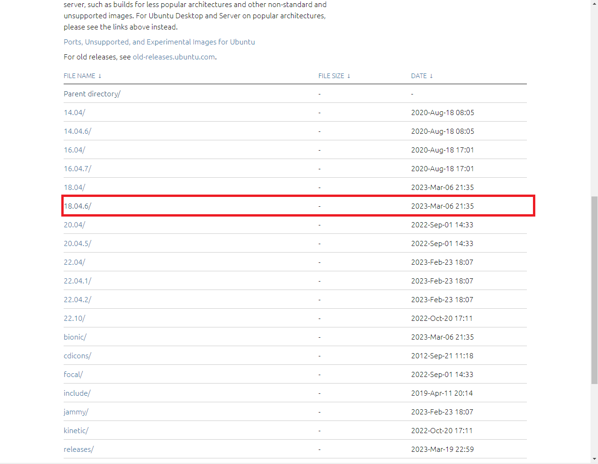
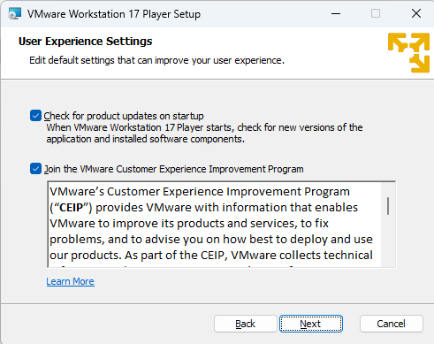
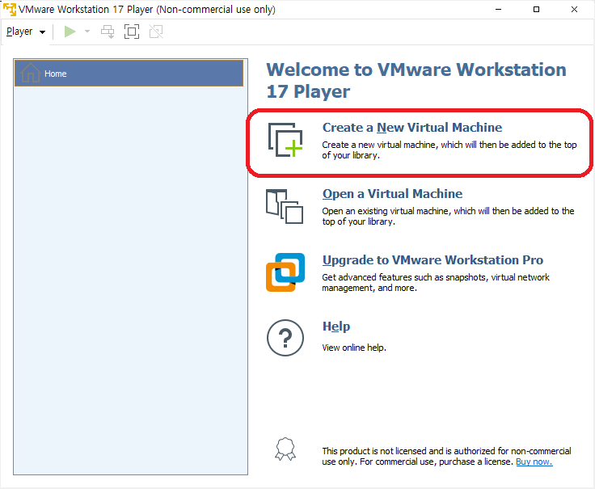
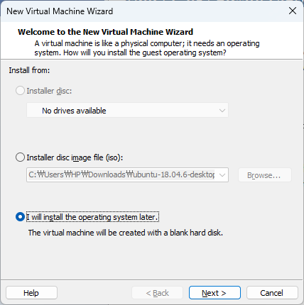
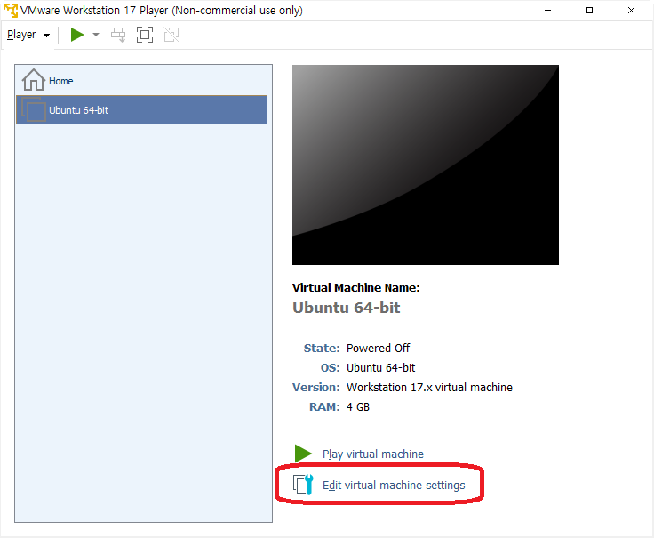
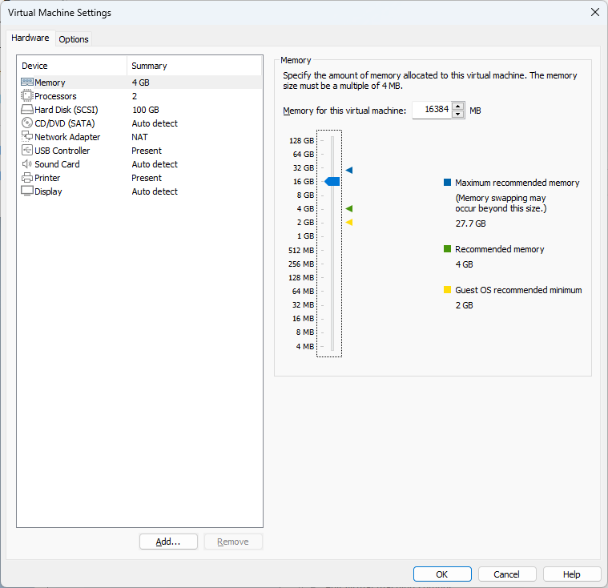
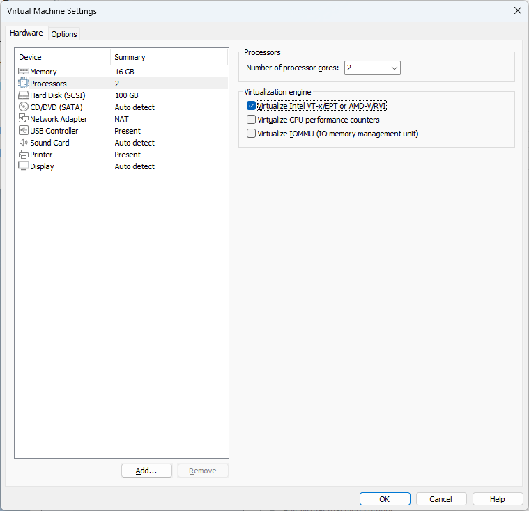
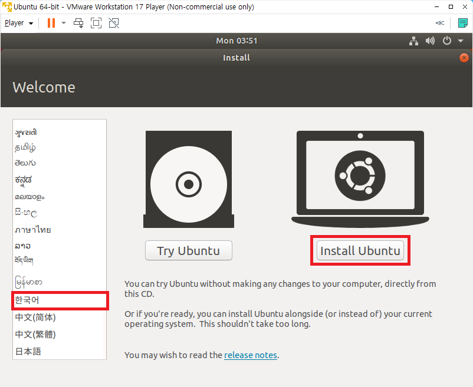

# VMWare Player 다운로드

https://customerconnect.vmware.com/en/downloads/details?downloadGroup=WKST-PLAYER-1701&productId=1377&rPId=100675

위의 링크에서 VMWare Player를 다운받았다.

# Ubuntu 18.04.6 설치
http://mirror.kakao.com/

위의 링크에 들어가서 ubuntu-release로 진입하고, version 선택에서 원하는 버전을 골라 다운받으면 된다.

 

 

# VMWare 설치
설치 과정에서 특별한 것은 없으나 User Experience Settings의 모든 체크박스들은 해제하도록 하자. 

# VMWare 실행
첫 실행시에 라이선스 설정을 해야하는데 키가 없으니 첫 번째 체크박스 선택 후 진행하였다. 

이후 Create a New Virtual Machine을 클릭하고, 3번째 체크박스인  I wiall install the operating system later 
을 선택 후 넘어가자. 

 

다음 화면에서는 Linux를 선택하고, version은 Ubuntu 64-bit을 선택하면 된다. 

넘어가다보면 디스크 공간을 설정하는 부분이 나오는데, 학부생때 이 디스크 사이즈가 작아서 고생했던 기억이 있어서 이번에는 100GB로 설정하고 진행하였다. 

이로서 가상 머신을 하나 만들었다. 이제 세부 설정으로 넘어가보자. 

시스템 메모리를 설정하는 부분이 처음으로 나오는데 앞서 이야기 했던 디스크 공간과 더불어 메모리 또한 프로젝트 진행에 여유가 없다면 고생하는 부분이다. 이번 설정에서는 16GB를 할당해보았다. 

다음은 Processors 부분인데, 체크박스 중 첫 번째 체크박스(Virtualize Intel VT-x/EPT or AMD-V/RVI)를 체크하고 넘어가도록 하자. 

CD/DVD 설정으로 넘어가보면, Connection 부분에 Use Physical drive가 default로 체크되어 있다. 이를 Use ISO image file를 체크한 후 다운받은 iso이미지 경로를 넣어주도록 하자. 

이제 설정은 완료되었고 Play Virtual machine을 클릭하여 실행 가능하다. 

실행하게 되면 영어로된 우분투 설치화면을 만날 수 있는데, 좌측에서 한글 선택 후 진행하면 수월할 것이다. 

이후 별다른 설정없이 설치를 진행하면 완료된다.
