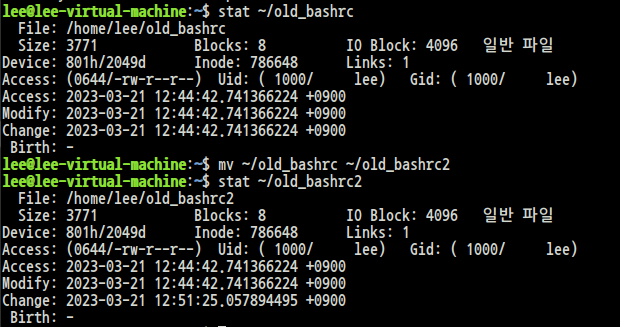
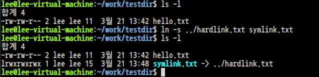

# Linux(Unix)의 필수 명령어
필수 명령어는 몇십개, 관리자용 명령어를 포함하더라도 2배정도이다. 겨우 몇십개이냐 라는 생각이 날 수도 있지만 이들은 각각 option을 설정할 수 있어 option의 조합으로 수백개 이상의 조합을 만들 수 있다. 여기서 각 명령어들의 모든 option을 외우는 것은 좋은 방법은 아니다. 잘 모르는 것들은 man 페이지를 종종 참고하는것이 좋다. 이제 리눅스 사용에 앞서 몇 가지 명령어에 대해 공부해보자.<br>

<table class="table">
<thead><tr>
<th>명령어</th>
<th>명령</th>
<th>뜻</th>
</tr>
</thead>
        <tbody><tr>
<td>sudo</td>
<td>super user do</td>
<td>관리자 권한으로 실행</td>
</tr>
<tr>
<td>cd</td>
<td>change directory</td>
<td>작업 경로 변경</td>
</tr>
<tr>
<td>ls</td>
<td>list of files in current directory</td>
<td>파일 목록 표시</td>
</tr>
<tr>
<td>cp</td>
<td>copies files & directories</td>
<td>복사</td>
</tr>
<tr>
<td>mkdir</td>
<td>make directory</td>
<td>폴더 생성</td>
</tr>
<tr>
<td>mv</td>
<td>move</td>
<td>폴더나 파일 이동 + 이름 바꾸기</td>
</tr>
<tr>
<td>rm</td>
<td>remove</td>
<td>삭제</td>
</tr>
<tr>
<td>pwd</td>
<td>print working directory</td>
<td>현재 작업 경로 표시</td>
</tr>
</tbody>
</table>

<br>

# 명령행 완성 기능
* auto-completion이라고도 부름
    * 오타를 방지하기 위해서 명령행 완성 기능을 습관화하자.
* <tab\>키를 사용
    * prompt에서 파일, 디렉터리 명의 일부만으로 나머지를 완성
    * prompt에서 명령어 다음에 치는 option, command를 자동 완성
    * 탭키를 두 번 누르거나 하위 디렉토리에 자동완성 경우의 수가 여러가지이면 자동완성 가능한 목록들이 보여지게 됨
    * ps. 윈도우나 리눅스에서 터미널을 사용할 때 가장 편리한 기능중 하나이다.

# 필수 명령어 파헤치기

## 1. pwd - Print Working Directory <br><br>

## 2. cd - Change Directory
* cd [경로]
* cd /: 루트 디렉토리로 이동
* cd ~: 홈 디렉토리로 이동
* cd -: 이전 경로로 이동
* 경로를 생략할 시 홈 디렉토리로 이동한다.


```
절대 경로/ 상대 경로

* Absolute Path(절대 경로) 줄여서 abs-path라고 함
    * root directory(/)를 시작으로 하는 경로
    * 경로의 시작이 / 이면 절대 경로
    * e.g. /usr/local/bin
* Relativce Path(상대 경로)
    * 현재 디렉토리를 시작으로 하는 경로
    * e.g. ../../bin
```
<br><br>

## 3. ls - List of files in current directory
* ls [-altriRr] [파일명 ...]
* a: all, l: long, t: sort by mtime, r: reverse


* file type: [-dbclps]
* -: regular file, d: directory, l: symbolic link
* Octal mode: 8진수로 표기되는 UNIX file mode
    * rwxrwxrwx: 3칸씩 각각의 rwx = owner, group, others 파트로 나뉜다.
    * rwxr-x--- == 750, owner(rwx) -> 7, group(r-x) -> 5, others(---) -> 0
* 파일 생성시 기본값: 기본 mode 값은 umask값을 뺀 나머지가 된다.<br>
    * 예를 들어 umask가 022라면, 
    * 디렉터리는 777 - 022 = 755가 생성시 기본 mode가 된다.
    * 파일은 666 - 022 = 644가 생성시 기본 mode가 된다.
    * umask값은 터미널에 umask입력으로 알 수 있다.<br>

<br><br>

## 4. mkdir - Make Directory
* mkdir [-p] <directory name\>
<br><br>

## 5. rmdir - Remove Directory
* rmdir [-p] <directory name\>
* 디렉토리가 비어있는 경우에만 사용 가능
* rmdir 대신에 rm -rf로 파일과 디렉터리를 함께 지우는 경우가 많다.
    * r: recursively
    * f: force<br><br>

## 6. cp, mv, rm
* cp: Copy
* mv: Move, Rename
* rm: Remove<br><br>

## 7. chmod - Change Mode
* e.g. chmod 640 myfile - mode의 숫자 표기 방법이 많이 쓰임<br><br>

# File 관련 명령어
## 1. file <file\>
### 파일 타입 확인
* 파일은 고유의 표식을 가지고 있는데, 이를 근거로 파일의 종류를 구분할 수 있다.
* 이런 연유로 UNIX 계열에서 파일의 확장자는 중요하지 않다.
* magic 데이터: /usr/share/file/magic

## 2. stat [option] <file\>
### status of file
* file의 meta data를 출력한다.
* meta data: 내용이 아닌 수식하는 정보, 예를 들어 파일이름, 생성 시간, 권한 등

<br><br>

## bashrc 파일로 stat 살펴보기
```
$ cp ~/.bashrc ~/old_bashrc
$ stat <ALT-.>
```
 
필자는 여기서
```
bash: syntax error near unexpected token `newline'
```
에러가 발생하였다.
해당 에러는 stat줄의 코드를
```
stat ~/old_bashrc
```
로 변경하여 해결하였다.

이후 파일을 변경한 후 Modify, Change값을 비교해보자.
```
$ mv ~/old_bashrc ~/old_bashrc2
```

<br><br>

## 결과
Modify값은 변함 없고, Change값만이 변화한 것을 알 수 있다.<br><br>

## 3. touch <file\>
 * 파일의 메타 정보 업데이트 - 주로 시간 관련 정보를 업데이트
 * file이 존재하지 않는 경우 빈 파일의 생성

## 4. find
* find directory [expression]
<h2>조건<br></h2>
<table class="table">
    <thead><tr>
    <th>조건</th>
    <th>설명</th>
    </tr>
    </thead>
    <tbody><tr>
    <td>n(숫자)</td>
    <td>정확히 n인 경우를 탐색</td>
    </tr>
    <tr>
    <td>+n</td>
    <td>n보다 큰 경우를 탐색(n 포함)</td>
    </tr>
    <tr>
    <td>-n</td>
    <td>n보다 작은 경우를 탐색(n 포함)</td>
    </tr>
    </tbody>
    </table>
<br>

<h2> find의 주요 검색 조건<br></h2>
<table class="table">
<thead><tr>
<th>조건</th>
<th>설명</th>
</tr>
</thead>
<tbody><tr>
<td>-name filename</td>
<td>filename의 이름과 같은 파일을 검색</td>
</tr>
<tr>
<td>-size n</td>
<td>크기가 n인 파일을 검색</td>
</tr>
<tr>
<td>-mtime n<br>-mmin n</td>
<td>변경된 시간이 n인 파일을 검색<br>(단위: mtime 옵션은 day, mmin 옵션은 minute)</td>
</tr>
<tr>
<td>-inum n</td>
<td>inode number가 n인 파일을 검색</td>
</tr>
<tr>
<td>-samefile file</td>
<td>file과 같은 inode를 가진 파일을 검색(= 같은 하드링크를 검색)</td>
</tr>
<tr>
<td>-maxdepth level</td>
<td>탐색할 위치의 하위디렉터리 최대 깊이가 level인 파일을 검색</td>
</tr>
<tr>
<td>-mindepth level</td>
<td>탐색할 위치의 하위디렉터리 최소 깊이가 level인 파일을 검색</td>
</tr>
</tbody>
</table>

* 검색 후 작업 지시
```
$ find ... -exec 명령어 \;
$ find ... -exec 명령어 \+
```
* 예제 - "*.tmp" 파일을 찾아서 지우는 명령
```
$ find . -name "*.tmp" -exec rm {} \;
$ find . -name "*.tmp" -exec rm -rf {} \;
$ find . -name "*.tmp" -exec rm -rf {} \+
```

## Find 연습문제
현재 디렉토리 아래에서 최근 24시간 이내에 내용이 변경되어진 일반 파일을 찾아서 mtime_b24.txt 파일로 리스트를 저장해보자
```
find ./ -mtime -1 -type f mtime_b24.txt
```

# stdio(Standard Input/ Output) 기초 

## File Channel
* file에 입출력하기 위한 통로
* file channel에 입출력을 하기 위해서 하드웨어를 직접 접근하지 않고, 표준화된 입출력 방식을 통하도록 하는 가상화 레이어의 일종
* 이는 UNIX 시스템을 발전시키면서 입출력과 하드웨어를 분리할 필요성으로 탄생
* C언어의 I/O인터페이스의 심플함을 가능하게함
* 파일에 입출력을 하기 위한 메타 정보를 가지는 객체


## 파일 서술자(file descripter, fd)
* stdio에서는 file channel마다 번호를 부여하는데 이 번호를 file descripter라고 함
* 파일 채널들에는 붙여진 유일한 식별자(indentifier), 숫자로 명명
* 양수 0번부터 시작하여 증가
* 예약된 파일 서술자
    * 0: stdin(표준 입력)
    * 1: stdout(표준 출력)
    * 2: stderr(표준 에러)

# PIPE
* 프로세스 사이에 통신으로 사용
* IPC(Inter-Process Communication)의 일종
* shell에서도 많이 사용하는 기능이다.

## PIPE의 종류
1. anonymous pipe - temporary
2. named pipe - persistency

## PIPE - anonymous pipe
프로세스들의 직렬 연결 - 작은 것이 아름답다의 철학을 가능하게 하는 기능<br>
명령행에서 Vertical bar(|)로 사용
```
$ find ~ | wc -l
wc: word count, -l옵션 사용시 line 수를 카운트한다.
```

# 아카이브, 압축 명령어
Unix계열은 여러 파일을 묶는 작업과 압축이 분리되어 있음
* 아카이브 유틸: tar(tape archive), cpio
    * 단순히 파일을 묶는 작업: 원래 테이프에 보관하는 목적이라 archiving한다고 불림
* 압축 유틸: gizp, bzip2, xz, zstd, lz4
    * 압축, 압축 해제

## 아카이빙: tar
<h2>tar [ctxv] [f archive-file] files...</h2>

* c: 아카이브 생성(create)
* t: 아카이브 테스트(test)
* x: 아카이브로부터 파일을 풀어냄(extract)
* v: 상세 정보 출력(사용 X)
* f archive-file 입출ㄹ겨할 아카이브 파일명

## 압축
* xz: 텍스트 압축에 압도적으로 강하나, 느리다.
* zstd: facebook에서 근무하던 Yann Collet이 C언어로 개발, 멀티 스레드 지원, 빠르고 중상의 압축률을 가짐<br><br>


# ln(link): hard
## hard link 생성
```
$ mkdir ~/work
$ mkdir ~/work/testdir
$ cd ~/work/testdir
$ cat > hello.txt
Hello World
ctrl + D
$ ls -l
$ ln hello.txt ../hardlink.txt
$ ls -li
$ ls -li ..
```
<br>

<br><br>


# ln(link): symbolic
symlink가 가리키는 대상의 주소가 relative path라면, symlink를 기준으로 만들어야 한다.<br>
즉  symlink를 만들 디렉토리에서 작업하는 것이 좋다. 그게 아니라 꼭 다른 위치에서 작업한다면, -r 옵션을 추가해서 relative path를 계산하도록 하면 된다.
```
$ ls -l
$ ln -s ../hardlink.txt symlink.txt
$ ls -l
```
<br>

<br><br>


# Practice symlink
<br><br>