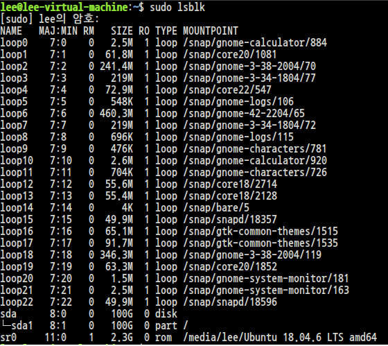
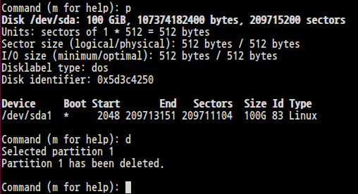
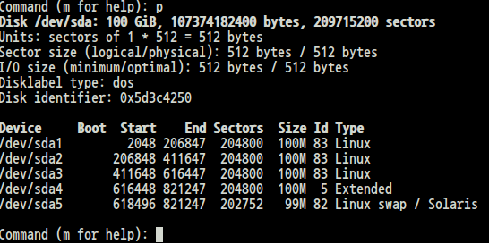

# File system 만들기
1. Partitioning
    * command: fdisk, parted
2. File System Making & Checking
    * command: mkfs, fsck or xfs_*
3. Mount
    * command: mount / umount
    * /etc/fstab: information file about the file system(마운트를 자동으로 하기 위해 사용)
    <br><br>

# Partiiton 만들기
현재 File System 리스트를 출력해보자.
```
$ sudo fdist -l (= $ sudo lsblk)
```
<br>


<br><br>

## Block Device
* 저장 장치를 이르는 용어
* 모든 저장장치들은 /dev/ 디렉토리 아래에 있다.
* /dev/sd[abcd...] 와 같이 sd가 붙으면 SCSI disk 혹은 SATA, USB 디스크를 의미한다.
* /dev/hd[abcd] IDE disk, 거의 사용되지 않음
<br><br>

## Character Device
입출력 장치(키보드, 마우스)
<br><br>

# $ fdisk <block device\>

```
$ sudo fdisk /dev/sda
m
```


<br><br>

# fdisk command
<table class="table">
    <thead><tr>
    <th>명령어</th>
    <th>설명</th>
    </tr>
    </thead>
    <tbody><tr>
    <td>a</td>
    <td>부트 활성 플래그를 지정.(DOS, Windows 계열의 boot 드라이브 지정)</td>
    </tr>
    <tr>
    <td>d</td>
    <td>파티션 삭제</td>
    </tr>
    <tr>
    <td>l</td>
    <td>알려진 파티션 ID(파티션 타입)</td>
    </tr>
    <tr>
    <td>n</td>
    <td>새로운 파티션 생성</td>
    </tr>
    <tr>
    <td>p</td>
    <td>현재 파티션 상태 출력</td>
    </tr>
    <tr>
    <td>t</td>
    <td>파티션 ID(타입)을 변경</td>
    </tr>
    <tr>
    <td>q</td>
    <td>변경된 상태를 저장하지 않고 종료</td>
    </tr>
    <tr>
    <td>w</td>
    <td>변경된 상태를 저장하고 종료</td>
    </tr>
    </tbody>
    </table>

# Practice1. 파티션 지우기

```
$ sudo fdisk /dev/sda
command: p
command: d
```


<br>

파티션이 1개뿐이라 선택창 없이 바로 지워지는 것을 볼 수 있다.
<br>
<br>


# Practice2. 파티션 만들기
```
$ sudo fdisk /dev/sda
command: n
p
1
ENTER
+4000M
```

<br>

연습 후 마지막 커맨드 창에서 w를 누르지 않도록 유의하자. q와 붙어있어서 무섭긴하다.
<br><br>

# Practice3. 종합 예제


<br><br>

