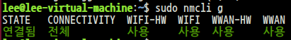
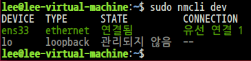
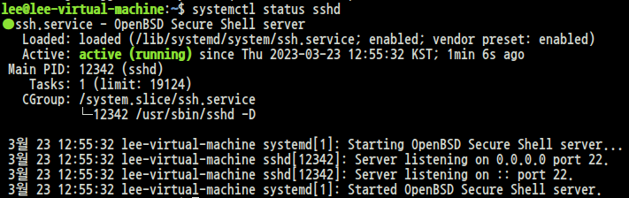

# nmcli : Network Manager CLI tool 
* 네트워크에 관련된 대부분의 기능을 가짐
* 조회 및 설정 가능

# nmcli g[eneral]
```
$ sudo nmcli g
```

<br><br>
* STATE: connected / asleep
* CONNECTIVITY: full / none

# nmcli n[etworking]
* Networking 상태 조회
* nmcli n on / off


<br><br>

# Network Device 확인
```
$ sudo nmcli dev
```

<br><br>

# nmcli <g | n | r | c | d>
* general, networking, radio, connection, device


<br><br>

# nmcli c[onnection] s[how]
```
$ sudo nmcli connection show
$ sudo nmcli c s
```

<br><br>

# nmcli c[onnection] s[how] <connection name\>
```
$ sudo nmcli c s '유선 연결1'
```

<br><br>

# Practice - nmcli 속성 변경(유선연결1 -> ens33)
```
$ sudo nmcli d
$ sudo nmcli con modify "유선 연결 1" connection.id ens33
$ sudo nmcli c
```

<br><br>

# Practice - IP 변경
```
$ sudo nmcli c mod ens33 ipv4.method manual ipv4.addresses [IP address] \
ipv4.gateway [IP address] +ipv4.dns 8.8.8.8
```


# Practice - Virual IP 추가, 삭제
```
// 추가
$ sudo nmcli c mod ens33 +ipv4.addresses [IP address]

// 삭제
$ sudo nmcli c mod ens33 -ipv4.addresses [IP address]
```

# SSH(Secure Shell)
# 준비 작업
## 1. sshd  서버의 설치 여부를 확인


```
$ sudo apt list openssh*
```

<br><br>

## [installed]표시가 없다. 설치해 주도록 하자.
```
$ sudo apt install openssh-server -y
```

# 2. sshd 서비스가 실행 중인지 확인
```
$ systemctl status sshd
```

<br><br>

만약 정지상태라면,
```
$ systemctl start sshd
```
 명령어로 실행시키면 된다.

부팅할 때 sshd 서비스를 실행하고 싶다면,
```
$ systemctl enable sshd
```
명령어로 실행 가능하다.

# 3. ssh port(22/tcp)가 방화벽에 허용되어 있는지 확인
```
$ sudo iptables -nL
```

<br><br>
모두 허용 되어있음을 볼 수 있다.

# ufw(ubuntu 방화벽)
```
// 방화벽 키기
$ sudo ufw enable
// 방화벽 끄기
$ sudo ufw disable
// allow <port number|port symbol>[/protocol]
$ sudo allow 22/tcp
$ sudo allow http/tcp
```

# SSH 연결 방법
```
$ ssh [IP address]
$ ssh [user.name]@[IP address]
$ ssh -p [port number] [IP address]
```

# ssh-keygen
* key 위치: ~/.ssh
```
$ ssh-keygen -N "[password]"
```

# curl 
* URL을 기반으로 통신하는 기능 제공
* curl [options] <URL>

# wget
* wget과 curl은 대부분의 기능이 비슷하나, curl이 더 많은 기능을 가짐
