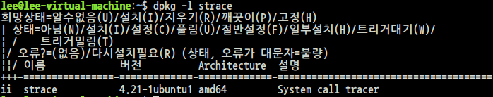
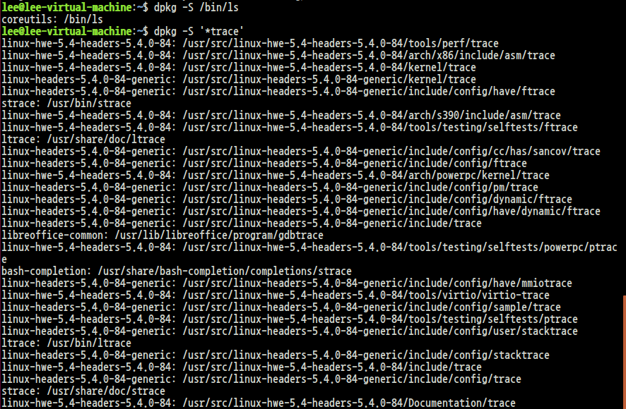
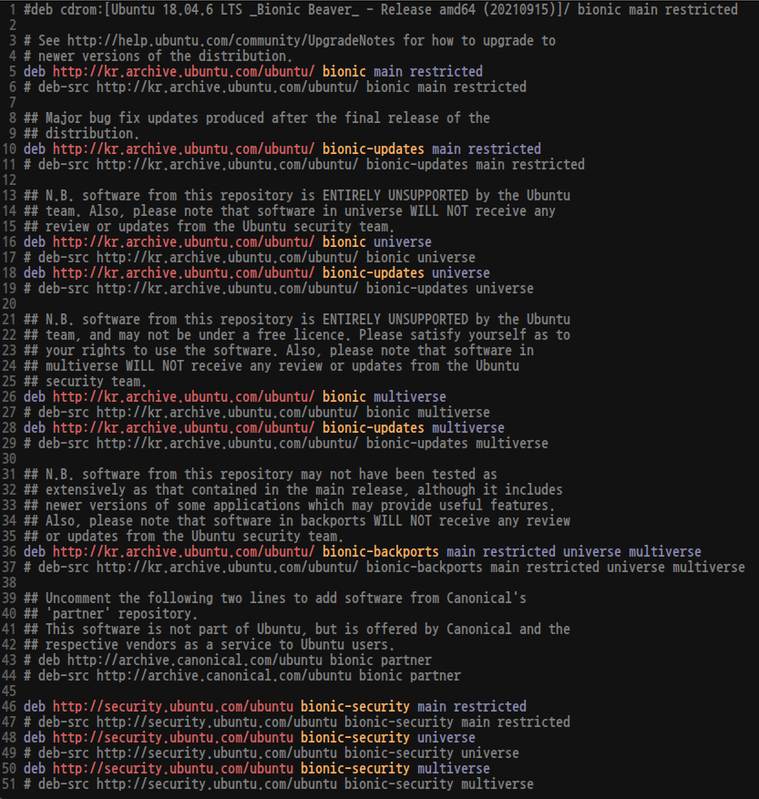
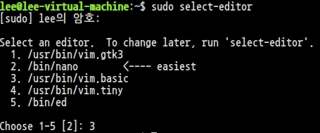
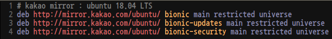

# Debian 계열 주요 명령어
* dpkg (debian package manager) - 기본 명령
* apt (advanced package tools) - 네트워크, 의존성 설치 지원 툴
<br><br>

# strace, gcc 패키지 리스트 확인

```
$ dpkg -l strace
```

<br><br>


```
dpkg -l gcc
```

<br><br>

# -s 패키지 상태 확인
```
dpkg -s strace
```

<br><br>

# -S 패키지 검색
```
dpkg -S /bin/ls
dpkg -S '*trace'
```

<br><br>

# apt
* apt가 패키지를 가져오는 곳: /etc/apt/sources.list
* sources.list에 추가할 경우는 /ect/apt/source.list.d/에 "*.list" 파일명으로 추가하는 편이 좋다.<br><br>

# /etc/apt/source.list
```
$ vim /etc/apt/source.list
```

<br><br>

# source.list format
```
deb [option1=value1 option2=value2] uri suite [component1] [component2] [...]
deb-src [option1=value1 option2=value2] uri suite [component1] [component2]
```
<br><br>

# component: suite의 구성 요소 및 라이선스 종류별 분류
* main: officially supported(maintained) software
* restricted: supported SW, restricted free license
* universe: community-maintained, not officially supported SW
* multiverse: non-free
* security: Important security updates
* updates: recommended updates
<br><br>

# kakao mirror 설정하기
```
$ sudo select-editor
```

<br><br>

```
$ sudo apt edit-sources kakao.list
```
실제 편집되는 파일: /etc/apt/sources.list.d/kakao.list<br>

<br><br>

```
$ sudo apt update
```

# apt downgrade - 예시
```
$ sudo apt list --all-versions libcurl3-gnutls
$ sudo apt install curl libcurl3-gnutls=7.47.0-1ubuntu2
```
