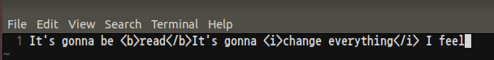
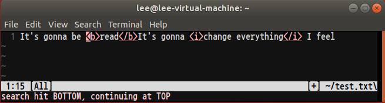

# Greedy matching이란?
```
$ var2 = "It's gonna be <b>read</b>It's gonna <i>change everything</i> I feel"
$ echo $var2 | egrep -o "<.+>"
```

* pattern은 최대한 많은 수의 매칭을  하려고 하는 성질이 있다.
* 위 코드의 결과값은 <b\>read</b\>It's gonna <i\>change everything</i\>이다.

# Non-greedy matching
태그 부분만을 뽑아내고 싶다면,
```
$ echo $var2 | egrep -o "<[^<>]+>"
```
와 같이 사용한다면 태그 부분만 뽑아낼 수 있다. 위와 같이 사용한다면 최소 매칭이 가능하다.<br>
POSIX RE에서는 non-greedy matching 수량자를 제공하지 않는다. 따라서 패턴을 변경하여 non-greedy matching과 유사한 결과를 얻어낼 수 있다.<br><br>

# vim에티터를 통한 Greedy matching & Non-greedy matching
1. vim 에디터 타이핑<br>

<br><br>

2. /<.\\+>으로 검색 - Greedy matching<br>

<br><br>

3. /<.\\{-}>으로 검색 - Non-greedy matching<br>

<br><br>

# Backslach
* meta char.의 의미를 없앤다.
1. c.b
    * cab, cbb, ccb, cdb 등등..
2. c\\.b
    * dot(.)이 아닌, 진짜 일반 문자 '.'을 의미
* BRE에서 ERE의 일부 기능을 표현할 때 사용
    * ERE의 {m, n}을 BRE로 표현할 때 \\{m, n\\}으로 사용
* 이와 같은 사용을 escape라고 함

# Parentheses
* 기능
    1. back-reference - 매칭된 결과를 다시 사용하는 패턴
        * "()"로 묶인 패턴 매칭 부분을 \\#로 다시 사용
    2. group

# Boundary - ERE
<div class="table_wrap"><table style="border-collapse: collapse; width: 100%;" border="1" data-ke-align="alignLeft">
<tbody>
<tr>
<td>\b</td>
<td>boundary가 맞는 표현식만 찾는다(단어 경계면 검색)</td>
</tr>
<tr>
<td>\B</td>
<td>boundary에 맞지 않는 표현식만 찾는다.(단어 경계면이 아닌 경우만 검색)</td>
</tr>
</tbody>
</table></div>
<br><br>

# Predefined character class
<table>
<tr>
      <td><strong>[:alnum:] </strong></td>
      <td>다음과 같은 영숫자 문자(문자 또는 숫자)와 일치합니다.<br>
      <br>
      <strong>a~z</strong>, <strong>A~Z</strong> 또는 <strong>0~9</strong><br>
      <br>
      <strong>참고: </strong>이 문자 종류를 정규 표현식에서 사용할 때는 대괄호로 한 번 더 묶어야 합니다(예: [[:alnum:]]).</td>
    </tr>
<tr>
      <td><strong>[:alpha:] </strong></td>
      <td>다음 영문자와 일치합니다.<br>
      <br>
      <strong>a~z</strong> 또는 <strong>A~Z</strong><br>
      <br>
      <strong>참고:</strong> 이 문자 종류를 정규 표현식에서 사용할 때는 대괄호로 한 번 더 묶어야 합니다(예: [[:alpha:]]).</td>
    </tr>
<tr>
      <td><strong>[:graph:] </strong></td>
      <td>공백, 제어 문자 등을 제외한 모든 보이는 문자와 일치합니다.<br>
      <br>
      <strong>참고: </strong>이 문자 종류를 정규 표현식에서 사용할 때는 대괄호로 한 번 더 묶어야 합니다(예: [[:graph:]]).</td>
    </tr>
<tr>
      <td><strong>[:punct:] </strong></td>
      <td>다음과 같은 구두점 문자 및 기호와 일치합니다.<br>
      <br>
      ! " # $ % &amp; ' ( ) * + , \ -. / : ; &lt; = &gt; ? @ [ ] ^ _ ` { | }<br>
      <br>
      참고: 이 문자 종류를 정규 표현식에서 사용할 때는 대괄호로 한 번 더 묶어야 합니다(예: [[:punct:]]).</td>
    </tr>
<tr>
      <td><strong>[:print:] </strong></td>
      <td>보이는 문자 및 공백과 일치합니다.<br>
      <br>
      <strong>참고:</strong> 이 문자 종류를 정규 표현식에서 사용할 때는 대괄호로 한 번 더 묶어야 합니다(예: [[:print:]]).</td>
    </tr>
<tr>
      <td><strong>[:space:] </strong></td>
      <td>공백, 탭 및 줄바꿈을 비롯한 모든 공백 문자와 일치합니다.<br>
      <br>
      <strong>참고: </strong>이 문자 종류를 정규 표현식에서 사용할 때는 대괄호로 한 번 더 묶어야 합니다(예: [[:space:]]).</td>
    </tr>
<tr>
      <td><strong>[:word:] </strong></td>
      <td>다음과 같은 단어 문자(문자, 숫자 또는 밑줄)와 일치합니다.<br>
      <br>
      <strong>a~z</strong>, <strong>A~Z</strong>, <strong>0~9</strong> 또는 _<br>
      <br>
      <strong>참고: </strong>이 문자 종류를 정규 표현식에서 사용할 때는 대괄호로 한 번 더 묶어야 합니다(예: [[:word:]]).</td>
    </tr>
</table>

