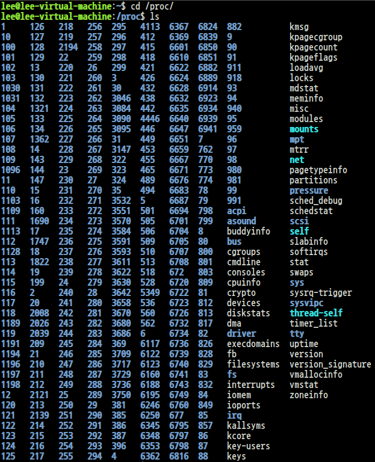
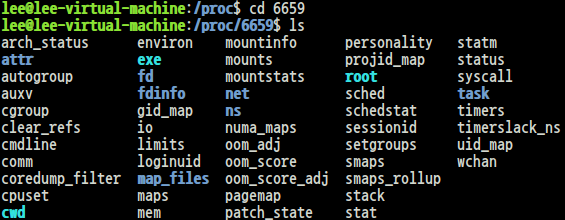

# /proc - process information pseudo-filesystem
* 프로세스 정보를 담고 있는 FS인척 하는 (가짜) 파일시스템
* 시스템 하드웨어, 커널 등 다양한 정보가 들어있다.<br><br>

# PCB(Process Control Block)
* 프로세스를 관리하기 위한 메타 정보가 들어있다.
* 프로세스를 이해하고 관리, 추적하기 위해서는 정말 중요
* Process ID, Date, Time, Resources info., Authority, Priority로 이루어짐<br><br>

# Process
* "실행 이미지", "메타 정보"로 구성
* 실행 이미지: 순수한 프로세스의 싫랭 코드(기계어)를 의미
* 메타 정보는 프로세스를 관리하기 위한 정보<br><br>

# cd /proc , ls

<br><br>

# /proc 파헤쳐보기
```
$ cd 6659   // 여기서 숫자는 PID를 의미
$ ls
```

<br><br>

여기서 하늘색으로 표시된 파일들은 symlink

```
$ ls -l exe
```

<br><br>

# 프로세스 정보 파일들
<div class="table_wrap"><table style="border-collapse: collapse; width: 100%;" border="1" data-ke-align="alignLeft">
<tbody>
<tr>
<td>파일</td>
<td>설명</td>
</tr>
<tr>
<td>cmdline</td>
<td>프로세스가 실행될 때 사용된 명령어 행(인수 포함)</td>
</tr>
<tr>
<td>cwd</td>
<td>프로세스가 실행되고 있는 디렉토리</td>
</tr>
<tr>
<td>environ</td>
<td>프로세스가 가지고 있는 환경변수 목록</td>
</tr>
<tr>
<td>exe</td>
<td>실행 파일의 위치</td>
</tr>
<tr>
<td>fd</td>
<td>열려진 파일 목록을 담고 있는 디렉토리</td>
</tr>
<tr>
<td>mem</td>
<td>메모리 사용량</td>
</tr>
<tr>
<td>smaps</td>
<td>공유 라이브러리 사용 목록 및각종 메모리 점유 정보</td>
</tr>
<tr>
<td>status</td>
<td>프로세스 상태 정보</td>
</tr>
</tbody>
</table></div>
<br><br>

# 시스템 정보 파일들
<div class="table_wrap"><table style="border-collapse: collapse; width: 100%;" border="1" data-ke-align="alignLeft">
<tbody>
<tr>
<td>파일</td>
<td>설명</td>
</tr>
<tr>
<td>cpuinfo</td>
<td>CPU에 대한 정보</td>
</tr>
<tr>
<td>diskstats</td>
<td>시스템의 디스크들에 대한 정보</td>
</tr>
<tr>
<td>interrupts</td>
<td>시스템의 IRQ에 대한 정보</td>
</tr>
<tr>
<td>meminfo</td>
<td>시스템 메모리에 대한 정보</td>
</tr>
<tr>
<td>net</td>
<td>네트워크에 관련된 정보 및 설정을 포함하는 디렉토리</td>
</tr>
<tr>
<td>partitions</td>
<td>시스템 파티션에 대한 정보</td>
</tr>
<tr>
<td>stat</td>
<td>CPU statistics</td>
</tr>
<tr>
<td>swaps</td>
<td>스왑 블록(파티션)에 대한 정보</td>
</tr>
<tr>
<td>sys</td>
<td>시스템 설정(커널 설정을 포함)을 포함하는 디렉토리</td>
</tr>
<tr>
<td>loading</td>
<td>Load average + sched. entity(Running/Total) + LastPid</td>
</tr>
</tbody>
</table></div>
<br><br>

# CPU 스펙 정보 알아보기
```
$ sudo cat /proc/cpuinfo
```

<br><br>

