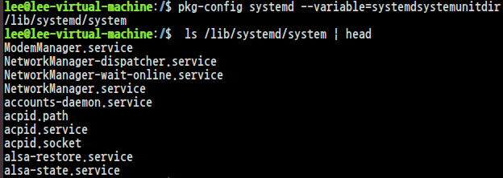
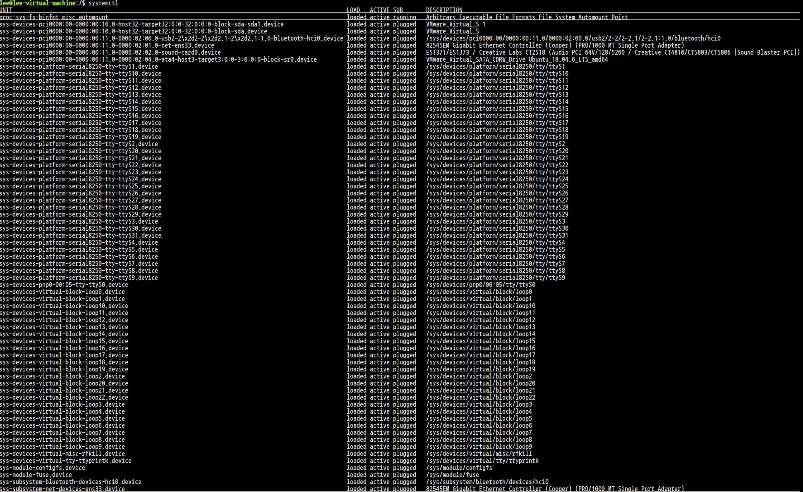
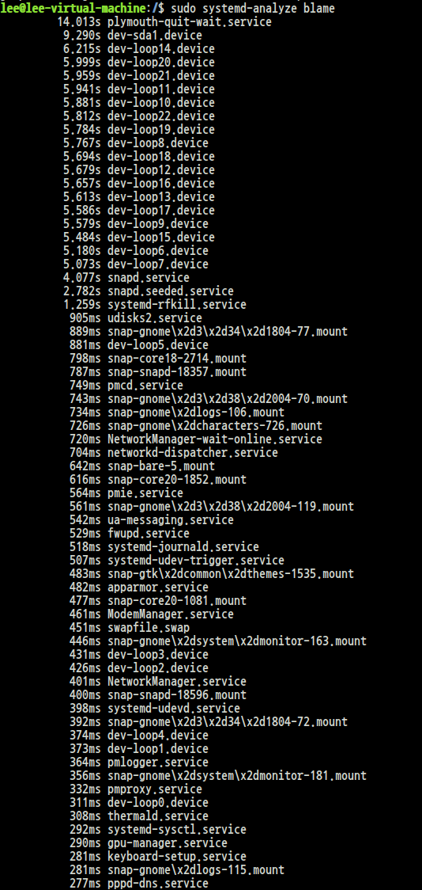
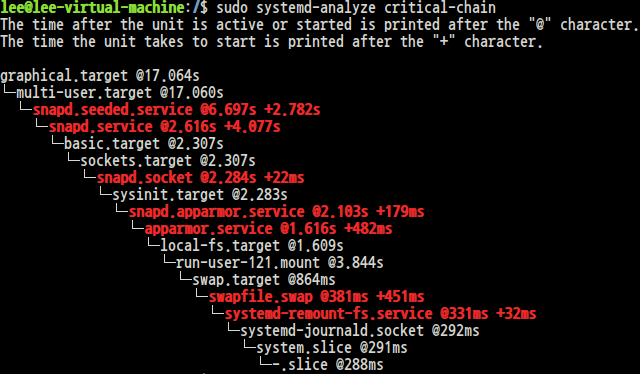
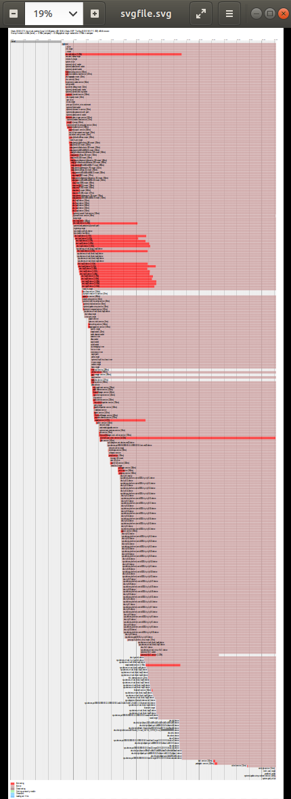

* Lennart Poettering이 개발
* 시스템, 서비스, 자원 설정, 이벤트를 통합 관리
    * 데몬과 제어 통신 프로그램으로 분리되어 제작
    * D-BUS 사용(제어를 위해 향상된 IPC, 원격 기능 제공 가능)
    * loginctl, journalctl, systemctl 등등 제공
    * 시스템의 기동, 종료도 모두 통합 제어

# systemd : unit
* unit 단위로 시스템 관리 - service unit, target unit, device unit ...
* 동적 상태 - unit의 현재 상태가 동적으로 관리되므로 외부 명령어에 의존하지 않음
* 병렬 처리 - 부팅 혹은 target 진입시 선, 후 관계에 의해 프로세스를 병렬로 실행

# systemd : binaries
* system configuration
    * hostnamectl, localectl, timedatectl, machinectl...
* system monitoring/querying
    * systemd-analyze, journalctl, loginctl
* system controlling

# systemd unit 종류 확인

<br><br>

# systemd unit directory 확인
```
$ pkg-config systemd--variable=systemdsystemunitdir
```
필자는 여기서 pkg-config가 설치되어 있지 않아 설치 후 진행하였다.
```
$ sudo apt install pkg-config
$ pkg-config systemd--variable=systemdsystemunitdir
$ ls /lib/systemd/system
```


<br><br>

# Units
<div class="table_wrap"><table style="border-collapse: collapse; width: 100%;" border="1" data-ke-align="alignLeft">
<tbody>
<tr>
<td>파일</td>
<td>설명</td>
</tr>
<tr>
<td>*.device</td>
<td>시스템 장치</td>
</tr>
<tr>
<td>*.mount</td>
<td>파일 시스템 마운트 포인트</td>
</tr>
<tr>
<td>*.automount</td>
<td>파일 시스템 오토마운트 포인트</td>
</tr>
<tr>
<td>*.path</td>
<td>시스템에서 감시하는 경로</td>
</tr>
<tr>
<td style="color:red">*.service</td>
<td>열려진 파일 목록을 담고 있는 디렉토리</td>
</tr>
<tr>
<td style="color:red">*.slice</td>
<td>슬라이스</td>
</tr>
<tr>
<td>*.socket</td>
<td>시스템에서 생성하는 소켓</td>
</tr>
<tr>
<td>*.swap</td>
<td>스왑 공간</td>
</tr>
<tr>
<td style="color:red">*.target</td>
<td>unit의 논리적 그룹</td>
</tr>
<tr>
<td style="color:red">*.timer</td>
<td>타이머</td>
</tr>
<tr>
<td>*.snapshot</td>
<td>스냅샷</td>
</tr>
</tbody>
</table></div>
<br><br>

# systemctl: systemd를 관리하는 매니저 프로그램
```
$ systemctl [command] [options]
```

# Pratice - service 유닛 목록 확인
1. systemctl을 인수 없이 실행<br>
    * 기본적으로 active unit만 출력되는데, -a옵션을 추가하면 모두 출력 가능


<br><br>

2. systemctl -t service 실행<br>


<br><br>

3. 화면에 대한 설명
<div class="table_wrap"><table style="border-collapse: collapse; width: 100%;" border="1" data-ke-align="alignLeft">
<tbody>
<tr>
<td>파일</td>
<td>설명</td>
</tr>
<tr>
<td>LOAD</td>
<td>해당 유닛의 설정이 메모리에 올라갔는지를 알려준다.</td>
</tr>
<tr>
<td>ACTIVE</td>
<td>해당 유닛의 상태를 의미</td>
</tr>
<tr>
<td>SUB</td>
<td>ACTIVE 항목의 low-level작동을 의미</td>
</tr>
</tbody>
</table></div>
<br><br>

4. 특정 state의 unit 검색하기
```
$ sudo systemctl --state=dead
```


# systemctl <command\> [arg...]
<div class="table_wrap"><table style="border-collapse: collapse; width: 100%;" border="1" data-ke-align="alignLeft">
<tbody>
<tr>
<td>파일</td>
<td>설명</td>
</tr>
<tr>
<td>status [NAME ...]</td>
<td>유닛의 상태를 출력한다.</td>
</tr>
<tr>
<td>start [NAME ...]</td>
<td>유닛을 시작한다.</td>
</tr>
<tr>
<td>stop [NAME ...]</td>
<td>유닛을 정지한다.</td>
</tr>
<tr>
<td>is-active [NAME ...]</td>
<td>유닛의 active 상태를 출력한다.</td>
</tr>
<tr>
<td>is-failed [NAME ...]</td>
<td>유닛의 failed 여부를 확인한다.</td>
</tr>
<tr>
<td>kill [NAME ...]</td>
<td>시그널을 보낸다.</td>
</tr>
<tr>
<td>list-unit</td>
<td>유닛 리스트 출력</td>
</tr>
</tbody>
</table></div>
<br><br>

<div class="table_wrap"><table style="border-collapse: collapse; width: 100%;" border="1" data-ke-align="alignLeft">
<tbody>
<tr>
<td>파일</td>
<td>설명</td>
</tr>
<tr>
<td>reload</td>
<td>유닛의 서비스 설정을 리로드한다.</td>
</tr>
<tr>
<td>restart</td>
<td>서비스를 재시작한다.</td>
</tr>
<tr>
<td>try-restart</td>
<td>서비스를 재시작하려고 시도한다.</td>
</tr>
<tr>
<td>reload-or-restart</td>
<td>reload를 지원하는 경우 reload를 수행하고, 지원하지 않는 경우 restart로 작동한다.</td>
</tr>
<tr>
<td>reload-or-try-restart</td>
<td>reload를 지원하는 경우 reload를 수행하고, 지원하지 않는 경우 try-restart로 작동한다.</td>
</tr>
</tbody>
</table></div>

<div class="table_wrap"><table style="border-collapse: collapse; width: 100%;" border="1" data-ke-align="alignLeft">
<tbody>
<tr>
<td>파일</td>
<td>설명</td>
</tr>
<tr>
<td>is-enabled [NAME ...]</td>
<td>유닛의 enabled 상태를 확인한다.</td>
</tr>
<tr>
<td>disable [NAME ...]</td>
<td>유닛을 비활성화</td>
</tr>
<tr>
<td>enable [NAME ...]</td>
<td>유닛을 활성화(--now 옵션 사용시 enable & start로 실행)</td>
</tr>
<tr>
<td>preset [NAME ...]</td>
<td>미리 설정된 기본값으로 설정</td>
</tr>
<tr>
<td>reenable [NAME ...]</td>
<td>유닛 파일을 재활성화</td>
</tr>
</tbody>
</table></div>

* systemd unit config. file을 리로드하는 명령은 daemon-reload이다.
<br><br>

# Practice - nginx 설치 및 유닛 실행
```
$ sudo apt install nginx
$ sudo systemctl status nginx
```

<br><br>

만일 inactive 상태라면,
```
$ sudo systemctl start nginx
$ sudo systemctl status nginx
```
로 running 시켜보자.<br><br>

# systemd : target unit - 유닛들을 논리적으로 묶은 그룹
* 시스템 시작 후 단계별로 기능을 묶어둠
* 동적 상태를 기준으로 함
* 동작 순서를 parallel하게 작동시킴<br><br>

# target 종류 살펴보기

<br><br>

# runlevel을 대체하는 타겟
<div class="table_wrap"><table style="border-collapse: collapse; width: 100%;" border="1" data-ke-align="alignLeft">
<tbody>
<tr>
<td>타겟</td>
<td>설명</td>
</tr>
<tr>
<td>poweroff.target</td>
<td>시스템 끄기. runlevel 0 호환모드</td>
</tr>
<tr>
<td>rescue.target</td>
<td>복구 모드. runlevel 1 호환 모드</td>
</tr>
<tr>
<td>multi-user.target</td>
<td>멀티; 유저 모드(runlevlel 2, 3, 4를 포함)</td>
</tr>
<tr>
<td>graphical.target</td>
<td>그래피컬 모드(X윈도우, runlevel 5를 포함)</td>
</tr>
<tr>
<td>reboot.target</td>
<td>리부팅, runlevel 6와 같음</td>
</tr>
<tr>
<td>shutdown.target</td>
<td>runlevel 0와 같음</td>
</tr>
<tr>
<td>halt.target</td>
<td>시스템 끄기</td>
</tr>
<tr>
<td>emergency.target</td>
<td>응급용 콘솔, 부팅시 systemd.unit=emergency.target로 사용 가능</td>
</tr>
</tbody>
</table></div>

# systemd-analyze
```
systemd-analyze [options] [command]
```
* systemd의 구동을 분석한다.
    * 각 서비스의 시간을 분석 및 시각화한다.
* command
    * blame: 서비스 작동에 걸린 시간별로 출력한다.
    * critical-chain: 크리티컬 체인을 출력한다.
    * plot, dot: 부팅 과정을 SVG 그래픽 파일로 출력한다.
    * dump: 시스템 정보 덤프
    * verify: unit 파일 작성/ 변경 후 검증
```
$ sudo systemd-analyze
```

<br><br>

```
$ sudo systemd-analyze blame    // 서비스별로 작업 시간을 알 수 있다.
```

<br><br>

```
$ sudo systemd-analyze critical-chain   // critical path 형태로 출력한다.
```

<br><br>

```
$ sudo systemd-analyze plot > svgfile.svg
```

<br><br>

# Journald - systemd는 로그 관리를 위해 systemd-journald 데몬 사용
* kernel 및 userland 메시지를 통합 관리
* /run/log/journal

# journalctl [options]
<div class="table_wrap"><table style="border-collapse: collapse; width: 100%;" border="1" data-ke-align="alignLeft">
<tbody>
<tr>
<td>옵션</td>
<td>설명</td>
</tr>
<tr>
<td>-e</td>
<td>출력시 저널의 마지막 행으로 점프한다.</td>
</tr>
<tr>
<td>-f</td>
<td>following 모드. 맨 끝 저널부터 시작하며 추가되는 부분을 출력</td>
</tr>
<tr>
<td>-n [lines]</td>
<td>해당 라인 수 만큼 출력한다.</td>
</tr>
<tr>
<td>-a</td>
<td>출력이 불가능한 문자 필드까지 모두 포함한다.</td>
</tr>
<tr>
<td>-u</td>
<td>특정 유닛에 대한 로그를 출력한다.</td>
</tr>
<tr>
<td><binary path\></td>
<td>특정 바이너리에 대한 로그를 출력한다.</td>
</tr>
<tr>
<td>-x</td>
<td>catalog를 출력한다. 이는 저널에 대한 상세한 설명을 추가한다.</td>
</tr>
<tr>
<td>-o</td>
<td>출력 포맷 지정. format은 여러 방식이 지원되지만, systemd 버전에 따라 조금씩 다를 수 있다.</td>
</tr>
</tbody>
</table></div>


# journalctl [-o msgtype]
```
$ sudo journalctl   // 전체 정보 출력
```

<br><br>

```
$ sudo journalctl -o short  // 간략한 정보 출력
```

<br><br>

```
$ sudo journalctl -o json  // json 규격에 맞추어 출력
```

<br><br>

```
$ sudo journalctl -o verbose    // 좀 더 자세한 정보 출력
```

<br><br>

