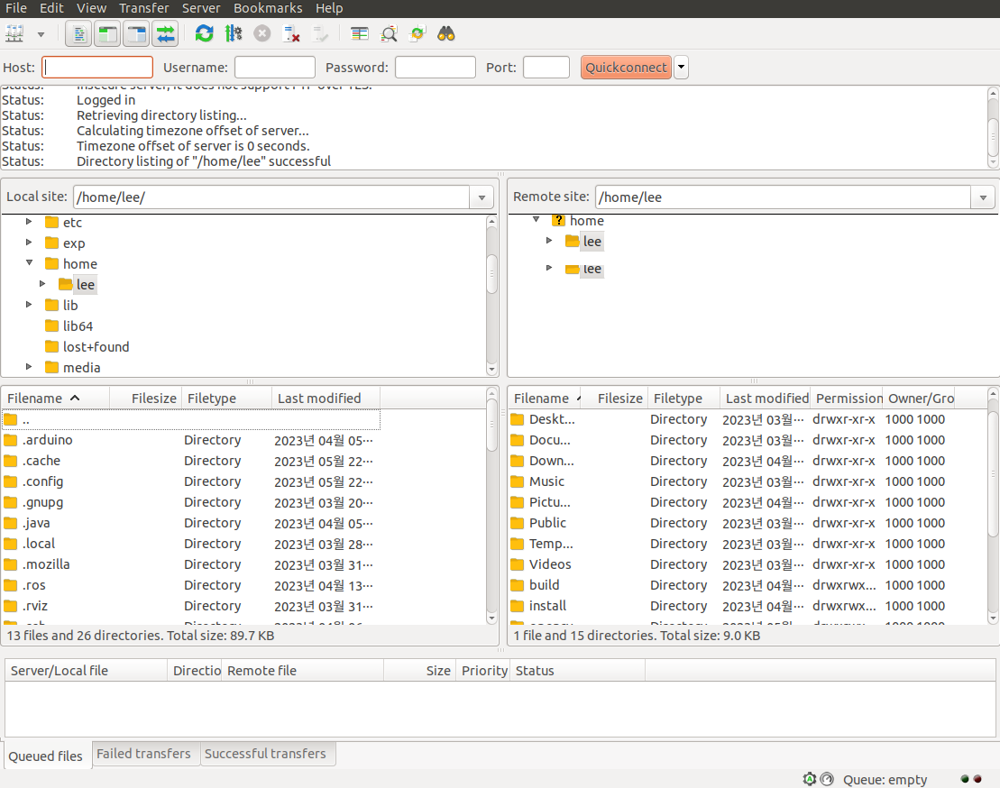
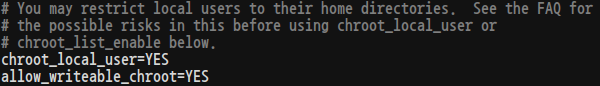
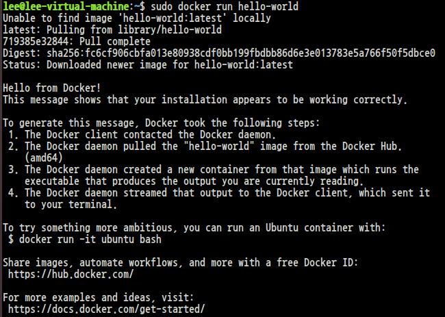
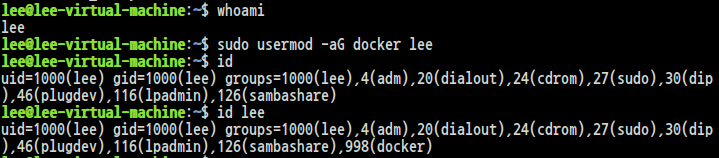
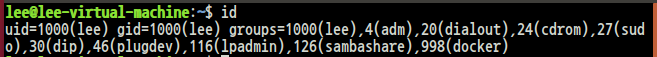

# Root Directory 변경(chroot)
Root Directory를 다른 파일로 변경하여 사용하게 되면 private mount layout을 가질 수 있다.

* chroot를 통해서 기초적인 격리를 할 수 있다.
    * chroot로 격리된 directory hierarchy를 통해 경로를 속일 수 있음
<br>
<br>

# chroot의 이해를 돕기 위한 예시
<br>

## 준비 작업

* ftp 서비스를 제공하는 vsftpd를 설치한다.
    ```
    $ sudo apt -y install vsftpd
    ```

    * 설치 후 서비스가 running되었는지 확인하고 running이 아니라면 start 한다.
    <br>
    
    
    <br>

    * 위와 같이 active 상태가 아니라면
    ```
    $ sudo systemctl start vsftpd
    ```
    를 명령한다.


* ftp 클라이언트 프로그램인 filezilla를 설치 후 진행
    ```
    $ sudo apt -y install filezilla
    $ filezilla
    ```

    
    <br>

    좌측이 local, 우측이 remote 화면이다. 

    * root 권한으로 /etc/vsftpd.conf 파일을 열어 다음 2행을 추가하고 저장

    
    <br>

    * 설정을 저장한 뒤에 vsftpd를 재시작
    
    ```
    $ sudo systemctl restart vsftpd
    $ sudo systemctl status vsftpd
    ```

    * filezilla 재접속 뒤 Home directory 확인

    
    <br>

    cwd가 변경된 것을 볼 수 있다.

<br>
<br>

# Isolation
* 격리(isolation)의 필요성
    * 시스템 내에 존재하는 자원은 한정적이기에 이를 효율적으로 분배하여 시스템의 가용성을 높일 수 있다.

* 활용
    1. 보안, 자원 관리적 측면
        * 특정 파일 경로의 접근을 제한(= 특정 시스템 자원의 사용을 제한)
        * 호스팅 업체라면 고성능 컴퓨터 1대로 여러 사업자에게 DB나 웹을 제공 가능
    2. 호환, 충돌 측면(바이너리의 동시 실행)
        * 동일한 디렉터리를 사용하는 프로세스는 독립된 실행을 어떻게 할 수 있나?
        * 혹은 서로 다른 버전의 파일을 사용하는 프로세스가 있다면?

<br>
<br>

# Docker
* container를 세련된 방식으로 구현한 제품의 일종
* 격리된 자원의 묶음(image)과 런타임으로 구성
* Host OS 위에서 작동하는 격리된 프로세스의 일종이므로 virtual machine과 달리 Memory, File system의 I/O에서 발생되는 크리티컬한 overhead가 없다.
* 입지가 불안하고 구조적, 기술적 문제가 있지만 여전히 매력적인 기술
<br>
<br>

# Install docker
<br>

## Old version 확인
```
$ su -
# apt list docker{,-engine,.io} containerd runc
```
<br>

## 필요 해키지 설치
```
# apt update
# apt -y install apt-transport-https ca-certificates curl gnupg lsb-release
```
<br>

## key-file 추가
```
# curl -fsSL https://download.docker.com/linux/ubuntu/gpg | gpg --dearmor -o /usr/share/keyrings/docker-archive-keyring.gpg
```
<br>

/usr/share/keyring/docker-archive-keyring.gpg에 key파일이 생성된다.(https에 필요)
<br>

## APT 저장소 source.list 추가
<br>
* 명령이 성공하면 /etc/apt/source.list.d에 docker.list가 생성됨
<br>

```
# echo \
"deb [arch=amd64 signed-by=/usr/share/keyrings/docker-archive-keyring.gpg]\
https://download.docker.com/linux/ubuntu\
$(lsb_release -cs) stable" > /etc/apt/source.list.d/docker.list
```

<hr>

## 강의 내용을 따라 설치가 되지 않아 https://docs.docker.com/engine/install/ubuntu/에서 설명된 설치로 진행하였다.
<br><br>

# docker: Hello World

```
$ sudo docker run hello-world
```


<br>
<br>

# docker: Ubuntu bash
* -i: interactive mode(open stdin)
* -t: terminal(Allocate a pseudo-TTY, stdio)

```
$ sudo docker run -it ubuntu bash
```


<br>
<br>

## ubuntu bash에서 exit


<br>

# docker CLI

## docker daemon과 통신하여 기능을 수행
* binary: docker
* docker group을 supplementary group에 포함시켜야 사용이 가능


<br>

## 그룸 추가 후에는 session을 재생성해야 groups 정보를 다시 읽는다.
* 다시 말해 재로그인을 해야한다.

## Ubuntu 배포판
* Ubuntu는 재로그인으로는 groups가 반영되지 않는다. 그룹 반영은 gdm을 재실행해야하므로 다음과 같이 실행한다.

0. X window에서 로그아웃 한다.
1. <CTRL_ALT_F4\>를 눌러서 tty4로 이동한 뒤에 console에 root로 로그인한다.
2. systemctl restart gdm
3. X window 로그인을 한다.
<br>


<br>

# docker CLI: ps
* ps는 기본적으로 작동중인 docker process를 출력한다.
    * -a 옵션을 추가해서 종료된 process 상태로 확인이 가능하다.


<br>

# docker CLI: binding
* container의 자원을 외부와 연결
* 일반적으로 I/O와 storage관련을 연결한다.
    * network
        * port binding: host OS의 port와 container의 port를 바인딩
        * network: docker network 사용
    * directory, file, block-device
        * mount binding: host OS의 directory를 바인딩
        * volume: docker volume 저장소 사용
        * device: host OS의 device, GPU를 바인딩
    * environment
        * shell environment variables를 지정
