# 기계학습의 정의
* 현대적 정의
    * 경험(E)을 통해 주어진 작업(T)에 대한 성능(P)의 향상
    * 최적의 프로그램(알고리즘)을 찾는 행위

    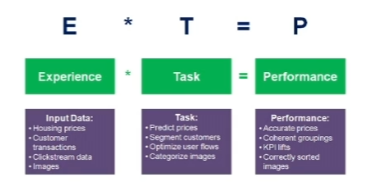
     

# 기계 학습과 전통적인 프로그래밍의 비교

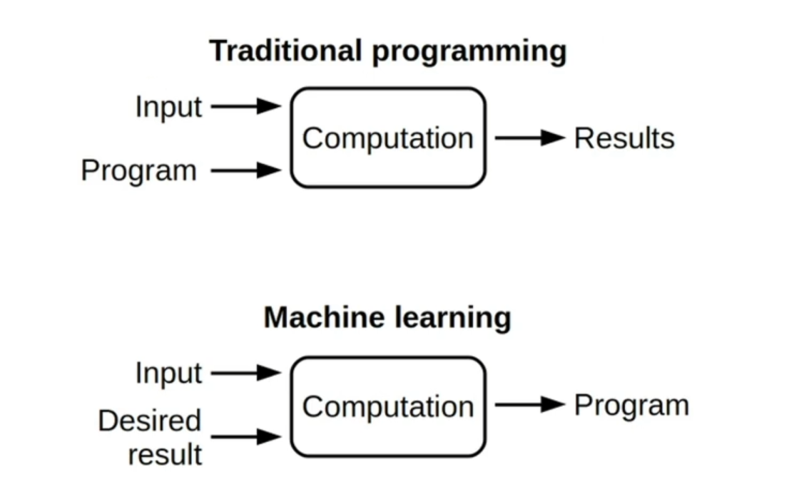
 

# 용어 설명
* Feature: 어떤 객체가 가지고 있는 객체 고유의 ***분별 가능***한 속성
    * e.g. Color, Edge, Corner, etc.
* Pattern: A set of features

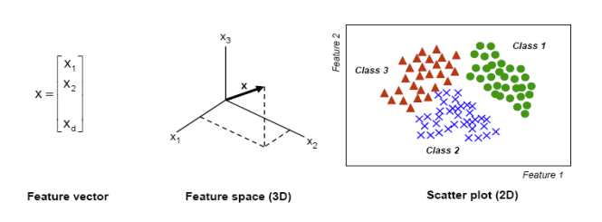
 

* Artificial Intelligence(AI): 인간의 지능을 모방하는 기술 혹은 방법론
* Machine Learning: AI의 subcategory로 학습하는 기계(learning machine)를 위한(사람의 경험 혹은 자연 현상)을 motivation으로 하여 어떤 특정 문제의 해결을 위한 기술 혹은 방법론

 

# Existing Features & Optimal Feature Set

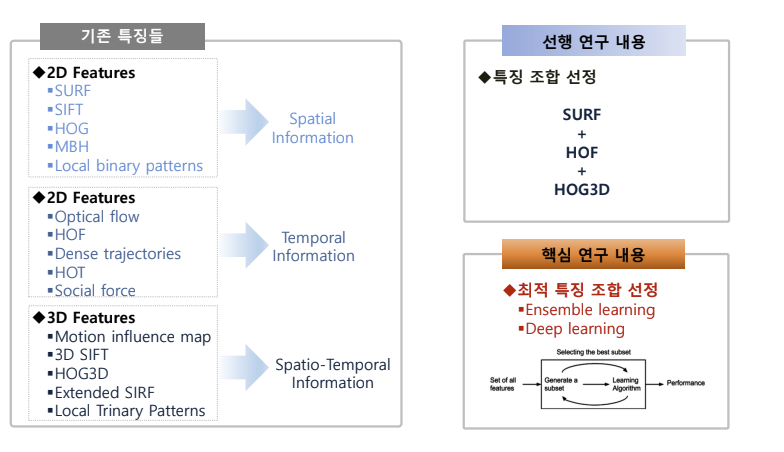
 

# 차원의 저주(Curse of Dimensionality)

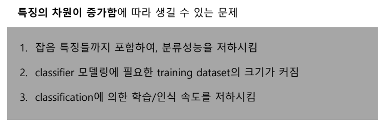
 

# 차원 축소 - (Feature Extraction & Feature Selection)
* 특징 추출(feature extraction): 기존 특징들의 ***조합으로 구성된 새로운 특징들의 부분집합***을 생성
* 특징 선택(feature selection): 전체 특징들로부터 부분집합을 선택

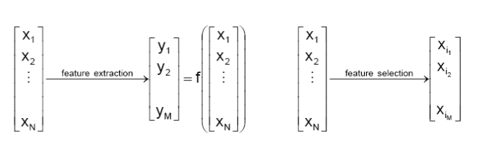
 

# Signal Representation & Classification
특징 추출 매핑 $y=f(x)$의 선택은 우리가 최적화시키고자 하는 목적에 의해 결정되며, 크게 두 가지 방법이 있다.
1. 신호 표현(Signal Representation): 특징추출매핑의 목적이 낮은 차원공간에서 정확하게 표현하고자 함일 경우 -> 주성분분석법(PCA: Principal Components Analysis)
2. 분류(Classification): 특징추출매핑의 목적이 낮은 차원에서의 클래스 구분을 중대하고자 함일 경우 -> 선형판별분석법(LDA: Linear Discriminant Analysis)

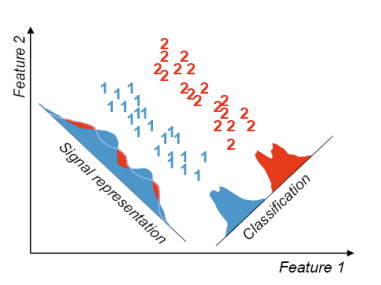
 

# PCA: Principal Components Analysis
* 다차원 특징 벡터로 이루어진 데이터에 대하여 ***고차원의 정보를 유지하면서 저차원으로 차원을 축소하는 방법***
* 고차원에서의 분산(흩어짐의 정도)을 가능하면 많이 유지하면서 차원을 줄이는 것

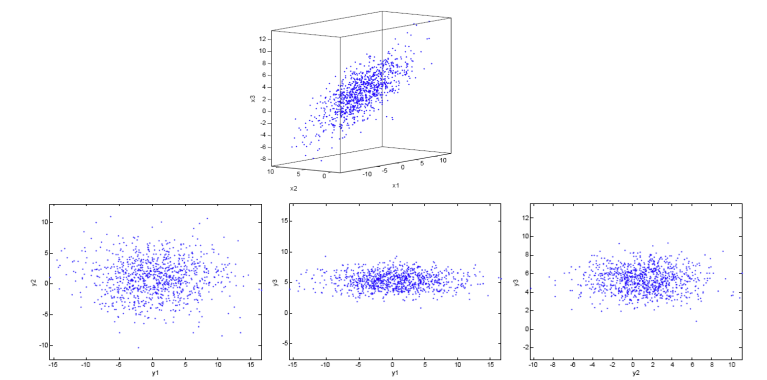
 

# LDA: Linear Discriminant Analysis
* PCA는 데이터의 최적 표현의 견지에서 데이터를 축소하는 방법인데 반하여
* LDA는 데이터의 최적 분류의 견지에서 데이터를 축소하는 방법 -> 가능한 클래스간의 분별 정보를 최대한 유지시키면서 치원을 축소
* 클래스간 분산(between-class scatter)과 클래스내 분산(within-class scatter)의 비율을 최대화하는 방식으로 차원을 축소

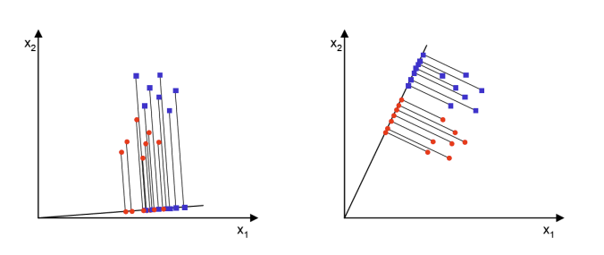
 

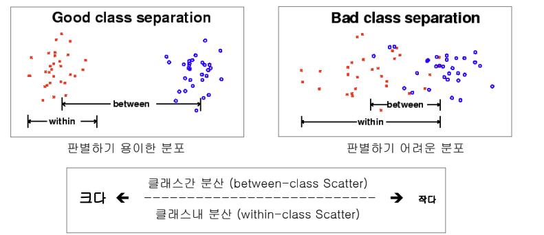
 

# SVM: Support Vector Machines

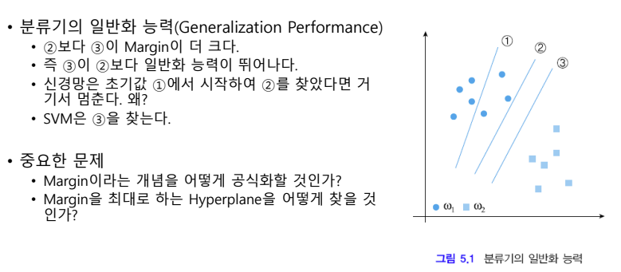
 

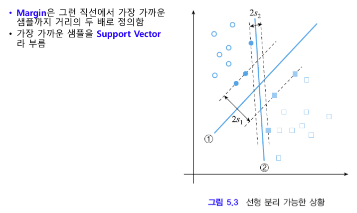
 

* 더 높은 차원으로 매핑하여 선형 분리 불가능을 가능으로 만들 수 있다.

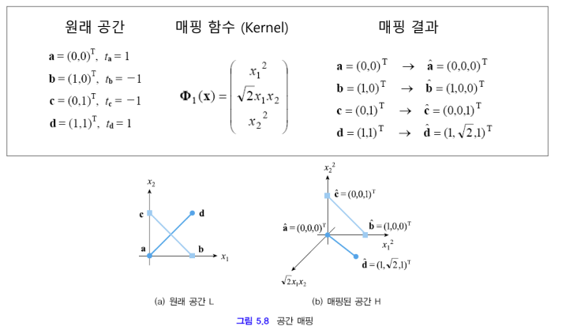
 

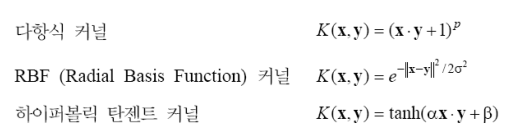
 

