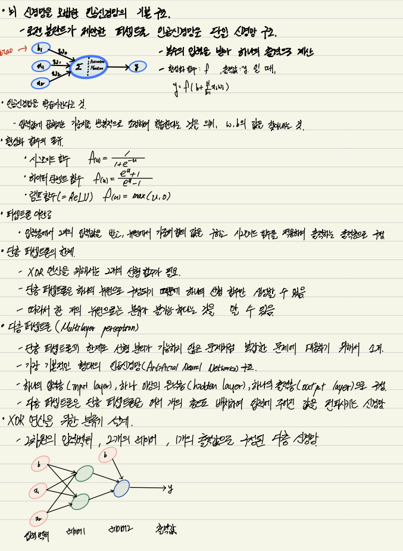
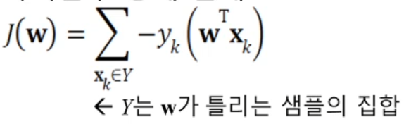
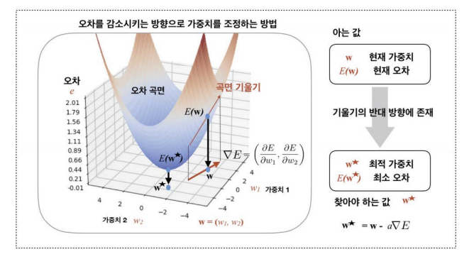
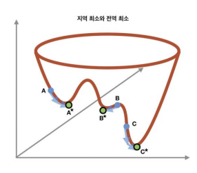
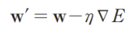
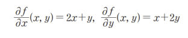
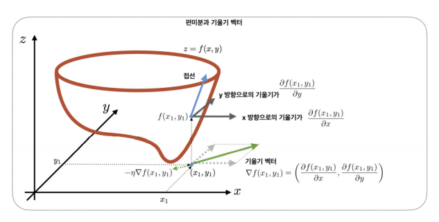

퍼셉트론은 사람의 뉴런과 유사성이 있음

 

# 신경망의 종류
* 인공 신경망은 다양한 모델이 존재함
    * 전방(forward) 신경망과 순환(recurrent) 신경망
    * 얕은(shallow) 신경망과 깊은(deep) 신경망

* 결정론(deterministic) 신경망과 확률론적(stochastic) 신경망 비교
    * 결정론 신경망
        - 모델의 매개변수와 조건에 의해 출력이 완전히 결정되는 신경망
    * 확률론적 신경망
        - 고유의 임의성을 가지고 매개변수와 조건이 같더라도 다른 출력을 가지는 신경망

# 두 벡터의 내적
강의에서 w dot x 내적을 사용한 직선을 그려 or모델을 분류하는 장면이 있다. 이 때 두 벡터의 내적은 한 벡터의 방향에 다른 벡터를 투영시켜 두 벡터의 크기를 곱하는 것으로 이해하고 진행해보자.

# 분류기 학습 과정
1. 과업 정의와 분류 과정의 수학적 정의(가설 설정)
2. 해당 분류기의 목적 함수 $J(\theta)$ 정의
3. $J(\theta)$를 최소화하는 $\theta$를 찾기 위한 최적화 방법 수행

# 목적 함수 정의
* 퍼셉트론(가설 혹은 모델 설정)의 매개변수를 $w = (w_0, w_1, w_2, ... w_d)^t$라 표기하면, 매개변수 집합은 $\theta = {w}$ 표기
* 목적 함수를 $J(\theta)$ 또는 J(w)로 표기
* 퍼셉트론 목적함수의 상세 조건
    * $J(w) >= 0$이다.
    * w가 최적이면, 즉 모든 샘플을 맞히면 $J(w) = 0$이다.
    * 틀리는 샘플이 많은 w일수록 $J(w)$는 큰 값을 갖는다.

# 목적 함수 상세 설계

 

* [조건(1)] 임의의 샘플 $x_k$가 $Y$에 속한다면, 퍼셉트론의 예측 값 $w^Tx_k$와 실제 값 $y_k$는 부호가 다름
    * $-y_k(w^Tx_k)$는 항상 양수를 가짐: 만족
* [조건(3)] 결국 Y가 클수록(틀린 샘플이 많을수록), $J(w)$는 큰 값을 가짐: 만족
* [조건(2)] Y가 공집합일 때(즉, 퍼셈트론이 모든 샘플을 맞출 때), $J(w) = 0$: 만족

# Gradient Descent
모델은 현재의 파라미터를 바탕으로 어떤 행위를 할 것이다. 그 결과는 보
통은 차이가 난다.
* 이것이 모델이 오차error
* 오차가 없다 = 학습이 완벽하게 잘 되었다 = 모델이 데이터를 잘 설명한다고 볼 수 있다
* 학습이란 이 오차가 줄어드는 방향(모델이 데이터를 잘 설명하는 방향)으로 파라미터를 변경하는 일

 

* 현재 가중치 w 위치에서 오차 곡면의 기울기를 안다면 기울기를 따라 내려가면 곡면을 낮은 곳으로 향할 수 있다.
* 최적해에 도착했다면 기울기 벡터가 0 벡터가 될 것이며 경사 하강법(gradient descent)을 통한 최적화optimization이다.
* 경사 하강법을 통해 얻은 답은 일정한 영역내에서 가장 좋은 답.
* 이렇게 일정한 영역 내에서 가장 좋은 지점을 지역 최소값local minimum
* 전체 공간에서 가장 좋은 해는 전역 최소값global minimum
* 좀더 일반적인 이름으로는 지역 최적값local optimum
* 전역 최적값global optimum

 

* 경사 하강법을 통한 학습이라는 것은 현재의 가중치 ww 를 더 좋은 가중치 ww′로 바꾸는 일

 

* 지역 최적값에 붙잡혀 전역 최적값을 찾지 못할 위험이 존재
* ηη(eta)는 기울기의 반대 방향으로 얼마나 이동할 것인지를 결정하는 학습률
* 학습 과정에 영향을 미치는 값들을 하이퍼파라미터hyperparameter라고 한다.

## 편미분
Gradient descent에 관해 이해하려면 편미분에 대한 이해도가 필요하다.

* 편미분(partial derivative)이란 둘 이상의 변수들을 가지는 함수 ff가 있을 경우, 이 함수를 각각의 변수에 대해서 독립적으로 미분을 하는 방식
* 다음과 같은 $x , y$두 변수로 이루어진 함수 $f(x, y) = x^2 + xy + y^2$가 있을 경우 $x, y$에 대한 편미분은 다음과 같이 각각 구할 수 있다.

 

 

* 그림에서 $∂f(x1, y1)⁄∂x$는 목적함수의 $f(x1, y1)$ 에 닿는 접선이 x축 방향으로 갖는 기울기를 의미함. 비슷하게$ ∂f(x1, y1)⁄∂y$는 y축 방향 기울기
* $x ∈ R^n$ 의 벡터를 입력으로 하는 함수 $f(x)$ 의 기울기 벡터 $∇f(x)$ 는 모든 차원의 기울기를 원소로 하는 벡터로 다음과 같이 정의
* 기울기 벡터는 위의 그림에서 녹색으로 표시된 화살표
* $η(eta)$는 기울기 벡터의 크기를 얼마나 고려하여 이동할지를 결정하는 것으로 이 값을 학습률learning rate이라고 한다.