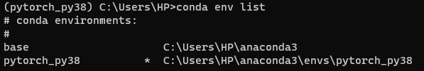
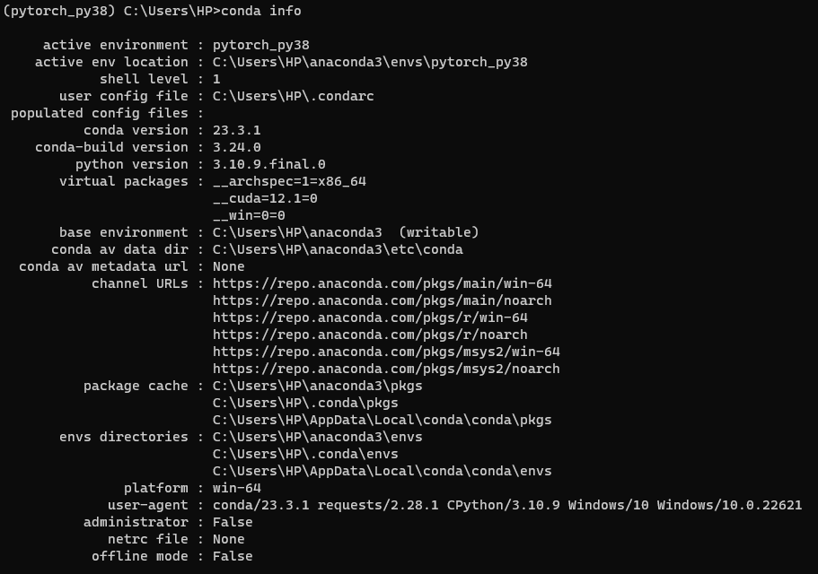
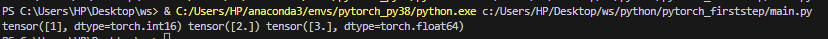
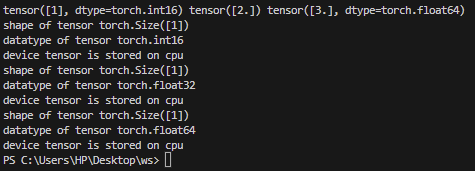

# Anaconda
Window OS 사용자로서 anaconda를 통한 가상환경에서 이번 Perception 강의를 수강중인데, 해당 가상환경에 대한 공부를 공부해보고자 한다.

## 가상환경 생성
```
conda create -n {envname}
```

가상환경을 만드는 명령어이다. -n 옵션은 가상환경의 이름을 설정해주는 부분이다.
* ps. 여러 사람이 한 서버를 사용하는 경우 conda 설치가 중복으로 되어있을 수 있다. 이 때 which conda 명령을 통해 지금 실행하고자 하는 conda가 어느 경로에 있는 conda 인지를 한번 확인해볼 필요가 있다.

## 가상환경 목록 확인하기
만들어진 가상환경들을 확인하는 방법은
```
conda info --envs
conda env list
```
명령어를 통해 가능하다.<br><br>
아나콘다를 설치하면 기본적으로 base라는 기본 환경이 만들어지고, 그 위에 방금 만든 가상환경이 만들어진다. 가상환경 경로 왼쪽에 (*) 표시가 되어있는 것이 현재 이용하고 있는 가상환경을 나타낸다.


<br>

현재 활성화된 가상환경에 대한 더 자세한 내용을 보려면
```
conda info
```
를 치면 된다.


<br>

## 가상환경으로 들어가기
가상환경 안으로 들어간다는 것은 자세히 말하면 **환경 변수들을 세팅한다** 정도로 이해하면 된다.
```
conda activate {envname}
```

## 가상환경으로부터 나오기
가상환경으로부터 나오는 방법은
```
conda deactivate
```
명령어를 이용하면 base로 이동할 수 있다.

## 필요없는 가상환경 삭제하기
잘못 만들었거나 더 이상 필요하지 않은 가상환경 삭제는
```
conda remove --name {envname}
```
으로 삭제 가능하다. 추가적으로 --all옵션을 추가하면 해당 가상환경 아래에 있는 모든 라이브러리들을 삭제 가능하다.

```
conda remove --name pytorch_py38 --all
```

## 가상환경의 이름 변경하기
기존 존재하는 가상환경의 이름을 바로 변경하는 명령어는 존재하지 않는다. 하지만 현재 존재하는 가상환경을 다른 이름으로 복사하여 사용하는 것은 가능하다.
```
conda create -n pytorch_py39 --clone pytorch_py38
```

## 패키지 설치 및 업데이트
```
conda install {package_name}    // 패키지 설치
conda update {package_name}     // 패키지 업데이트
```

# pytorch
## 예제 1 - tensor 출력해보기
```py
import torch
def make_tensor():
    # int16
    a = torch.tensor([1], dtype = torch.int16)
    # float
    b = torch.tensor([2], dtype = torch.float32)
    # double
    c = torch.tensor([3], dtype = torch.float64)

    print(a, b, c)

if __name__=="__main__":
    make_tensor()
```

## Result

<br>

## 예제 2 - tensor info 출력해보기
```py
import torch
def make_tensor():
    # int16
    a = torch.tensor([1], dtype = torch.int16)
    # float
    b = torch.tensor([2], dtype = torch.float32)
    # double
    c = torch.tensor([3], dtype = torch.float64)

    print(a, b, c)

    tensor_list = [a, b, c]

    for t in tensor_list:
        print("shape of tensor {}".format(t.shape))
        print("datatype of tensor {}".format(t.dtype))
        print("device tensor is stored on {}".format(t.device))

if __name__=="__main__":
    make_tensor() 
```

## Result

<br>

