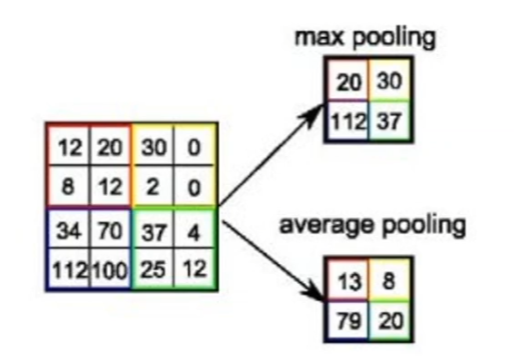
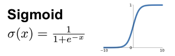
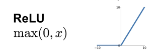

# Pooling
Conv 연산을 거쳐서 나온 activation map을 resizing하여 새로운 layer를 얻고자 할 때 사용하며, 최댓값을 추출하는 max pooling, 평균값을 추출하는 average pooling등 다양한 종류가 있다.


<br>

위의 사진에 설명을 덧붙이자면, 왼쪽과 같은 데이터가 주어졌을 때 stride를 2로 설정하고 2*2 filter를 통해 max pooling, average pooling을 적용한 것이다.<br>

pooling은 왜 필요한 것일까? 이유는 overfitting을 방지하기 위함이다.

```py
# pool.py
import numpy as np

#2D pooling
class Pool:
    def __init__(self, batch, in_c, out_c, in_h, in_w, kernel, dilation, stride, pad):
        self.batch = batch
        self.in_c = in_c
        self.out_c = out_c
        self.in_h = in_h
        self.in_w = in_w
        self.kernel = kernel
        self.dilation = dilation
        self.stride = stride
        self.pad = pad
        self.out_w = (in_w - kernel + 2 * pad) // stride + 1
        self.out_h = (in_h - kernel + 2 * pad) // stride + 1
    
    def pool(self, A):
        C = np.zeros([self.batch, self.out_c, self.out_h, self.out_w], dtype=np.float32)
        for b in range(self.batch):
            for c in range(self.in_c):
                for oh in range(self.out_h):
                    a_j = oh * self.stride - self.pad
                    for ow in range(self.out_w):
                        a_i = ow * self.stride - self.pad
                        max_value = np.amax(A[:, c, a_j:a_j+self.kernel, a_i:a_i+self.kernel])
                        C[b,c,oh,ow] = max_value
        return C
```

# Activation Function

## Sigmoid
* 출력 값을 0에서 1로 변경해줌
* 가장 많이 사용되었던 활성화 함수


<br>

```py
def sigmoid(x):
    x_shape = x.shape
    x = np.reshape(x,[-1])
    x = [ 1 / (1 + np.exp(-v)) for v in x]
    x = np.reshape(x, x_shape)
    return x
```

## tanh
* 출력 값을 -1에서 1로 변경
* zero-centered(Sigmoid의 문제점 한 가지 해결)


<br>

```py
def tanh(x):
    x_shape = x.shape
    x = np.reshape(x, [-1])
    x = [np.tanh(v) for v in x]
    x = np.reshape(x,x_shape)
    return x
```

## ReLU
* 양의 값에서는 x값이 그대로 출력
* sigmid/tanh보다 훨씬 빠른 계산속도(약 6배)
* non-zero centered 문제 발생


<br>

```py
def relu(x):
    x_shape = x.shape
    x = np.reshape(x,[-1])
    x = [max(v,0) for v in x]
    x = np.reshape(x, x_shape)
    return x
```

## Leaky ReLU
* ReLU와 유사하지만, negative regime에서 0값을 갖지 않음
* 계산이 빠름


<br>

```py
def leaky_relu(x):
    x_shape = x.shape
    x = np.reshape(x, [-1])
    x = [max(0.1*v,v) for v in x]
    x = np.reshape(x, x_shape)
    return x
```

# shallow CNN & backpropagation
```py
def shallow_network():
    """_summary_
    'Conv - MaxPool - FC' shallow model's forward and backward code
    """
    #input [1,1,6,6], 2 iter
    X = [np.array(np.random.standard_normal([1,1,6,6]), dtype=np.float32),
         np.array(np.random.standard_normal([1,1,6,6]), dtype=np.float32)]
    #GT
    Y = np.array([1,1], dtype=np.float32)
    
    #conv1 weights. [1,1,3,3]
    W1 = np.array(np.random.standard_normal([1,1,3,3]), dtype=np.float32)
    #fc weights. [1,4]
    W2 = np.array(np.random.standard_normal([1,4]), dtype=np.float32)
    
    padding = 0 
    stride = 1

    #L1 layer shape w,h
    L1_h = (X[0].shape[2] - W1.shape[2] + 2 * padding) // stride + 1
    L1_w = (X[0].shape[3] - W1.shape[2] + 2 * padding) // stride + 1
    
    print("L1 output : {} {}".format(L1_h, L1_w))
    
    #Conv1
    Convolution = Conv(batch = X[0].shape[0],
                       in_c =X[0].shape[1],
                       out_c = W1.shape[0],
                       in_h = X[0].shape[2],
                       in_w = X[0].shape[3],
                       k_h = W1.shape[2],
                       k_w = W1.shape[3],
                       dilation = 1,
                       stride = stride,
                       pad = padding)
    #conv1 diff
    Conv_diff = Conv(batch = X[0].shape[0],
                     in_c = X[0].shape[1],
                     out_c = W1.shape[0],
                     in_h = X[0].shape[2],
                     in_w = X[0].shape[3],
                     k_h = L1_h,
                     k_w = L1_w,
                     dilation = 1,
                     stride = 1,
                     pad = 0)
    #FC
    Fc = FC(batch = X[0].shape[0],
            in_c = X[1].shape[1],
            out_c = 1,
            in_h = L1_h,
            in_w = L1_w)
    #Max Pooling
    Pooling = Pool(batch = X[0].shape[0],
                   in_c = W1.shape[0],
                   out_c = W1.shape[0],
                   in_h = L1_h,
                   in_w = L1_w,
                   kernel = 2,
                   dilation = 1,
                   stride = 2,
                   pad = 0)
    
    num_epoch = 1000
    for e in range(num_epoch):
        total_loss = 0
        for i in range(len(X)):
            #forward
            L1 = Convolution.gemm(X[i], W1)
            #print("L1")
            #print(L1)
            L1_act = np.array(sigmoid(L1), dtype=np.float32)
            #print("L1_act")
            #print(L1_act)
            
            L1_max = Pooling.pool(L1_act)
            
            #print("L1 max")
            #print(L1_max)
            
            L1_max_flatten = np.reshape(L1_max, (1,-1))
            #print(L1_max_flatten.shape)
            
            L2 = Fc.fc(L1_max_flatten, W2)
            #print("L2")
            #print(L2)
            
            L2_act = np.array(sigmoid(L2), dtype=np.float32)
            
            #print("L2_act")
            #print(L2_act)
            
            #L2 error
            loss = np.square(Y[i] - L2_act) * 0.5
            #print(loss)
            total_loss += loss.item()
            
            
            #Backward (Backpropogation)
            
            #delta E / delta W2
            
            diff_w2_a = L2_act - Y[i]
            
            diff_w2_b = L2_act*(1 - L2_act)
            
            diff_w2_c = L1_max
            
            diff_w2 = diff_w2_a * diff_w2_b * diff_w2_c
            diff_w2 = np.reshape(diff_w2, (1,-1))
            # print("{} / {} / {}".format(diff_w2_a, diff_w2_b, diff_w2_c))
            # print("diff_w2 : ", diff_w2)
            
            #delta E / delta W1
            diff_w1 = 1
            diff_w1_a = diff_w2_a * diff_w2_b
            
            # print("diff_w1_a")
            # print(diff_w1_a)
            
            diff_w1_b = np.reshape(W2,(1,1,2,2))
            
            # print("diff_w1_b")
            # print(diff_w1_b)
            
            diff_w1_b = diff_w1_b.repeat(2, axis=2).repeat(2,axis=3)
            
            # print("L1_act")
            # print(L1_act)
            # print("L1_max")
            # print(L1_max)

            L1_max_repeat = L1_max.repeat(2, axis=2).repeat(2, axis=3)
            #diff maxpool
            diff_w1_c = np.equal(L1_act, L1_max_repeat).astype(int)
            #print(diff_w1_c)
            
            diff_w1_d = diff_w1_c * L1_act * (1 - L1_act)
            
            #print(diff_w1_d)
            
            #diff_w1_e = X[i]
            
            diff_w1 = diff_w1_a * diff_w1_b * diff_w1_c * diff_w1_d
            
            diff_w1 = Conv_diff.gemm(X[i], diff_w1)
            
            # print("diff_w1")
            # print(diff_w1)
            
            
            #update
            W2 = W2 - 0.01 * diff_w2
            W1 = W1 - 0.01 * diff_w1
            
        print("{} epoch loss {}".format(e, total_loss / len(X)))
```

