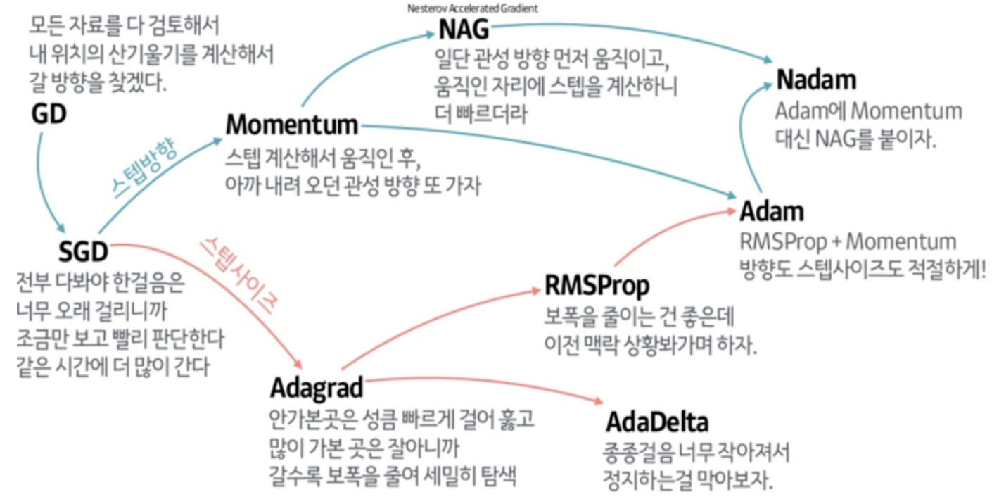

# Optimizer
먼저 Optimizer에 어떤 종류가 있는지 살펴보자.

 

## SGD
* batch 대신 mini-batch를 사용하여 Loss Function을 계산
* batch gradient descent보다 부정확할 수 있으나, 계산속도가 빠름
* $W = W - \eta\frac{\delta L}{\delta W}$

## Momentum
* 이전 기울기 방향에 속도항을 추가
* $v = \alpha v - \eta \frac{\delta L}{\delta W}$
* $W = W + v$

## Adagrad
* 각 Feature마다 Learning rate를 Adaptive하게 조절

## RMS-prop
* Adagrad의 한계점을 개선하기 위해 제안
* gradient의 크기를 지수 이동 평균(exponential moving average)을 사용하여 조절
* gradient의 크기에 따라 파라미터 업데이트

## Adam
* Momentum과 RMS-prop의 장점을 결합한 알고리즘

# Drop out
* 신경망에서 Drop-out Rate에 따라 뉴련을 제거하는 방법
* Overfitting을 방지하기 위해 사용
* Drop-out Rate는 하이퍼 파라미터로, 일반적으로 0.5를 사용

# Batch Normalization
신경망에서 gradient값이 너무 크거나 작다면, 학습이 효과적으로 이루어지지 않는다. 이러한 문제를 해결하기 위해 Sigmoid나 tanh와 같은 활성화 함수를 통해 전체 값을 매우 작은 범위로 바꾸는데 이 때 매우 큰 값 또한 너무나 작게 변화한다는 단점이 있다. 
위의 문제를 해결하는 또 다른 방법인 배치 정규화에 대해 알아보자. 
기본적으로 정규화를 하는 이유는 학습 시간 단축과 지역 최솟값에 빠지는 현상을 막기 위함이다. 
배치 정규화는 평균과 분산을 조정하는 과정이 별도의 과정으로 떼어진 것이 아니라, 신경망 안에 포함되어 학습 시 평균과 분산을 조정하는 과정이다. 즉 각 레이어마다 정규화하는 레이어를 두어 변형된 분포가 나오지 않게 하는 것이다.