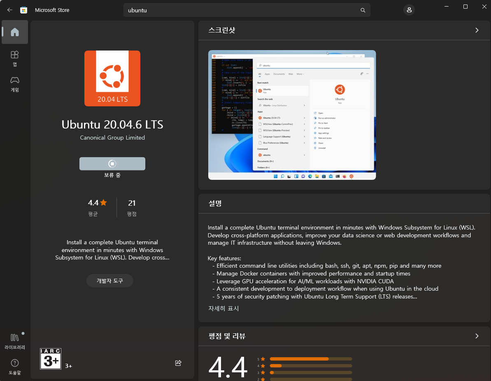
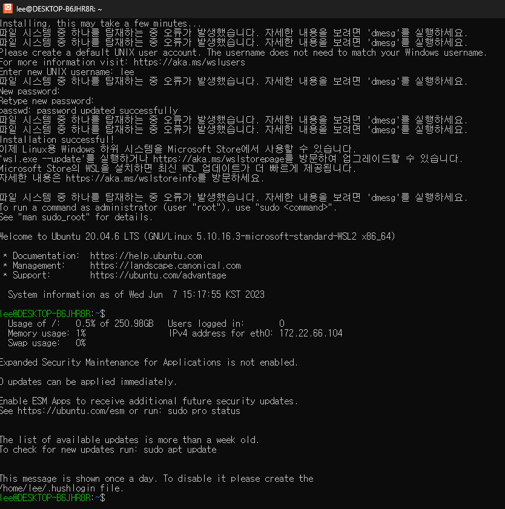
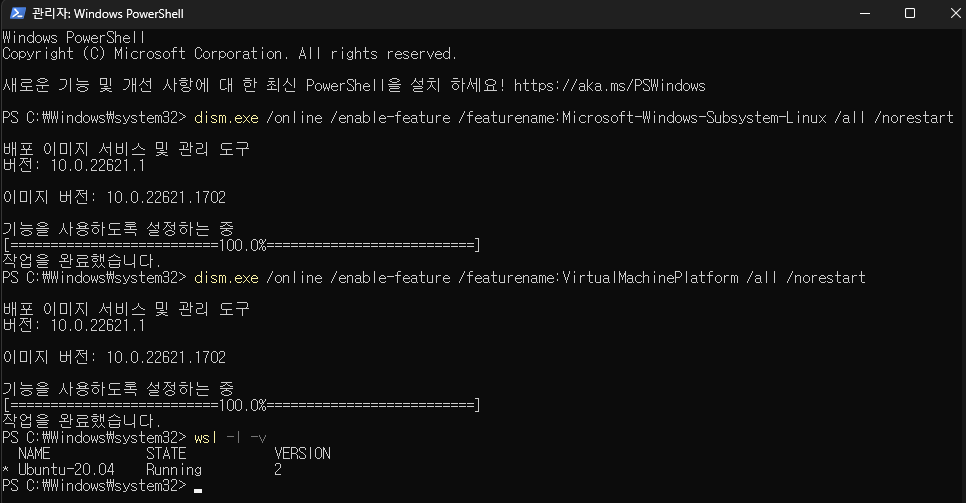
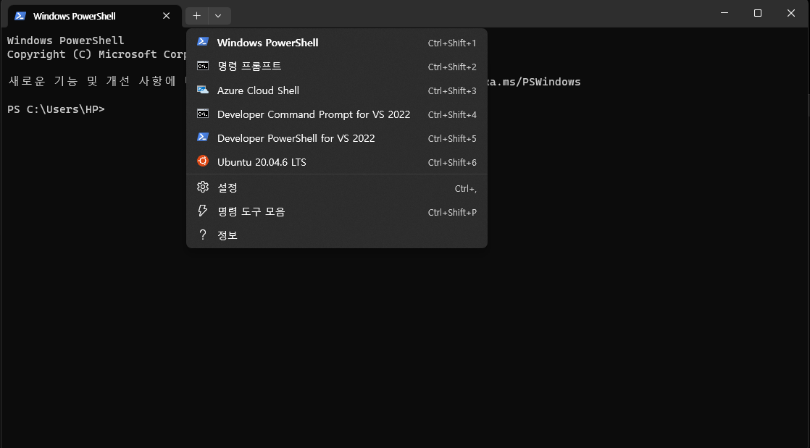
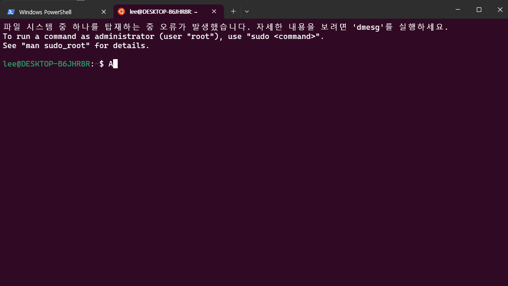
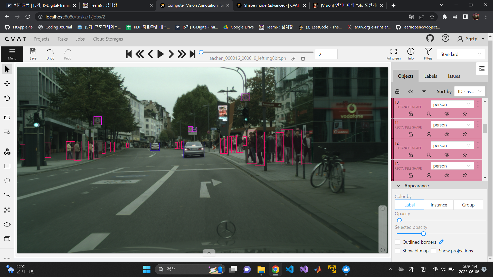
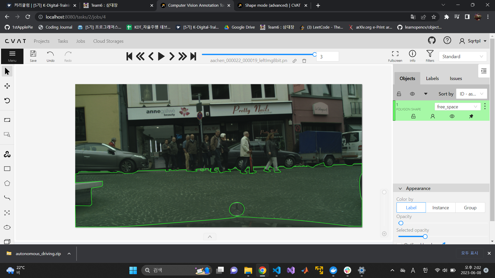

# Data Labeling
* Labeling은 확보한 원시 데이터(Raw Data)를 유의미한 작업에 사용하도록 데이터를 만드는 작업
* 예시) 기계학습(Maching Learning) 또는 딥러닝(Deep Learning)에서 인공지능이 학습에 필요한 데이터를 만드는 작업
* 레이블링 또는 어노테이션(Annotation), 태깅(Tagging)이라 부른다.
* Computer Vision에서는 주로 이미지에 필요한 작업(Classification, Detection)에 대해 결과를 미리 입력하는 작업
* 데이터 라벨링에는 상당한 시간이 걸림
* 따라서 Data Labeling을 최소화하면서 보다 효과적인 데이터 증강(Data Augmentation) 방법들이 제안되고 있다.
<br>

# Data Labeling Tools
* [CVAT](https://opencv.github.io/cvat/docs/administration/basics/installation/)
    * Docker Image를 제공하여 편리하게 설치할 수 있음
* labelme
* labelmg
<br>

# WSL 설치
* [WSK 설치 방법](https://learn.microsoft.com/ko-kr/windows/wsl/install)
1. Microsoft Store에서 Ubuntu Download


<br>

필자는 store에서 다운로드가 되지 않는 오류가 있었다.


2. Ubuntu 관리자 권한으로 실행 후 계정 생성


<br>

3. WSL 시스템 활성화
관리자 권한으로 PowerShell 실행
```
> dism.exe /online /enable-feature /featurename:Microsoft-Windows-Subsystem-Linux /all /norestart
> dism.exe /online /enable-feature /featurename:VirtualMachinePlatform /all /norestart
> wsl -l -v
```

만약 확인 시 version이 1이라면 2로 변경해야 한다.


<br>

4. Ubuntu 실행
Windows Terminal에서 우측에 'v'버튼을 클릭하여 'Ubuntu'를 선택


<br>


<br>

# Docker Desktop 설치
[Install Docker Engine on Ubuntu](https://docs.docker.com/engine/install/ubuntu/)


# Data Augmentation
* 데이터 증강의 기본 개념은 데이터가 갖고있는 고유한 특징/특성에 (추가/변경/제거)를 통해 새로운 이미지를 만드는 것
* 색공간 뿐 아니라 이미지의 기하학적 형태를 변형하기도 함

# CVAT을 활용한 Data Labeling

## Object Detection Task


<br>

## Segmentation Task


<br>