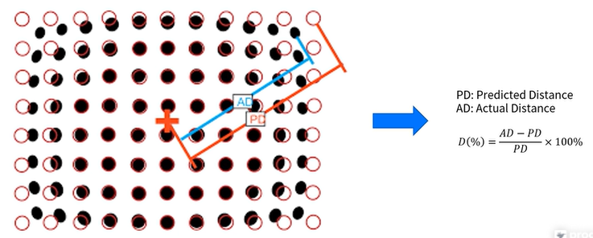

왜곡이란 무엇이고 왜 발생할까?

완벽한 Pinhole 카메라는 빛이 하나의 점을 통과하지만, 렌즈는 크기를 갖는 물체이기 때문에 빛이 굴절되어 왜곡이 발생하고, 이미지 평면이 반듯한 평면일 수 없기에 이또한 왜곡의 발생 요인이 된다. 
렌즈로 인한 왜곡은 이미지 중심부에서 멀어질수록 표현 비율이 달라지게 된다.

 

위 그림의 수식을 통해 왜곡의 정도를 계산할 수 있다.

# 방사 왜곡의 형태
* Barrel Distortion: 중심부가 외각부보다 큰 형태로 발생
* Pincushion Distortion: 중심부가 외각부보다 작은 형태로 발생

# 접선 왜곡
접선 왜곡은 카메라 제조 공정에서 발생하는 왜곡으로, 렌즈와 이미지 센서와의 수평이 맞지 않는 경우 발생한다.

위 두가지 왜곡 외에도 다양한 형태의 왜곡이 존재한다. ex) 원근 왜곡

# 3차원 위치 정보 추정
* 2개 이상의 카메라로 동일한 시점에 촬영한 각 1장의 이미지 만으로 3차원 위치정보를 추정할 수 있다.
* 각 카메라의 Extrinsic Parameter를 알아야 정확한 정보를 추정할 수 있다.
* 같은 카메라로, 카메라가 움직이는 환경에서 연속된 이미지 정보를 활용하여 3차원 위치정보를 추정할 수 있다.
* 카메라의 움직임 정보를 정밀하게 측정 & 추정해야 정확한 정보를 얻을 수 있다.
