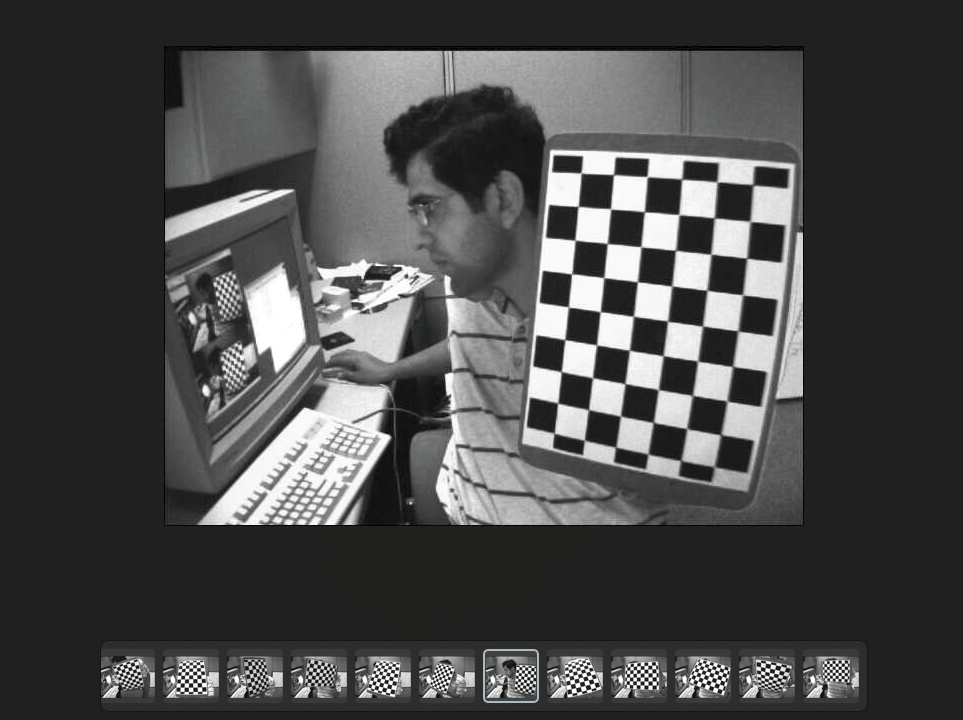
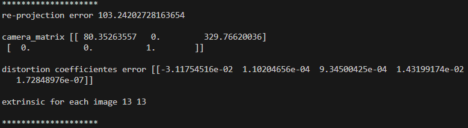

# Sample Images


<br>

# Camera Calibration Information
```py
import cv2
import glob
import numpy as np

# Get Image Path List
image_path_list = glob.glob("C:/Users/HP/Desktop/ws/python/Intrinsic_Calibration/images/*.jpg")

# Chess board Config
BOARD_WIDTH = 9
BOARD_HEIGHT = 6
SQUARE_SIZE = 0.025

DISPLAY_IMAGE = False

# Window-name Config
window_name = "Intrinsic Calibration"
cv2.namedWindow(window_name, cv2.WINDOW_NORMAL)

# Calbration Config
flags = (cv2.CALIB_CB_ADAPTIVE_THRESH + 
         cv2.CALIB_CB_NORMALIZE_IMAGE + 
         cv2.CALIB_CB_FAST_CHECK)
pattern_size = (BOARD_WIDTH, BOARD_HEIGHT)

image_points = list()

counter = 0

for image_path in image_path_list:
    image = cv2.imread(image_path, cv2.IMREAD_COLOR)
    # OpenCV Color Space -> BGR
    image_gray = cv2.cvtColor(image, cv2.COLOR_BGR2GRAY)

    ret, corners = cv2.findChessboardCorners(image_gray, pattern_size, flags)
    if ret == True:
        if DISPLAY_IMAGE:
            image_draw = cv2.drawChessboardCorners(image, pattern_size, corners, ret)
            for corner in corners:
                counter_text = str(counter)
                point = (int(corner[0][0]), int(corner[0][1]))
                cv2.putText(image_draw, counter_text, point, 2, 0.5, (0, 0, 255), 1)
                counter += 1

            counter = 0
            cv2.imshow(window_name, image_draw)
            cv2.waitKey(0)
        image_points.append(corners)
object_points = list()

# (13, 54, 1, 2)
# (image_count, feature count = 9 * 6, list, image_point(u, v))
# object_points
# (13, 54, 1, 3)
# (image_count, feature count = 9 * 6, list, object_point(x, y, z))
"""
forward: Z
right: Y
down: X
"""

BOARD_WIDTH = 9
BOARD_HEIGHT = 6

for _ in range(len(image_path_list)):
    object_point = list()

    height = 0
    for _ in range(BOARD_WIDTH):
        # Loop Width -> 9
        width = 0
        for _ in range(BOARD_HEIGHT):
            # Loop Height -> 6
            point = [[height, width, 0]]
            object_point.append(point)
            width += SQUARE_SIZE
        height += SQUARE_SIZE
    object_points.append(object_point)
object_points = np.asarray(object_points, dtype = np.float32)

# image_size = 640 * 480
tmp_image = cv2.imread(image_path_list[0], cv2.IMREAD_ANYCOLOR)
image_shape = np.shape(tmp_image)
IMAGE_WIDHT = image_shape[1]
IMAGE_HEGIHT = image_shape[0]
image_shape = (IMAGE_WIDHT, IMAGE_HEGIHT)
print(type(object_points))
ret, cameraMatrix, distCoeffs, rvcs, tvecs = cv2.calibrateCamera(object_points, image_points, image_shape, None, None)

print("*" * 20)
print(f"re-projection error {ret}\n")
print(f"camera_matrix {cameraMatrix}\n")
print(f"distortion coefficientes error {distCoeffs}\n")
print(f"extrinsic for each image {len(rvcs)} {len(tvecs)}\n")
print("*" * 20)

"""
0, 0, 0 -> index 0
0, 0.025, 0 -> index 1
"""
```

## Result


<br>

# 작성중...