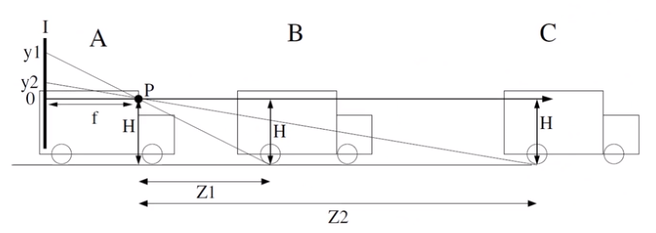

처음에는 우리가 한 눈만을 떴을때를 생각하고 단안 카메라로 Depth Estimation이 불가능할 것이라 생각하였는데, 교육을 수강하며 단안 카메라로도 Depth Estimation이 가능하다는 사실을 깨달았다. 오늘은 해당 과정이 어떻게 가능한지 살짝 알아보고자 한다.

단안카메라에서 원근법을 사용하는 방법은 두 가지 단서를 사용한다.
1. 차량의 크기
2. 차량 바닥의 위치

도로면의 기하학 정보를 활용하면 더 나은 결과를 얻을 수 있다. 
평평한 바닥과 광학 축이 노면과 평행하도록 설치된 카메라가 있다고 가정하자. 카메라로부터 $Z$만큼 떨어진 노면은 이미지에서 높이 $y$에 투영된다.

 

위의 그림에서 우리가 알고자 하는 것은 Z이고, H는 카메라의 높이이다.
$ y_1 : f = H : Z_1$ 비례식에서 우리가 알고자 하는 Z값을 제외한 모든 값을 알고 있으므로 Z를 구할 수 있는 것이다.
$y = \frac{fH}{Z}$

따라서 어제 배운 픽셀값과 초점거리 간의 관계를 이용하여 y값만 알아낸다면 위의 조건에서 거리 Z를 구하는 것은 어렵지 않다. 하지만 광학축을 노면과 항상 평행하게 유지하는 것은 거의 불가능에 가깝다.

# 작성중...