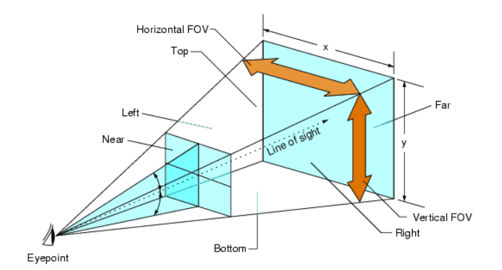

이전에 Computer Vision에서 활용하는 기하학적 방법으로 객체의 거리(위치)를 추정하는 기법을 학습했다.

# Geometrical Distance Estimation

 

위 그림에서 우리가 더 생각해보아야 할 문제는 ***해당 평면에 위치하지 않은, 즉 횡방향으로 이동된 물체에 대한 깊이는 어떻게 추정하는가***라는 문제이다. 
그래서 오늘은 차원을 하나 늘려 Distance Estimation을 어떻게 결정하는지 공부해보고자 한다.  

그렇다면 실제 물체의 횡방향 거리정보는 어떻게 얻을 수 있을까? 
이는 FOV를 활용하여 해결이 가능하다. FOV란 카메라 렌트를 취부하여 보이는 영상을 촬영했을 때, 그 촬영한 영상의 영역이라고 설명할 수 있고, 해당 변수를 사용하면 이미지에서 땅에 붙어있지 않은 물체의 깊이 추정 문제도 해결 가능하다. 

 

여기까지는 카메라와 대상의 기하학적 조건, 카메라와 대상 객체의 실제 크기 정보를 활용하여 깊이를 추정하는 방법을 배웠다.  

# Homography
3차원 공간에 놓인 point를 image 평면과 평행하게 하나의 평면에 포함되도록 평면을 만들어 homogeneous 좌표계로 변환하면, 더욱 쉽게 깊이 추정이 가능하다고 한다.  
이미지에서 본 점은 $P_img = (x, y)$로 표현이 가능하지만, 이미지보다 차원이 더 높은 공간에서, 이미지 평면의 좌표를 설명할 수 있을까? 
초점 거리의 정의는 렌즈로부터 이미지 평면까지의 거리를 의미한다. 
정규 이미지 좌표계는 렌즈로부터 거리가 1인 가상의 평면을 의미한다. 
카메라 좌표계를 기준으로 생각하면, 정규 이미지 평면에 존재하는 점 $(u, v)$는 $(u, v, 1)$로 표현이 가능하다. 이미지 평면에 존재하는 점 $(x, y)$는 $(fx, fy, f)$로 표현이 가능하다. 
즉, 이미지에 맺힌 특정 대상은 3차원 공간에 유일하고, 유한한 위치에 존재하지만, 2차원 공간으로 투영되는 과정에서 무한개의 점으로 표현이 가능하다. 하지만 이는 이미지 공간(Normalized Image Plane or Image Plane)에 투영되는가에 따라 달라지는 것이지, 그 대상은 동일하다. 
간단히 말해 각 평면들에 있는 point에 특정 상수를 곱하면, Homogeneous Coordinate에서 모두 동일한 위치에 있다는 것이다.