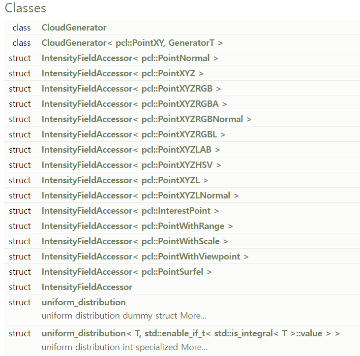

LiDAR는 빛을 탐지하고 범위를 측정하는 센서로 RADAR(RAdio Detection And Ranging)에서 사용하는 전파(Radio)를 빛(Light)으로 변경한 센서이다.

# LiDAR 종류
1. Single Point Distance Sensor -> 레이저 포인터와 같은 점
2. 2D Scanners
3. 3D Scanners
4. Non-Repeating Pattern Scanners

# Parsing
2D LiDAR와 3D LiDAR 모두 반사된 객체와의 직선 거리이기 때문에, 반사된 포인트의 위치를 파악하기 위해서는 별도 계산이 필요하다.(이는 LiDAR 센서마다 방법이 다르다.)<br>
해당 과정을 Parsing이라고 칭한다.

# PCL


<br>

Point Cloud를 다룰 수 있는 많은 클래스를 제공한다. cmake version이 3.x 이상이어야 cmake가 가능하다.


<br>

PCL 라이브러리를 사용하다보 보면 두 가지 Container를 보게 된다. PCLPointCloud2는 Point Cloud의 데이터(x, y, z 등) 뿐만 아니라 다양한 메타데이터를 포함하고, 데이터 저장 방식에 보다 효율적인 방법을 채택한 방식이다.<br>
PCLPointCloud2는 Binary Blob 방식으로 데이터를 저장하고 있으며, 데이터를 주고 받을 때(TCP/IP 등) 데이터의 크기를 효과적으로 절약할 수 있다.<br>
- PCLPointCloud2의 data 타입은 std::vector<std::uint8_t\>로 8비트 데이터이다.
- PointCloud<T\>의 데이터 타입은 std::vector<Point T\>로 pcl::PointXYZ 등 자료형의 크기에 비례한다.<br><br>

하지만 실제 데이터를 다루기 위해서는 결국 PCLPointCloud2와 PointCloud<T\>사이의 변환이 필요하다.

## 변환 코드
```cpp
pcl::PCLPointCloud2 point_cloud2;
pcl::PointCloud<pcl::PointXYZ> point_cloud;

// PointCloud2 -> <T>
pcl::fromPCLPointCloud2(point_cloud2, point_cloud);

// <T> -> PointCloud2
pcl::toPCLPointCloud2(point_cloud, point_cloud2);
```


## Ref
https://pointclouds.org/<br>
https://pointclouds.org/documentation/index.html<br>

