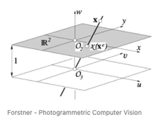
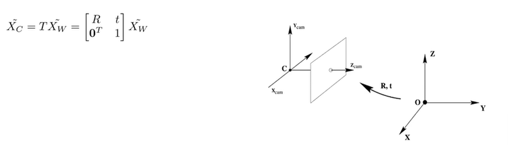
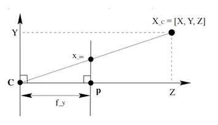
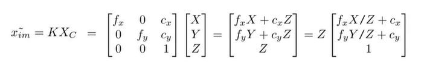
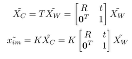

# Euler Angle & Quaternion

# Euler Angle
수학자 오일러가 고안한 개념으로 3차원 공간의 절대 좌표를 기준으로 물체의 회전을 측정하는 방식
* 장점
    * x, y ,z 세 개의 축을 기준으로 회전하기에 직관적이고 조작이 쉬움
    * 180도가 넘는 회전도 표현 가능
* 단점
    * 오일러 각을 계산하는데 드는 비용이 큼
    * 3차원 좌표계를 사용하기 때문에 Singularity Problem(in robotics)가 발생
 

## Singularity Problem in robotics
로봇이 하나 이상의 자유도(DoF)를 잃게 만드는 특정 지점으로 tool center point(TCP)이 특이점 근처나 안으로 이동하게되면 로봇이 이동을 멈추거나 예기치 않은 방식으로 작동하는 문제를 말함
 

# Quaternion
* 쿼터니언은 4개의 수(x, y, z, w)로 이루어지며 각 성분은 축이나 각도를 의미하는게 아닌 하나의 벡터(x, y, z)와 스칼라(w: roll)를 의미
* 일반적으로 4차원 좌표계는 이해가 쉽지 않기에 각 성분에 직접 접근 및 수정하지는 않음
* 오일러 각이 회전 순서에 기반하여 작동하는 반면 Quaternion은 세 축을 동시에 회전시키기 때문에 짐벌 락 현상이 발생하지 않음
* 4개의 성분으로 이루어져 있어 Euler Angle에서 발생했던 Singularity Problem 또한 발생하지 않아 미분이 가능하여 최적화 가능
 

## Gimbal lock Problem
* 3개의 짐벌을 이용해 회전하는 두 개의 짐벌이 겹쳐질 경우 회전축 하나가 사라지는 현상. 겹쳐진 두 개의 축을 더 이상 움직일 수 없게 된다는 의미가 아니라, 그 두 개가 하나의 축으로 합쳐져서 각각 회전시켜도 같은 축을 기준으로 회전하게 된다는 의미 

# Projective Geometry
Euclidean geometry를 따르면, 3D Euclidean space에서 평행한 두 직선은 무한대의 거리에서 교차하지만 이 교차점을 수학적으로 표현할 방법이 없다. 이 3D Euclidean space를 2D 이미지에 투영시켰을 때 두 직선은 사다리꼴 모양을 하며 교차점을 가지게 되는데 (이 교차점을 Vanishing point라고 한다), 2차원에서 이 직선들의 벡터를 구해내면 우리는 이 교차점의 2D 위치를 수학적으로 표현할 수 있다 (즉, pixel 위치를 구할 수 있다). 즉, 3D→2D 변환을 Euclidean geometry를 통해 mapping하기 위해서는 무한대 거리의 점→유한한 거리의 점으로의 mapping이 가능해야한다는건데, 이 중 3D Euclidean space에서 무한대의 거리에 위치한 점을 수로 표현할 수 없으니 mapping을 할 방법이 없는 것이다. 

Projective geometry는 이 무한대의 거리에 있는 교차점을 수로 표현할 수 있다. 3D space에서 무한대의 거리에 있는 교차점도 표현할 수 있고, 2D 이미지에서 사다리꼴 모양의 직선들의 교차점도 표현할 수 있다. 3D→2D mapping에 필요한 두 위치를 모두 수로 표현할 수 있는게 Projective geometry의 특징이다. 

## Hierarchies of geometries
* Euclidean
    * Rotation + Translation 표현 가능
* Similarity
    * Euclidean transformation에서 uniform scaling 표현 가능
    * Euclidean transformation에서 length 정보 손실
* Affine
    * Similarity transformation에서 Non-uniform scaling + shear 표현 가능
    * Similarity transformation에서 Angle / Length-ratio 정보 손실
* Projective
    * Affine transformation에서 projection 표현 가능
    * Affine transformation에서 incidence, cross-ratio 정보 손실
 

# Homogeneous coordinates
Homogeneous coordinates of x of a geometric entity x are invariant with respect to multiplation by a scalar lambda =/=0. Thus x and lambda * x represent the same entity x 

Homogeneous 좌표는 쉽게 말하면 (x, y)(Cartesian coordinate)를 (x, y, 1)로 표현하는 것. 좀더 일반적으로 말하면 임의의 0이 아닌 상수 w에 대해 (x, y)를 (wx, wy, w)로 표현. 즉, homogeneous 좌표계에서 스케일(scale)은 무시되며 (x, y)에 대한 homogeneous 좌표 표현은 무한히 많이 존재하게 됩니다. 마찬가지로, 3차원의 경우에는 (X, Y, Z)를 (X, Y, Z, 1) 나 (wX, wY, wZ, w)로 표현됨.

 

위 이미지에서 보이듯 Euclidean Space는 Projective Space의 하위 개념임을 확인할 수 있음 
Euclidean Space에서 N차원 정보는 Projective Space에서 N+1차원의 정보를 갖는다. 

## Euclidean space vs Projective space
* Euclidean space
    * Cartesian coordinates
    * Is a subset of projective space, where scale = 1
    * Add scale Information (i.e. 1) to cartesian representation
* Projective space
    * Homogeneous coordinates
    * Divide all members by scale information and remove scale information to get cartisian representation

# Camera projection

## Steps
world coordinate system(3D) -> camera coordinate system(3D) -> image coordinate system(2D)

## World coordiante(3D) to Camera coordinate(3D) transformation
* Rigid body motion
    * Rotation - 3 * 3 Matrix(SO(3))
    * Translation - 3 * 1 Vector
    * Transformation - 4 * 4 Matrix(SE(3))

 

## Camera coordinate(3D) to Image coordinate(2D) Transformation

 

$f_y : Z = X_{im} : X$이므로 $X_{im}$을 구할 수 있다. 

 

## Camera projection all step

 