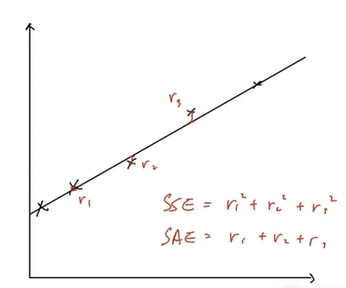
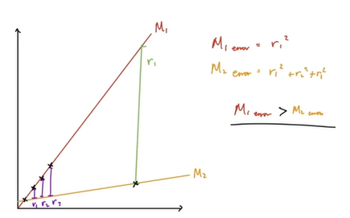

## Data
* Inlier data 
    * Data that is expected, and is corrent
* Outlier data
    * Data that is unexpectec, and is incorrect

## Model fitting - Need for outlier reprojection
* Why filter out outlier data?
    * Outlier is statistically incorrect (most of the time)
    * Outlier is geometrically incorrect (most of the time)
* In computer vision, we have 2 types of algorithms
    * Closed-form algorithms
        * Only accepts geometrically consistent data
    * Iterative optimization
        * Only accepts statistically consistent data
* Line fitting(i.e. Estimating line model)
    * Error metrics
        * SSE - Sum of squared error
        * SAE - Sum of absolute error

 

* Cannot estimate the model properly with outliers
    * M1 is a better model than M2
    * But M2 has lower error than M1

 

* Outlier rejection is essential in model estimation with noisy data
* Well-known techniques
    * RANSAC
    * M-Estimator
    * MAXCON

## RANSAC - RANdom SAmple Consensus
* Random - 무작위하게
* Sample - 데이터 샘플을 뽑아 모델을 만들고
* Consensus - 모델에 대한 데이터의 합의도를 알아봄

* RANSACN is a template algorithm
    * Compute Homography
    * Compute Essential matrix
    * Compute Fundamental matrix

### RANSAC algorithm
1. Randomly sample 'minimal set of data'
2. Estimate model with sampled data
3. Evaluate model score
    * if (Current score > So-far-best score): Update score
4. Return to step 1

