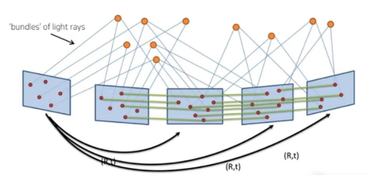

* Now there are N frames
* Each frame has unique relative motion(i.e. [R|t])
* 2D-2D correspondence exists between subsequent frames
* Each landmark may have more than 2 2D-3D correspondences

 

## Reprojection error
* Project triangulated 3D point into image plane
* Reprojected point has a different position to observed keypoint
* The distance between these two points = Reprojection error

## Nonlinear optimization
### Gauss-Newton method
뉴턴법을 연립 방정식 형태로 확장시킨 것 
즉, 변수의 개수가 n개 식의 개수가 m개인 식이 있을 때, 이 식을 $F: R^n -> R^m$인 다변수 다차원 함수로 표현할 수  있음

* 근사해 찾응 법
1. 임의의 x를 정한다.
2. $f(x)$ 값이 '0'인지 확인한다.
    * 0이라고 해도 될 정도로 작은 값이면 종료
    * 0이라고 할 수 없는 값이면 3으로 진행
3. $f(x)$의 접선을 그리고 접선과 x축이 만나는 지점으로 x를 옮김

### Schur complement
https://ko.wikipedia.org/wiki/%EC%8A%88%EC%96%B4_%EB%B3%B4%EC%88%98%ED%96%89%EB%A0%AC

