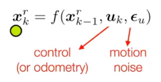
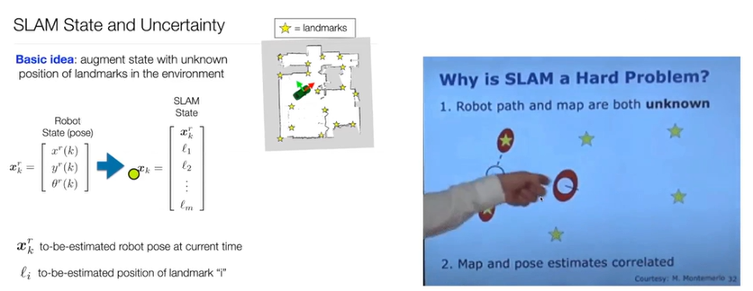
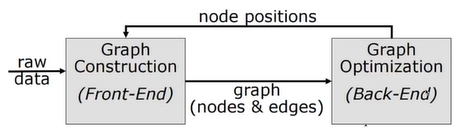

* A method to get solution of an over-determined system
    * All SLAM problems are over-determined system

* Over-determined system = There are more equations than unknown
    * i.e. More sensor measurements than the number of states

* What is the state 'x' which minimizes the sum of Z-Z^?
    * What is the robot pose and landmark location, which minimizes the difference between our measurements and given the sensor readings

## Maximum-a-posteriori(MAP) estimation in SLAM
motion model과 observation 모델의 정보를 기반으로 noise 누적에도 안정적으로 최적의 로봇 pose와 landmark의 위치 추정 -> belief

 

 

## Incremental SLAM, Batch SLAM
SLAM은 incremental SLAM(i.e. Online SLAM), batch SLAM(i.e. Offline SLAM)으로 나뉘는데 incremental SLAM은 가장 최종 state만 추종한다. 장단점으로는 연산이 빠르고 draft 에러에 취약하며 부정확하다. 
batch SLAM은 여러 시점의 정보를 독립적인 확률 분포로 계산해 draft에러는 잘 해소된다. 하지만 더 많은 정보를 필요로 하고 연산량 또한 많아 실시간 처리가 불가능했었기에 Offline SLAM으로 불린다. 

## Graph-based SLAM
* batch SLAM의 대표적인 예
* A way to implement least squares in SLAM
* Describes poses and landmarks as nodes
* Describes motion constraints and observation constraints as edges
* Extra constraint enables graph-optimization

### Pipeline

 

