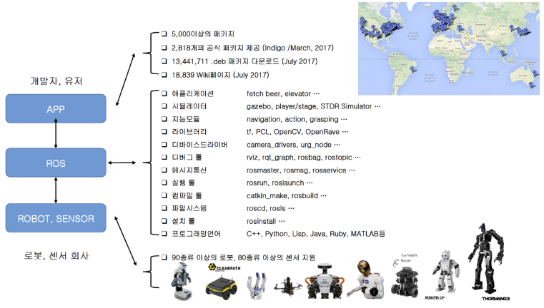

<br><br>

# ROS - 오픈소스 로봇 운영체제
* 소스 무료 공개
* 개방형 구조
* 활발한 커뮤니티 활동
* 서로 다른 운영체제, 하드웨어, 프로그램에서도 연동이 가능하며 따라서 다양
한 하드웨어가 이용되는 로봇 개발에는 매우 적합한 운영체제
* 공동 작업의 효율성을 극대화가 시키기 위해 서로 다른 운영체제를 사용하더라도 <strong>코드를 재사용하는 환경을 구축하는 것이 궁극적인 목적</strong>
* 분산 프로세스: 프로세스가 독립적으로 실행되면서 유기적으로 데이터를 주고 받을 수 있음
* 패키지 단위 관리: 같은 작업을 수행하는 여러 개의 프로세스를 패키지 단위로 관리 가능하여
개발 또는 사용이 편리하고 배포, 공유, 수정에 용이
* 공개 레파지토리: Github 등에 프로젝트를 공개하고 라이센스를 밝히게 되어 있음
* API 형태: ROS는 API를 불러와 자신이 사용하던 코드를 쉽게 적용 가능
* 복수의 프로그래밍 지원: Python, C++, C#, Java, Lisp, Lua 등으로 쉽게 구현할 수 있으며, 다양한 언어를 지원
* 대규모 실행: ROS는 대규모 실행 시스템 및 개발 프로세스에 적용 가능
<br><br>

# 로봇 소프트웨어를 개발하는데 필요한 소프트웨어의 집합체
* 소프트웨어 프레임워크(Software Framework)
<br><br>

# 메타 운영체제(Meta OS), 미들웨어(Middleware)
* 소프트웨어 모듈 + 라이브러리 집합 + 도구 집합
<br><br>

# ROS Ecosystem

출처: http://www.epnc.co.kr/news/articleView.html?idxno=110506
<br><br>

# ROS 특징
* Standard Message Definitions for Robots
    - 일반적으로 사용되는 로봇에 대한 표준 메시지 정의
    - Geometric concepts like poses, transforms, and vectors; for sensors like cameras,
    IMUs and lasers; and for navigation data like odometry, paths, and maps
    - 표준 메시지를 사용하면 다른 응용 프로그램과 연결이 용이함

* Robot Geometry Library
    - 로봇은 다양한 부품으로 이루어져 있음
    - 부품 간의 상대적인 좌표를 트리화하여 관리하는 TF 제공

* Robot Description Language
    - 로봇의 모습, 물리적인 특성을 기술하는 언어를 제공함 (URDF: XML 방식)
    - URDF를 정의하면 ROS에서 제공하는 시각적인 툴 rviz에서 로봇을 시뮬레이션 할 수 있음
* Diagnostics
    - 로봇 상태를 진단할 수 있는 진단 시스템 제공

* Pose Estimation, Localization, and Navigation
    - 로봇 자세 추정, 맵에서의 위치, 맵 생성, 이동 로봇의 네비게이션 등 기본적인 기능에 대한 라이브
    러리(package) 제공
<br><br>

# ROS Tools
* Command-Line Tools
    - GUI 없이 command 창에서 실행이 가능하며, ROS의 거
    의 모든 기능을 제공함

* RVIZ
    - 3차원 시각화 도구로 다양한 센서 데이터나, URDF로
    표현된 로봇을 나타낼 수 있음

* RQT
    - 그래픽 인터페이스 개발을 위한 Qt 기반 툴
    - 노드 사이의 연결정보 표시 rqt_graph
    - 센서 신호를 보여주는 rqt_plot
    - 데이터를 메시지 형태로 기록하고 재생하는 rqt_bag
* GAZEBO
    - 물리 엔진이 탑재된 3차원 시뮬레이터
<br><br>

# ROS 용어 정리
* Node
    * 최소단위의 실행가능한 프로세스 (하나의 실행가능한 프로그램)
    * ROS에서는 최소한의 실행단위로 프로그램을 나누어 작업
    * 각 노드는 메시지통신으로 데이터를 주고 받음
* Master
    * 노드와 노드 사이의 연결 및 메시지 통신을 위한 네임 서버
    * ROS를 구동하게 되면 사용자가 정해놓은 ROS_MASTER_URI 주소로 IP를 사용하고, 11311 포트를 이용
* Package
    * 하나 이상의 노드, 노드 실행을 위한 정보 등을 묶어 놓은 것
    * 패키지의 묶음은 메타패키지라고 함
* Message (가장 중요한 개념)
    * 하나의 ROS 프로세서(Node)에서 다른 ROS 프로세서(Node)로 정보를 전달하는 한 형태
    * 메시지를 통해 노드 간의 데이터를 주고 받음
    * 메시지는 integer, floating point, boolean와 같은 변수 형태
    * 메시지 안에 메시지를 품고 있는 간단한 데이터 구조 및 메시지들의 배열과 같은 구조도 사용 할 수 있음
* Topic(토픽)
    * 노드 메시지의 이름, ROS가 사용하는 메시지의 한 형태
    * 노드에서 메시지를 보내고 싶으면 마스터에 토픽을 등록하고 해당 토픽으로 메시지를 보냄
    * 수신을 원하는 노드는 마스터에 등록된 토픽 이름으로 메시지를 수신
    * 단방향, 연속성을 가진 통신 방법
* Publish & Publisher (발행 & 발행자)
    * 토픽의 내용에 해당하는 메시지 형태의 데이터를 송신
    * 발행자 노드는 발행을 수행하기 위한 토픽을 포함한 자신의 정보를 마스터에 등록하고 구독(Subscribe)를 원하는 노드
    에게 메시지를 보냄, 복수개로 등록이 가능함
* Subscribe & Subscriber (구독 & 구독자)
    * 토픽에 해당하는 메시지 형태의 데이터를 수신하는 것
    * 구독자 노드는 토픽을 포함한 자신의 정보를 마스터에 등록하고, 구독하고자 하는 토픽을 발행하는 발행자 노드의 정보를 마스터로부터 받음
    * 발행자 역시 복수개로 등록이 가능함
* Service(서비스)
    * 요청과 응답이 함께 사용되는 동기 방식의 메시지 교환 방식, ROS 메시지의 한 형태
    * 서비스는 요청이 있을 경우에 응답을 하는 서비스 서버와 요청을 하고 응답을 받는 서비스 클라이언트로 구성
    * 서비스는 1회용 통신 메시지로 서비스 요청과 응답이 완료되면 연결된 두 노드의 접속은 끊김
    * 양방향, 일회성 통신
* Service Server (서비스 서버)
    * 서비스 서버는 요청을 이력으로 받고, 응답을 출력하는 서비스 메시지 통신의 서버 역할
    * 서비스 요청에 의해 주어진 서비스를 수행한 후 그 결과를 서비스 클라이언트에 전달
* Service Client (서비스 클라이언트)
    * 서비스 클라이언트는 요청을 출력으로, 응답을 입력으로 받는 서비스 메시지 통신의 클라이언트 역할
    * 요청과 응답 모두 메시지로 되어 있으며, 서비스 요청을 서비스 서버에 전달하고 그 결과 값을 서비스 서버로 부터 받음
* Parameter(매개변수)
    * 노드에서 사용하는 매개변수를 말한다.
    * 디폴트로 설정 값들이 지정되어 있고, 필요에 따라 매개변수를 읽고, 바꾸는 것이 가능
    * 실시간으로 설정 값을 바꿔야 할 경우에 사용
    * 변수를 네트워크에 지정해 놓고, 그 변수를 외부에서 변경시키고 다른 노드에서 받아서 사용할 수 있음
* Parameter Server(매개변수 서버)
    * 매개변수 서버는 매개변수를 사용할 때, 각 매개변수를 등록하는 서버를 말함
    * 매개변수 서버는 마스터의 일부분임
* roscore (ROS 코어)
    * ROS 마스터를 실행하는 명령어
    * 같은 네트워크라면 다른 컴퓨터에서 실행이 가능
    * 같은 네트워크 시스템에서는 하나의 roscore만 구동되며, 사용자가 지정해 놓은 ROS_MASTER_URI 변수에 기재되어 있는 주소 및 포트를 이용함
* Catkin
    * ROS의 빌드 시스템
    * CMake(Cross Platform Make)를 ROS에 맞도록 수정하여 ROS에 특화된 Catkin 빌드 환영을 만들어 사용
* ROSBuild(Ros 빌드)
    * Catkin 이전에 사용했던 빌드 시스템, 현재는 거의 사용하지 않음
* rosrun
    * ROS의 기본적인 실행 명령어
    * 하나의 노드를 실행하는 데 사용
    * 노드가 사용하는 URI 주소 및 포트는 현재 노드가 실행중인 컴퓨터에 지정된 ROS_HOSTNAME 이라는 환경 변수 값을 사용함
* roslaunch
    * 복수개의 노드를 실행하는 명령어
    * 실행 시 패키지의 매개변수를 변경, 노드명 변경, 환경 변수 변경 등의 실행 시 설정할 수 있는 많은 옵션을 갖춘 노드 실
    행에 특화된 명령어임
<br><br>

# ROS 메시지 통신
* ROS는 프로그램을 잘게 나누어 노드(node)라는 이름으로 실행되며, 노드 간의 데이
터는 메시지 통신을 통해 이루어짐
* 이렇게 함으로써 같은 네트워크 상에 있으면 어떤 시스템에서 실행이 되도 상관없어 다양한 플랫폼으로 로봇 시스템을 구성할 수 있음<br><br>

# 통신 절차
* Step 1 : 마스터 구동
```
$ roscore
```

* Step 2 : 메시지 수신하는 노드 실행
```
$ rosrun 패키지이름 노드 이름
예시) $ rosrun turtlesim turtlesim_node
```
* Step 3 : 메시지를 전송하는 노드 실행
```
$ rosrun 패키지이름 노드 이름
예시) $ rosrun turtlesim turtle_teleop_key
※ step 2번과 3번이 바뀌어도 상관 없음
```
<br><br>

# 메시지 종류
* topic : 단방향 연속적인 전송
    - publisher, subscriber
    - 일방통행 연속적인 데이터로 센서 데이터가 많음
    - 1:N, N:1, N:M 통신도 가능함
* service
    - service server, service client
    - 양방향 통신, 일회성 통신 방법
    - 정보를 확인하는 용도로 많이 사용
    - 일회성 명령어를 주는 경우도 많이 사용
* action
    - 양방향 통신이며, 비동기 통신
    - 요청 처리 후 응답까지 시간이 오래 걸리거나 중간에 피드백이 필요한 경우 사용
    - 해당되는 목표 goal과 결과 result 피드백이 있음
    - 메시지 전송 방식 자체는 비동기 방식인 토픽과 동일
* parameter
    - 일반 프로그램 상에서 전역변수 (Global variable)와 같은 역할
    - 모든 노드에서 같은 파라미터 정보를 공유할 수 있음
<br><br>

# 메시지 형태
* 단순 자료형
    - 정수(integer), 부동소수점(floating point), 논리형(boolean)
    - http://wiki.ros.org/std_msgs
* 메시지 안에 메시지를 가지고 있는 데이터 구조
    - geometry_msgs/PoseStamped
    - http://docs.ros.org/api/geometry_msgs/html/msg/PoseStamped.html
* 배열과 같은 구조
    - float32[ ] ranges
    - sensor_msgs/LaserScan
    - http://docs.ros.org/api/sensor_msgs/html/msg/LaserScan.html

참고<br>
http://wiki.ros.org/msg<br>
http://wiki.ros.org/common_msgs
<br><br>

# 주요 명령어
<div class="table_wrap"><table style="border-collapse: collapse; width: 100%;" border="1" data-ke-align="alignLeft">
<tbody>
<tr>
<td>명령어</td>
<td>설명</td>
</tr>
<tr>
<td>roscd <package\></td>
<td>지정한 ROS 패키지의 디렉터리로 이동</td>
</tr>
<tr>
<td>roscore</td>
<td>master(ROS name service)<br>
rosout (로그 기록)<br>
parameter server(파라미터 관리)<br></td>
</tr>
<tr>
<td>rosrun <package\> <executable\></td>
<td>패키지에 있는 node를 실행<br>
rosrun package node __name:=name</td>
</tr>
<tr>
<td>roslaunch</td>
<td>노드를 여러 개 한번에 실행 및 실행 옵션 설정</td>
</tr>
<tr>
<td>rosclean</td>
<td>ROS 로그 파일을 검사하거나 삭제</td>
</tr>
<tr>
<td>rostopic</td>
<td>ROS 토픽 정보 확인</td>
</tr>
<tr>
<td>rosservice</td>
<td>ROS 서비스 정보 확인</td>
</tr>
<tr>
<td>rosnode</td>
<td>ROS 노드 정보 확인</td>
</tr>
<tr>
<td>rosparam</td>
<td>ROS 파라미터 정보 확인</td>
</tr>
<tr>
<td>rosbag</td>
<td>ROS 메시지 기록, 재생</td>
</tr>
</tbody>
</table></div>