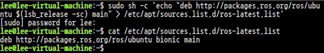
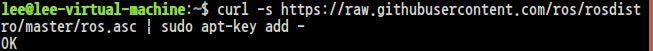
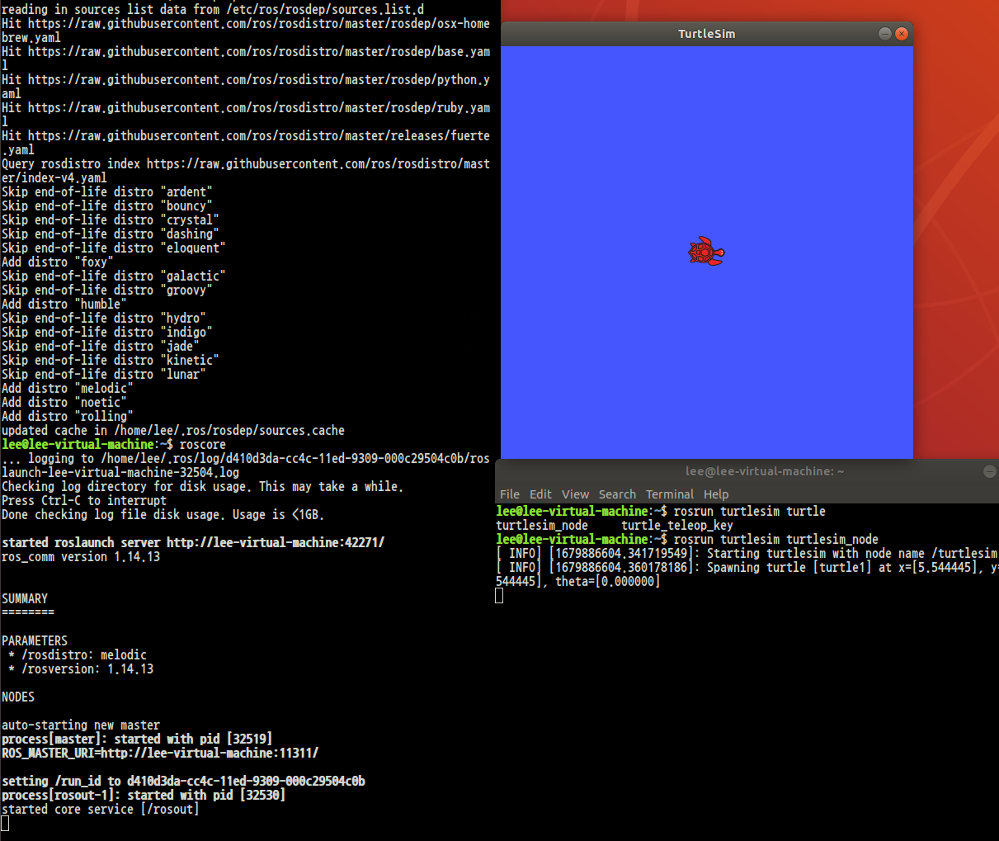
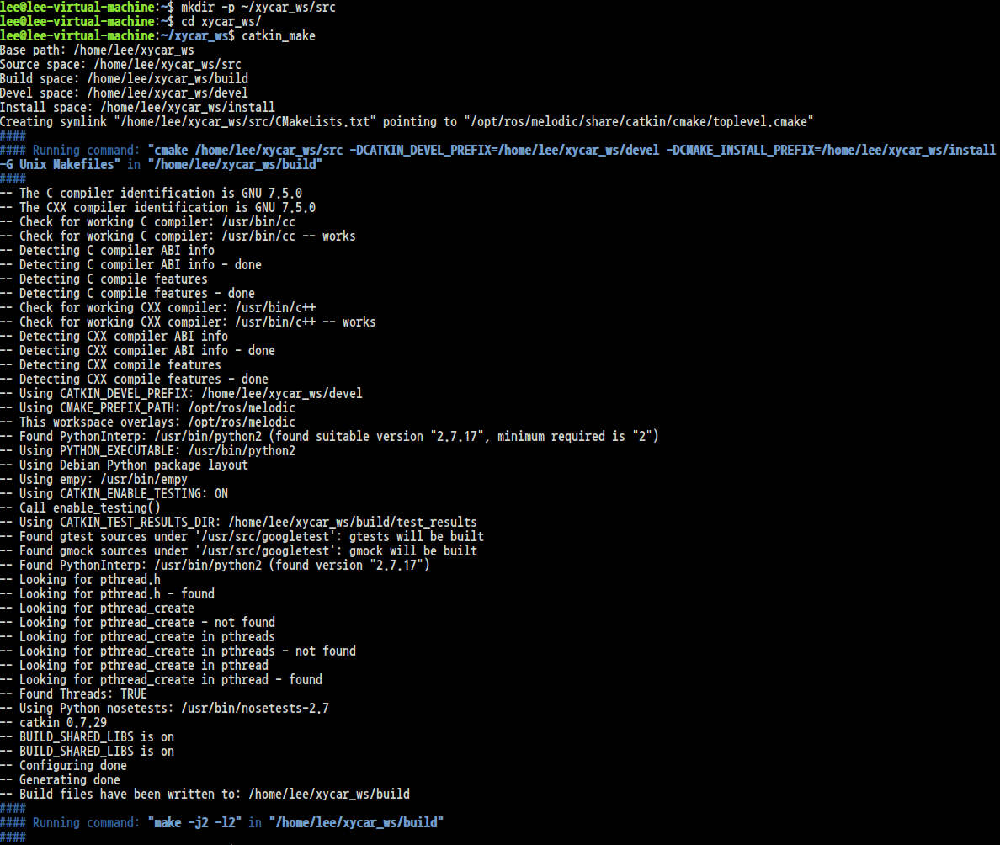
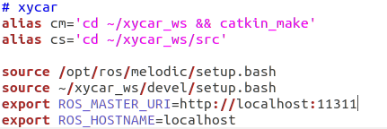
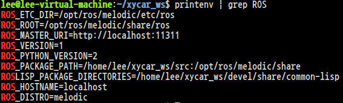
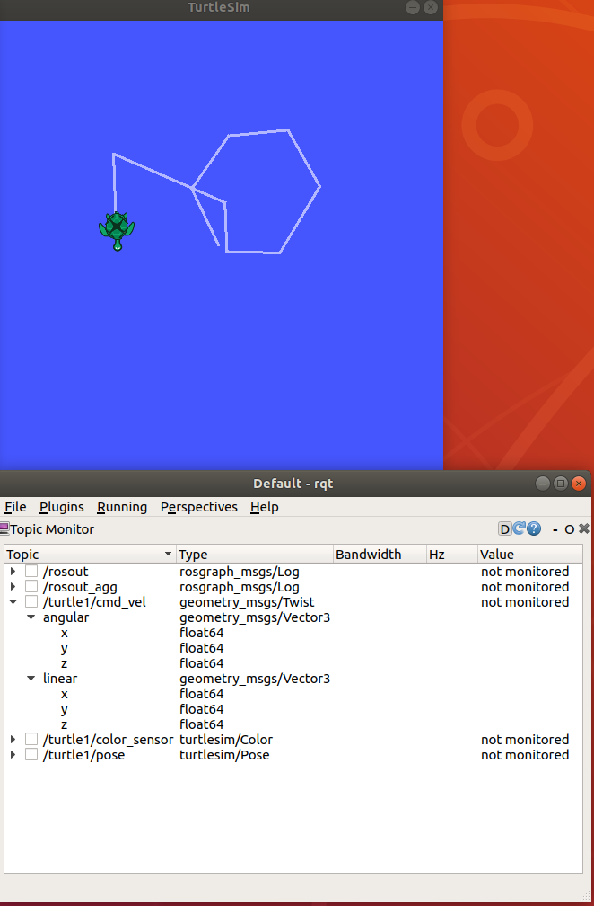

참고: http://wiki.ros.org/melodic/Installation/Ubuntu
## 1. ROS를 제공하는 Software Repository 등록
 ```
$ sudo sh -c 'echo "deb http://packages.ros.org/ros/ubuntu $(lsb_release -sc) main" > /etc/apt/sources.list.d/ros-latest.list'
$ cat /etc/apt/sources.list.d/ros-latest.list
 ```


## 2. apt key setup
```
$ sudo apt install curl # if you haven't already installed curl
$ curl -s https://raw.githubusercontent.com/ros/rosdistro/master/ros.asc | sudo apt-key add -
```


## 3. 패키지 설치
```
$ sudo apt-get update
$ sudo apt install ros-melodic-desktop-full
```

## 4. 쉘 환경 설정
```
$ echo "source /opt/ros/melodic/setup.bash" >> ~/.bashrc
$ source ~/.bashrc
```

## 5. 추가 도구 설치
```
$ sudo apt install python-rosdep python-rosinstall python-rosinstall-generator python-wstool build-essential
$ sudo rosdep init
$ rosdep update
```

## 6. 설치 확인



# 워크스페이스 생성
```
$ cd ~
$ mkdir -p ~/xycar_ws/src
$ cd xycar_ws
$ catkin_make       // ROS 코딩 환경 셋업과 정리(build)
```


# 환경변수 설정
```
sudo gedit ~/.bashrc
```
후에 아래 내용을 추가해주자.
```
alias cm='cd ~/xycar_ws && catkin_make'
alias cs='cd ~/xycar_ws/src'

source /opt/ros/melodic/setup.bash
source ~/xycar_ws/devel/setup.bash
export ROS_MASTER_URI=http://localhost:11311
export ROS_HOSTNAME=localhost
```
이후 source 명령어로 refresh
```
$ source ~/.bashrc
```


## 환경변수 확인
```
$ printenv | grep ROS
```



# 키보드 입력을 토픽으로 받아 터틀 움직이기
```
<terminal 1>
$ roscore

<terminal 2>
$ rosrun turtlesim turtlesim_node

<terminal 3>
$ rosrun turtlesim turtle_teleop_key
```
이후 터미널3에 키보드 입력을 하면 터틀이 움직이는 것을 볼 수 있다.

