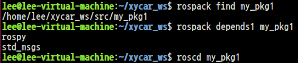
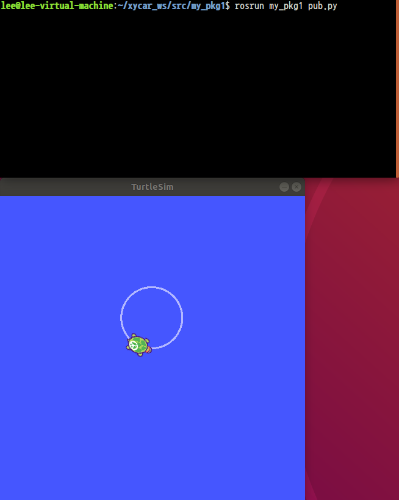
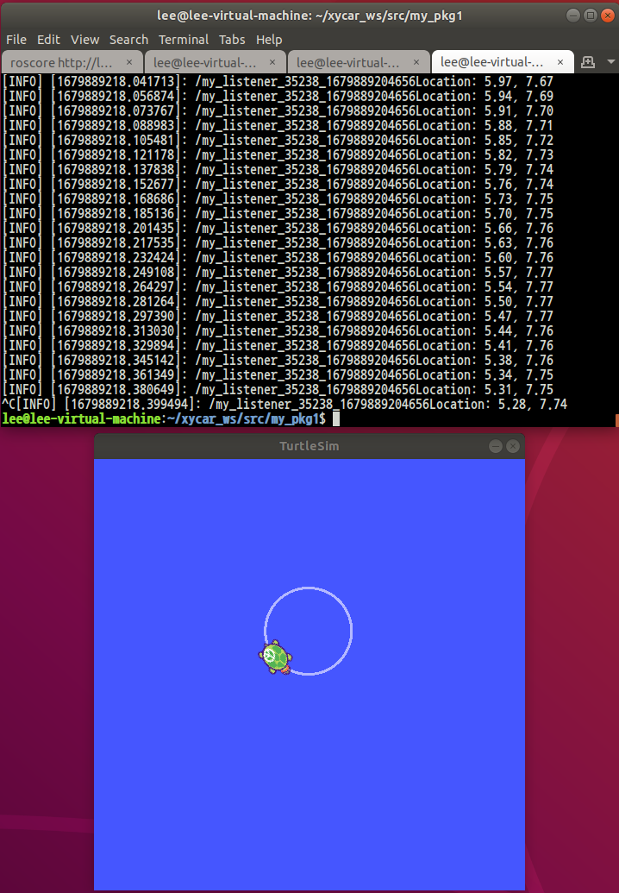

# Publisher 만들기

## 1. 패키지 만들기
```
$ cd ~/xycar_ws/src
$ catkin_create_pkg <package_name> <의존하고 있는 다른 패키지(ex. std_msgs, rospy, roscpp...)>
$ cd ..
$ catkin_make
```

## 2. 만들어진 패키지 확인
```
$ rospack find <package_name>
$ rospack depends1 <package_name>
$ roscd <package_name>
```


## 3. 코드 작성 - 프로그래밍
```py
# ~/xycar_ws/src/my_pkg1/src/pub.py
#! /usr/bin/env python

import rospy
from geometry_msgs.msg import Twist

rospy.init_node('my_node', anonymous = True)
pub = rospy.Publisher('/turtle1/cmd_vel', Twist, queue_size = 10)

msg = Twist()
msg.linear.x = 2.0
msg.linear.y = 0
msg.linear.z = 0
msg.angular.x = 0
msg.angular.y = 0
msg.angular.z = 1.8

rate = rospy.Rate(1)

while not rospy.is_shutdown():
    pub.publish(msg)
    rate.sleep()
```

실행하기 전 권한설정을 해 주도록 하자.
```
$ chmod +x pub.py
```

## 4. 프로그램 실행
rosrun을 통해 작성한 코드를 실행하여 터틀을 움직여보자
```
<terminal 1>
$ rosrun

<terminal 2>
$ rosrun turtlesim turtlesim_node

<terminal 3>
$ rosrun my_pkg1 pub.py
```


# Subscriber 만들기

## 1. 어떠한 토픽을 받을 수 있는지 확인
```
$ rostopic list
$ rostopic type /turtle1/pose
$ rostopic show turtlesim/Pose
$ rostopic echo /turtle1/pose
```

## 2. 코드 작성
```py
# ~/xycar_ws/my_pkg1/src/sub.py
#! /usr/bin/env python

import rospy
from turtlesim.msg import Pose

def callback(data):
    s = "Location: %.2f, %.2f" % (data.x, data.y)
    rospy.loginfo(rospy.get_caller_id() + s)

rospy.init_node("my_listener", anonymous = True)
rospy.Subscriber("/turtle1/pose", Pose, callback)
rospy.spin()
```
pub에서 진행했던 권한설정을 반드시 하고 넘어가도록 하자.

# 3. 프로그램 실행
```
<terminal 1>
$ rosrun

<terminal 2>
$ rosrun turtlesim turtlesim_node

<terminal 3>
$ rosrun my_pkg1 pub.py

<terminal 4>
$ rosrun my_pkg1 sub.py
```


# 일반적인 ROS 프로그래밍 단계
* step 1>> package 생성 (catkin_create_pkg)
* step 2>> package.xml 파일을 수정
* step 3>> CMakeList.txt 파일을 수정
* step 4>> catkin_ws/src/package_name/src 에서 source 파일 (file명.cpp)을 작성
step 5>> catkin_ws에 가서 catkin_make를 실행

방법 1) 위의 방법을 terminal 창을 이용하여 직접 수행

방법 2) qtcreator를 이용
-> qtcreator 를 사용한다 해도 위의 기본 단계는 다르지 않음

# *.launch file
* 여러 노드를 함께 실행시킬 때 편리
* 파라미터 값을 노드에 전달 가능
* roslaunch 명령어를 이용하여 많은 노드를 동시에 실행시키기 위한 파일
* 실행시킬 노드들의 정보가 XML형식으로 기록되어 있음

```
<launch>
    <node>...</node>
    <node>...</node>
    <node>...</node>
    <node>...</node>
    ...
</launch>
```

* node 태그
    * 실행할 노드 정보를 입력할 때 사용되는 태그
    * <node pkg="패키지 명" type="노드가 포함된 소스파일 명" name="노드 이름"\>
* 속성
    * pkg: 실행시킬 노드의 패키지 이름을 입력하는 속성
    * type: 노드의 소스코드가 담긴 파이썬 파일의 이름을 입력하는 속성
        * 실행 권한 설정 유의!
    * name: 노드의 이름을 입력하는 속성
* include 태그
    * 다른 launch 파일을 불러오고 싶을 때 사용하는 태그
    * <include file="같이 실행할 *.launch 파일 경로"\>

## 1. Launch 파일 작성
```
$ gedit pub-sub.launch
이후 아래 내용 입력
<launch>
    <node pkg="turtlesim" type="turtlesim_node" name="turtlesim_node"/>
    <node pkg="my_pkg1" type="pub.py" name="pub_node"/>
    <node pkg="my_pkg1" type="sub.py" name="sub_node" output="screen"/>
```

## 2. 파일 실행
```
$ roslaunch my_pkg1 pub-sub.launch
```
roslaunch 명령을 사용할 때에는 roscore 명령을 실행할 필요가 없다.<br>
내부적으로 roscore가 자동 실행됨

# *.launch 파일 사례
1. USB 카메라 구동과 파라미터 세팅을 위한 launch 파일
```
<launch>
    <node name="usb_cam" pkg="usb_cam" type="cam_node" output="screen">
        <param name="autoexposure" value="false"/>
        <param name="exposure" value="150"/>
        <param name="image_width" value="640"/>
        <param name="image_height" value="480"/>
        <param name="camera_frame_id" value="usb_cam"/>
    </node>
</include>
```

