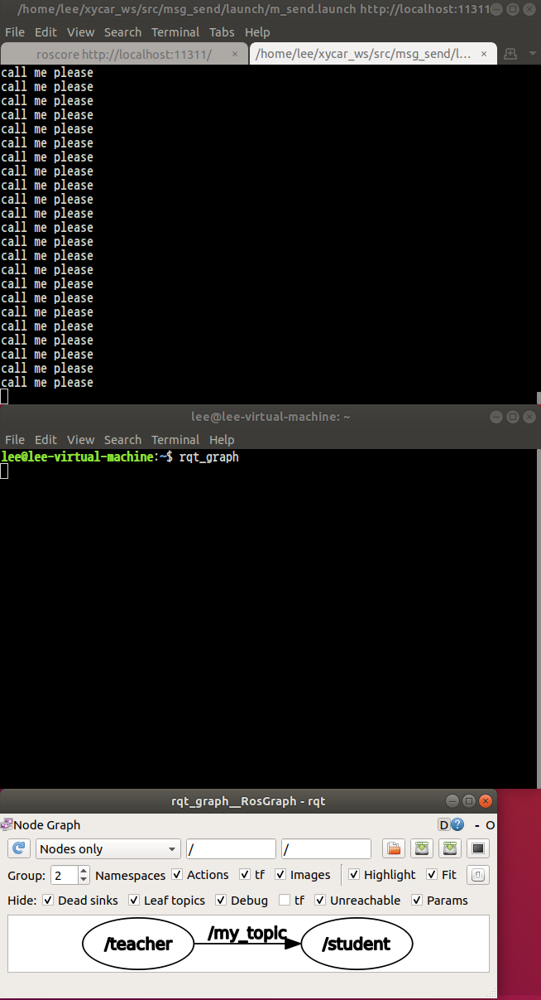
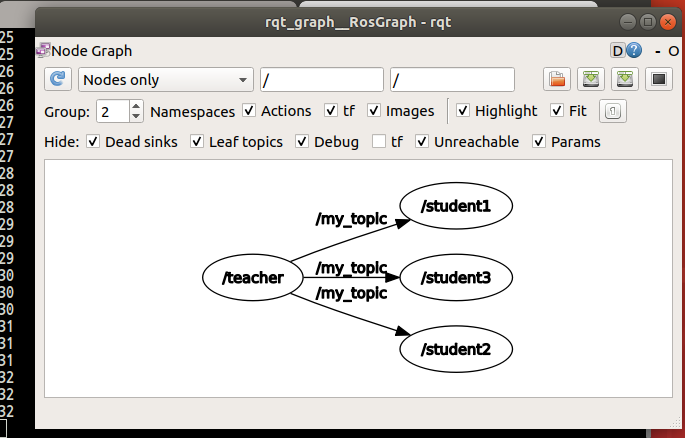
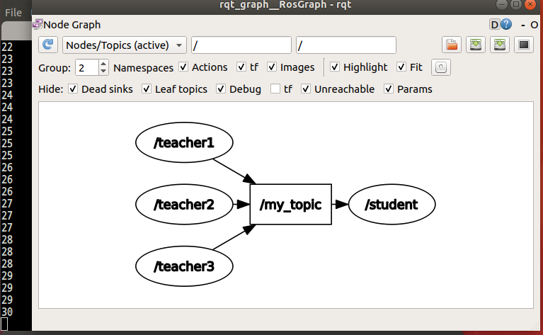
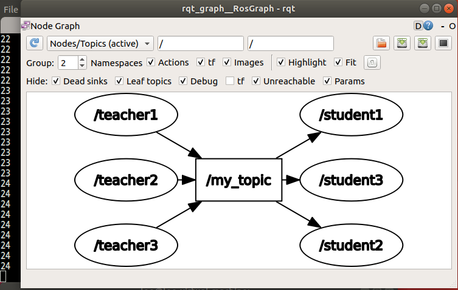
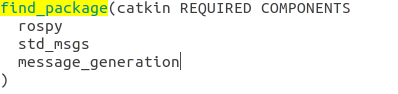
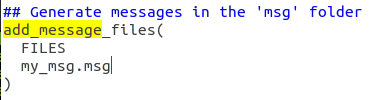
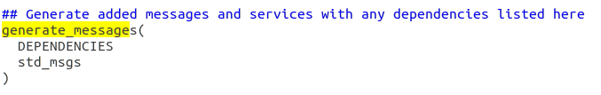
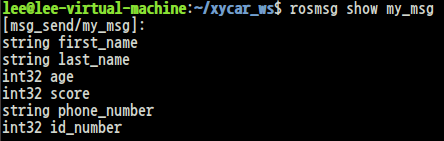
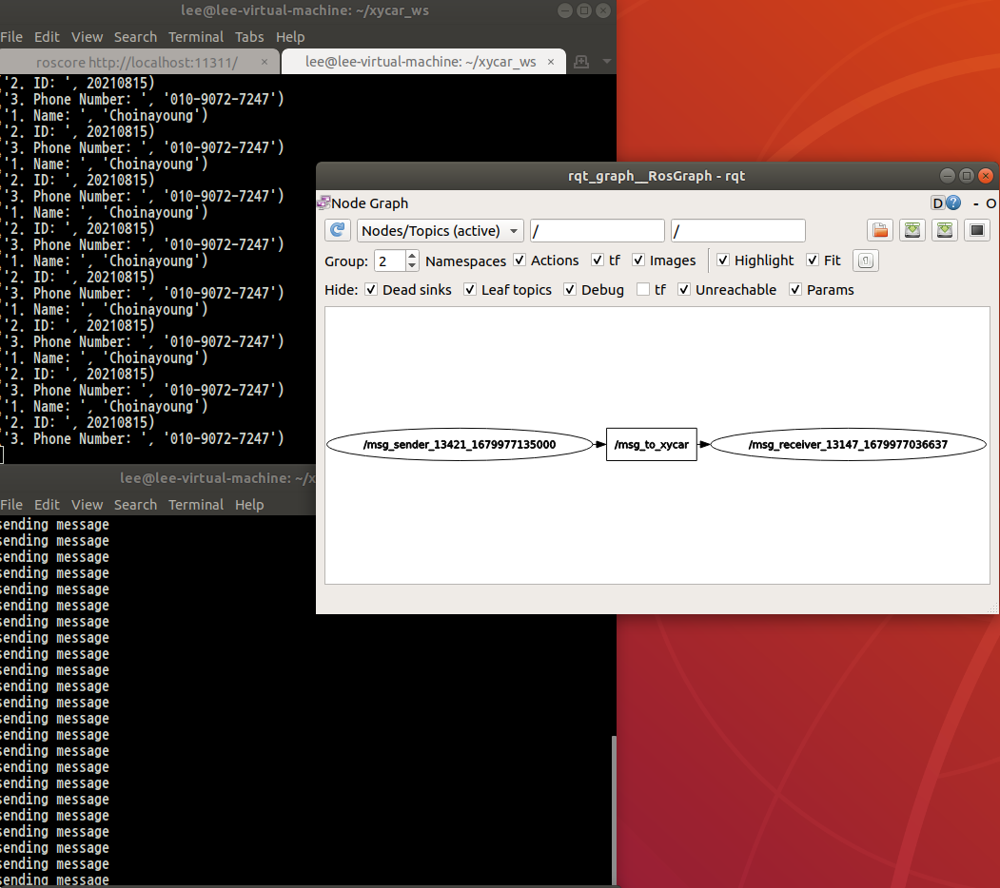

# Turtlrsim 8자 주행 시키기

```py
# ~/xycar_ws/src/my_pkg1/src/pub8.py
#! /usr/bin/env python

import rospy
from geometry_msgs.msg import Twist

rospy.init_node('my_node', anonymous = True)
pub = rospy.Publisher('/turtle1/cmd_vel', Twist, queue_size = 10)

msg = Twist()
msg.linear.x = 2.0
msg.linear.y = 0
msg.linear.z = 0
msg.angular.x = 0
msg.angular.y = 0
msg.angular.z = 1.8

def my_fun(x, z):
	msg.linear.x = x
	msg.angular.z = z
rate = rospy.Rate(1)

while not rospy.is_shutdown():
    for _ in range(4):
	my_fun(2, 2)
	pub.publish(msg)
	rate.sleep()

    for _ in range(4):
	my_fun(2, -2)
	pub.publish(msg)
	rate.sleep()
```

# Result


# ROS 노드 통신 프로그래밍

## 1. 패키지 생성
```
$ cd ~/xycar_ws/src
$ catkin_create_pkg msg_send std_msgs rospy
$ cd msg_send
$ mkdir launch
$ cd ~/xycar_ws
$ catkin_make
```

## 2. teacher.py & student.py
```
$ cd ~/xycar_ws/src/msg_send/src
$ vim teacher.py
```

```py
#!/usr/bin/env python

import rospy
from std_msgs.msg import String

rospy.init_node('teacher')

pub = rospy.Publisher('my_topic', String)

rate = rospy.Rate(2)

while not rospy.is_shutdown():
    pub.publish('call me please')
    rate.sleep()
```

```
$ vim student.py
```
```py
#!/usr/bin/env python

import rospy
from std_msgs.msg import String

def callback(msg):
    print msg.data
    
rospy.init_node('student')

sub = rospy.Subscriber('my_topic', String, callback)

rospy.spin()
```

## 3. m_send.launch
```
$ cd ..
$ cd launch
$ vim m_send.launch
```
```
<launch>
	<node pkg="msg_send" type="teacher.py" name="teacher"/>
	<node pkg="msg_send" type="student.py" name="student" output="screen"/>
</launch>
```
```
$ cm    // 빌드
```


## 4. 권한 설정
```
$ cd ~/xycar_ws/src/msg_send/src
$ chmod +x student.py teacher.py
```

## 5. Launch 파일실행
```
$ roslaunch msg_send m_send.launch
```

## 실행 결과


# 1:N, N:1, N:N 통신 프로그램

## INT32 타입의 메시지를 주고 받는 파이썬 코드
```py
# ~/xycar_ws/src/msg_send/src/teacher_int.py
#!/usr/bin/env python

import rospy
from std_msgs.msg import Int32

rospy.init_node('teacher')

pub = rospy.Publisher('my_topic', Int32)

rate = rospy.Rate(2)
count = 1

while not rospy.is_shutdown():
    pub.publish(count)
    count = count + 1
    rate.sleep()
```

```py
# ~/xycar_ws/src/msg_send/src/student_int.py
#!/usr/bin/env python

import rospy
from std_msgs.msg import Int32

def callback(msg):
    print msg.data
    
rospy.init_node('student')

sub = rospy.Subscriber('my_topic', Int32, callback)

rospy.spin()
```

## 노드를 여러 개 띄울 때
* 하나의 코드로 여러 개의 노드를 연결하려면 각 노드의 이름을 달리해야 함
    * 노드의 init 함수에서 anonymous=True 값을 넣어주면 노드 이름이 자동설정됨
* Launch 파일을 이용해서 roslaunch 명령으로 여러 노드를 띄울 수 있음
    * 노드 설정에서 name=" "부분을 다르게 설정


# 1:N 통신
* Launch 파일을 변경하여 진행
```
# ~/xycar_ws/src/msg_send/launch/m_send_1n.launch
<launch>
	<node pkg="msg_send" type="teacher_int.py" name="teacher"/>
	<node pkg="msg_send" type="student_int.py" name="student1" output="screen"/>
    <node pkg="msg_send" type="student_int.py" name="student2" output="screen"/>
    <node pkg="msg_send" type="student_int.py" name="student3" output="screen"/>
</launch>
```


# N:1 통신
```
# ~/xycar_ws/src/msg_send/launch/m_send_n1.launch
<launch>
	<node pkg="msg_send" type="teacher_int.py" name="teacher1"/>
    <node pkg="msg_send" type="teacher_int.py" name="teacher2"/>
    <node pkg="msg_send" type="teacher_int.py" name="teacher3"/>
	<node pkg="msg_send" type="student_int.py" name="student" output="screen"/>
</launch>
```


# N:N 통신
```
# ~/xycar_ws/src/msg_send/launch/m_send_nn.launch
<launch>
	<node pkg="msg_send" type="teacher_int.py" name="teacher1"/>
    <node pkg="msg_send" type="teacher_int.py" name="teacher2"/>
    <node pkg="msg_send" type="teacher_int.py" name="teacher3"/>
	<node pkg="msg_send" type="student_int.py" name="student1" output="screen"/>
    <node pkg="msg_send" type="student_int.py" name="student2" output="screen"/>
    <node pkg="msg_send" type="student_int.py" name="student3" output="screen"/>
</launch>
```


# 나만의 메시지 만들기
## Cuntom Message 사용 방법
* 메시지 파일 생성 및 작성
```
$ cd ~/xycar_ws/src
$ roscd msg_send
$ mkdir msg
$ cd msg
$ vim my_msg.msg
```

```
string first_name
string last_name
int32 age
int32 score
string phone_number
int32 id_number
```

* package.xml 수정
```
# ~/xycar_ws/src/msg_send/package.xml
# 아래 내용 추가
<build_depend>message_generation</build_depend>
<exec_depend>message_runtime</exec_depend>
```

* CMackList.txt 수정





* Cumtom Message 설정과 확인
```
$ cm
$ rosmsg show my_msg
```


# Practice - my_msg 사용 예제
## Publish 노드
```py
# ~/xycar_ws/src/msg_send/src/msg_sender.py
#!/usr/bin/env python

import rospy
from msg_send.msg import my_msg

rospy.init_node('msg_sender', anonymous=True)
pub = rospy.Publisher('msg_to_xycar', my_msg)

msg = my_msg()
msg.first_name = "nayoung"
msg.last_name = "Choi"
msg.id_number = 20210815
msg.phone_number = "010-9072-7247"

rate = rospy.Rate(1)
while not rospy.is_shutdown():
	pub.publish(msg)
	print("sending message")
	rate.sleep()
```

## Subscribe 노드
```py
# ~/xycar_ws/src/msg_send/src/msg_receiver.py
#!/usr/bin/env python3

import rospy
from msg_send.msg import my_msg

def callback(msg):
    print ("1. Name: ", msg.last_name + msg.first_name)
    print ("2. ID: ", msg.id_number)
    print ("3. Phone Number: " , msg.phone_number)
    
rospy.init_node('msg_receiver', anonymous=True)

sub = rospy.Subscriber('msg_to_xycar', my_msg, callback)

rospy.spin()
```

## 권한 변경 & 빌드 & 실행
```
$ chmod +x msg_sender.py msg_receiver.py
$ cm
$ rosrun msg_send msg_receiver.py
$ rosrun msg_send msg_sender.py
```

<strong>$ rosrun msg_send msg_receiver.py</strong> 이 부분에서 필자는 <strong>ModuleNotFoundError: No module named 'rospkg'</strong>에러가 발생하였다. 설치하고 진행해 보도록 하자.
```
$ pip install rospkg
```
이후 패키지 설치의 문제가 아니라 코드 첫줄에 있는 파이썬 버전에 문제가 있음을 깨달았다. 위의 receiver 코드 python3를 python으로 변경해주도록 하자

## Subscribe 노드 - 수정
```py
# ~/xycar_ws/src/msg_send/src/msg_receiver.py
#!/usr/bin/env python

import rospy
from msg_send.msg import my_msg

def callback(msg):
    print ("1. Name: ", msg.last_name + msg.first_name)
    print ("2. ID: ", msg.id_number)
    print ("3. Phone Number: " , msg.phone_number)
    
rospy.init_node('msg_receiver', anonymous=True)

sub = rospy.Subscriber('msg_to_xycar', my_msg, callback)

rospy.spin()
```

## 에러
위의 에러를 처리하고 난 뒤 
```
Traceback (most recent call last):
  File "/home/lee/xycar_ws/src/msg_send/src/msg_receiver.py", line 4, in <module>
    from msg_send.msg import my_msg
ImportError: No module named msg_send.msg
```
에러가 또 발생하였다. 해당 에러는 bash파일 소싱을 통해 해결하였다.

```
$ source ~/xycar_ws/devel/setup.bash
```
## 결과 화면
