# 과제 1 - 노드 간 동기화 문제 해결
토픽을 주고 받을 때 누락 없이 모두 잘 도착하는지 알아보자.<br>
누락된 메시지를 쉽게 확인할 수 있도록 숫자를 보내보자.<br>
처음과 끝 메세지가 잘 전송되는지 확인해보자.
```py
# ~/xycar_ws/src/my_pkg1/src/sender_serial.py
#! /usr/bin/env python

import rospy
from std_msgs.msg import Int32

rospy.init_node('sender_serial')
pub = rospy.Publisher('my_topic', Int32)

rate = rospy.Rate(2)
count = 1
while not rospy.is_shutdown():
    pub.publish(count)
    count = count + 1
    rate.sleep()
```

```py
# ~/xycar_ws/src/my_pkg1/src/receiver_serial.py
#! /usr/bin/env python

import rospy
from std_msgs.msg import Int32

def callback(msg):
    print msg.data
rospy.init_node('receiver_serial')
sub = rospy.Subscriber('my_topic', Int32, callback)
rospy.spin()
```

## 실행 결과
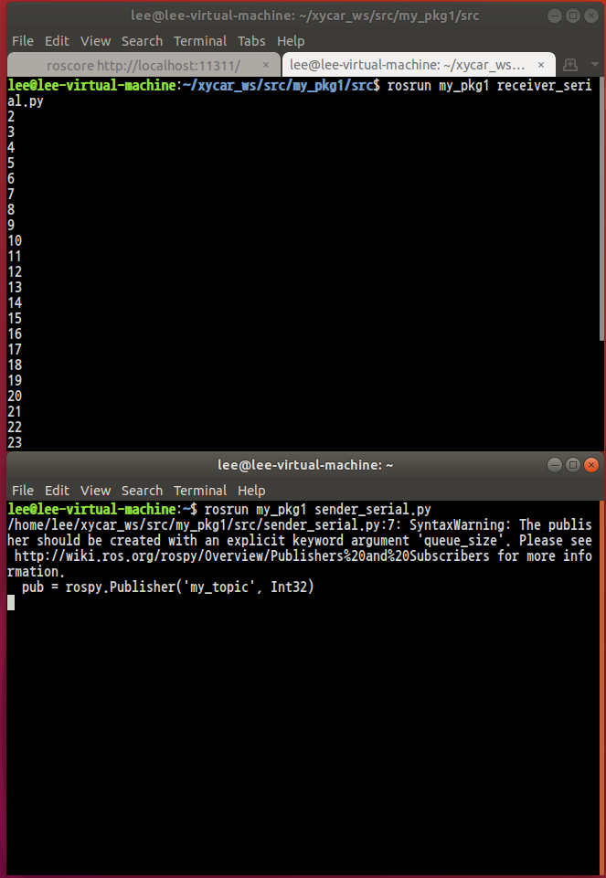

2부터 받아오는 것을 볼 수 있다.

## 해결방안
sender_serial.py를 pub.get_num_connection을 통해 1이 될 때 까지 헛돌게 해보자.
```py
# ~/xycar_ws/src/my_pkg1/src/sender_serial.py
#! /usr/bin/env python

import rospy
from std_msgs.msg import Int32

rospy.init_node('sender_serial')
pub = rospy.Publisher('my_topic', Int32)

rate = rospy.Rate(2)
count = 1
while (pub.get_num_connections() == 0):
    continue
while not rospy.is_shutdown():
    pub.publish(count)
    count = count + 1
    rate.sleep()
```

## 실행 결과
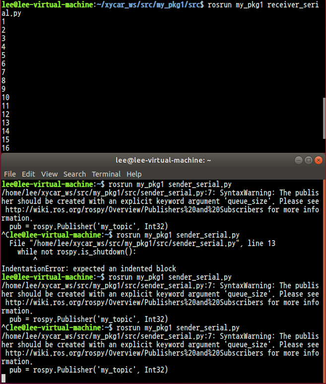

# 과제 2 - ROS 전송 속도(데이터 크기에 따른 전송 속도는 어떻게 되는가?)
```py
# ~/xycar_ws/src/my_pkg1/src/sender_speed.py
#! /usr/bin/env python

import rospy
from std_msgs.msg import String

name = 'sender'
pub_topic = "longstring"
rospy.init_node(name, anonymous = True)
pub = rospy.Publisher(pub_topic, String, queue_size = 1)

hello_str = String()
rate = rospy.Rate(1)

pub_size = 1000000  # 1M bite
# pub_size = 5000000  # 5M bite
# pub_size = 10000000  # 10M bite
# pub_size = 20000000  # 20M bite
# pub_size = 50000000  # 50M bite

my_string = ""

for i in range(pub_size):
    my_string += "#"

while not rospy.is_shutdown():
    htllo_str.data = my_string + "." + str(rospy.get_time())
    pub.publish(hello_str)
    rate.sleep()
```

## rostopic 확인
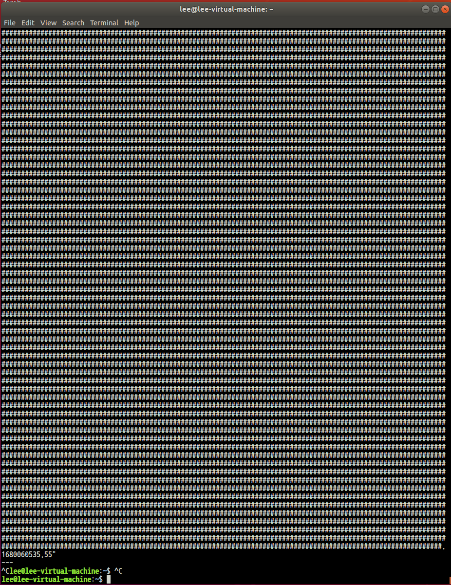

```py
# ~/xycar_ws/src/my_pkg1/src/receiver_speed.py
#! /usr/bin/env python
import rospy
from std_msgs.sg import String

name = "receiver"
sub_topic = "longstring"

def callback(data):
    current_time = str(rospy.get_time())
    arrival_data = str(data.data).split(".")

    time_diff = float(current_time) - float(arrival_data[1])
    string_size = len(arrival_data[0])
    rospy.loginfo(str(string_size) + " byte: " + str(time_diff) + " second")
    rospy.loginfo("speed: " + str(float(string_size) / time_diff) + "byte/s")

rospy.init_node(name, anonymous = True)
rospy.loginfo("Init")
rospy.Subscriber(sub_topic, String, callback)
rospy.spin()
```

## 결과 확인

1. 1M 전송
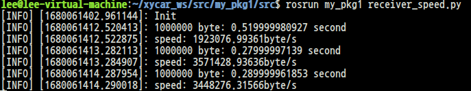

2. 5M 전송
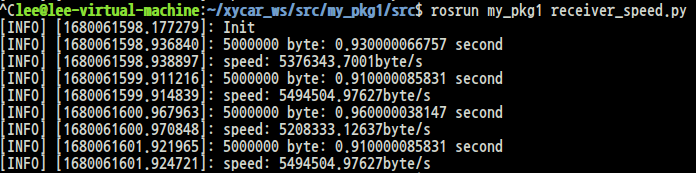

3. 10M 전송
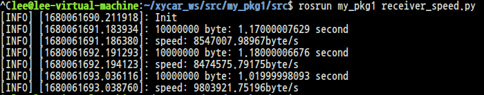

4. 20M 전송
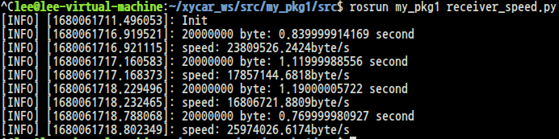

5. 50M 전송
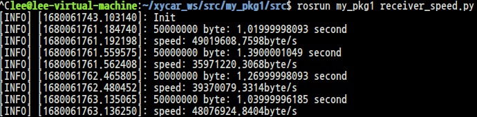

# 과제 3 - ROS 처리 지연 문제

```py
# ~/xycar_ws/src/my_pkg1/src/sender_overflow.py
#! /usr/bin/env python

import rospy
from std_msgs.msg import Int32

name = "sender"
pub_topic = "my_topic"


rospy.init_node(name)
pub = rospy.Publisher(pub_topic, Int32, queue_size = 1)

rate = rospy.Rate(1000)
count = 1

while (pub.get_num_connections() == 0):
    continue
while not rospy.is_shutdown():
    pub.publish(count)
    count = count + 1
    rate.sleep()
```

```py
# ~/xycar_ws/src/my_pkg1/src/receiver_overflow.py
#! /usr/bin/env python

import rospy
from std_msgs.msg import Int32

name = "receiver"
sub_topic = "my_topic"

def callback(msg):
    rospy.loginfo("callback is being processed")
    rospy.sleep(5)
    print msg.data

rospy.init_node(name)
rospy.Subscribe(sub_topic, Int32, callback, queue_size = 1)
rospy.spin()
```

## 결과 확인
1. queue_size = 1 -> 5000개씩 건너뜀을 알 수 있다.
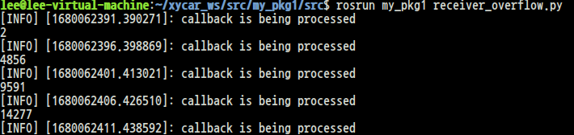

2. queue_size = 10000 -> 콜백 수행을 잘 하는것을 볼 수 있음
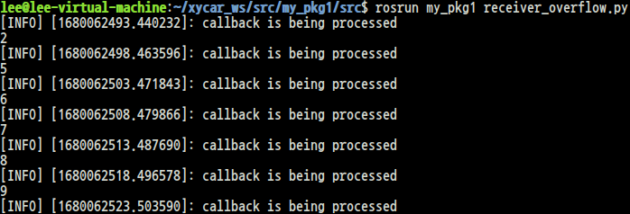


# 과제 4 - ROS 타임 슬롯 문제
주기적 발송에서 타임슬롯을 오버하면 어떻게 되는가?<br>
```py
# ~/xycar_ws/src/msg_send/src/teacher_int32_job.py
#!/usr/bin/env python

import rospy
import time
from std_msgs.msg import Int32

def do_job(time):
    for i in range(0, time):
        i = i + 1
        pub.publish(i)

def list_append_time():
    start.append(start_time)
    end.append(end_time)
    sleep.append(sleep_time)

rospy.init_node('teacher')
pub = rospy.Publisher('msg_to_students', Int32, queue_size = 0)
rate = rospy.Rate(5)

while not rospy.is_shutdown():
    start = []
    end = []
    sleep = []
    num = input("input count number> ")
    rate.sleep()
    total_start = time.time()

    for j in range(5):
        start_time = time.time()
        do_job(num)
        end_time = time.time()

        rate.sleep()
        sleep_time = time.time()
        list_append_time()
    total_end = time.time()

    for t in range(5):
        sleep[t] = sleep[t] - end[t]
        end[t] = end[t] - start[t]
    
    for result in range(5):
        print "spend time > ", round(end[result], 4), 's'
        print "sleep time > ", round(sleep[result], 4), 's'
    print "------------------------"
    print "total time > ", round((total_end - total_start), 4), 's'
    print "------------------------\n\n"
```

## 실행 결과
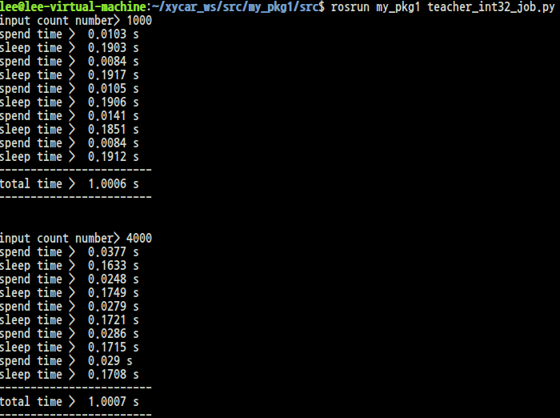


# 과제 5 - ROS 노드의 순차 실행
order_test라는 패키지 생성 후 진행<br>
```
$ catkin_create_pkg order_test std_msgs rospy
```

## sr_order.launch

```
# ~/xycar_ws/src/order_test/launch/sr_order.launch
<launch>
    <node name = "receiver" pkg = "order_test" type = "receiver.py" output = "screen"/>
    <node name = "first" pkg = "order_test" type = "first.py" output = "screen"/>
    <node name = "second" pkg = "order_test" type = "second.py" output = "screen"/>
    <node name = "third" pkg = "order_test" type = "third.py" output = "screen"/>
    <node name = "fourth" pkg = "order_test", type = "fourth.py" output = "screen"/>
</launch>
```


## Receiver.py

```py
# ~/xycar_ws/src/order_test/src/receiver.py
#! /usr/bin/env python
import rospy
from std_msgs.msg import String

name = "receiver"
pub_topic = "start_ctl"
sub_topic = "msg_to_receiver"

def callback(data):
    rospy.loginfo("i heard %s", data.data)

rospy.init_node(name)
rospy.Subscriber(sub_topic, String, callback)
pub = rospy.Publisher(pub_topic, String, queue_size = 1)

rate = rospy.Rate(10)
hello_str = String()
rospy.sleep(1)

sq = ["first", "second", "third", "fourth"]
pub_msg = String()

for i in sq:
    pub_msg.data = i + ":go"
    pub.publish(pub_msg)
    rospy.sleep(3)

rospy.spin()
```

## first.py, second.py ...

```py
# ~/xycar_ws/src/order_test/src/first.py
#!/usr/bin/env python

import rospy
from std_msgs.msg import String

name = "first"  # second, third, fourth 모두 이 부분만 수정
pub_topic = "msg_to_receiver"
sub_topic = "start_ctl"

OK = None

def ctl_callback(data):
    global OK
    OK = str(data.data)

rospy.init_node(name)
rospy.Subscriber(sub_topic, String, ctl_callback)

while True:
    if OK == None:
        continue
    d = OK.split(":")
    if (len(d) == 2) and (d[0] == name) and (d[1] == "go"):
        break
pub = rospy.Publisher(pub_topic, String, queue_size = 1)
rate = rospy.Rate(2)
hello_str = String()

while not rospy.is_shutdown():
    hello_str.data = "my name is " + name
    pub.publish(hello_str)
    rate.sleep()
```

## 실행 결과
fourth 까지 순차적으로 실행된 것을 볼 수 있다.
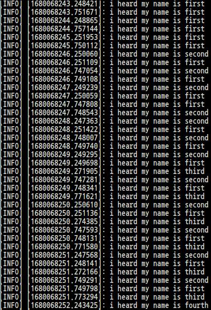

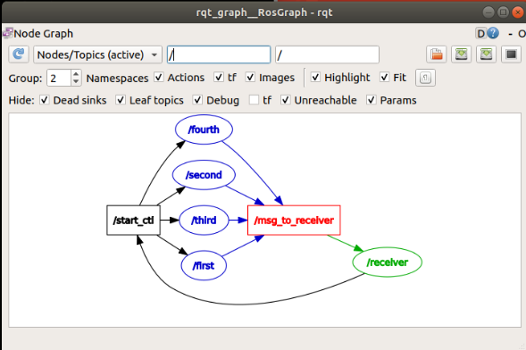

# 받은 토픽을 가공해서 보내기

## 1. Launch 파일 작성
```
<!-- ~/xycar_ws/src/msg_send/launch/remote.launch -->
<launch>
    <node pkg = "msg_send" type = "remote_teacher" name = "teacher" output = "screen"/>
    <node pkg = "msg_send" type = "remote_student" name = "student" output = "screen"/>
</launch>
```

```
$ cm
```

## 2. 파이썬 파일 작성

## remote_teacher.py
```py
#! /usr/bin/env python

import rospy
from msg_send.msg import my_msg
from std_msgs.msg import String

import time

def call_back(data):
    st_name = data.last_name + '' + data.first_name
    curr_time = time.strftime("%Y-%$m-%d %H:%M:%S", time.localtime())
    st_name2 = 'Good morning, ' + st_name + '' + curr_time

    pub.publish(st_name2)

rospy.init_node("remote_teacher", anonymous = True)

pub = rospy.Publisher('msg_from_xycar', String, queue_size = 1)
sub = rospy.Subscriber('msg_to_xycar', my_msg, call_back)
rospy.spin()
```

## remote_student.py
```py
#! /usr/bin/env python

import rospy
from msg_send.msg import my_msg
from std_msgs.msg import String

done = False
def call_back(data):
    print(data.data)
    done = True

rospy.init_node('remote_student', anonymous = True)
pub = rospy.Publisher('msg_to_xycar', my_msg, queue_size = 1)
rospy.Subscriber('msg_from_xycar', String, call_back)
rate = rospy.Rate(1)

msg = my_msg()
msg.first_name = "Gil-Dong"
msg.last_name = "Hong"
msg.age = 15
msg.score = 100
msg.id_number = 12345678
msg.phone_nuer = "010-0000-0000"

while not rospy.is_shutdown() and not done:
    pub.publish(msg)
    print("sending message...")
    rate.sleep()
```

## 실행 결과
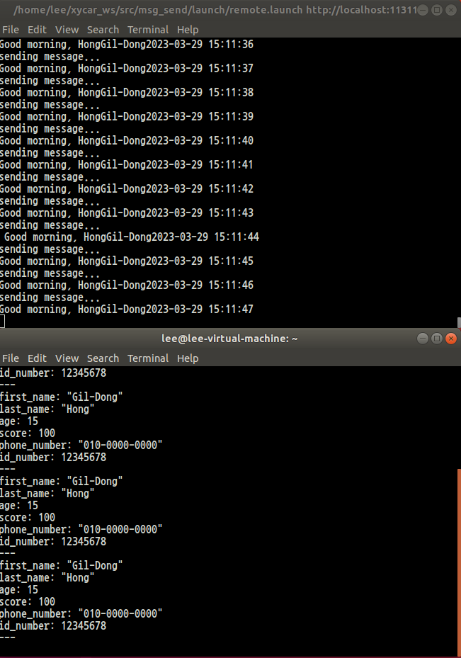

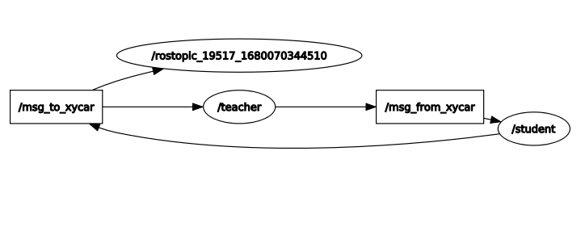