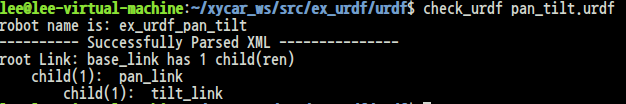
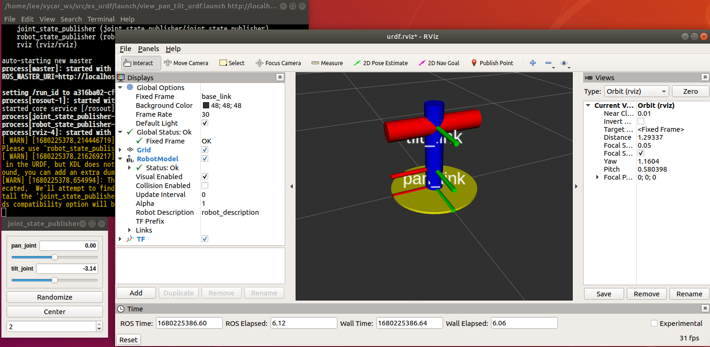
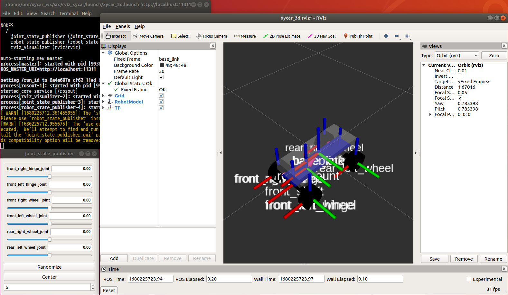
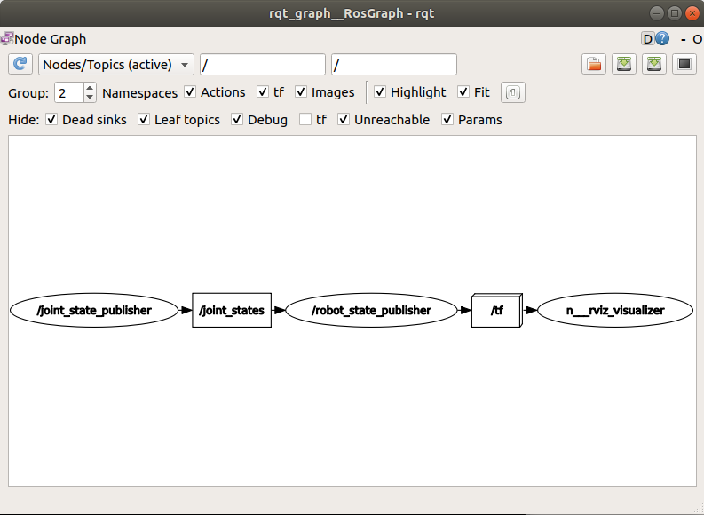
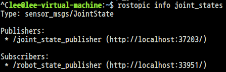
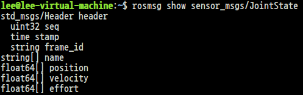
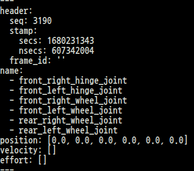
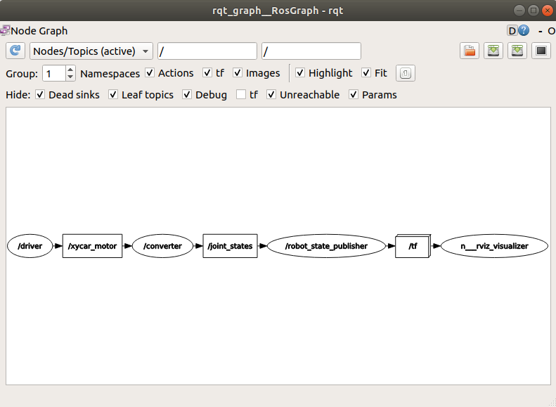
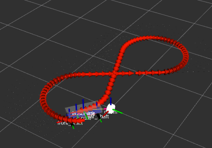

# Xycar 토픽, 노드, 자료형
<br>

<table>
<thead>
<tr>
<th>
</th>
<th>노드명</th>
<th>토픽</th>
<th>자료형</th>
</tr>
</thead>
<tbody>
<tr>
<td>모터 제어기</td>
<td>/xycar_motor</td>
<td>/xycar_motor</td>
<td>xycar_motor.msg</td>
</tr>
<tr>
<td>라이다</td>
<td>/xycar_lidar</td>
<td>/scan</td>
<td>sensor_msgs/LaserScan</td>
</tr>
<tr>
<td>카메라</td>
<td>/usb_cam</td>
<td>/usb_cam/image_raw</td>
<td>sensor_msgs/Image</td>
</tr>
<tr>
<td>초음파 센서</td>
<td>/xycar_ultrasonic</td>
<td>/xycar_ultrasonic</td>
<td>std_msgs/Int32MultiArray</td>
</tr>
<tr>
<td>IMU 센서</td>
<td>/xycar_imu</td>
<td>/imu</td>
<td>sensor_msgs/Imu</td>
</tr>
<tr>
<td>Depth cam</td>
<td>/camera/realsense2_camera</td>
<td>/camera/color/image_raw <br>*/image_rect_raw</td>
<td>
</td>
</tr>
</tbody>
</table>
<br>

# RVIZ에서 회전 막대 시각화하기
<br>

## 1. URDF 파일로 회전 막대 모델링(모델링 된 파일 사용)
<br>

## 2. ROS 패키지 만들기
<br>

```
$ catkin_create_pkg ex_urdf geometry_msgs
```
<br>

## 3. 내려받은 파일 붙여넣기 후 catkin_make
<br>

## 4. urdf 파일 확인
<br>

```
$ sudo apt install liburdfdom-tools // check_urdf를 사용하기 위한 패키지 다운로드
$ check_urdf ~/xycar_ws/src/ex_urdf/urdf/pan_tilt.urdf
```

<br>


<br>

## 5. link, joint의 관계도 살펴보기
<br>

```
$ urdf_to_graphiz pan_tilt.urdf
```
<br>


<br>

## 6. 패키지 설치
<br>

```
$ sudo apt update
$ sudo apt install ros-melodic-joint-state-publisher-gui
```
<br>

## 7. RVIZ 실행, 세팅
<br>

```
$ roslaunch ex_urdf view_pan_tilt_urdf.launch
```

1. 이후 좌측 하단에 add 버튼 클릭<br>
2. RobotModel, TF 추가
3. Fixed Frame에 map을 base_link로 변경

## 8. RVIZ에 막대 띄우기
<br>


<br>
<br>

# RVIZ에 Xycar 시각화, 코딩으로 바퀴 움직이기
<br>

## 1. URDF 파일로 xycar 모델링(모델링 된 파일 사용)
<br>

## 2. ROS 패키지 만들기<br>
```
$ catkin_create_pkg rviz_xycar geometry_msgs
```
<br>

## 3. 내려받은 파일 붙여넣기 후 catkin_make
<br>

## 4. RVIZ 실행, Xycar 시각화
```
$ roslaunch ex_urdf view_pan_tilt_urdf.launch
```
<br>


<br>


<br>

## 5. joint_states 토픽 확인

```
$ rostopic info joint_states
```
<br>


<br>

```
$ rosmsg show sensor_msgs/JointState
```
<br>


<br>

```
$ rostopic echo joint_states
```
<br>


<br>

## 6. move_joint.launch파일 만들기
<br>

```html
<!-- ~/xycar_ws/src/rviz_xycar/launch/move_joint.launch-->
<launch>
    <param name="robot_description" textfile="$(find rviz_xycar)/urdf/xycar_3d.urdf"/>
    <param name="use_gui" value="true"/>

    <!-- rviz display -->
    <node name="rviz_visualizer" pkg="rviz" type="rviz" required="true" 
                args="-d $(find rviz_xycar)/rviz/xycar_3d.rviz"/>

    <node name="robot_state_publisher" pkg="robot_state_publisher" 
                type="state_publisher"/>

    <node name= "move_joint" pkg="rviz_xycar" type= "move_joint.py" /> 
 
</launch>
```
<br>

## 7. 파이썬 프로그램 - move_joint.py
```py
# ~/xycar_ws/src/rviz_xycar/src/move_joint.py
#!/usr/bin/env python

import rospy
from sensor_msgs.msg import JointState
from std_msgs.msg import Header

def talker():
    pub = rospy.Publisher('joint_states', JointState, queue_size=10)
    rospy.init_node('move_joint')
    rate = rospy.Rate(50) 

    hello_xycar = JointState()
    hello_xycar.header = Header()
    hello_xycar.name = ['front_right_hinge_joint', 'front_left_hinge_joint', 
                      'front_right_wheel_joint', 'front_left_wheel_joint',
                       'rear_right_wheel_joint','rear_left_wheel_joint']
    hello_xycar.velocity = []
    hello_xycar.effort = [] 
  
    a = -3.14
    b = -3.14

    while not rospy.is_shutdown():
      hello_xycar.header.stamp = rospy.Time.now()
      
      if a >= 3.14:
         a = -3.14
         b = -3.14
      else:
         a += 0.01
         b += 0.01

      hello_xycar.position = [0, 0, a, b, 0, 0]

      pub.publish(hello_xycar)
      rate.sleep()

if __name__ == '__main__':
    try:
        talker()
    except rospy.ROSInterruptException:
        pass
```
<br>


# 과제 1. 모터제어기 프로그래밍
<br>

## 1. 패키지 생성

```
$ catkin_create_pkg my_motor std_msgs rospy
```

<br>

## 2. Launch 폴더 만들기

```
$ mkdir ~/xycar_ws/src/my_motor/launch
```

<br>

## 3. Launch 파일 내에 8_drive.launch 파일 만들기, src 폴더에 8_drive.py 만들기

```html
<!--- ~/xycar_ws/src/my_motor/launch/8_drive.launch-->
<launch>
    <!---motor node-->
    <include file = "$(find xycar_motor)/launch/xycar_motor.launch"/>

    <!---auto driver -->
    <node name="auto_driver" pkg="my_motor" type="8_drive.py" output="screen">
</launch>
```

```py
# ~/xycar_ws/src/my_motor/src/8_drive.py
#! /usr/bin/env python

# import한 모듈 가져오기
import rospy
from xycar_motor.msg import xycar_motor

motor_control = xycar_motor()

# 노드 새로 만들기
rospy.init_node("auto_driver")

# 토픽 발행 준비
pub = rospy.Publisher('xycar_motor', xycar_motor, queue_size = 1)

def motor(angle, speed):
    global pub
    global motor_control

    motor_control.angle = angle
    motor_control.speed = speed

    pub.publish(motor_control)

speed = 3                       # 주행속도 3으로 설정
while not rospy.is_shutdown():
    angle = -50                 # 좌회전, 조향각 최대
    for _ in range(60):
        motor(angle, speed)
        time.sleep(0.1)
    
    angle = 0                   # 직진
    for _ in range(30):
        motor(angle, speed)
        time.sleep(0.1)
    
    angle = 50                  # 우회전, 조향각 최대
    for _ in range(60):
        motor(angle, speed)
        time.sleep(0.1)

    angle = 0                   # 직진
    for _ in range(30):
        motor(angle, speed)
        time.sleep(0.1)
```

# 과제 2. 토픽 변환(xycar_motor -> joint_states)
```py
# ~/xycar_ws/src/rviz_xycar/src/converter.py
#! /usr/bin/env python

# import 필요한 모듈 가져오기
import rospy
from xycar_motor.msg import xycar_motor
from sensor_msgs.msg import JointState
from std_msgs.msg import Header
import math

# 객체, 변수 선언
global pub
global msg_joint_states
global l_wheel, r_wheel


# def callback xycar_motor 토픽을 받을 때마다 불려지는 콜백함수 정의하기
def callback(data):
    global msg_joint_states, l_wheel, r_wheel, pub
    Angle = data.angle

    steering = math.radians(Angle * 0.4)  # 20 / 50 = 0.4

    if l_wheel > 3.14:
        l_wheel = -3.14
        r_wheel = -3.14
    else:
        l_wheel += 0.01
        r_wheel += 0.01

    msg_joint_states.position = [steering, steering, r_wheel, l_wheel, r_wheel, l_wheel]

    pub.publish(msg_joint_states)
# 노드 새로 만들기
rospy.init_node('converter')
pub = rospy.Publisher('joint_states', JointState)

# 토픽의 발행을 준비

# joint_states 토픽에 담을 데이터 준비
msg_joint_states = JointState()
msg_joint_states.header = Header()
msg_joint_states.name = ['front_right_hinge_joint', 'front_left_hinge_joint', 'front_right_wheel_joint', 'front_left_wheel_joint', 'rear_right_wheel_joint', 'rear_left_wheel_joint']
msg_joint_states.velocity = []
msg_joint_states.effort = []

l_wheel, r_wheel = -3.14, -3.14

# 토픽의 구독을 준비
rospy.Subscriber("xycar_motor", xycar_motor, callback)

# 무한루프에서 토픽이 도착하기를 기다림
rospy.spin()
```

## 실행 결과
<br>


<br>

## 과제 3. 오도메트리 - rviz_odom.py
<br>

```py
# ~/xycar_ws/src/rviz_xycar/src/rviz_odom.py
#! /usr/bin/env python

import math
from math import sin, cos, pi
import rospy
import tf
from nav_msgs.msg import Odometry
from geometry_msgs.msg import Point, Pose, Quaternion, Twist, Vector3
from sensor_msgs.msg import JointState

global Angle
def callback(msg):
    global Angle
    Angle = msg.position[msg.name.index("front_left_hinge_joint")]

rospy.Subscriber('joint_states', JointState, callback)

rospy.init_node('odometry_publisher')
odom_pub = rospy.Publisher("odom", Odometry, queue_size = 50)
odom_broadcaster = tf.TransformBroadcaster()

current_time = rospy.Time.now()
last_time = rospy.Time.now()

r = rospy.Rate(30.0)

current_speed = 0.4
wheel_base = 0.2
x_ = 0
y_ = 0
yaw_ = 0
Angle = 0

while not rospy.is_shutdown():
    current_time = rospy.Time.now()
    dt = (current_time - last_time).to_sec()

    current_steering_angle = Angle
    current_angular_velocity = current_speed * math.tan(current_steering_angle) / wheel_base
    x_dot = current_speed * cos(yaw_)
    y_dot = current_speed * sin(yaw_)
    x_ += x_dot * dt
    y_ += y_dot * dt
    yaw_ += current_angular_velocity * dt

    odom_quat = tf.transformations.quaternion_from_euler(0, 0, yaw_)

    odom_broadcaster.sendTransform(
        (x_, y_, 0.),
        odom_quat,
        current_time,
        "base_link",
        "odom"
    )

    odom = Odometry()
    odom.header.stamp = current_time
    odom.header.frame_id = "odom"
    odom.pose.pose = Pose(Point(x_, y_, 0.), Quaternion(*odom_quat))
    odom.child_frame_id = "base_link"
    odom_pub.publish(odom)
    last_time = current_time
    r.sleep()
```
<br>

```html
<!--~/xycar_ws/src/rviz_xycar/launch/rviz_odom.launch-->
<launch>
    <param name="robot_description" textfile="$(find rviz_xycar)/urdf/xycar_3d.urdf"/>
    <param name="use_gui" value="true"/>
    <!-- rviz display -->
    <node name="rviz_visualizer" pkg="rviz" type="rviz" required="true" 
                args="-d $(find rviz_xycar)/rviz/rviz_drive.rviz"/>
    <node name="robot_state_publisher" pkg="robot_state_publisher" 
                type="state_publisher"/>
    <node name="driver" pkg="rviz_xycar" type="rviz_8_drive.py" /> 
    <node name="converter" pkg="rviz_xycar" type="converter.py" />
    <node name="odom" pkg="rviz_xycar" type="rviz_odom.py" />
</launch>
```

## 실행 결과


<br>