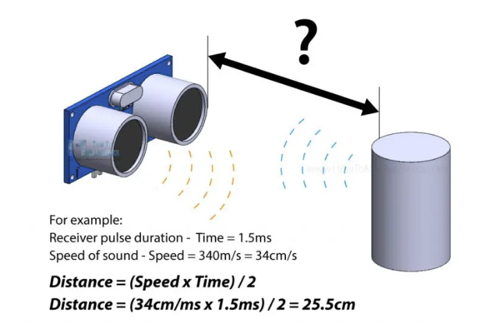
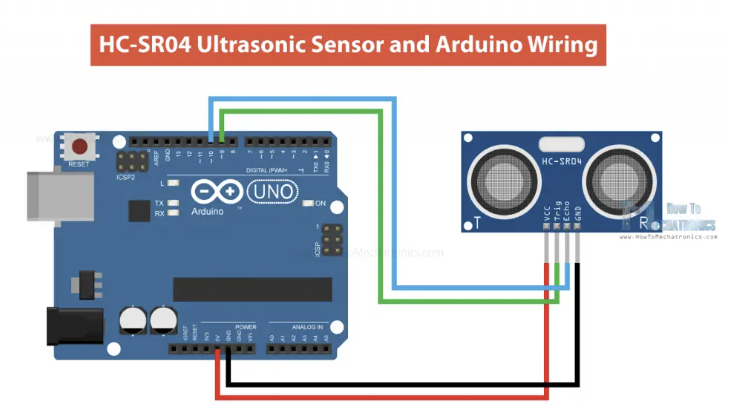
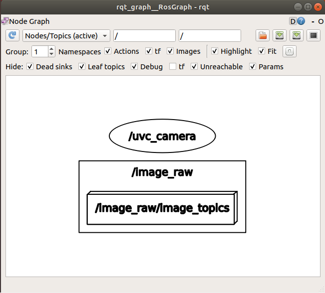
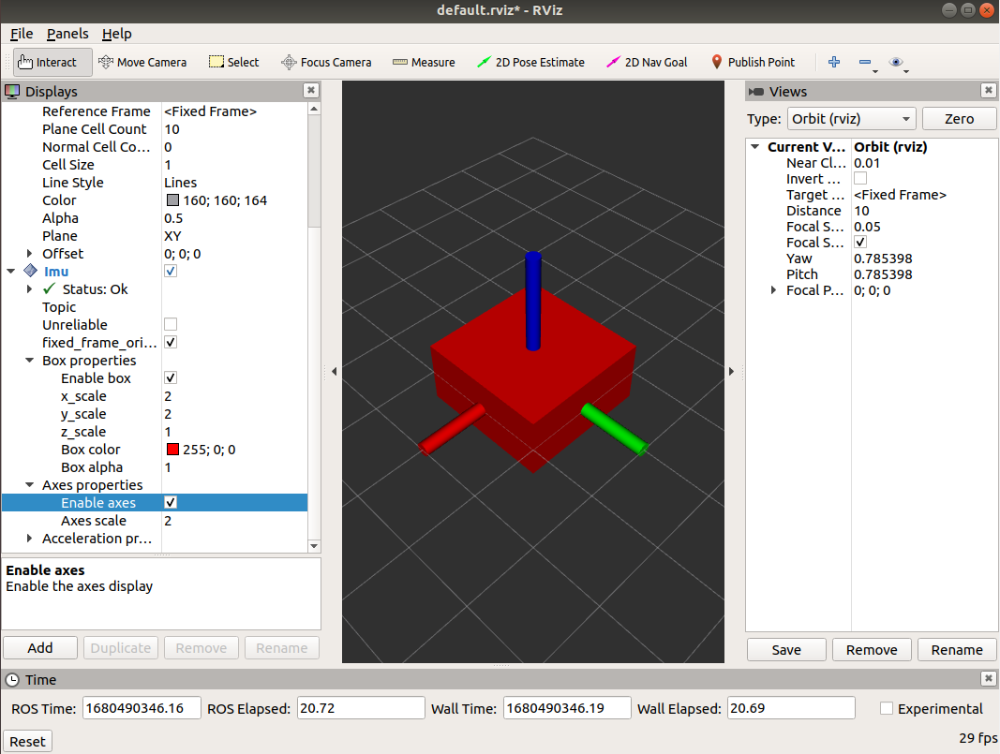
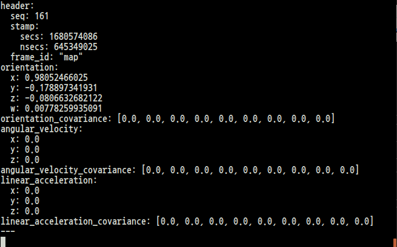

# 센서 종류
* 카메라 센서
* IMU 센서
* 라이다 센서
* 초음파 센서
* Depth 카메라 센서
<br>

## 1. 카메라 센서
* 1080P USB 카메라
* USB 2.0, UVC 지원
    * UVC란?
        * UVC기능(USB포트에 꽂으면 드라이버 설치가 필요없이 자동인식되는 윈도우즈 XP SP2내장 기능)이 있는 카메라
* 170도 어안렌즈
* CMOS OV2710 Sensor(해상도는 낮지만 낮은 전력소모)
* 120-fps(640*480), 30-fps(1920*1080)
<br>

## 2. IMU 센서
* 관성 측정장치 - 가속도계와 회전속도계, 자력계의 조합을 사용하여 어떤 물체(질량)에 가해지는 힘, 회전 각속도 등을 측정하는 장치
* 자이카에서는 6축 IMU센서인 MPU-6050을 사용
<br>

## 3. 가속도 센서
* MEMS 기술로 만들어지는 센서
* 반도체 칩 안에 입체적인 구조물을 만들고 이 구조물이 외부의 힘을 따라 움직이는 것을 전기적 신호로 바꾸어 출력
* X, Y, Z축 방향의 직선 움직임과 기울어짐의 자세 파악
<br>

## 4. 자이로 센서
* MEMS 기술 기반
* X, Y, Z축을 기준으로 한 회전 움직임 감지
<br>

## 5. 지자기 센서
* 3축 나침반, 방위를 알려주는 디지털 나침반 기능
* 지도와 결합하여 다양한 응용 제공
<br>

## 6. 라이다 센서
* 1채널 2D 라이다
* 0.9` degree, 4000sampling, 15cm ~ 18meter Range
<br>


## 레이다 & 라이다
* 라이다(LIDAR, Light Imageing Detection and Ranging)
    * 레이저 신호의 반사파를 이용
    * 짧은 주파수로 작은 물체도 감지가 가능
    * 정확한 3D 이미지 구성 가능
* 레이다(RADAR, Radio Detection and Ranging)
    * 전파 신호의 반사파를 이용
    * 속도 감지 기능(경찰의 과속 측정기에 사용)
    * 구름 많은 날씨 환경 및 야간에도 손쉽게 작동
    * LIDAR보다 더 긴 작동거리를 제공
<br>

## 라이다 데이터 처리 예시
```py
#!/usr/bin/env python

import rospy
from sensor_msgs.msg import LaserScan
import numpy as np

# Function
def callback(msg):
    global msg_list
    msg_list = np.array(msg.ranges)\
scan_sub = rospy.Subscriber('/scan', LaserScan, callback)

# main
while not rospy.is_shutdown():
    # 좌, 우 스캔, 노이즈 제거
    # lidar detection
    left_range = msg_list[:(msg_list.size * 1) // 6]
    right_range = msg_list[(msg_list.size * 5) // 6:]
    
    left_range = left_range[left_range != 0]
    right_range = right_range[right_range != 0]
```
<br>

## 7. 초음파 센서
* 초음파란?
    * 인간의 귀가 들을 수 있는 가청 주파수 대역보다 높은 진동수로 발생하는 파동
* 초음파를 이용하여 센서로부터 사물까지의 직선 거리를 측정
* 자이카에는 5개의 초음파센서 탑재
* 시그널
    * Vcc: 전력 공급(5V)
    * GND: ground
    * trig: 센서를 동작시키기 위한 트리거 시그널(입력)
    * echo: 거리 측정 결과를 전달하기 위한 시그널(출력)
<br>

## 거리 계산 식

<br>

## 연결 예시

<br>

## 예시 코드

```cpp
// defines pins numbers
const int trigPin = 9;
const int echoPin = 10;
// defines variables
long duration;
int distance;
void setup() {
  pinMode(trigPin, OUTPUT); // Sets the trigPin as an Output
  pinMode(echoPin, INPUT); // Sets the echoPin as an Input
  Serial.begin(9600); // Starts the serial communication
}
void loop() {
  // Clears the trigPin
  digitalWrite(trigPin, LOW);
  delayMicroseconds(2);
  // Sets the trigPin on HIGH state for 10 micro seconds
  digitalWrite(trigPin, HIGH);
  delayMicroseconds(10);
  digitalWrite(trigPin, LOW);
  // Reads the echoPin, returns the sound wave travel time in microseconds
  duration = pulseIn(echoPin, HIGH);
  // Calculating the distance
  distance = duration * 0.034 / 2;
  // Prints the distance on the Serial Monitor
  Serial.print("Distance: ");
  Serial.println(distance);
}
```

출처: https://howtomechatronics.com/tutorials/arduino/ultrasonic-sensor-hc-sr04/

## 노트북 카메라를 이용해 토픽 확인해보기
```
<terminal1>
$ sudo apt-get install ros-melodic-uvc-camera
$ roscore

<terminal2>
rosrun uvc_camera uvc_camera_node
```


<br>

# IMU sensor 패키지 만들기

## 1. my_imu 패키지 만들기
```
$ cd xycar_ws/src
$ catkin_create_pkg my_imu std_msgs rospy
```

## 2. launch 파일 만들기
```
$ cd my_imu
$ mkdir launch
$ cm
```

## 3. 기울기값 출력 프로그램
```py
# ~xycar_ws/src/my_imu/src/roll_pitch_yaw.py
#! /usr/bin/env python

import rospy
import time

from sensor_msgs import Imu
from tf.transformations import euler_from_quaternion

Imu_msg = None

def imu_callback(data):
    global Imu_msg
    Imu_msg = [data.orientation.x, data.orientation.y, data.drientation.z, data.orientation.w]

rospy.init_node('Imu_Print')
rospy.Subscriber('imu', Imu, imu_callback)

while not rospy.is_shutdown():
    (roll, pitch, yaw) = euler_from_quaternion(Imu_msg)

    print('Roll: %.4f, Pitch: %.4f, Yaw: %.4f' %(roll, pitch, yaw))
    time.sleep(1.0)
```
이후 권한 변경
<br>

```html
<!-- ~xycar_ws/src/my_imu/launch/roll_pitch_yaw.launch -->
<launch>
    <node pkg = "xycar_imu" type = "9dof_imu_node.py" name = "xycar_imu" output = "screen">
        <param name = "rviz_mode" type = "string" value = "false"/>
    </node>
    <node pkg = "my_imu" type = "roll_pitch_yaw.py" name = "Imu_Print" output = "screen"/>
</launch>
```

# 과제 - RVIZ 기반 IMU 뷰어 제작
## 1. rviz imu plugin 설치
```
$ sudo apt-get install git
$ git clone -b melodic https://github.com/CCNYRoboticsLab/imu_tools.git
$ rosdep install imu_tools
$ cm
```
<br>

## 2. rviz 실행, 설정값 저장

<br>

## 3. launch 파일 생성
```html
<!-- ~/xycar_ws/src/rviz_imu/launch/data_generator.launch -->
<launch>
    <!-- rviz display -->
    <node name = "rviz_visualizer" pkg = "rviz" type = "rviz" required = "true" args = "-d $(find rviz_imu)/rviz/imu_generator.rviz"/>
    <node name = "imu_data_maker" pkg = "rviz_imu" type = "imu_data_maker.py"/>
</launch>
```
<br>

```html
<!-- ~/xycar_ws/src/rviz_imu/launch/imu_generator.launch -->
<launch>
    <!-- rviz display -->
    <node name = "rviz_visualizer" pkg = "rviz" type = "rviz" required = "true" args = "-d $(find rviz_imu)/rviz/imu_generator.rviz"/>
    <node name = "imu_generator" pkg = "rviz_imu" type = "imu_generator.py"/>
</launch>
```
<br>

## 4. python 파일 생성
```py
# ~/xycar_ws/src/rviz_imu/src/imu_data_maker.py
#! /usr/bin/env python

import rospy, math, os  # txt파일 작성을 위한os, 프로그래밍을 위한여러 모듈 import
from sensor_msgs.msg import Imu
from tf.transformations import euler_from_quaternion    # quaternion값을 읽기 쉽도록 euler로 변환해주는 모듈

degrees2rad = float(math.pi)/float(180.0)   # degree를 radian으로 변환
rad2degrees = float(180.0)/float(math.pi)   # radian을 degree로 변환
name = " >> ./imu_data.txt" # txt파일로 저장을 위한 사전 작업, 파일명 지정

def call_back(data):
    global degrees2rad
    global rad2degrees

    euler = euler_from_quaternion((data.orientation.x, data.orientation.y, data.orientation.z, data.orientation.w))

    euler = [euler[0], euler[1], euler[2]]

    save_str = "roll : " + str(euler[0]) + ", " + "pitch : " + str(euler[1]) + ", " + "yaw : "+ str(euler[2])

    command = 'echo "' + save_str + " >> ./imu_data.txt"

    print(command)
    os.system(command)

def listener():
    rospy.init_node('imu_data_maker', anonymous = False)
    rospy.Subscriber('imu', Imu, call_back)

if __name__ == "__main__":
    listener()
    try:
        rospy.spin()
    except KeyboardInterrupt:
        print("Shutting down")
```
<br>

```py
# ~/xycar_ws/src/rviz_imu/src/imu_generator.py
#! /usr/bin/env python

import rospy, math, os, rospkg  # txt파일을 읽어오기 위한os, 프로그래밍을 위한여러 모듈 import
from sensor_msgs.msg import Imu
from tf.transformations import quaternion_from_euler    # quaternion값을 읽기 쉽도록 euler로 변환해주는 모듈

# 노드 선언, Imu 타입의 토픽 정의
rospy.init_node("imu_generator")
pub = rospy.Publisher("imu", Imu, queue_size = 1)

# txt파일 데이터를 저장할 list 생성
data = []

# rospkg의 함수들을 활용해 txt파일을 읽어옴
path = rospkg.RosPack().get_path('rviz_imu') + "/src/imu_data.txt"
f = file(path, "r")
lines = f.readlines()

# 라인별로 rolll, pitch, yaw값을 읽어와 data에 저장
for line in lines:
    tmp = line.split(",")
    extract = []
    for i in tmp:
        extract.append(float(i.split(":")[1]))
    data.append(extract)

msg = Imu()
msg.header.frame_id = 'map'

r = rospy.Rate(10)
seq = 0

# 데이터 Publish
for j in range(len(data)):
    msg_data = quaternion_from_euler(data[j][0], data[j][1], data[j][2])

    msg.orientation.x = msg_data[0]
    msg.orientation.y = msg_data[1]
    msg.orientation.z = msg_data[2]
    msg.orientation.w = msg_data[3]

    msg.header.stamp = rospy.Time.now()
    msg.header.seq = seq
    seq = seq + 1

    pub.publish(msg)
    r.sleep()
```
## 실행

```
$ roslaunch rviz_imu imu_generator.launch

# 토픽 확인
$ rostopic echo /imu
```


<br>

## 결과 영상

<br>