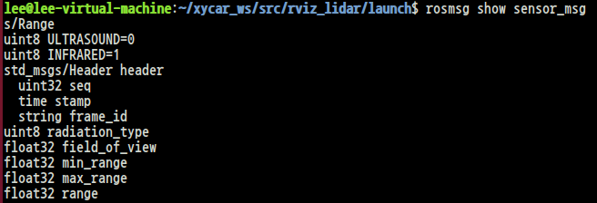
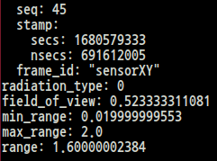
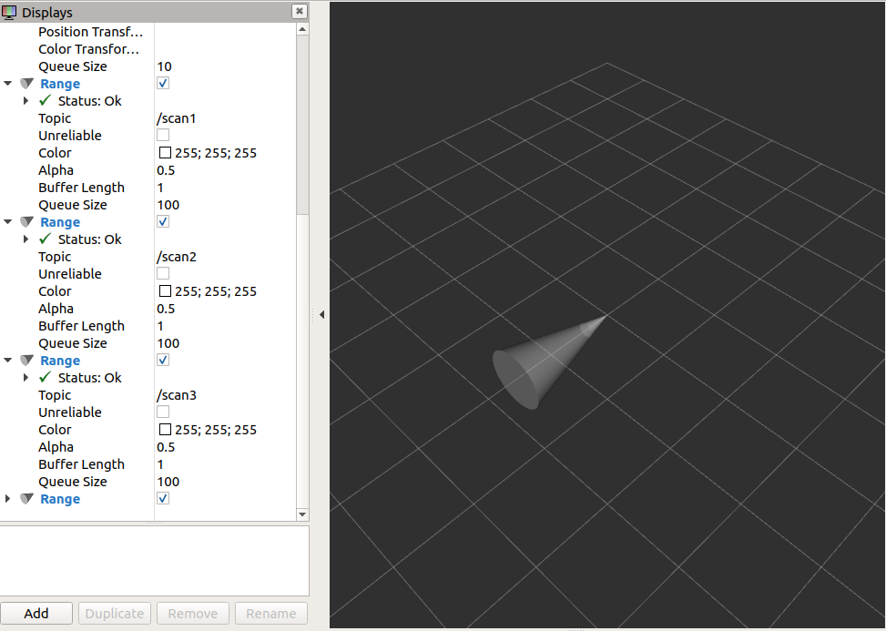
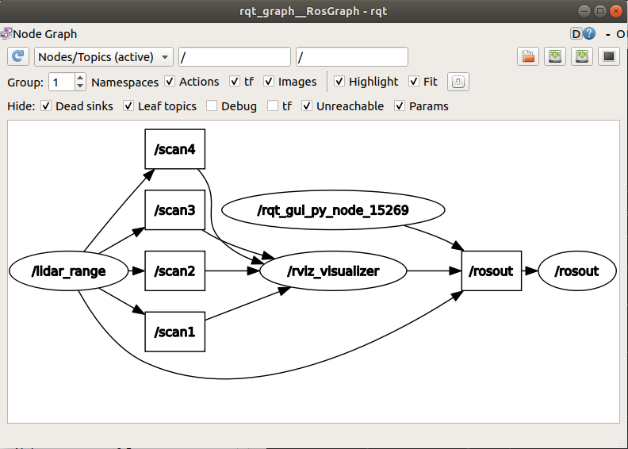

# 라이다 데이터 시각화
## 1. 패키지 생성 - rviz_lidar

```
xycar_ws-- src--rviz_lidar-- rviz
                          └- launch
                          └- src
```
<br>

```
$ catkin_create_pkg rviz_lidar rospy tf geometry_msgs urdf rviz xacro
```

## 2. launch 디렉토리 아레에 lidar_3d.launch 파일 만둘기(실제 라이다 구동 시)
```html
<!-- ~/xycar_ws/src/rviz_lidar/launch/lidar_3d.launch-->
<launch>
    <!-- rviz display-->
    <node name = "rviz_visualizer" pkg = "rviz" type = "rviz" required = "true" args = "-d $(find rviz_lidar)/rviz/lidar_3d.rviz"/>
    <node name = "xycar_lidar" pkg = "xycar_lidar" type = "xycar_lidar" output = "screen">
        <param name = "serial port" type = "string" value = "/dev/ttyRPL"/>
        <param name = "serial_baudrate" type = "int" value = "115200"/>
        <param name = "frame_id" type = "string" value = "laser"/>
        <param name = "inverted" type = "bool" value = "false"/>
        <param name = "angle_compensate" type = "bool" value = "true"/>
    </node>
</launch>
```

## 라이다 장치가 없는 경우
* 실제 라이다 장치를 대신하여 /scan 토픽을 발행하는 프로그램을 이용
* ROS에서 제공하는 "rosbag" 이용

## launch 디렉토리 아레에 lidar_3d.launch 파일 만둘기(rosbag 사용 시)

```html
<!-- ~/xycar_ws/src/rviz_lidar/launch/lidar_3d_rosbag.launch-->
<launch>
    <!-- rviz display-->
    <node name = "rviz_visualizer" pkg = "rviz" type = "rviz" required = "true" args = "-d $(find rviz_lidar)/rviz/lidar_3d.rviz"/>
    <node name = "rosbag_play" pkg = "rosbag" type = "play" output = "screen" required = "true" args = "$(find rviz_lidar)/src/lidar_topic.bag"/>
</launch>
```

## 3. RVIZ 실행
```
$ roslaunch rviz_lidar lidar_3d.launch
```

## 4. rviz 설정 변경 후 저장


# ROSBAG
* 토픽을 구독하여 파일로 저장하거나, 파일에서 토픽을 꺼내 발행하는 기능

## 사용법
```
<terminal>
$ rosbag record -O lidar_topic scan
$ rosbag play lidar_topic.bag
```

```html
<!-- launch file-->
<launch>
    <node name = "rosbag_play" pkg = "rosbag" type = "play" output = "screen" required = "true" args = "$(find_rviz_lidar)/src/lidar_topic.bag"/>
</launch>
```

# Range 메시지를 RVIZ에서 시각화 하는 방법
* 기존 rviz_lidar에서 작업

## 1. Range 토픽 데이터 구조 확인

<br>

## 2. 파이썬 파일 작성
```py
# ~/xycar_ws/src/rviz_lidar/src/lidar_range.py
#! /usr/bin/env python

import serial, time, rospy
from sensor_msgs.msg import Range
from std_msgs.msg import Header

rospy.init_node('lidar_range')

pub1 = rospy.Publisher('scan1', Range, queue_size = 1)
pub2 = rospy.Publisher('scan2', Range, queue_size = 1)
pub3 = rospy.Publisher('scan3', Range, queue_size = 1)
pub4 = rospy.Publisher('scan4', Range, queue_size = 1)

'''
Range 채우기
헤더 정보 채우기
원뿔 모양의 Range 표시에 필요한 정보 채우기
'''
msg = Range()
h = Header()
h.frame_id = "sensorXY"
msg.header = h
msg.radiation_type = Range().ULTRASOUND
msg.min_range = 0.02
msg.max_range = 2.0
msg.field_of_view = (30.0/180.0)*3.14

while not rospy.is_shutdown():
    msg.header.stamp = rospy.Time.now()
    
    # 장애물 까지의 거리를 입력으로 넣고 토픽 발행
    msg.range = 0.4
    pub1.publish(msg)

    msg.range = 0.8
    pub2.publish(msg)

    msg.range = 1.2
    pub2.publish(msg)

    msg.range = 1.6
    pub2.publish(msg)

    time.sleep(0.2)
```

## 3. launch 파일 작성
```html
<!-- ~/xycar_ws/src/rviz_lidar/launch/lidar_range.launch-->
<launch>
    <!--rviz display-->
    <node name = "rviz_visualizer" pkg = "rviz" type = "rviz" required = "true" args = "-d $(find rviz_lidar)/rviz/lidar_range.rviz"/>
    <node name = "lidar_range" pkg = "rviz_lidar" type = "lidar_range.py"/>
</launch>
```

## 4. 토픽 전달 확인 및 Rviz 설정 저장

```
$ rostopic echo scan1
```


<br>


<br>


<br>

# 과제: RVIZ에서 라이다 정보를 Range로 표시하기

## 1. 파이썬 파일 작성
```py
# ~/xycar_ws/src/