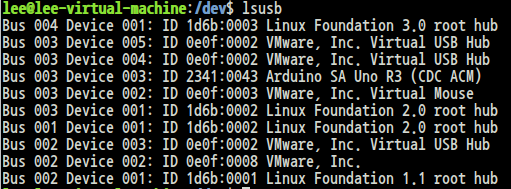
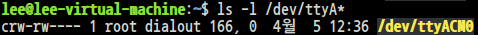
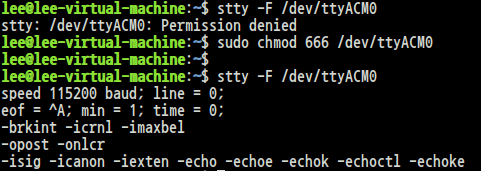
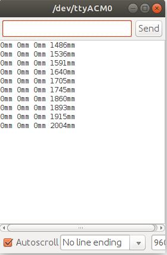

# 초음파 센서 4개를 지원하는 ROS 패키지 제작하기

## PC에서 아두이노 연결 확인

<br>

## port 설정 & 확인
아두이노 연결 후
```
$ sudo usermod -a -G dialout "사용자이름"
```

권한 설정이 잘 되었는지 확인
```
$ ls -l /dev/ttyU*
혹은
$ ls -l /dev/ttyA*
```
<br>


<br>

필자는 위의 설정 이후에도 USB Serial Port를 사용하지 못했다.
```
$ sudo chmod 666 /dev/ttyACM0
```
위의 명령어로 권한설정을 끝내면 정상적으로 작동했다.


<br>

## 1. Ultrasonic_4_fw.ino 파일 제작하기

```c
/*
PinNumber trig1 2
PinNumber echo1 3
PinNumber trig2 4
PinNumber echo2 5
PinNumber trig3 6
PinNumber echo3 7
PinNumber trig4 8
PinNumber echo4 9
*/

void setup()
{
  Serial.begin(9600);
  for(int i = 2; i <= 9; i++){
    if(i % 2 == 0) pinMode(i, OUTPUT);
    else pinMode(i, INPUT);
  }
}

void loop(){
  long duration, distance;
  for(int i=0; i<=4; i++) digitalWrite(2 * i, LOW);
  delayMicroseconds(2);
  for(int i=0; i<=4; i++) digitalWrite(2 * i, HIGH);
  delayMicroseconds(10);
  for(int i=0; i<=4; i++) digitalWrite(2 * i, LOW);
  
  for(int i=0; i<=4; i++){
    duration = pulseIn(2*i+1, HIGH);
    distance = duration * 170 / 1000;
    Serial.print(distance);
    Serial.print("mm ");
  }
  delay(100);
}
```

## 작동 확인

<br>

## 2. ROS 노드 프로그램 소스코드 만들기

## Publisher
```py
#! /usr/bin/env python
# ~/xycar_ws/src/ultrasonic/src/ultra4_pub.py

import rospy, time, serial
from std_msgs.msg import Int32MultiArray, Int32

FRONT = [0, 0, 0, 0]

ser_front = serial.Serial(
    port = '/dev/ttyACM0',
    baudrate=9600,
)

def read_sensor():
    sensor_data = ser.front.readline()
    ser_front_flushInput()
    ser_front.flushOutput()
    FRONT = read_Sdata(sensor_data)
    msg.data = FRONT

def read_Sdata(s):
    s = s.replace(" ", "")
    s_data = s.split("mm")
    s_data.remove('\r\n')
    s_data = list(map(int, s_data))
    return s_data

if __name__ == '__main__':
    rospy.init_node('ultra4', Int32MultiArray, queue_size = 1)
    msg = Int32MultiArray()
    while not rospy.is_shutdown():
        read_sensor()
        pub.publish(msg)
        time.sleep(0.2)

    ser_front.close()
```

## Subscriber
```py
#! /usr/bin/env python
# ~/xycar_ws/src/ultrasonic/src/ultra4_sub.py

import rospy
from std_msgs.msg import Int32MultiArray

def callback(msg):
    print(msg.data)

rospy.init_node('ultra4_sub')
sub = rospy.Subscriber('ultra4', Int32MultiArray, callback)

rospy.spin()
```

## 3. Launch 파일 작성
```html
<!-- ~/xycar_ws/src/ultrasonic/launch/ultra4.launch-->
<launch>
    <node pkg="ultrasonic" type="ultra4_pub.py" name="ultra4_pub"/>
    <node pkg="ultrasonic" type="ultra4_sub.py" name="ultra4_sub"/>
</launch>
