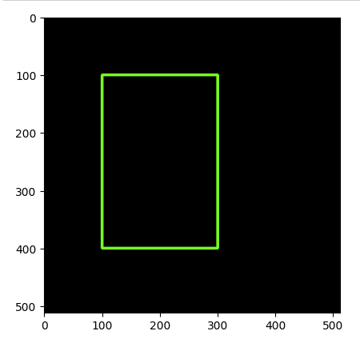

# 기본적인 도형 그리기

* 선(line)
```py
line(img, start, end, color, thickness)
img = cv2.line(img, (0, 0), (511, 511), (255, 0, 0), 5)
```

* 사각형(rectangle)
```py
rectangle(img, start, end, color, thickness)
img = cv2.rectangle(img, (100, 100), (300, 500), (0, 255, 0), 3)
```

* 원(circle)
```py
circle(img, center, radius, color, thickness)
img = cv2.circle(img, (300, 400), 100, (0, 0, 255), 2)
```

* 텍스트(text)
```py
putText(img, text, org, font, fontScale, color)
cv2.putText(img, 'Test', (10, 50), cv2.FONT_HERSHEY_SIMPLEX, 4, (255, 255, 255))
```

# Practice

## 사각형 그리기
<br>

```py
import cv2 as cv
import matplotlib.pyplot as plt

img = cv.imread('Black.png', cv.IMREAD_COLOR)
img = cv.rectangle(img, (100, 100), (300, 400), (0, 255, 0), 3) # 100, 100부터 300, 400까지 Green, thickness = 3인 사각형 생성

plt.imshow(img)
plt.show()
```
<br>


<br>

## 이미지 파일을 읽어 타이틀 설정, 화면에 출력
```py
import cv2 as cv

img = cv.imread('girl.png', cv.IMREAD_COLOR)
cv.imshow('My Girl', img)   # 타이틀 이름 설정

cv.waitKey(10000)
cv.destroyAllWindows()
```

# ROI(Region of Interest) - 관심영역
이미지 내에서 관심 영역 설정은 numpy.ndarray 슬라이싱을 통해 가능

```py
import cv2 as cv
img = cv.imread('cars.png')
src = img[120:270, 270:460]

cv.imshow('car', src)
cv.waitKey(10000)
```

# HSV Filter
Hue(색상): 색의 질, 노란색, 빨간색, 파란색, ...<br>
Saturation(채도): 선명도, 원색에 가까울수록 채도가 높음<br>
Value(명도): 밝기, 명도가 높을수록 백색에, 낮을수록 흑색에 가까워짐

```py
import cv2 as cv
import numpy as np

img = cv.imread('cars.png')
hsv = cv.cvtColor(img, cv.COLOR_BGR2HSV)

lower_white = np.array([0, 0, 150])
upper_white = np.array([179, 255, 255])

mask = cv.imRange(hsv, lower_white, upper_white)
cv.imshow('line', mask)
cv.waitKey(10000)
```

# 카메라 영상 출력 프로그램 예제(edge_cam.py)
```py
#! /usr/bin/env python
# -*- coding: utf-8 -*-

import cv2 as cv
import rospy
import numpy as np

from sensor_msgs.msg import Image
from cv_bridge import CvBridge

gridge = CvBridge()
cv_image = np.empty(shape = [0])

def img_callback(data):
    global cv_image = bridge(imgmsg_to_cv2(data, "bgr8")

rospy.init_node('cam_tune', anonymous = True)
rospy.Subscriber("/usb_cam/image_raw/", Image, img_callback)

while not rospy.is_shutdown():
    if cv_image.size != (640 * 480 * 3):
        continue
    gray = cv.cvtColor(cv_image, cv2.COLOR_BGR2GRAY)
    blur_gray = cv.GaussianBlur(gray, (5, 5), 0)
    edge_img = cv.Canny(np.uint8(blur_gray), 60, 70)
    
    cv.imshow('original', cv_image)
    cv.imshow('gray', gray)
    cv.imshow('gaussian blur', blur_gray)
    cv.imshow('edge', edge_img)
    cv.waitKey(1)
```

# 차선 검출을 위한 영상 처리
사각형 안에 있는 흰색 점의 개수를 세서 일정 개수 이상이면 녹색으로 표시
```py
import cv2 as cv
import numpy as np

image = cv.imread('sample.png')
hsv = cv.cvtColor(image, cv2.COLOR_BFR2HSV)

lower_white = np.array([0, 0, 70])
upper_white = np.array([131, 255, 255])
img = cv.inRange(hsv, lower_white, upper_white)

xx = 20
while True:
    area = img[430 : 450, xx : xx + 15]
    if cv.countNonZero(area) > 200:
        image = cv2.rectangle(image, (xx, 430), (xx + 15, 450), (0, 255, 0), 3)
    else:
        image = cv2.rectangle(image, (xx, 430), (xx + 15, 450), (255, 0, 0), 3)
    
    xx = xx + 20

    if xx > 640:
        break

cv.imshow('countNonZero', image)
cv.waitKey(10000)
```

차선 검출 프로그램
```py
#! /usr/bin/env python

import cv2, time
import numpy as np

cap = cv2.VideoCapture('track1.avi')
threshold_60 = 60
threshold_100 = 100
width_640 = 640
scan_width_200, scan_height_20 = 200, 20
lmid_200, rmid_200 = scan_width_200, width_640 - scan_width_200
area_width_20, area_height_10 = 20, 10
vertical_430 = 430
row_begin_5 = (scan_height_20 - area_height_10) // 2
row_end_15 = row_begin_5 + area_height_10
pixel_threshold_160 = 0.8 * area_width_20 * area_height_10

while True:
    ret, frame = cap.read()
    if not ret:
        break
    if cv2.waitKey(1) & 0xFF == 27:
        break
    roi = frame[vertical_430 : vertical_430 + scan_height_20, :]
    frame = cv2.rectangle(frame, (0, vertical_430), (width_640 - 1, vertical_430 + scan_height_20), (255, 0, 0), 3)
    hsv = cv2.cvtColor(roi, cv2.COLOR_BGR2HSV)
    
    lbound = np.array([0, 0, threshold_60], dtype = np.uint8)
    ubound = np.array([131, 255, 255], dtype = np.uint8)

    bin = cv2.inRange(hsv, lbound, ubound)
    view = cv2.cvtColor(bin, cv2.COLOR_GRAY2BGR)

    left, right = -1, -1
    for l in range(area_width_20, lmid_200):
        area = bin[row_begin_5 : row_end_15, l - area_width_20 : l]
        if cv2.countNonZero(area) > pixel_threshold_160:
            left = l
            break
    for r in range(width_640 - area_width_20, rmid_440, -1):
        area = bin[row_begin_5 : row_end_15, r : r + area_width_20]
        if cv2.countNonZero(area) > pixel_threshold_160:
            right = r
            break
    if left != -1:
        lsquare = cv2.rectangle(view, (left - area_width_20, row_begin_5), (left, row_end_15), (0, 255, 0), 3)
    else:
        print("Lost left line")
    if right != -1:
        rsquare = cv2.rectangle(view, (right, row_begin_5), (right + area_width_20, row_end_15), (0, 255, 0), 3)
    else:
        print("Lost right line")

    cv2.imshow("origin", frame)
    cv2.imshow("view", view)

    hsv = cv2.cvtColor(frame, cv2.COLOR_BGR2HSV)
    hsv = cv2.inRange(hsv, lbound, ubound)
    cv2.imshow("hsv", hsv)

    time.sleep(0.1)

cap.release()
cv2.destroyAllWindows()