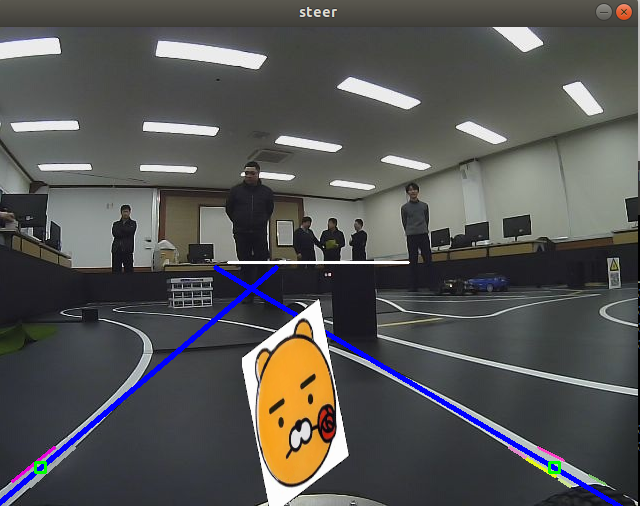

# Image Sapce vs Parameter Space
* Image Space: x, y 좌표계
    * Image Space에서의 직선은 Parameter Space에서 점으로 표현할 수 있음
    * 기울기와 y절편만 알면 Image space에서 직선을 그릴 수 있음
* Parameter Space: m, b 좌표계
    * Image Space에서의 점은 Parameter Space에서 직선으로 표현할 수 있음
    * 그 직선은 Image Space에서 (x1, y1)점을 지나는 모든 직선을 의미함
    * Parameter Space에서 두 직선의 교점은 m과 b가 같은 경우에 생기고(m: 기울기, b: 절편) Image Space에서 두 점을 지나는 직선을 의미
    * Parameter Space에서 겹치는 직선이 많은 교점일수록 그 교점이 의미하는 Image Space에서의 직선이 존재할 가능성이 높음
* Parameter Space의 한계
    * 기울기가 무한대인 직선은 표현이 어려움
    * 그래서 Hough Space를 도입
* Hough Space
    * 원점에서 직선에 수선의 발을 내려서 수선을 긋고, 원점과 직선과의 거리와 수선과 x축과의 각도로 직선을 표현
    * Hough Space에서 직선이 많이 겹치는 교점일수록 Image Space에서 직선이 존재할 확률이 높음


# Hough Transform을 통한 차선 검출 방식
1. 입력 영상을 GrayScale로 변환
2. Canny Edge 처리로 외각선 획득
3. 로우와 세타 간격 설정
4. 외각선 점들에 대해서 (로우, 세타) 좌표값 구하기
5. 오차범위 내의 (로우, 세타) 좌표값을 갖는 외곽선 점들이 하나의 직선을 구성한다고 판정

# HoughLInes 함수
```py
cv2.HoughLines(image, rho, theta, threshold)

# image: 8bit, 흑백 이미지
# rho: hough space에서 얼마만큼 로우를 증가시키면서 조사할 것인지
# theta: hough space에서 얼마만큼 세타를 증가시키면서 조사할 것인지
# threshold: hough space에서 threshold 이상의 직선이 겹치는 교점은 하나의 직선을 형성한다고 판단함
# 검출된 직선의 로우, 세타값을 반환
```

# HoughlinesP 함수
```py
cv2.HoughlinesP(image, rho, theta, threshold, minLineLength, maxLineGap)

# minLineLength: 선분의 최소 길이, 이것보다 짧은 선분은 버림
# maxLineGap: 간격의 최대 길이, 이것보다 작은 간격은 하나의 선분으로 간주
# 검출된 선분의 시작점과 끝점의 좌표를 반환
```

# Hough_drive pkg
## 패키지 생성
```
$ catkin_create_pkg hough_drive std_msgs rospy
$ cm
```

## .py파일
```py
#! /usr/bin/env python
# -*- coding: utf-8 -*-

import rospy
import numpy as np
import cv2, random, math, time

Width = 640
Height = 480
Offset = 420
Gap = 40

# draw lines
def draw_lines(img, lines):
    global Offset
    for line in lines:
        x1, y1, x2, y2 = line[0]
        color = (random.randint(0, 255), random.randint(0, 255), random.randint(0, 255))
        img = cv2.line(img, (x1, y1 + Offset), (x2, y2 + Offset), color, 2)
    return img

# draw rectangle
def draw_rectangle(img, lpos, rpos, offset = 0):
    center = (lpos + rpos) / 2
    cv2.rectangle(img, (lpos - 5, 15 + offset), (lpos + 5, 25 + offset), (0, 255, 0), 2)
    cv2.rectangle(img, (rpos - 5, 15 + offset), (rpos + 5, 25 + offset), (0, 255, 0), 2)
    cv2.rectangle(img, (center - 5, 15 + offset), (center + 5, 25 + offset), (0, 255, 0), 2)
    cv2.rectangle(img, (315, 15 + offset), (325, 25 + offset), (0, 0, 255), 2)
    return img

# left lines, right lines
def divide_left_right(lines):
    global Width
    low_slope_threshold = 0
    high_slope_threshold = 10

    slopes = []
    new_lines = []
    for line in lines:
        x1, y1, x2, y2 = line[0]
        if x2 - x1 == 0:
            slope = 0
        else:
            slope = float(y2 - y1) / float(x2 - x1)
        if (abs(slope) > low_slope_threshold) and (abs(slope) < high_slope_threshold):
            slopes.append(slope)
            new_lines.append(line[0])

    # divide lines left to right
    left_lines = []
    right_lines = []

    for j in range(len(slopes)):
        Line = new_lines[j]
        slope = slopes[j]
        x1, y1, x2, y2 = Line
        if (slope < 0) and (x2 < Width/2 - 90):
            left_lines.append([Line.tolist()])
        
        elif (slope > 0) and (x1 > Width/2 + 90):
            right_lines.append([Line.tolist()])

    return left_lines, right_lines

# get average m, b of lines
def get_line_params(lines):
    # sum of x, y, m
    x_sum = 0.0
    y_sum = 0.0
    m_sum = 0.0

    size = len(lines)
    if size == 0:
        return 0, 0
    for line in lines:
        x1, y1, x2, y2 = line[0]

        x_sum += x1 + x2
        y_sum += y1 + y2
        m_sum += float(y2 - y1) / float(x2 - x1)
    
    x_avg = x_sum / (size * 2)
    y_avg = y_sum / (size * 2)
    m = m_sum / size
    b = y_avg - m * x_avg

    return m, b

# get lpos, rpos
def get_line_pos(img, lines, left = False, right = False):
    global Width, Height
    global Offset, Gap

    m, b = get_line_params(lines)

    if m == 0 and b == 0:
        if left: pos = 0
        if right: pos = Width
    else:
        y = Gap / 2
        pos = (y - b) / m
        b += Offset
        x1 = (Height - b) / float(m)
        x2 = ((Height / 2) - b) / float(m)

        cv2.line(img, (int(x1), Height), (int(x2), (Height / 2)), (255, 0, 0), 3)

    return img, int(pos)

# show image and return lpos, rpos

def process_image(frame):
    global Width
    global Offset, Gap

    # gray
    gray = cv2.cvtColor(frame, cv2.COLOR_BGR2GRAY)

    # blur
    kernel_size= 5
    blur_gray = cv2.GaussianBlur(gray, (kernel_size, kernel_size), 0)

    # canny edge
    low_threshold = 60
    high_threshold = 70
    edge_img = cv2.Canny(np.uint8(blur_gray), low_threshold, high_threshold)

    # HoughLinesP
    roi = edge_img[Offset : Offset+Gap, 0 : Width]
    all_lines = cv2.HoughLinesP(roi, 1, math.pi/180, 30, 30, 10)

    # divide left, right lines
    if all_lines is None:
        return 0, 640
    left_lines, right_lines = divide_left_right(all_lines)

    # get center of lines
    frame, lpos = get_line_pos(frame, left_lines, left = True)
    frame, rpos = get_line_pos(frame, right_lines, right = True)

    # draw lines
    frame = draw_lines(frame, left_lines)
    frame = draw_lines(frame, right_lines)
    frame = cv2.line(frame, (230, 235), (410, 235), (255, 255, 255), 2)

    # draw rectangle
    frame = draw_rectangle(frame, lpos, rpos, offset = Offset)

    return [lpos, rpos], frame

def draw_steer(image, steer_angle):
    global Width, Height, arrow_pic

    arrow_pic = cv2.imread('steer_arrow.png', cv2.IMREAD_COLOR)

    origin_Height = arrow_pic.shape[0]
    origin_Width = arrow_pic.shape[1]
    steer_wheel_center = origin_Height * 0.74
    arrow_Height = Height/2
    arrow_Width = (arrow_Height * 462) / 728

    matrix = cv2.getRotationMatrix2D((origin_Width / 2, steer_wheel_center), (steer_angle) * 2.5, 0.7)

    arrow_pic = cv2.warpAffine(arrow_pic, matrix, (origin_Width + 60, origin_Height))
    arrow_pic = cv2.resize(arrow_pic, dsize = (arrow_Width, arrow_Height), interpolation=cv2.INTER_AREA)

    gray_arrow = cv2.cvtColor(arrow_pic, cv2.COLOR_BGR2GRAY)
    _, mask = cv2.threshold(gray_arrow, 1, 255, cv2.THRESH_BINARY_INV)

    arrow_roi = image[arrow_Height: Height, (Width / 2 - arrow_Width / 2) : (Width / 2 + arrow_Width / 2)]

    arrow_roi = cv2.add(arrow_pic, arrow_roi, mask = mask)

    res = cv2.add(arrow_roi, arrow_pic)

    image[(Height - arrow_Height) : Height, (Width / 2 - arrow_Width / 2): (Width / 2 + arrow_Width / 2)] = res

    cv2.imshow('steer', image)

def start():
    global image, Width, Height
    cap = cv2.VideoCapture('hough_track.avi')

    while not rospy.is_shutdown():
        ret, image = cap.read()
        time.sleep(0.03)

        pos, frame = process_image(image)

        center = (pos[0] + pos[1]) / 2
        angle = 320 - center
        steer_angle = angle * 0.4
        draw_steer(frame, steer_angle)

        if cv2.waitKey(1) & 0xFF == ord('q'):
            break

if __name__ == '__main__':
    start()
```
<br>

## 실행 결과

<br>