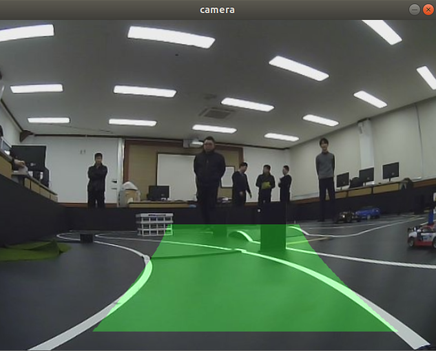
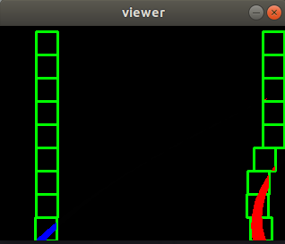

# 원근 변환과 슬라이딩 윈도우를 이용한 차선 찾기
1. Camera Calibration
2. Bird's eye View
3. 이미지 임계값 및 이진 이미지
4. 슬라이딩 윈도우로 차선 위치 파악
5. 파악된 차선 위치 원본 이미지에 표시

# 파이썬 파일 작성
```py
#! /usr/bin/env python
# -*- coding: utf-8 -*-

import numpy as np
import cv2, random, math, copy

Width = 640
Height = 480

cap = cv2.VideoCapture("xycar_track1.avi")
window_title = 'camera'

warp_img_w = 320    # bird_eye_view image width
warp_img_h = 240    # bird_eye_view image height

warpx_margin = 30
warpy_margin = 3

nwindows = 9    # number of sliding windows
margin = 12     # sliding window area
minpix = 5      # minimum points to draw line

lane_bin_th = 145

warp_src = np.array([
    [230 - warpx_margin, 300 - warpy_margin],
    [45 - warpx_margin, 450 + warpy_margin],
    [445 + warpx_margin, 300 - warpy_margin],
    [610 + warpx_margin, 450 + warpy_margin],
], dtype = np.float32)

warp_dist = np.array([
    [0, 0],
    [0, warp_img_h],
    [warp_img_w, 0],
    [warp_img_w, warp_img_h],
], dtype = np.float32)

calibrated = True
if calibrated:
    mtx = np.array([
        [422.037858, 0.0, 245.895397],
        [0.0, 435.589734, 163.625535],
        [0.0, 0.0, 1.0]
    ])
    dist = np.array([0.289296, 0.061035, 0.001786, 0.015238, 0.0])
    cal_mtx, cal_roi = cv2.getOptimalNewCameraMatrix(mtx, dist, (Width, Height), 1, (Width, Height))

def calibrate_image(frame):
    global Width, Height
    global mtx, dist
    global cal_mtx, cal_roi

    tf_image = cv2.undistort(frame, mtx, dist, None, cal_mtx)
    x, y, w, h = cal_roi
    tf_image = tf_image[y : y + h, x : x + w]

    return cv2.resize(tf_image, (Width, Height))

def warp_image(img, src, dst, size):
    M = cv2.getPerspectiveTransform(src, dst)
    Minv = cv2.getPerspectiveTransform(dst, src)
    warp_img = cv2.warpPerspective(img, M, size, flags = cv2.INTER_LINEAR)
    return warp_img, M, Minv

def warp_process_image(img):
    global nwindows
    global margin
    global minpix
    global lane_bin_th

    # Gaussian Blurring
    blur = cv2.GaussianBlur(img, (5, 5), 0) 

    # detect white
    _, L, _ = cv2.split(cv2.cvtColor(blur, cv2.COLOR_BGR2HLS))  

    # lane_bin_th: threshold
    _, lane = cv2.threshold(L, lane_bin_th, 255, cv2.THRESH_BINARY) 

    # histogram: A graph of the distribution of pixel values ​​constituting an image
    histogram = np.sum(lane[lane.shape[0] // 2 :, :], axis = 0)

    midpoint = np.int(histogram.shape[0] / 2)

    leftx_current = np.argmax(histogram[:midpoint])

    rightx_current = np.argmax(histogram[midpoint:]) + midpoint

    window_height = np.int(lane.shape[0] / nwindows)
    nz = lane.nonzero()

    left_lane_inds = []
    right_lane_inds = []

    lx, ly, rx, ry = [], [], [], []
    out_img = np.dstack((lane, lane, lane)) * 255

    for window in range(nwindows):
        
        win_yl = lane.shape[0] - (window + 1) * window_height
        win_yh = lane.shape[0] - window * window_height

        win_xll = leftx_current - margin
        win_xlh = leftx_current + margin
        win_xrl = rightx_current - margin
        win_xrh = rightx_current + margin

        cv2.rectangle(out_img, (win_xll, win_yl), (win_xlh, win_yh), (0, 255, 0), 2)
        cv2.rectangle(out_img, (win_xrl, win_yl), (win_xrh, win_yh), (0, 255, 0), 2)

        good_left_inds = ((nz[0] >= win_yl) & (nz[0] < win_yh) & (nz[1] >= win_xll) & (nz[1] < win_xlh)).nonzero()[0]

        good_right_inds = ((nz[0] >= win_yl) & (nz[0] < win_yh) & (nz[1] >= win_xrl) & (nz[1] < win_xrh)).nonzero()[0]

        left_lane_inds.append(good_left_inds)
        right_lane_inds.append(good_right_inds)

        if len(good_left_inds) > minpix:
            leftx_current = np.int(np.mean(nz[1][good_left_inds]))
        if len(good_right_inds) > minpix:
            rightx_current = np.int(np.mean(nz[1][good_right_inds]))
        
        lx.append(leftx_current)
        ly.append((win_yl + win_yh) / 2)
        rx.append(rightx_current)
        ry.append((win_yl + win_yh) / 2)
    
    left_lane_inds = np.concatenate(left_lane_inds)
    right_lane_inds = np.concatenate(right_lane_inds)

    lfit = np.polyfit(np.array(ly), np.array(lx), 2)
    rfit = np.polyfit(np.array(ry), np.array(rx), 2)

    out_img[nz[0][left_lane_inds], nz[1][left_lane_inds]] = [255, 0, 0]
    out_img[nz[0][right_lane_inds], nz[1][right_lane_inds]] = [0, 0, 255]
    cv2.imshow("viewer", out_img)
    return lfit, rfit

def draw_lane(image, warp_img, Minv, left_fit, right_fit):
    global Width, Height
    yMax = warp_img.shape[0]
    ploty = np.linspace(0, yMax - 1, yMax)
    color_warp = np.zeros_like(warp_img).astype(np.uint8)
    
    left_fitx = left_fit[0]*ploty**2 + left_fit[1]*ploty + left_fit[2]
    right_fitx = right_fit[0]*ploty**2 + right_fit[1]*ploty + right_fit[2]
    
    pts_left = np.array([np.transpose(np.vstack([left_fitx, ploty]))])
    pts_right = np.array([np.flipud(np.transpose(np.vstack([right_fitx, ploty])))]) 
    pts = np.hstack((pts_left, pts_right))
    
    color_warp = cv2.fillPoly(color_warp, np.int_([pts]), (0, 255, 0))
    newwarp = cv2.warpPerspective(color_warp, Minv, (Width, Height))

    return cv2.addWeighted(image, 1, newwarp, 0.3, 0)

def start():
    global Width, Height, cap

    _, frame = cap.read()
    while not frame.size == (Width*Height*3):
        _, frame = cap.read()
        continue

    print("start")

    while cap.isOpened():
        
        _, frame = cap.read()

        image = calibrate_image(frame)
        warp_img, M, Minv = warp_image(image, warp_src, warp_dist, (warp_img_w, warp_img_h))
        left_fit, right_fit = warp_process_image(warp_img)
        lane_img = draw_lane(image, warp_img, Minv, left_fit, right_fit)

        cv2.imshow(window_title, lane_img)

        cv2.waitKey(1)

if __name__ == '__main__':
    start()
```

# 실행 화면

<br>


<br>