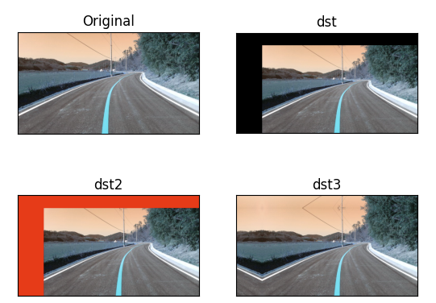
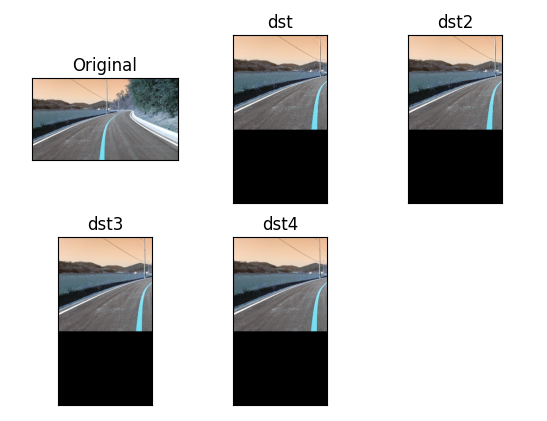
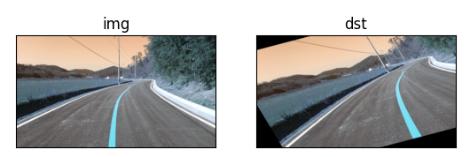
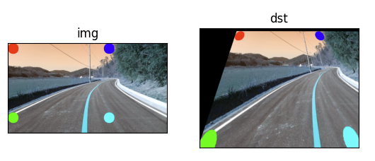

# Warping
* 사전적으로 '뒤틀림', '왜곡하다'라는 의미
* 영상시스템에서 말하는 Warping은 영상을 이동, 회전, 크기변환 등을 이용
* 이미지를 찌그러뜨리거나 반대로 찌그러진 이미지를 복원하기 위한 처리 기법

# 변환(Transformations)
좌표 x를 새로운 좌표 x로 변환하는 함수<br>
사이즈 변경(scaling), 위치 변경(Translation), 회전(Rotation) 등등

1. 강제 변환(Rigid-Body): 크기 및 각도가 보존되는 변환
2. 유사 변환(Similarity): 크기는 변하고 각도는 보존되는 변환
3. 선형 변환(Linear): Vector 공간에서의 이동
4. Affine: 선형 변환과 이동 변환까지 포함. 선의 수평성은 유지
5. Perspective: Affine 변환에 수평성도 유지되지 않음. 원근 변환

# 평행 이동
이미지를 이동하려면 원래 있던 좌표에 이동시키려는 거리만큼 더하면 됨

```py
dst = cv2.warpAffine(src, matrix, dsize, dst, flags, borderMode, borderValue)
# src: 원본 이미지. numpy 배열
# matrix: 2*3 변환 행렬, dytpe = float32
# dsize: 결과 이미지의 크기, (width, height)
# dst: 결과 이미지
# flags: 보간법 알고리즘 플래그
# borderMode: 외각영역 보정 플래그
# borderValue: 외각영역 보정 플래그가 cv2.BORDER_CONSTANT일 경우 사용할 색상 값
```

```py
import cv2
import numpy as np
import matplotlib.pyplot as plt

img = cv2.imread('practice.jpg')
rows, cols = img.shape[0:2]

dx, dy = 100, 50

mtrx = np.float32([[1, 0, dx],
                  [0, 1, dy]])

dst = cv2.warpAffine(img, mtrx, (cols+dx, rows+dy))

dst2 = cv2.warpAffine(img, mtrx, (cols+dx, rows+dy), None, cv2.INTER_LINEAR, cv2.BORDER_CONSTANT, (255, 0, 0))

dst3 = cv2.warpAffine(img, mtrx, (cols+dx, rows+dy), None, cv2.INTER_LINEAR, cv2.BORDER_REFLECT)

plt.subplot(2,2,1), plt.imshow(img), plt.title('Original'), plt.xticks([]), plt.yticks([])

plt.subplot(2,2,2), plt.imshow(dst), plt.title('dst'), plt.xticks([]), plt.yticks([])

plt.subplot(2,2,3), plt.imshow(dst2), plt.title('dst2'), plt.xticks([]), plt.yticks([])

plt.subplot(2,2,4), plt.imshow(dst3), plt.title('dst3'), plt.xticks([]), plt.yticks([])
```

## 평행이동 결과

<br>

# 확대, 축소
기존 좌표에 특정 값을 곱하면 됨<br>
이미지의 좌표를 축소 확대 하려면 2*3 행렬을 사용한다(변환 행렬)

```py
import cv2
import numpy as np
import matplotlib.pyplot as plt

img = cv2.imread('practice.jpg')
height, width = img.shape[0:2]

m_small = np.float32([[0.5, 0, 0],
                     [0, 0.5, 0]])

m_big = np.float32([[2, 0, 0],
                   [0, 2, 0]])

dst = cv2.warpAffine(img, m_small, (int(height * 0.5), int(width * 0.5)))

dst2 = cv2.warpAffine(img, m_small, (int(height * 0.5), int(width * 0.5)), None, cv2.INTER_AREA)

dst3 = cv2.warpAffine(img, m_big, (int(height * 2), int(width * 2)))

dst4= cv2.warpAffine(img, m_big, (int(height * 2), int(width * 2)), None, cv2.INTER_CUBIC)

plt.subplot(2,3,1), plt.imshow(img), plt.title('Original'), plt.xticks([]), plt.yticks([])

plt.subplot(2,3,2), plt.imshow(dst), plt.title('dst'), plt.xticks([]), plt.yticks([])

plt.subplot(2,3,3), plt.imshow(dst2), plt.title('dst2'), plt.xticks([]), plt.yticks([])

plt.subplot(2,3,4), plt.imshow(dst3), plt.title('dst3'), plt.xticks([]), plt.yticks([])

plt.subplot(2,3,5), plt.imshow(dst4), plt.title('dst4'), plt.xticks([]), plt.yticks([])
```

## 확대, 축소 결과

<br>
subplot으로 크기를 제한하여 결과물이 잘 표시되지 않았다.

# 크기조정 OpenCV 함수
```py
cv2.resize(src, dsize, dst, fx, fy, interpolation)
# src: 입력 원본 이미지
# dsize: 출력 영상 크기, 생략하면 fx, fy 배율을 적용
# fx, fy: 크기 배율, dsize가 주어지면 dsize를 우선 적용
# interpolation: 보간법 알고리즘 선택 플래그
# dst: 결과 이미지
```

# Affine 변환
* 크기 변환, 이동 변환, 회전 변환에서도 원래 평행했던 특성을 그대로 유지
* Affine 변환 행렬
    * cv2.getAffineTransform 함수를 통하여 얻을 수 있음
    * 2*3 행렬

```py
import cv2
import numpy as np
import matplotlib.pyplot as plt

img = cv2.imread('practice.jpg')
rows, cols = img.shape[0:2]

pts1 = np.float32([[50, 50],
                     [200, 50],
                  [50, 200]])

pts2 = np.float32([[10, 100],
                   [200, 50],
                  [100, 250]])

M = cv2.getAffineTransform(pts1, pts2)

dst = cv2.warpAffine(img, M, (cols, rows))

plt.subplot(1,2,1), plt.imshow(img), plt.title('img'), plt.xticks([]), plt.yticks([])

plt.subplot(1,2,2), plt.imshow(dst), plt.title('dst'), plt.xticks([]), plt.yticks([])
```

## Affine 변환 결과

<br>

# Perspective 변환(원근 변환)
* 원근법을 적용한 변환
* 직선의 성질만 유지가 되고, 선의 평행성은 유지가 되지 않는 변환
* 기차길은 서로 평행하지만, 원근 변환을 거치면 평행성은 유지되지 못하고 하나의 점에서 만나는 것 처럼 보임
* 반대의 변환도 가능함 -> 차선 인식에 사용

```py
import cv2
import numpy as np
import matplotlib.pyplot as plt

img = cv2.imread('practice.jpg')
rows, cols = img.shape[0:2]

pts1 = np.float32([[20, 20],
                     [20, 280],
                  [380, 20],
                  [380, 280]])

pts2 = np.float32([[100, 20],
                   [20, 290],
                  [300, 20],
                  [380, 280]])

cv2.circle(img, (20, 20), 20, (255, 0, 0), -1)
cv2.circle(img, (20, 280), 20, (0, 255, 0), -1)
cv2.circle(img, (380, 20), 20, (0, 0, 255), -1)
cv2.circle(img, (380, 280), 20, (0, 255, 255), -1)

M = cv2.getPerspectiveTransform(pts1, pts2)

dst = cv2.warpPerspective(img, M, (400, 300))

plt.subplot(1,2,1), plt.imshow(img), plt.title('img'), plt.xticks([]), plt.yticks([])

plt.subplot(1,2,2), plt.imshow(dst), plt.title('dst'), plt.xticks([]), plt.yticks([])
```

## Perspective 변환 결과

<br>

