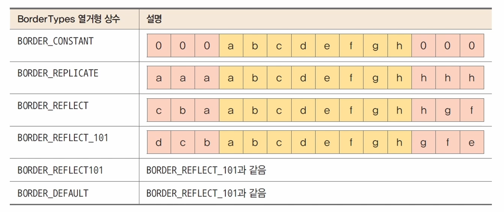
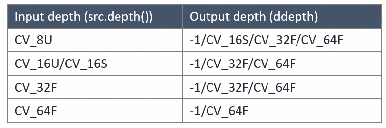
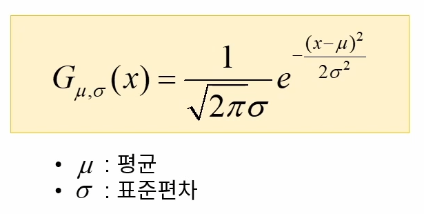
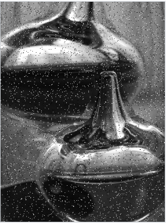
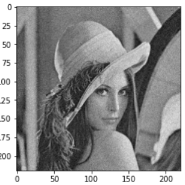
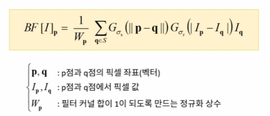

* 영상에서 필요한 정보만 통과시키고, 원치 않는 정보는 걸러내는 작업
* 블러링, 샤프닝, 잡음 제거, 엣지 검출 등

## 주파수 공간에서의 필터링(frequency domain filtering)
* 푸리에 변환을 이용하여 영상을 주파수 공간으로 변환하여 필터링을 수행하는 방법

## 공간적 필터링(spatial domain filtering)
* 영상의 픽셀 값을 직접 이용하는 필터링 방법
    * 대상 좌표의 픽셀 값과 주변 픽셀 값을 동시에 사용
* 주로 마스크 연산을 사용함(mask = kernel)
* OpenCV에서는 공간적 필터링 마스크 크기가 커질 경우 주파수 공간에서의 필터링을 수행
* 마스크는 꼭 n * n형태가 아닌 자유로운 모양 지정이 가능

## OpenCV 필터링에서 지원하는 가장자리 픽셀 확장 방법


<br>

## 영상 가장자리 픽셀 확장하기
딥러닝에서 Conv모델을 적용시킬때 영상 가장자리를 확장하여 filter를 찍어내는 것은 공부하였다. OpenCV에서도 이와같은 함수를 지원한다.

```cpp
void copyMakeBorder(InputArray src, OutputArray dst, int top, int bottom, int left, int right, int borderType, const Scalar& value = Scalar());
```

* top: 윗쪽 확장 크기
* bottom: 아래쪽 확장 크기
* left: 왼쪽 확장 크기
* right: 오른쪽 확장 크기
* boarder Type: 가장자리 픽셀 확장 방법(위 그림 참조)
* value: borderType이 BORDER_CONSTANT인 경우 사용할 값

## 기본적인 2D 필터링 함수

```cpp
void filter2D(InputArray src, OutputArray dst, int ddepth, IntArray kernel, Point anchor = Point(-1, -1), double delta = 0, int borderType = BORDER_DEFAULT);
```

* ddepth: 원하는 결과 영상의 깊이를 지정. -1이면 src와 같은 깊이를 사용

{: width="300" height="120"}
<br>

* kernel: 필터 마스크 행렬. 1채널 실수형
* anchor: 고정점 위치. (-1, -1)이면 필터 중앙을 고정점으로 사용
* delta: 추가적으로 더할 값
* borderType: 가장자리 픽셀 처리 방법

## 엠보싱 필터
* 엠보싱: 직물이나 종이, 금속판 등에 올록볼록한 형태로 만든 객체의 윤곽 또는 무늬
* 엠보싱 필터: 엠보싱 필터는 입력 영상을 엠보싱 느낌이 나도록 변환하는 필터
* 결과를 효과적으로 보여주기 위해 결과 영상에 128을 더해서 보여줌

# 블러링
## 평균 값 필터
* 각각의 좌표에서 주변 픽셀 값들의 산술 평균을 계산하고, 이를 출력 영상의 픽셀 값으로 설정
* 영상에 평균 값 필터를 적용하면 인접한 픽셀 간의 급격한 그레이스케일 값 변화가 줄어들어, 날카로운 엣지가 무뎌지고 영상에 있는 잡음이 감소하는 효과

## 평균 값 필터를 이용한 블러링 함수

```cpp
void blur(InputArray src, OutputArray dst, Size ksize, Point anchor = Point(-1, -1), int borderType = BORDER_DEFAULT);
```

* ksize: 평균값 필터 크기

### 코딩으로 구현해보는 평균값 필터
```cpp
blur(src, dst, Size(3, 3));
```

```cpp
Mat kernel = Mat::ones(3, 3, CV_32F) / 9.f;
filter2D(src, dst, -1, kernel);
```

위 두 코드는 같은 결과값을 낸다.

## 평균값 필터의 단점
* 필터링 대상 위치에서 가까이 있는 픽셀과 멀리 있는 픽셀이 모두 같은 가중치를 사용하여 평균을 계산
* 마스크 크기가 커지면, 현재 위치의 픽셀 값의 비중은 줄고 상대적으로 멀리 떨어져 있는 픽셀들의 영향력이 커짐

# 정규 분포와 가우시안 함수
## 정규 분포
* 평균을 중심으로 좌우대칭인 종 모양을 갖는 확률 분포
* 가우시안 분포
* 자연계에서 일어나는 수많은 일을 설명할 수 있음
* 키, 몸무게, 시험 점수, 잡음, 측정 오차, 제품 수명 등

## 가우시안 함수


<br>

## 가우시안 필터링 함수

```cpp
void GaussianBlur(InputArray src, OutputArray dst, Size ksize, double sigmaX, double sigmaY = 0, int borderType = BORDER_DEFAULT);
```

* ksize: 가우시안 커널 크기
* sigmaX: x 방향 sigma
* sigmaY: y 방향 sigma. 0이면 sigmaX와 같게 설정

# 샤프닝
## 언샤프 마스크 필터링
* 날카롭지 않은 영상, 즉, 블러링된 영상을 이용하여 날카로운 영상을 생성

## 평균값 필터를 사용하여 언샤프 마스크 필터링 구현

```cpp
Mat src = imread("rose.bmp", IMREAD_GRAYSCALE);
Mat blr;
blur(src, blr, Size(3, 3));
Mat dst = 2 * src - blr;
```

## 가우시안 필터를 사용한 언샤프 마스크 필터링 구현

```cpp
Mat src = imread("rose.bmp", IMREAD_GRAYSCALE);
Mat blr
GaussianBlur(src, blr, Size(), 1.0);
Mat dst = 2 * src - blr;
```

# 잡음 제거
## 영상의 잡음
* 영상의 픽셀 값에 추가되는 원치 않는 형태의 신호
* 카메라에서 광학 신호를 전기적 신호로 변환하는 과정에서 잡음이 추가될 수 있음

## 잡음의 종류
1. 점 잡음(Salt&Pepper noise)


<br>

2. Gaussian noise


<br>

## 잡음 생성
### 정상분포 난수 발생(가우시안 잡음 생성)

```cpp
void randn(InputOutputArray dst, InputArray mean, InputArray stddev);
```

* 생성된 난수는 dst의 타입에 맞게 자동 변경
* 만약 dst가 unchar 자료형을 사용하면 0보다 작은 난수는 모두 0으로 설정
* 균일 분포 난수를 발생하려면 randu()함수를 사용

## 프로파일을 이용한 잡음 분석
* 프로파일: 영상에서 특정 경로 상에 있는 픽셀의 밝기 값을 그래프 형태로 나타낸 것
* Line profile, intensity profile

## 양방향 필터
* 가우시안 필터의 단점을 보완할 수 있음
* 엣지 보전 잡음 제거 필터의 하나
* 평균 값 필터 또는 가우시안 필터는 엣지 부근에서도 픽셀 값을 평탄하게 만드는 단점이 있음
* 기준 픽셀과 이웃 픽셀과의 거리, 그리고 픽셀 값의 차이를 함께 고려하여 블러링 정도를 조절


<br>

## 양방향 필터링 함수

```cpp
void bilateralFilter(InputArray src, OutputArray dst, int d, double sigmaColor, double sigmaSpace, int borderType = BORDER_DEFAULT);
```

* d: 필터링에 사용될 이웃 픽셀의 거리, 음수를 입력할 경우 sigmaSpace 값에 의해 자동 결정됨
* sigmaColor: 색 공간에서 필터의 표준 편차
* sigmaSpace: 좌표 공간에서 필터의 표준 편차