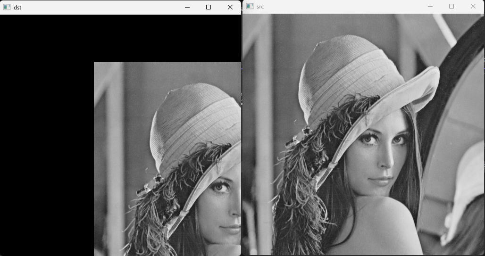
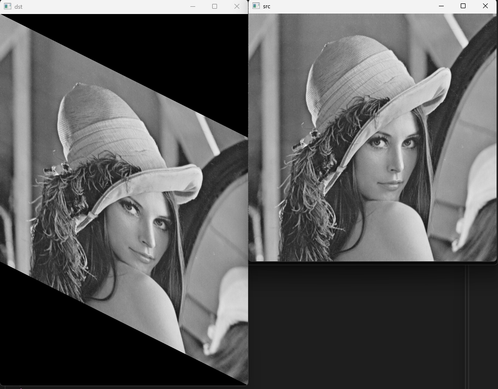
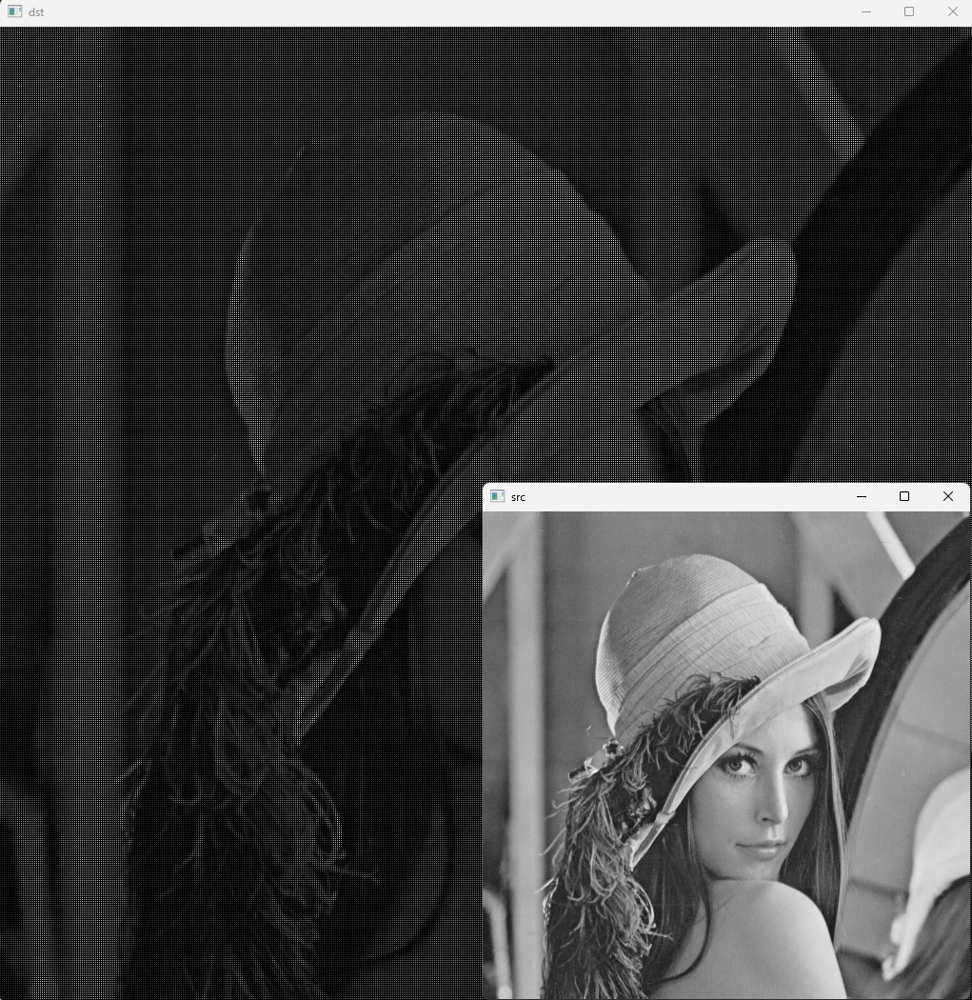

# 영상의 기하학적 변환
* 영상을 구성하는 픽셀의 배치 구조를 변경함으로써 전체 영상의 모양을 바꾸는 작업
* 전처리 작업, 영상 정합, 왜곡 제거 등

# 기하학적 변환의 종류
* translation
* Euclidean
* Similarity
* affine
* projective

# 이동 변환(translation transform)이란?
* 가로 또는 세로 방향으로 영상을 특정 크기만큼 이동시키는 변환
* x축과 y축 방향으로 이동 변위를 지정

# 그레이 스케일 영상을 (100, 100) 이동 변환

```cpp
#include <iostream>
#include "opencv2/opencv.hpp"

using namespace std;
using namespace cv;

int main()
{
	Mat src = imread("lenna.bmp", IMREAD_GRAYSCALE);

	if (src.empty()) {
		cerr << "Image laod failed!" << endl;
		return -1;
	}

	Mat dst = Mat::zeros(src.rows, src.cols, CV_8UC1);

	for (int y = 0; y < src.rows; y++) {
		for (int x = 0; x < src.cols; x++) {
			int x_ = x + 200;
			int y_ = y + 100;

			// 출력 영상의 범위를 벗어나는지 확인
			if (x_ < 0 || x_ >= dst.cols) continue;
			if (y_ < 0 || y_ >= dst.rows) continue;

			dst.at<uchar>(y_, x_) = src.at<uchar>(y, x);
		}
	}

	imshow("src", src);
	imshow("dst", dst);
	waitKey();
}

```

## 결과 화면

{: width="300" height="120"}
<br>

# 영상의 전단 변환(shear transformation)
* 직사각형 형태의 영상을 한쪽 방향으로 밀어서 평행사변형 모양으로 변형되는 변환. 층밀림 변환
* 가로 방향 또는 세로 방향으로 따로 정의됨


```cpp
#include <iostream>
#include "opencv2/opencv.hpp"

using namespace std;
using namespace cv;

int main()
{
	Mat src = imread("lenna.bmp", IMREAD_GRAYSCALE);

	if (src.empty()) {
		cerr << "Image load failed!" << endl;
		return -1;
	}

	Mat dst(src.rows * 3 / 2, src.cols, src.type(), Scalar(0));

	double m = 0.5;
	for (int y = 0; y < src.rows; y++) {
		for (int x = 0; x < src.cols; x++) {
			int nx = x;
			int ny = int(y + m*x);
			dst.at<uchar>(ny, nx) = src.at<uchar>(y, x);
		}
	}
	imshow("src", src);
	imshow("dst", dst);

	waitKey();
}
```

## 결과 화면

{: width="300" height="120"}
<br>

# 크기 변환(scale transform)
* 영상의 크기를 원본 영상보다 크게 또는 작게 만드는 변환
* x축과 y축 방향으로의 스케일 비율(scale factor)를 지정

```cpp
#include <iostream>
#include "opencv2/opencv.hpp"

using namespace std;
using namespace cv;

void resize1();
void resize2();
void resize3();
void resize4();

int main()
{
	resize1();
//	resize2();
//	resize3();
//	resize4();
}

void resize1()
{
	Mat src = imread("lenna.bmp", IMREAD_GRAYSCALE);

	if (src.empty()) {
		cerr << "Image load failed!" << endl;
		return;
	}

	Mat dst = Mat::zeros(src.rows * 2, src.cols * 2, CV_8UC1);

	for (int y = 0; y < src.rows; y++) {
		for (int x = 0; x < src.cols; x++) {
			int x_ = x * 2;
			int y_ = y * 2;

			dst.at<uchar>(y_, x_) = src.at<uchar>(y, x);
		}
	}

	imshow("src", src);
	imshow("dst", dst);
	waitKey();
}

void resize2()
{
	Mat src = imread("camera.bmp", IMREAD_GRAYSCALE);

	if (src.empty()) {
		cerr << "Image load failed!" << endl;
		return;
	}

	Mat dst = Mat::zeros(src.rows * 2, src.cols * 2, src.type());

	for (int y_ = 0; y_ < dst.rows; y_++) {
		for (int x_ = 0; x_ < dst.cols; x_++) {
			int x = x_ / 2;
			int y = y_ / 2;
			dst.at<uchar>(y_, x_) = src.at<uchar>(y, x);
		}
	}

	imshow("src", src);
	imshow("dst", dst);
	waitKey();
}

void resizeBilinear(const Mat& src, Mat& dst, Size size)
{
	dst.create(size.height, size.width, CV_8U);

	int x1, y1, x2, y2;	double rx, ry, p, q, value;
	double sx = static_cast<double>(src.cols - 1) / (dst.cols - 1);
	double sy = static_cast<double>(src.rows - 1) / (dst.rows - 1);

	for (int y = 0; y < dst.rows; y++) {
		for (int x = 0; x < dst.cols; x++) {
			rx = sx * x;			ry = sy * y;
			x1 = cvFloor(rx);		y1 = cvFloor(ry);
			x2 = x1 + 1; if (x2 == src.cols) x2 = src.cols - 1;
			y2 = y1 + 1; if (y2 == src.rows) y2 = src.rows - 1;
			p = rx - x1;			q = ry - y1;

			value = (1. - p) * (1. - q) * src.at<uchar>(y1, x1)
				+ p * (1. - q) * src.at<uchar>(y1, x2)
				+ (1. - p) * q * src.at<uchar>(y2, x1)
				+ p * q * src.at<uchar>(y2, x2);

			dst.at<uchar>(y, x) = static_cast<uchar>(value + .5);
		}
	}
}

void resize3()
{
	Mat src = imread("camera.bmp", IMREAD_GRAYSCALE);

	if (src.empty()) {
		cerr << "Image load failed!" << endl;
		return;
	}

	Mat dst;
	resizeBilinear(src, dst, Size(600, 300));

	imshow("src", src);
	imshow("dst", dst);
	waitKey();
}

void resize4()
{
	Mat src = imread("rose.bmp");

	if (src.empty()) {
		cerr << "Image load failed!" << endl;
		return;
	}

	Mat dst1, dst2, dst3, dst4;
	resize(src, dst1, Size(), 4, 4, INTER_NEAREST);
	resize(src, dst2, Size(1920, 1280));
	resize(src, dst3, Size(1920, 1280), 0, 0, INTER_CUBIC);
	resize(src, dst4, Size(1920, 1280), 0, 0, INTER_LANCZOS4);

	imshow("src", src);
	imshow("dst1", dst1(Rect(400, 500, 400, 400)));
	imshow("dst2", dst2(Rect(400, 500, 400, 400)));
	imshow("dst3", dst3(Rect(400, 500, 400, 400)));
	imshow("dst4", dst4(Rect(400, 500, 400, 400)));
	waitKey();
}
```

## 결과 화면

{: width="300" height="120"}
<br>

# 역방향 매핑(backword mapping)
* 출력 영상의 크기를 기준으로 원본 영상의 픽셀값에 접근하도록 코딩
* 화질이 좋지 않은 형태로 보여짐
* 위 예제코드의 resize2 참조

# 보간법(interpolation)
* 역방향 매핑에 의한 크기 변환 시, 참조해야 할 입력 영상의 (x, y)좌표가 실수 좌표라면?
    * (x, y)와 가장 가까운 정수 좌표의 픽셀 값을 참조하거나,
    * 또는 (x, y)근방의 정수 좌표 픽셀 값을 이용하여 실수 좌표 위치의 픽셀 값을 추정
* 보간법이란 실수 좌표 상에서의 픽셀 값을 결정하기 위해 주변 픽셀 값을 이용하여 값을 추정하는 방법

## 주요 보간법
* 최근방 이웃 보간법
* 양선형 보간법
* 3차 보간법
* 스플라인 보간법
* 란쵸스 보간법

