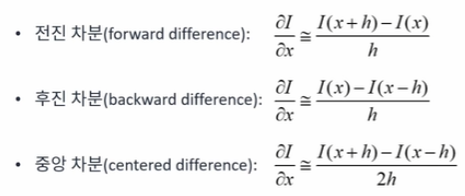
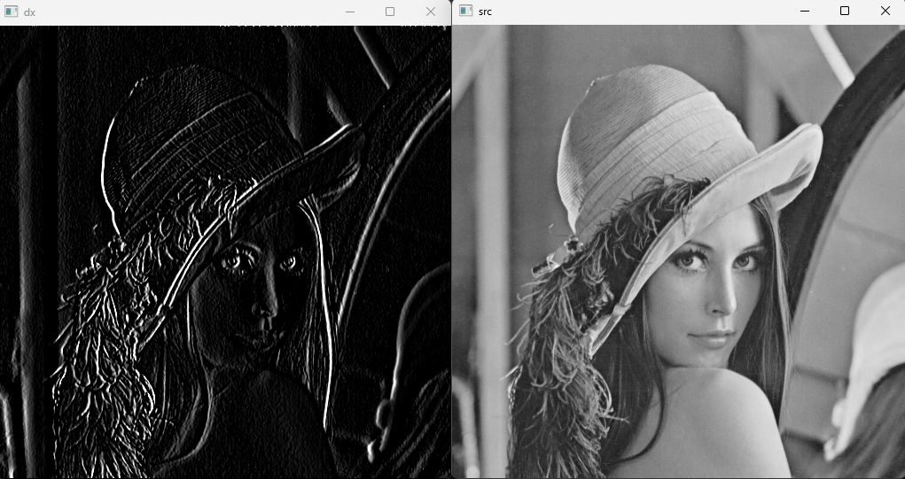
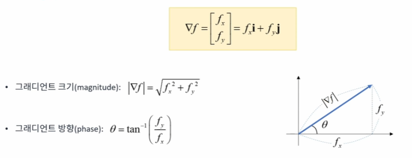
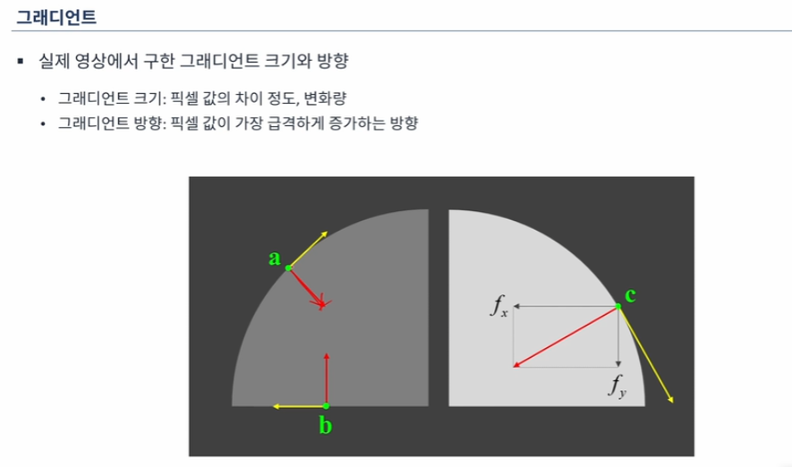
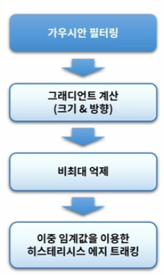

# 엣지(edge)
* 영상에서 픽셀의 밝기 값이 급격하게 변하는 부분
* 일반적으로 객체와 배경, 또는 객체와 객체의 경계
* 엣지 검출은 객체 분할 및 인식을 위한 기본적인 과정
* 기본적인 엣지 검출 방법
    * 영상을 (x, y)변수의 함수로 간주했을 떄, 이 함수의 1차 미분 값이 크게 나타나는 부분을 검출
* 가우시안 블러와 엣지 검출
    * 입력 영상에 가우시안 블러를 적용하여 잡음을 제거한 후 엣지를 검출하는 것이 바람직함
* 1차 미분과 근사화(approximation)<br>
    {: width="300" height="120"}
<br>

* 중앙 차분이 적절한 기울기를 나타냄

# Sobel filter를 사용한 엣지 검출 코드
```cpp
#include <iostream>
#include "opencv2/opencv.hpp"

using namespace std;
using namespace cv;

int main()
{
    Mat src = imread("lenna.bmp", IMREAD_GRAYSCALE);


    if (src.empty()){
        cerr << "Image load failed" << endl;
        return -1;
    }

    Mat dx = Mat::zeros(src.rows, src.cols, CV_8UC1);
    for (int y = 0; y < src.rows - 1; y++){
        for (int x = 0; x < src.cols - 1; x++){
            int v1 = src.at<uchar>(y - 1, x + 1)
            + src.at<uchar>(y, x + 1) * 2
            + src.at<uchar>(y + 1, x + 1)
            - src.at<uchar>(y - 1, x - 1)
            - src.at<uchar>(y, x - 1) * 2
            - src.at<uchar>(y + 1, x - 1);
            dx.at<uchar>(y, x) = saturate_cast<uchar>(v1);
        }
    }

    imshow("src", src);
    imshow("dx", dx);
    waitKey();
}
```

## 결과 화면

{: width="300" height="120"}
<br>

# 영상의 그래디언트
* 함수 (x, y)를 x축과 y축으로 각각 편미분하여 벡터 형태로 표현한 것


<br>


<br>

# Sobel 연산자를 이용한 영상의 미분 함수
```cpp
void Sobel(InputArray src, OutputArray dst, int ddepth, int dx, int dy, int ksize = 3, double scale = 1, double delta = 0, int borderType = BORDER_DEFAULT);
```

* ddepth: 출력 영상의 깊이
* dx, dy = x 방향과 y 방향으로의 미분 차수
* ksize: 커널 크기
* scale: 연산 결과에 추가적으로 곱할 값
* delta: 연산 결과에 추가적으로 더할 값
* borderType: 가장자리 픽셀 확장 방식

# 소벨 필터를 이용한 엣지 검출의 장단점
* 장점: 비교적 간단한 필터링 연산과 임계값 연산으로 엣지 위치를 검출할 수 있음
* 단점: 그래디언트 크기만을 사용하기 때문에 엣지 위치가 여러 개의 픽셀로 표현될 수 있음

# J.Canny가 제안한 좋은 엣지 검출기의 조건
* 정확한 검출: 엣지가 아닌 점을 엣지로 찾거나 또는 엣지를 검출하지 못하는 확률을 최소화
* 정확한 위치: 실제 엣지의 중심을 검출
* 단일 엣지: 하나의 엣지는 하나의 점으로 표현

# Canny엣지 검출 단계


<br>

## Canny 엣지 검출 함수

```cpp
void Canny(InputArray image, OutputArray edges, double threshold1, double threshold2, int apertureSize = 3, bool L2gradient = false);
```

* threshold1: 상단 임계값
* threshold2: 하단 임계값
* apertureSize: 소벨 연산을 위한 커널 크기
* L2gradient: L2 정규화 사용 여부