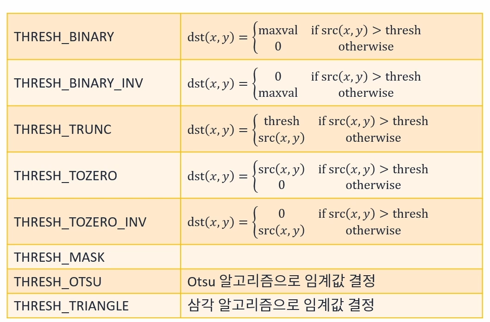
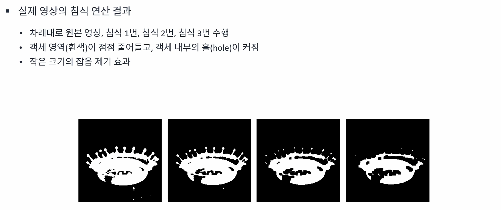
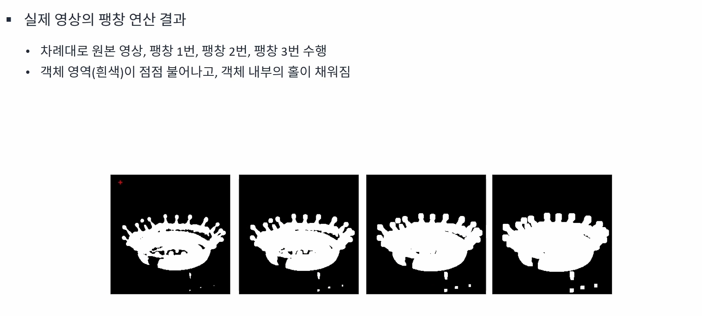
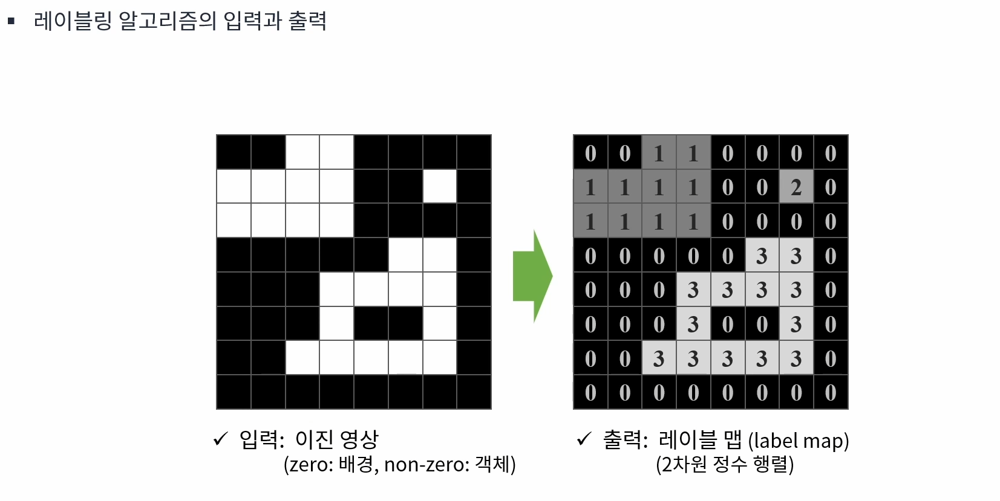
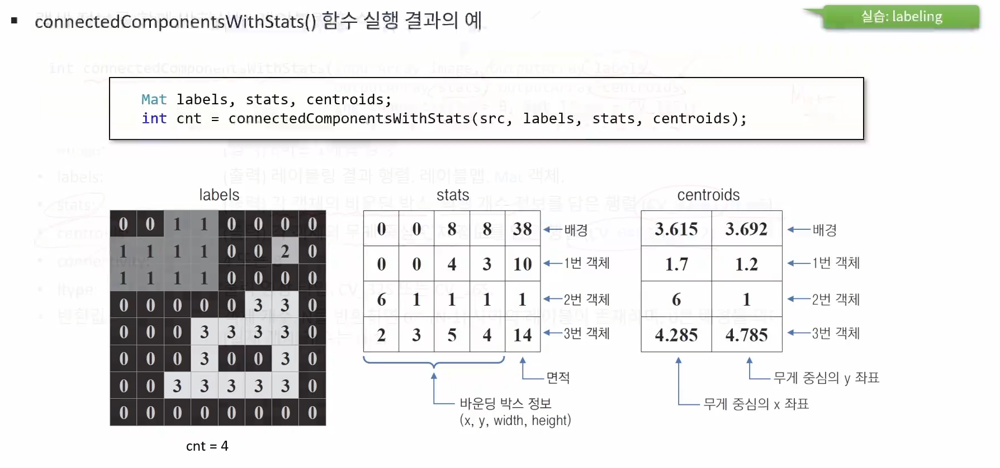
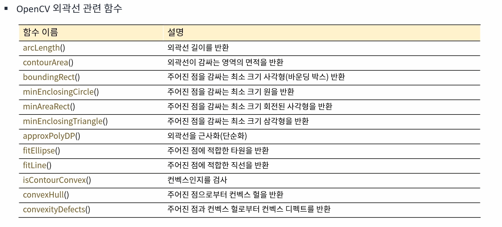

영상의 이진화란 영상의 픽셀 값을 0 또는 255로 나타내는 연산을 뜻한다.

## 임계값 연산 함수

```cpp
double threshold(InputArray src, OutputArray dst, double thresh, double maxval, int type);
```

* thresh: 사용자 지정 임계값
* maxVal: THRESH_BINARY 또는 THRESH_BINARY_INV 방법 시 최댓값
* type: 임계값에 의한 변환 함수 지정 또는 자동 임계값 설정 방법 지정
* 반환값: 사용된 임계값

## threshold() 함수의 type 지정 방법

{: width="800" height="600"}
<br>

# 임계값 자동 결정 방법

## Otsu 이진화 방법
* 입력 영상이 배경과 객체 두 개로 구성되어 있다고 가정
* 임의의 임계값 T에 의해 나눠지는 두 픽셀 분포 그룹의 분산이 최소가 되는 T를 선택
* 일종의 최적화 알고리즘(optimization algorithm)
* threshold() 함수의 type 인자에 THRESH_OTSU를 지정<br>


# 전역 이진화
* 영상 전체에 대해 동일한 임계값을 사용하여 이진화를 수행하는 기법
* Global binarization, global threshold

## 전역 이진화의 문제점
* 불균일한 조명 환경에 취약
* 균일하지 않은 조명의 영향을 해결하려면?
    * 불균일한 조명 성분을 보상한 후 이진화 수행

# 지역 이진화(local threshold, local binarization)
* 픽셀 또는 영역마다 다른 임계값을 사용하여 이진화를 수행하는 기법
* 보통 영상을 특정 크기 영역으로 분할하여 이진화를 수행하거나 또는 각 픽셀 근방에 윈도우를 설정하고 해당 윈도우에서 임계값을 결정하여 이진화를 수행

## OpenCV 적응형 이진화 함수

```cpp
void adaptiveThreshold(InputArray src, OutputArray dst, double maxValue, int adaptiveMethod, int thresholdType, int blockSize, double C);
```

* maxValue: 이진화에서 사용할 최댓값
* adaptiveMethod: 블록 평균 계산 방식 지정
    * ADAPTIVE_THRESH_MEAN_C: 산술 평균
    * ADAPTIVE_THRESH_GAUSSIAN_C: 가우시안 가중치 평균
* thresholdType: THRESH_BINARY or THRESH_BINARY_INV
* blockSize: 사용할 블록 크기. 3 이상의 홀수
* C: 블록 내 평균값 또는 가중 평균값에서 뺄 값

# 모폴로지
## 모폴로지 연산
* 영상을 형태학적인 측면에서 다루는 기법
* 다양한 영상 처리 시스템에서 전처리 또는 후처리 형태로 널리 사용
* 수학적 모폴로지

## 이진 영상의 침식(erosion) 연산
* 구조 요소가 객체 영역 내부에 완전히 포함될 경우 고정점 픽셀을 255로 설정
* 침식 연산은 객체 외곽을 깎아내는 연산
    * 객체의 크기는 줄어들고 배경은 확대됨


<br>

## 이진 영상의 팽창(dilation) 연산
* 구조 요소와 객체 영역이 한 픽셀이라도 만날 경우 고정점 필셀을 255로 설정
* 팽창 연산은 객체 외곽을 확대시키는 연산


<br>

## 모폴로지 침식 연산 함수

```cpp
void erode(InputArray src, OutputArray dst, InputArray kernel, Point anchor = Point(-1, -1), int iterations = 1, int borderType = BORDER_CONSTANT, const Scalar& borderValue = morphologyDefaultBorderValue());
```

* kernel: 구조 요소, Mat()을 지정하면 3*3 사각형 구성 요소를 사용
* anchor: 고정점 위치. Point(-1, -1)이면 중앙점을 사용
* iterations: 반복 횟수

## 구조 요소(커널) todtjd

```cpp
Mat getStructuringElement(int shape, Size ksize, Point anchor = Point(-1, -1));
```

* shape: 구조 요소 모양 지정 상수
    * MORPH_RECT: 사각형 모양
    * MORPH_CROSS: 십자가 모양
    * MORPH_ELLIPSE: 사각형에 내접하는 타원

* ksize: 구조 요소 크기
* anchor: MORPH_CROSS 모양의 구조 요소에서 중심 좌표. Point(-1, -1) -> 중앙
* 반환 값: 0과 1로 구성된 CV_8UC1 타입의 행렬

## 범용 모폴로지 연산 함수

```cpp
void morphologyEx(InputArray src, OutputArray dst, int op, InputArray kernel, Point anchor = Point(-1, -1), int iteratoins = 1, int borderType = BORDER_CONSTANT, const Scalar& borderValue = morphologyDefaultBorderValue());
```

* op: 모폴로지 연산 상수
    * MORPH_ERODE: 침식
    * MORPH_DILATE: 팽창
    * MORPH_OPEN: 열기
    * MORPH_CLOSE: 닫기
    * MORPH_GRADIENT: 모폴로지 그래디언트 = 팽창 - 침식
* kernel: 구조 요소
* anchor: 고정점
* iterations: 반복 횟수

# 레이블링

## 객체 단위 분석
* 객체 단위 분석
    * (흰색) 객체를 분할하여 특징을 분석
    * 객체 위치 및크기 정보, ROI 추출, 모양 분석 등
    * 레이블링 & 외곽선 검출
* 레이블링(connected component labeling)
    * 서로 연결되어 있는 객체 픽셀에 고유한 번호를 지정(레이블 맵)
    * 영역 기반 모양 분석
    * 레이블맵, 바운딩 박스, 픽셀 개수, 무게 중심 좌표를 반환
* 외곽선 검출(contour tracing)
    * 각 객체의 외곽선 좌표를 모두 검출
    * 외곽선 기반 모양 분석
    * 다양한 외곽선 처리 함수에서 활용 가능(근사화, 컨벡스헐 등)

## 레이블링이란?
* 동일 객체에 속한 모든 필셀에 고유한 번호를 매기는 작업
* 일반적으로는 이진 영상에서 수행
* OpenCV에는 3.X 버전부터 최신 논문 기반의 레이블링 함수를 제공
* Connected compoenet labeling

## 픽셀의 연결 관계
* 4-이웃 연결 관계(4-neighbor connectivity)
    * 상하좌우, 4개 픽셀만 연결된 것으로 취급
* 8-이웃 연결 관계(8-neighbor connectivity)
    * 상하좌우와 대각선 방향, 8개 픽셀이 모두 연결된 것으로 취급


<br>

## 레이블링 함수

```cpp
int connectedCompoenets(InputArray image, OutputArray labels, int connectivity = 8, int ltype = CV_32S);
```

* connectivity: 4 또는 8
* ltype: 출력 영상 타입
* 반환값: 객체 개수. N을 반환하면 0 ~ N-1 사이의 레이블이 존재하며 0은 배경을 의미

## 객체 정보를 함께 반환하는 레이블링 함수

```cpp
int connectedCompoenetssWithStats(InputArray image, OutputArray labels, OutputArray stats, OutputArray centroids, int connectivity = 8, int ltype = CV_32S);
```

* stats: 각 객체의 바운딩 박스, 픽셀 개수 정보를 담은 행렬(CV_32SC1, N * 5)
* centroids: 각 객체의 무게 중심 위치 정보를 담은 행렬(CV_64FC1, N * 2)


<br>

# 외곽선 검출(contour tracing, boundary tracking)
* 객체의 외곽선 좌표를 모두 추출하는 작업
* 바깥쪽 & 안쪽(홀) 외곽선
    * 외곽선의 계츨 구조도 표현 가능
* 외곽선 좌표를 표현하려면?
    * 외곽선 점 하나: Point P;
    * 객체 하나의 외곽선: vector<Point\> contour;
    * 여러 객채의 외곽선: vector<vector<Point\>> contours;

## 외곽선 검출 함수

```cpp
void findContours(InputOutputArray image, OutputArrayOfArrays contours, OutputArray hierarchy, int mode, int method, Point offset = Point());

void findContours(InputOutputArray image, OutputArrayOfArrays contours, int mode, int method, Point offset = Point());
```

* contours: 검출된 외곽선 정보. vector<vector<Point\>> 자료형
* hierarchy: 외곽선 계층 정보. vector<Vec4i\> 자료형. 네 개의 정수 값이 차례로 next, prev, child, parent외곽선 인덱스를 가리킴
* mode: 외곽선 검출 모드. RETR_EXTERNAL, RETR_LIST, RETR_CCOMP, RETR_TREE중 하나를 지정
* method: 외곽선 근사화 방법. CHAIN_APPROX_NONE 또는 CHAIN_APPROX_SIMPLE중 하나를 지정
    * CHAIN_APPROX_NONE: 근사화 없음
    * CHAIN_APPROX_SIMPLE: 수직선, 수평선, 대각선에 대해 끝점만 저장
* offset: 좌표 값 이동 옵셋

# OpenCV 다양한 외곽선 관련 함수

{: width="800" height="600"}
<br>

## 외곽선 길이 구하기

```cpp
double arcLength(InputArray curve, bool closed);
```

* curve: 외곽선 좌표
* closed: true이면 폐곡선으로 간주
* 반환값: 외곽선 길이

## 면적 구하기

```cpp
double contourArea(InputArray contour, bool oriented = false)
```

* contour: 외곽선 좌표
* oriented: true이면 외곽선 진행 방향에 따라 부호 있는 면적을 반환
* 반환값: 외곽선으로 구성된 영역의 면적

## 바운딩 박스 구하기

```cpp
Rect boundingRect(InputArray points);
```

* points: 외곽선 좌표
* 반환값: 외곽선을 외접하여 둘러싸는 가장 작은 직사각형

## 바운딩 서클 구하기

```cpp
void minEnclosingCircle(InputArray points, Point2f& center, float& radius);
```

* points: 외곽선 좌표
* center: 바운딩 서클 중심 좌표
* radius: 바운딩 서클 반지름

## 외곽선 근사화

```cpp
void approxPolyDP(InputArray curve, OutputArray approxCurve, double epsilon, bool closed);
```

* curve: 입력 곡선
* approxCurve: 더글라스-포이커 알고리즘으로 근사화된 외곽선
* epsilon: 근사화 정밀도 조절. 입력 곡선과 근사화 곡선 간의 최대 거리
* closed: true를 전달하면 폐곡선

## 컨벡스 검사

```cpp
bool isContourConvex(InputArray contour);
```

* contour: 입력 곡선 좌표
* 반환값: 컨벡스이면 true, 아니면 false