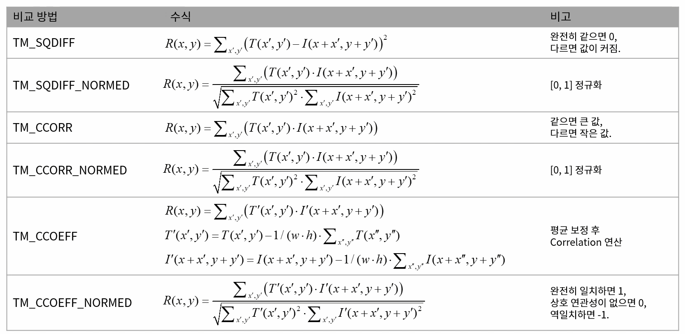

# 템플릿 매칭(template matching)
* 입력 영상에서 (작은 크기의) 부분 영상 위치를 찾는 기법
* 템플릿(template): 찾을 대상이 되는 작은 영상
* 회전, 확대, 축소 변환된 영상에 대해서는 취약

## 템플릿 매칭 수행 과정
* 템플릿 이미지를 원본 이미지에 Conv 연산처럼 움직이며 유사도/비유사도를 계산
* 최댓값/ 최솟값 선택 -> 중점 획득
* 템플릿 매칭

## 템플릿 매칭 함수

```cpp
void matchTemplate(InputArray image, InputArray templ, OutputArray result, int method, InputArray mask = noArray());
```

* templ: 템플릿 영상. image보다 같거나 작은 크기. 같은 타입
* result: 비교 결과를 저장할 행렬. 1채널 32비트 실수형
    * image의 크기가 W * H이고, templ의 크기가 w * h이면, result의 크기는 (W - w + 1) * (H - h + 1)
* method: 비교 방법
    * TM_SQDIFF / TM_SQDIFF_NORMED: sum of squared diffrence
    * TM_CCORR / TM_CCORR_NORMED: Correlation
    * TM_CCOEFF / TM_CCOEFF_NORMED: Correlation Coefficient
* mask: 마스크 영상

## 템플릿 매칭 비교 방법


<br>

# 여러개의 템플릿 매칭
* 각각의 영역에서 국지적 최대(local max)지점을 검출
