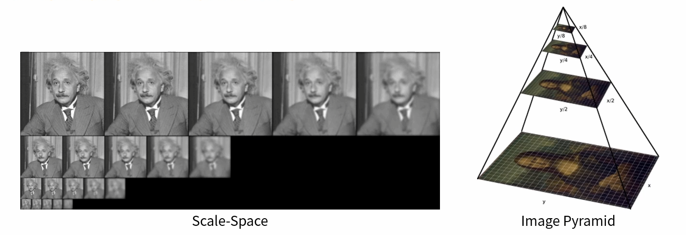
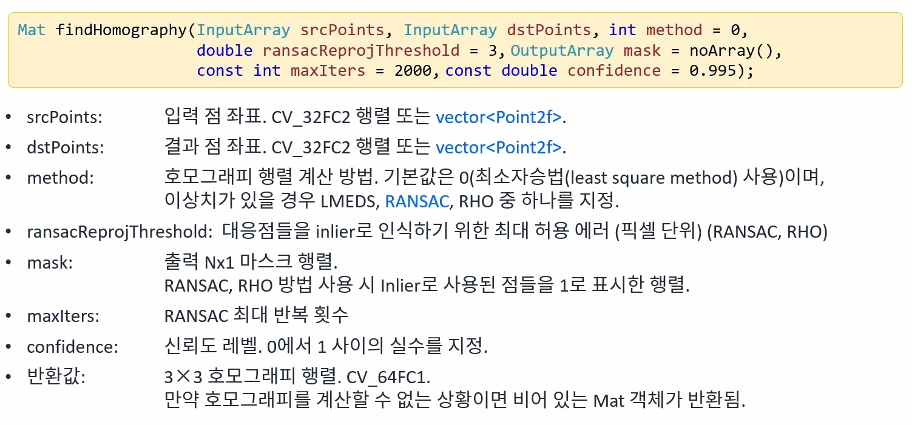

## 영상의 특징 중 코너의 특징
* 평탄한 영역, 엣지 영역에 비해 변별력이 높음
* 이동, 회전 변환에 강인
* 크기 변환에 취약

## 크기 불변 특징점
* 스케일 스페이스(scale-space) 또는 이미지 피라미드(image pyramid)를 구성하여 영상의 크기가 바뀌더라도 반복적으로 검출될 수 있는 특징점을 찾으면 매칭 등의 응용에서 사용할 수 있음
* 주요 크기 불변 특징점 알고리즘: SIFT, SURF, KAZE, AKAZE, ORB 등


<br>

# SIFT(Scale Invariant Feature Transform)
* https://en.wikipedia.org/wiki/Scale-invariant_feature_transform

## SIFT 계산 단계
1. Scale-space extrema detection
2. Keypoint localization
3. Orientation assignment
4. Keypoint description

## 특징점 표현을 위한 Keypoint 클래스

```cpp
class CV_EXPORTS_W_SIMPLE KeyPoint
{
public:
    //! the default constructor
    CV_WRAP KeyPoint();
    /**
    @param pt x & y coordinates of the keypoint
    @param size keypoint diameter
    @param angle keypoint orientation
    @param response keypoint detector response on the keypoint (that is, strength of the keypoint)
    @param octave pyramid octave in which the keypoint has been detected
    @param class_id object id
     */
    KeyPoint(Point2f pt, float size, float angle=-1, float response=0, int octave=0, int class_id=-1);
    /**
    @param x x-coordinate of the keypoint
    @param y y-coordinate of the keypoint
    @param size keypoint diameter
    @param angle keypoint orientation
    @param response keypoint detector response on the keypoint (that is, strength of the keypoint)
    @param octave pyramid octave in which the keypoint has been detected
    @param class_id object id
     */
    CV_WRAP KeyPoint(float x, float y, float size, float angle=-1, float response=0, int octave=0, int class_id=-1);

    size_t hash() const;

    /**
    This method converts vector of keypoints to vector of points or the reverse, where each keypoint is
    assigned the same size and the same orientation.

    @param keypoints Keypoints obtained from any feature detection algorithm like SIFT/SURF/ORB
    @param points2f Array of (x,y) coordinates of each keypoint
    @param keypointIndexes Array of indexes of keypoints to be converted to points. (Acts like a mask to
    convert only specified keypoints)
    */
    CV_WRAP static void convert(const std::vector<KeyPoint>& keypoints,
                                CV_OUT std::vector<Point2f>& points2f,
                                const std::vector<int>& keypointIndexes=std::vector<int>());
    /** @overload
    @param points2f Array of (x,y) coordinates of each keypoint
    @param keypoints Keypoints obtained from any feature detection algorithm like SIFT/SURF/ORB
    @param size keypoint diameter
    @param response keypoint detector response on the keypoint (that is, strength of the keypoint)
    @param octave pyramid octave in which the keypoint has been detected
    @param class_id object id
    */
    CV_WRAP static void convert(const std::vector<Point2f>& points2f,
                                CV_OUT std::vector<KeyPoint>& keypoints,
                                float size=1, float response=1, int octave=0, int class_id=-1);

    /**
    This method computes overlap for pair of keypoints. Overlap is the ratio between area of keypoint
    regions' intersection and area of keypoint regions' union (considering keypoint region as circle).
    If they don't overlap, we get zero. If they coincide at same location with same size, we get 1.
    @param kp1 First keypoint
    @param kp2 Second keypoint
    */
    CV_WRAP static float overlap(const KeyPoint& kp1, const KeyPoint& kp2);

    CV_PROP_RW Point2f pt; //!< coordinates of the keypoints
    CV_PROP_RW float size; //!< diameter of the meaningful keypoint neighborhood
    CV_PROP_RW float angle; //!< computed orientation of the keypoint (-1 if not applicable);
                            //!< it's in [0,360) degrees and measured relative to
                            //!< image coordinate system, ie in clockwise.
    CV_PROP_RW float response; //!< the response by which the most strong keypoints have been selected. Can be used for the further sorting or subsampling
    CV_PROP_RW int octave; //!< octave (pyramid layer) from which the keypoint has been extracted
    CV_PROP_RW int class_id; //!< object class (if the keypoints need to be clustered by an object they belong to)
};

```

## 특징점 클래스 객체 생성 함수

```cpp
static Ptr<SIFT> SIFT::create(...);
static Ptr<KAZE> KAZE::create(...);
static Ptr<AKAZE> AKAZE::create(...);
static Ptr<ORB> ORB::create(...);
```

* Feature2D 상속 클래스들은 모두 create()라는 이름의 정적 멤버 함수를 제공
* 각각의 create() 함수는 다수의 인자를 가지지만, 디폴트 인자가 정의되어 있음
* Ptr은 OpenCV에서 구현한 스마트 포인터 클래스

## 영상에서 특징점 검출 함수

```cpp
virtual void Feature2D::detect(InputArray image, std::vector<KeyPoint>& keypoints, InputArray mask = noArray());
```

## 검출된 특징점 그리기 함수

```cpp
void drawKeypoints(InputArray image, const std::vector<KeyPoint>& keypoints, InputOutputArray outImage, const Scalar& color = Scalar::all(-1), int flags = DrawMatchesFlags::DEFAULT);
```

* flags: 특징점 그리기 방법
    * DrawMatchesFlags::DEFAULT: 특징점 위치만을 표현하는 작은 크기 원
    * DrawMatchesFlags::DRAW_RICH_KEYPOINTS: 특징점 크기와 방향을 반영한 원

# 특징점 기술자 구하기
* 기술자(descriptor, feature vector)
    * 각각의 특징점 근방의 부분 영상을 표현하는 실수 또는 이진 벡터
    * OpenCV에서는 Mat 객체로 표현
        * 행 개수: 특징점 개수
        * 열 개수: 특징점 기술자 알고리즘에 의해 정의됨

## 실수 기술자
* 주로 특징점 부근 부분 영상의 방향 히스토그램 사용
* 보통 float 자료형을 사용하여 실수 정보를 저장하는 방식
* 실수 기술자를 사용하는 알고리즘: SIFT, SURF, KAZE 등
* 실수 기술자는 보통 L2 Norm을 사용하여 유사도를 판단

## 이진 기술자(binary descriptor)
* 이진 테스트를 이용하여 부분 영상의 특징을 기술
* 보통 uchar 자료형을 사용하여 비트 단위로 영상 특징 정보를 저장
* 이진 기술자를 사용하는 알고리즘 AKAZE, ORB, BRIEF 등
* 이진 기술자는 해밍거리를 사용하여 유사도를 판단

## 특징점에서 기술자(특징 벡터) 계산

```cpp
virtual void Feature2D::compute(InputArray image, std::vector<KeyPoint>& keypoints, OutputArrays descriptors);
```

```cpp
virtual void Feature2D::detectAndCompute(InputArray image, InputArray mask, std::vector<KeyPoint>& keypoints, OutputArray descriptors, bool useProvidedKeypoints = false);
```

# 특징점 매칭
* 두 영상에서 추출한 특징점 기술자를 비교하여 유사한 기술자끼리 선택하는 작업
* 특징 벡터 유사도 측정 방법
    * 실수 특징 벡터: L2 Norm
    * 이진 특징 벡터: 해밍 거리

## 특징점 매칭 함수

```cpp
void DescriptorMatcher::match(InputArray queryDescriptors, InputArray trainDescriptors, std::vector<DMatch>& matches, InputArray mask = noArray()) const
```

* queryDescriptors: 질의 기술자 집합
* trainDescriptors: 훈련 기술자 집합
* matches: 매칭 결과
* mask: 서로 매칭 가능한 질의 기술자와 훈련 기술자를 지정할 때 사용

# 호모그래피

## 호모그래피란?
* 두 평면 사이의 투시 변환(Perspective transform)
* 8DOF: 최소 4개의 대응점 좌표가 필요
* 기존 사용했던 getPerspectiveTransform(두 영상에서 대응되는 점의 개수가 4개일 때 사용)함수와 비슷
* 두 개의 영상에서 대응되는 점의 개수가 4개 이상일 때 사용

## 함수


<br>

## RANSAC이란?
* 이상치(outlier)가 많은 원본 데이터로부터 모델 파라미터를 예측하는 방법

