# 케스케이드 분류기: 얼굴 검출
## 비올라-존스(Viola-Jones) 얼굴 검출기(face detector)
* 2001년 CVPR 학회에서 발표된 객체 검출 알고리즘
* Positive 영상(얼굴 영상)과 negative 영상(얼굴이 아닌 영상)을 수천~수만장 모아서 학습시켜 빠르고 정확하게 얼굴 영역을 검출하는 방법을 제안
* 기존 얼굴 검출 방법보다 약 15배 빠르게 동작
* 기존 얼굴 검출 방법과의 차별점   
    * 유사 하르(Haar-like) 특징을 사용
    * AdaBoost에 기반한 강한 분류 성능
    * 캐스케이드(cascade) 방식을 통한 빠른 동작 속도

## 유사 하르 특징(Haar-like features)
* 사각형 형태의 필터 집합을 사용
* 흰색 사각형 영역 픽셀 값의 합에서 검정색 사각형 영역 픽셀 값을 뺀 결과 값을 추출
* 적분 영상(integral image)을 이용하여 빠르게 계산 가능

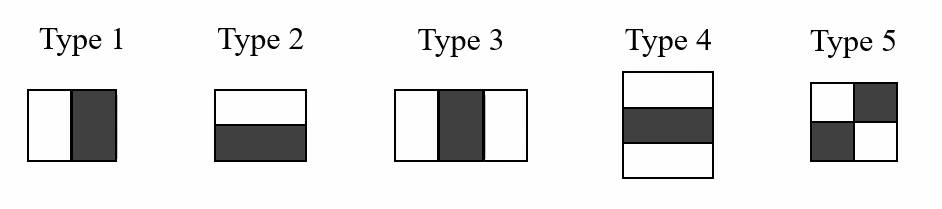
<br>

## AdaBoost 알고리즘을 이용하여 얼굴 판별에 유용한 유사 하르 특징을 선별
* 24*24 크기의 부분 영상에서 180,000개 이상의 특징 추출 가능
* AdaBoost 알고리즘을 이용하여 효과적인 유사 하르 특징 6000여개를 선별하여 사용

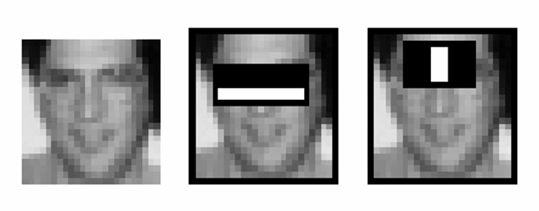
<br>

## 케스케이드 분류기(Cascade classifier)
* 일반적인 영상에는 얼굴이 한 두개 있을 뿐, 나머지 영역은 대부분 non-face 영역
* Non-face 영역을 빠르게 skip하도록 다단계 검사 수행

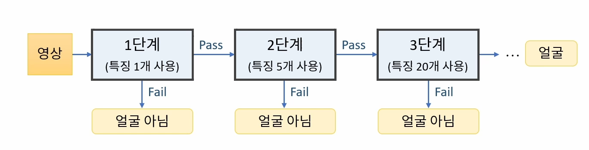
<br>

## 검출 과정 영상

* https://www.youtube.com/watch?v=hPCTwxF0qf4

## CascadeClassifier 멀티 스케일 객체 검출 멤버 함수

```cpp
void CascadeClassifier::detectMultiScale(InputArray image, std::vector<Rect>& objects, double scaleFacor = 1.1, int minNeighbors = 3, int flags = 0, Size minSize = Size(), Size maxSize = Size());
```

* object: 검출된 객체의 사각형 정보, vector<Rect> 자료형
* scaleFactor: 영상 축소 비율
* minNeighbors: 얼마나 많은 이웃 사각형이 검출되어야 최종 검출 영역으로 설정할지를 지정

# 머신러닝
## 머신 러닝 단계
* 훈련(Train): 훈련 데이터를 이용하여 모델을 학습하는 과정 
* 예측(Predict): 학습된 모델을 이용하여 새로운 데이터로부터 적절한 값을 예측하는 과정. 추론(Inference)

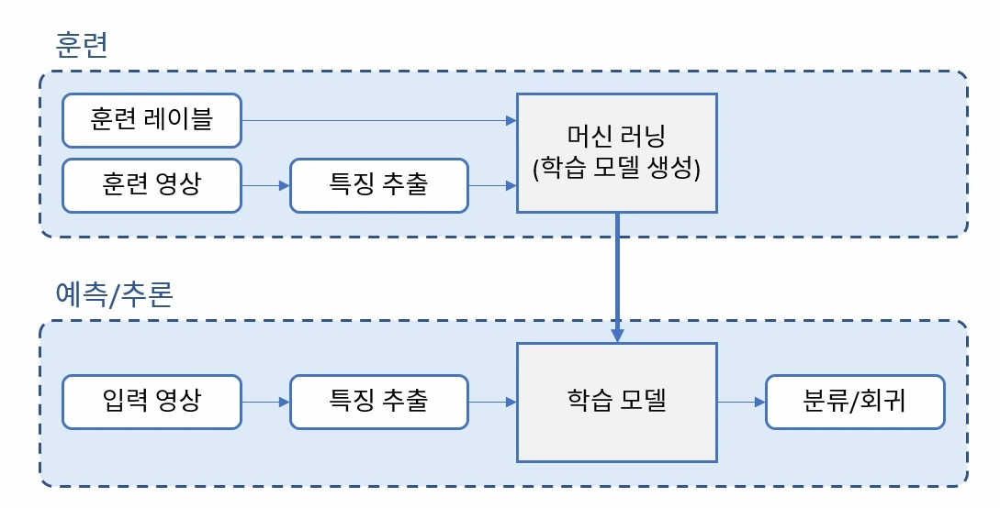
<br>

## 머신러닝 학습의 목적
* 미래의 새로운 데이터를 더 정확하게 예측하기 위함
    * 모델의 일반화 성능을 향상시키는 방향으로 학습해야 함.

## 훈련 데이터의 분할 방법

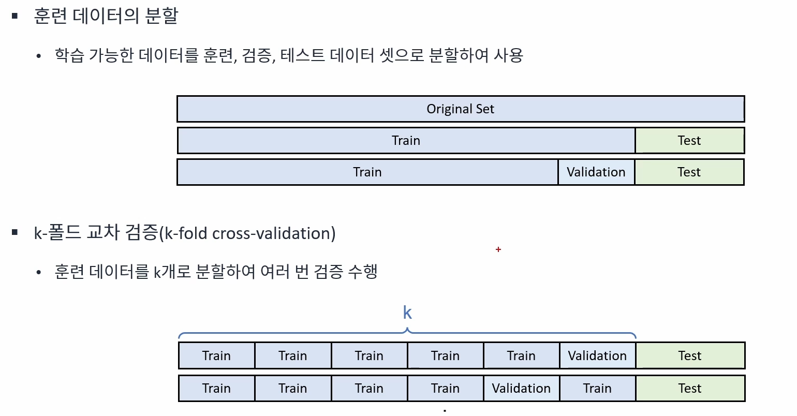
<br>

# SVM


<br>

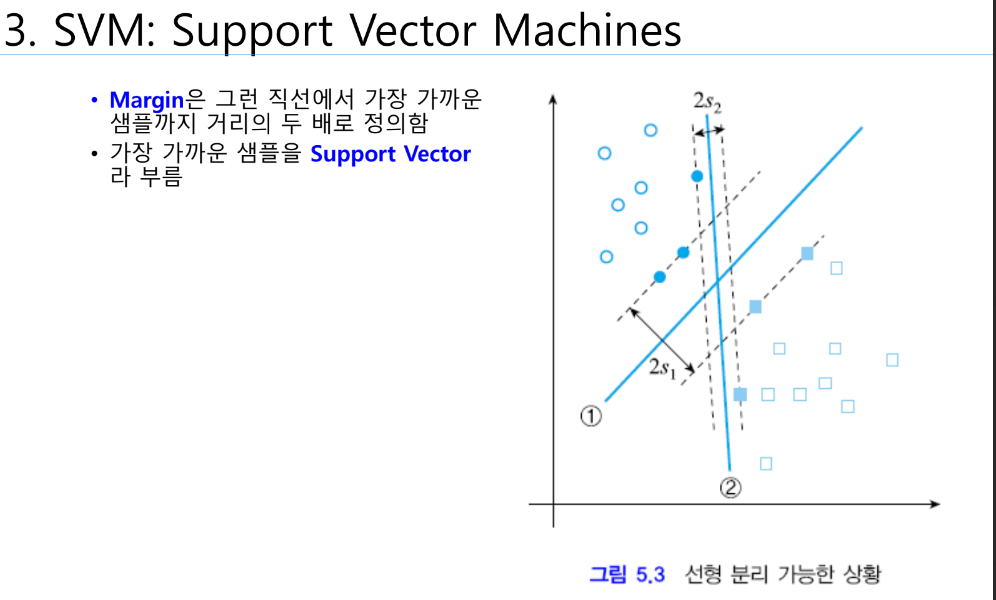
<br>

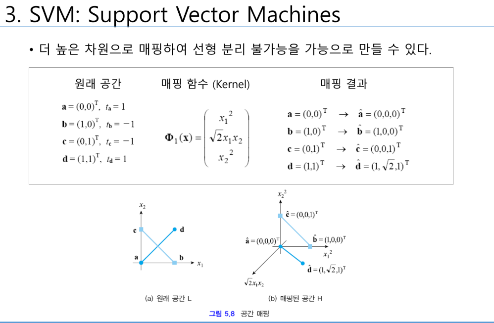
<br>

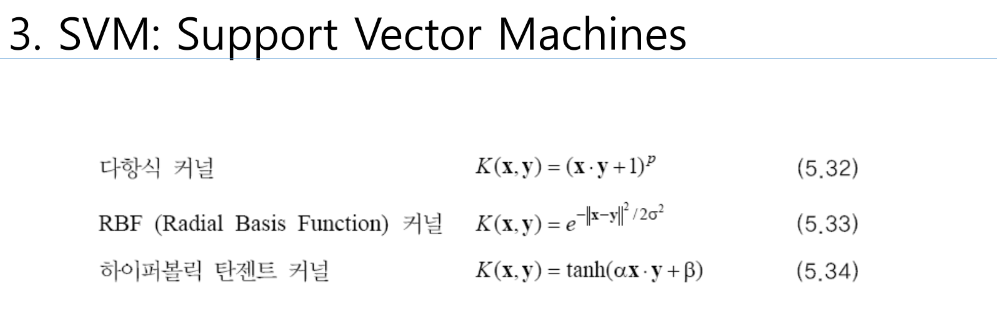
<br>

# HOG(Histogram of Oriented Gradients)
* 영상의 지역적 그래디언트 방향 정보를 특징 벡터로 사용
* 2005년 CVPR 학회에서 보행자 검출 방법으로 소개되어 널리 사용되기 시작함
* 이후 다양한 객체 인식에서 활용됨

# Deep Learning
## ML, DL의 차이점

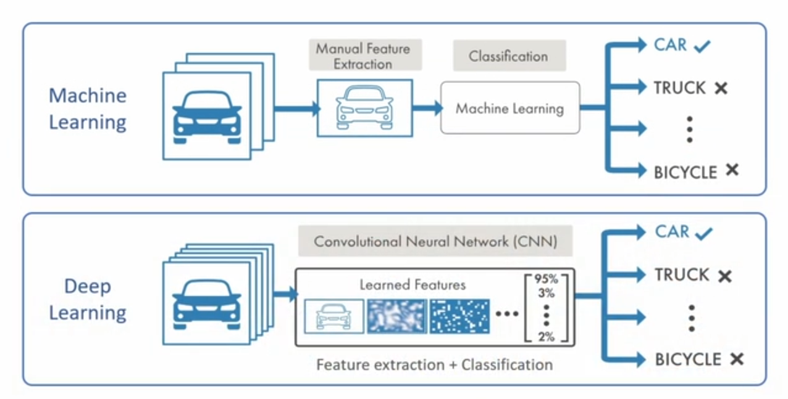
<br>

https://kr.mathworks.com/discovery/deep-learning.html

## 퍼셉트론(Perceptron)

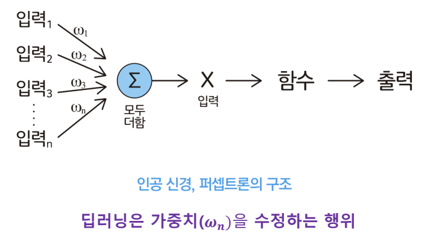
<br>

# CNN

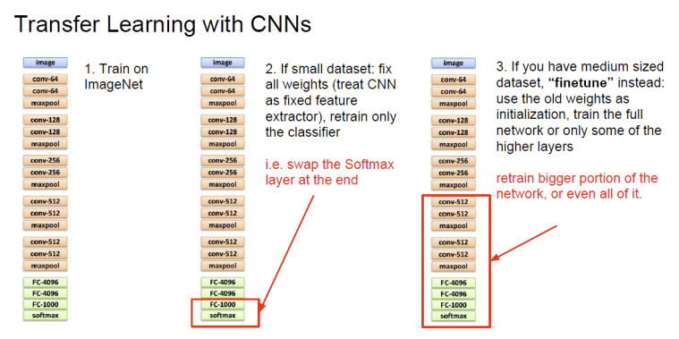
<br>

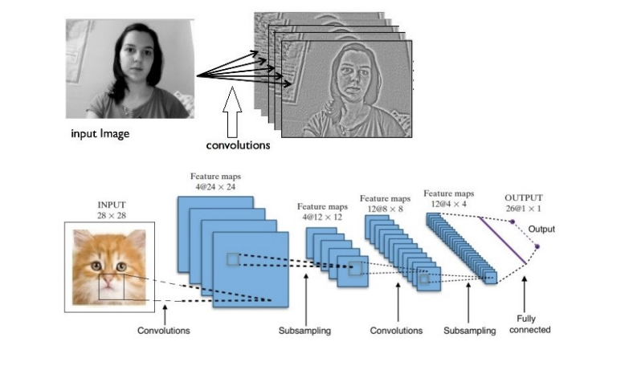
<br>

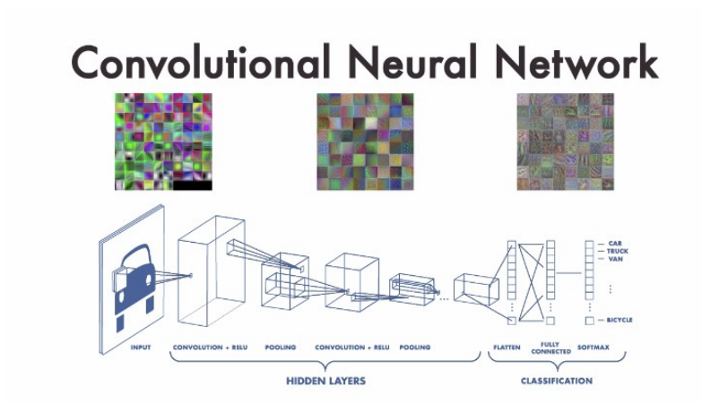
<br>

