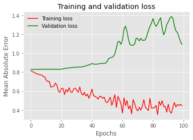

## keras 모듈의 LSTM Layer를 임포트하지 않는 모델 만들기

```python
from google.colab import drive
drive.mount('/content/drive')
```

    Mounted at /content/drive
    


```python
cd drive/My Drive/LSTM_DL
```

    /content/drive/My Drive/LSTM_DL
    


```python
!pip install common
!pip install --upgrade pandas
!pip install --upgrade --force-reinstall xlrd

import numpy as np
import pandas as pd
import seaborn as sns
import matplotlib.pyplot as plt
import warnings
warnings.filterwarnings("ignore")
plt.style.use('ggplot')
```

    Looking in indexes: https://pypi.org/simple, https://us-python.pkg.dev/colab-wheels/public/simple/
    Collecting common
      Downloading common-0.1.2.tar.gz (3.5 kB)
    Building wheels for collected packages: common
      Building wheel for common (setup.py) ... [?25l[?25hdone
      Created wheel for common: filename=common-0.1.2-py3-none-any.whl size=3732 sha256=9a7e108a597dc5f0682bca7ffc851c5ed1e7e7aa3ea73c865cb9f42d895fa415
      Stored in directory: /root/.cache/pip/wheels/11/88/ea/416ddc295a285f3661c88772a64b4a3766a92ce55f7b01dd9d
    Successfully built common
    Installing collected packages: common
    Successfully installed common-0.1.2
    Looking in indexes: https://pypi.org/simple, https://us-python.pkg.dev/colab-wheels/public/simple/
    Requirement already satisfied: pandas in /usr/local/lib/python3.7/dist-packages (1.3.5)
    Requirement already satisfied: pytz>=2017.3 in /usr/local/lib/python3.7/dist-packages (from pandas) (2022.6)
    Requirement already satisfied: numpy>=1.17.3 in /usr/local/lib/python3.7/dist-packages (from pandas) (1.21.6)
    Requirement already satisfied: python-dateutil>=2.7.3 in /usr/local/lib/python3.7/dist-packages (from pandas) (2.8.2)
    Requirement already satisfied: six>=1.5 in /usr/local/lib/python3.7/dist-packages (from python-dateutil>=2.7.3->pandas) (1.15.0)
    Looking in indexes: https://pypi.org/simple, https://us-python.pkg.dev/colab-wheels/public/simple/
    Collecting xlrd
      Downloading xlrd-2.0.1-py2.py3-none-any.whl (96 kB)
         |████████████████████████████████| 96 kB 3.8 MB/s 
    [?25hInstalling collected packages: xlrd
      Attempting uninstall: xlrd
        Found existing installation: xlrd 1.1.0
        Uninstalling xlrd-1.1.0:
          Successfully uninstalled xlrd-1.1.0
    Successfully installed xlrd-2.0.1
    


```python
# road data
data = pd.read_excel('data.xls')

data94 = data[(data['Part Number'] == 'Part 94')]
data95 = data[(data['Part Number'] == 'Part 95')]

# clear data
data94 = data94.loc[:, ['Part Number', 'D일 투입예정 수량(D일계획)', 'D+1일 투입예정 수량(Total)', 'D+2일 투입예정 수량(Total)',
                        'D+3일 투입예정 수량(Total)', 'D+4일 투입예정 수량(Total)', 'D+5일 투입예정 수량', 'D+6일 투입예정 수량',
                        'D+7일 투입예정 수량', 'D+8일 투입예정 수량', 'D+9일 투입예정 수량', 'D+10일 투입예정 수량', 'D+11일 투입예정 수량',
                        'D+12일 투입예정 수량','CRET_TIME']]
data95 = data95.loc[:, ['Part Number', 'D일 투입예정 수량(D일계획)', 'D+1일 투입예정 수량(Total)', 'D+2일 투입예정 수량(Total)',
                        'D+3일 투입예정 수량(Total)', 'D+4일 투입예정 수량(Total)', 'D+5일 투입예정 수량', 'D+6일 투입예정 수량',
                        'D+7일 투입예정 수량', 'D+8일 투입예정 수량', 'D+9일 투입예정 수량', 'D+10일 투입예정 수량', 'D+11일 투입예정 수량',
                        'D+12일 투입예정 수량','CRET_TIME']]
```


```python
data94['CRET_TIME'] = pd.to_datetime(data94['CRET_TIME'], format="%Y%m%d%H%M")
data95['CRET_TIME'] = pd.to_datetime(data95['CRET_TIME'], format="%Y%m%d%H%M")

data94 = data94.groupby(by=[data94['CRET_TIME'].dt.year,
data94['CRET_TIME'].dt.month,
data94['CRET_TIME'].dt.day]).last()
data94.reset_index(drop=True, inplace=True)

data95 = data95.groupby(by=[data95['CRET_TIME'].dt.year,
data95['CRET_TIME'].dt.month,
data95['CRET_TIME'].dt.day]).last()
data95.reset_index(drop=True, inplace=True)
```

Null Data Check


```python
data94.info()
```

    <class 'pandas.core.frame.DataFrame'>
    RangeIndex: 49 entries, 0 to 48
    Data columns (total 15 columns):
     #   Column               Non-Null Count  Dtype         
    ---  ------               --------------  -----         
     0   Part Number          49 non-null     object        
     1   D일 투입예정 수량(D일계획)     49 non-null     int64         
     2   D+1일 투입예정 수량(Total)  49 non-null     int64         
     3   D+2일 투입예정 수량(Total)  49 non-null     int64         
     4   D+3일 투입예정 수량(Total)  49 non-null     int64         
     5   D+4일 투입예정 수량(Total)  49 non-null     int64         
     6   D+5일 투입예정 수량         49 non-null     int64         
     7   D+6일 투입예정 수량         49 non-null     int64         
     8   D+7일 투입예정 수량         49 non-null     int64         
     9   D+8일 투입예정 수량         49 non-null     int64         
     10  D+9일 투입예정 수량         49 non-null     int64         
     11  D+10일 투입예정 수량        49 non-null     int64         
     12  D+11일 투입예정 수량        49 non-null     int64         
     13  D+12일 투입예정 수량        49 non-null     int64         
     14  CRET_TIME            49 non-null     datetime64[ns]
    dtypes: datetime64[ns](1), int64(13), object(1)
    memory usage: 5.9+ KB
    


```python
data95.info()
```

    <class 'pandas.core.frame.DataFrame'>
    RangeIndex: 49 entries, 0 to 48
    Data columns (total 15 columns):
     #   Column               Non-Null Count  Dtype         
    ---  ------               --------------  -----         
     0   Part Number          49 non-null     object        
     1   D일 투입예정 수량(D일계획)     49 non-null     int64         
     2   D+1일 투입예정 수량(Total)  49 non-null     int64         
     3   D+2일 투입예정 수량(Total)  49 non-null     int64         
     4   D+3일 투입예정 수량(Total)  49 non-null     int64         
     5   D+4일 투입예정 수량(Total)  49 non-null     int64         
     6   D+5일 투입예정 수량         49 non-null     int64         
     7   D+6일 투입예정 수량         49 non-null     int64         
     8   D+7일 투입예정 수량         49 non-null     int64         
     9   D+8일 투입예정 수량         49 non-null     int64         
     10  D+9일 투입예정 수량         49 non-null     int64         
     11  D+10일 투입예정 수량        49 non-null     int64         
     12  D+11일 투입예정 수량        49 non-null     int64         
     13  D+12일 투입예정 수량        49 non-null     int64         
     14  CRET_TIME            49 non-null     datetime64[ns]
    dtypes: datetime64[ns](1), int64(13), object(1)
    memory usage: 5.9+ KB
    


```python
data94.head()
```


  <div id="df-af6aacea-b42c-45b9-8c09-3d016b96a551">
    <div class="colab-df-container">
      <div>
<style scoped>
    .dataframe tbody tr th:only-of-type {
        vertical-align: middle;
    }

    .dataframe tbody tr th {
        vertical-align: top;
    }

    .dataframe thead th {
        text-align: right;
    }
</style>
<table border="1" class="dataframe">
  <thead>
    <tr style="text-align: right;">
      <th></th>
      <th>Part Number</th>
      <th>D일 투입예정 수량(D일계획)</th>
      <th>D+1일 투입예정 수량(Total)</th>
      <th>D+2일 투입예정 수량(Total)</th>
      <th>D+3일 투입예정 수량(Total)</th>
      <th>D+4일 투입예정 수량(Total)</th>
      <th>D+5일 투입예정 수량</th>
      <th>D+6일 투입예정 수량</th>
      <th>D+7일 투입예정 수량</th>
      <th>D+8일 투입예정 수량</th>
      <th>D+9일 투입예정 수량</th>
      <th>D+10일 투입예정 수량</th>
      <th>D+11일 투입예정 수량</th>
      <th>D+12일 투입예정 수량</th>
      <th>CRET_TIME</th>
    </tr>
  </thead>
  <tbody>
    <tr>
      <th>0</th>
      <td>Part 94</td>
      <td>42</td>
      <td>32</td>
      <td>30</td>
      <td>30</td>
      <td>30</td>
      <td>38</td>
      <td>0</td>
      <td>30</td>
      <td>30</td>
      <td>30</td>
      <td>30</td>
      <td>30</td>
      <td>0</td>
      <td>2021-09-13 18:30:00</td>
    </tr>
    <tr>
      <th>1</th>
      <td>Part 94</td>
      <td>40</td>
      <td>30</td>
      <td>30</td>
      <td>30</td>
      <td>50</td>
      <td>45</td>
      <td>30</td>
      <td>30</td>
      <td>30</td>
      <td>30</td>
      <td>30</td>
      <td>0</td>
      <td>0</td>
      <td>2021-09-14 17:30:00</td>
    </tr>
    <tr>
      <th>2</th>
      <td>Part 94</td>
      <td>40</td>
      <td>30</td>
      <td>30</td>
      <td>47</td>
      <td>43</td>
      <td>51</td>
      <td>0</td>
      <td>0</td>
      <td>0</td>
      <td>30</td>
      <td>30</td>
      <td>0</td>
      <td>30</td>
      <td>2021-09-15 16:33:00</td>
    </tr>
    <tr>
      <th>3</th>
      <td>Part 94</td>
      <td>47</td>
      <td>30</td>
      <td>0</td>
      <td>53</td>
      <td>42</td>
      <td>39</td>
      <td>0</td>
      <td>0</td>
      <td>30</td>
      <td>30</td>
      <td>0</td>
      <td>30</td>
      <td>30</td>
      <td>2021-09-16 17:06:00</td>
    </tr>
    <tr>
      <th>4</th>
      <td>Part 94</td>
      <td>46</td>
      <td>30</td>
      <td>30</td>
      <td>44</td>
      <td>37</td>
      <td>51</td>
      <td>0</td>
      <td>30</td>
      <td>30</td>
      <td>0</td>
      <td>30</td>
      <td>30</td>
      <td>30</td>
      <td>2021-09-17 06:32:00</td>
    </tr>
  </tbody>
</table>
</div>
      <button class="colab-df-convert" onclick="convertToInteractive('df-af6aacea-b42c-45b9-8c09-3d016b96a551')"
              title="Convert this dataframe to an interactive table."
              style="display:none;">

  <svg xmlns="http://www.w3.org/2000/svg" height="24px"viewBox="0 0 24 24"
       width="24px">
    <path d="M0 0h24v24H0V0z" fill="none"/>
    <path d="M18.56 5.44l.94 2.06.94-2.06 2.06-.94-2.06-.94-.94-2.06-.94 2.06-2.06.94zm-11 1L8.5 8.5l.94-2.06 2.06-.94-2.06-.94L8.5 2.5l-.94 2.06-2.06.94zm10 10l.94 2.06.94-2.06 2.06-.94-2.06-.94-.94-2.06-.94 2.06-2.06.94z"/><path d="M17.41 7.96l-1.37-1.37c-.4-.4-.92-.59-1.43-.59-.52 0-1.04.2-1.43.59L10.3 9.45l-7.72 7.72c-.78.78-.78 2.05 0 2.83L4 21.41c.39.39.9.59 1.41.59.51 0 1.02-.2 1.41-.59l7.78-7.78 2.81-2.81c.8-.78.8-2.07 0-2.86zM5.41 20L4 18.59l7.72-7.72 1.47 1.35L5.41 20z"/>
  </svg>
      </button>

  <style>
    .colab-df-container {
      display:flex;
      flex-wrap:wrap;
      gap: 12px;
    }

    .colab-df-convert {
      background-color: #E8F0FE;
      border: none;
      border-radius: 50%;
      cursor: pointer;
      display: none;
      fill: #1967D2;
      height: 32px;
      padding: 0 0 0 0;
      width: 32px;
    }

    .colab-df-convert:hover {
      background-color: #E2EBFA;
      box-shadow: 0px 1px 2px rgba(60, 64, 67, 0.3), 0px 1px 3px 1px rgba(60, 64, 67, 0.15);
      fill: #174EA6;
    }

    [theme=dark] .colab-df-convert {
      background-color: #3B4455;
      fill: #D2E3FC;
    }

    [theme=dark] .colab-df-convert:hover {
      background-color: #434B5C;
      box-shadow: 0px 1px 3px 1px rgba(0, 0, 0, 0.15);
      filter: drop-shadow(0px 1px 2px rgba(0, 0, 0, 0.3));
      fill: #FFFFFF;
    }
  </style>

      <script>
        const buttonEl =
          document.querySelector('#df-af6aacea-b42c-45b9-8c09-3d016b96a551 button.colab-df-convert');
        buttonEl.style.display =
          google.colab.kernel.accessAllowed ? 'block' : 'none';

        async function convertToInteractive(key) {
          const element = document.querySelector('#df-af6aacea-b42c-45b9-8c09-3d016b96a551');
          const dataTable =
            await google.colab.kernel.invokeFunction('convertToInteractive',
                                                     [key], {});
          if (!dataTable) return;

          const docLinkHtml = 'Like what you see? Visit the ' +
            '<a target="_blank" href=https://colab.research.google.com/notebooks/data_table.ipynb>data table notebook</a>'
            + ' to learn more about interactive tables.';
          element.innerHTML = '';
          dataTable['output_type'] = 'display_data';
          await google.colab.output.renderOutput(dataTable, element);
          const docLink = document.createElement('div');
          docLink.innerHTML = docLinkHtml;
          element.appendChild(docLink);
        }
      </script>
    </div>
  </div>


```python
data95.head()
```


  <div id="df-b63d5f56-5b22-4a52-bd43-36779314ca0b">
    <div class="colab-df-container">
      <div>
<style scoped>
    .dataframe tbody tr th:only-of-type {
        vertical-align: middle;
    }

    .dataframe tbody tr th {
        vertical-align: top;
    }

    .dataframe thead th {
        text-align: right;
    }
</style>
<table border="1" class="dataframe">
  <thead>
    <tr style="text-align: right;">
      <th></th>
      <th>Part Number</th>
      <th>D일 투입예정 수량(D일계획)</th>
      <th>D+1일 투입예정 수량(Total)</th>
      <th>D+2일 투입예정 수량(Total)</th>
      <th>D+3일 투입예정 수량(Total)</th>
      <th>D+4일 투입예정 수량(Total)</th>
      <th>D+5일 투입예정 수량</th>
      <th>D+6일 투입예정 수량</th>
      <th>D+7일 투입예정 수량</th>
      <th>D+8일 투입예정 수량</th>
      <th>D+9일 투입예정 수량</th>
      <th>D+10일 투입예정 수량</th>
      <th>D+11일 투입예정 수량</th>
      <th>D+12일 투입예정 수량</th>
      <th>CRET_TIME</th>
    </tr>
  </thead>
  <tbody>
    <tr>
      <th>0</th>
      <td>Part 95</td>
      <td>113</td>
      <td>0</td>
      <td>274</td>
      <td>274</td>
      <td>270</td>
      <td>251</td>
      <td>0</td>
      <td>218</td>
      <td>78</td>
      <td>35</td>
      <td>167</td>
      <td>277</td>
      <td>0</td>
      <td>2021-09-13 18:30:00</td>
    </tr>
    <tr>
      <th>1</th>
      <td>Part 95</td>
      <td>209</td>
      <td>296</td>
      <td>275</td>
      <td>276</td>
      <td>280</td>
      <td>193</td>
      <td>204</td>
      <td>109</td>
      <td>28</td>
      <td>158</td>
      <td>277</td>
      <td>0</td>
      <td>0</td>
      <td>2021-09-14 17:30:00</td>
    </tr>
    <tr>
      <th>2</th>
      <td>Part 95</td>
      <td>209</td>
      <td>267</td>
      <td>240</td>
      <td>267</td>
      <td>340</td>
      <td>331</td>
      <td>0</td>
      <td>0</td>
      <td>0</td>
      <td>277</td>
      <td>249</td>
      <td>0</td>
      <td>233</td>
      <td>2021-09-15 16:33:00</td>
    </tr>
    <tr>
      <th>3</th>
      <td>Part 95</td>
      <td>288</td>
      <td>244</td>
      <td>0</td>
      <td>282</td>
      <td>241</td>
      <td>267</td>
      <td>0</td>
      <td>0</td>
      <td>277</td>
      <td>242</td>
      <td>0</td>
      <td>242</td>
      <td>164</td>
      <td>2021-09-16 17:06:00</td>
    </tr>
    <tr>
      <th>4</th>
      <td>Part 95</td>
      <td>276</td>
      <td>277</td>
      <td>246</td>
      <td>320</td>
      <td>241</td>
      <td>354</td>
      <td>0</td>
      <td>250</td>
      <td>273</td>
      <td>0</td>
      <td>277</td>
      <td>277</td>
      <td>215</td>
      <td>2021-09-17 06:32:00</td>
    </tr>
  </tbody>
</table>
</div>
      <button class="colab-df-convert" onclick="convertToInteractive('df-b63d5f56-5b22-4a52-bd43-36779314ca0b')"
              title="Convert this dataframe to an interactive table."
              style="display:none;">

  <svg xmlns="http://www.w3.org/2000/svg" height="24px"viewBox="0 0 24 24"
       width="24px">
    <path d="M0 0h24v24H0V0z" fill="none"/>
    <path d="M18.56 5.44l.94 2.06.94-2.06 2.06-.94-2.06-.94-.94-2.06-.94 2.06-2.06.94zm-11 1L8.5 8.5l.94-2.06 2.06-.94-2.06-.94L8.5 2.5l-.94 2.06-2.06.94zm10 10l.94 2.06.94-2.06 2.06-.94-2.06-.94-.94-2.06-.94 2.06-2.06.94z"/><path d="M17.41 7.96l-1.37-1.37c-.4-.4-.92-.59-1.43-.59-.52 0-1.04.2-1.43.59L10.3 9.45l-7.72 7.72c-.78.78-.78 2.05 0 2.83L4 21.41c.39.39.9.59 1.41.59.51 0 1.02-.2 1.41-.59l7.78-7.78 2.81-2.81c.8-.78.8-2.07 0-2.86zM5.41 20L4 18.59l7.72-7.72 1.47 1.35L5.41 20z"/>
  </svg>
      </button>

  <style>
    .colab-df-container {
      display:flex;
      flex-wrap:wrap;
      gap: 12px;
    }

    .colab-df-convert {
      background-color: #E8F0FE;
      border: none;
      border-radius: 50%;
      cursor: pointer;
      display: none;
      fill: #1967D2;
      height: 32px;
      padding: 0 0 0 0;
      width: 32px;
    }

    .colab-df-convert:hover {
      background-color: #E2EBFA;
      box-shadow: 0px 1px 2px rgba(60, 64, 67, 0.3), 0px 1px 3px 1px rgba(60, 64, 67, 0.15);
      fill: #174EA6;
    }

    [theme=dark] .colab-df-convert {
      background-color: #3B4455;
      fill: #D2E3FC;
    }

    [theme=dark] .colab-df-convert:hover {
      background-color: #434B5C;
      box-shadow: 0px 1px 3px 1px rgba(0, 0, 0, 0.15);
      filter: drop-shadow(0px 1px 2px rgba(0, 0, 0, 0.3));
      fill: #FFFFFF;
    }
  </style>

      <script>
        const buttonEl =
          document.querySelector('#df-b63d5f56-5b22-4a52-bd43-36779314ca0b button.colab-df-convert');
        buttonEl.style.display =
          google.colab.kernel.accessAllowed ? 'block' : 'none';

        async function convertToInteractive(key) {
          const element = document.querySelector('#df-b63d5f56-5b22-4a52-bd43-36779314ca0b');
          const dataTable =
            await google.colab.kernel.invokeFunction('convertToInteractive',
                                                     [key], {});
          if (!dataTable) return;

          const docLinkHtml = 'Like what you see? Visit the ' +
            '<a target="_blank" href=https://colab.research.google.com/notebooks/data_table.ipynb>data table notebook</a>'
            + ' to learn more about interactive tables.';
          element.innerHTML = '';
          dataTable['output_type'] = 'display_data';
          await google.colab.output.renderOutput(dataTable, element);
          const docLink = document.createElement('div');
          docLink.innerHTML = docLinkHtml;
          element.appendChild(docLink);
        }
      </script>
    </div>
  </div>


# 변수별 상관관계 파악을 위한 데이터 재배열


```python
corr_data94 = pd.concat([
        data94.iloc[12:, :]['D일 투입예정 수량(D일계획)'].reset_index(drop=True),
        data94.iloc[11:-1, :]['D+1일 투입예정 수량(Total)'].reset_index(drop=True),
        data94.iloc[10:-2, :]['D+2일 투입예정 수량(Total)'].reset_index(drop=True),
        data94.iloc[9:-3, :]['D+3일 투입예정 수량(Total)'].reset_index(drop=True),
        data94.iloc[8:-4, :]['D+4일 투입예정 수량(Total)'].reset_index(drop=True),
        data94.iloc[7:-5, :]['D+5일 투입예정 수량'].reset_index(drop=True),
        data94.iloc[6:-6, :]['D+6일 투입예정 수량'].reset_index(drop=True),
        data94.iloc[5:-7, :]['D+7일 투입예정 수량'].reset_index(drop=True),
        data94.iloc[4:-8, :]['D+8일 투입예정 수량'].reset_index(drop=True),
        data94.iloc[3:-9, :]['D+9일 투입예정 수량'].reset_index(drop=True),
        data94.iloc[2:-10, :]['D+10일 투입예정 수량'].reset_index(drop=True),
        data94.iloc[1:-11, :]['D+11일 투입예정 수량'].reset_index(drop=True),
        data94.iloc[:-12, :]['D+12일 투입예정 수량'].reset_index(drop=True)
        ],
        axis=1)

corr_data95 = pd.concat([
        data95.iloc[12:, :]['D일 투입예정 수량(D일계획)'].reset_index(drop=True),
        data95.iloc[11:-1, :]['D+1일 투입예정 수량(Total)'].reset_index(drop=True),
        data95.iloc[10:-2, :]['D+2일 투입예정 수량(Total)'].reset_index(drop=True),
        data95.iloc[9:-3, :]['D+3일 투입예정 수량(Total)'].reset_index(drop=True),
        data95.iloc[8:-4, :]['D+4일 투입예정 수량(Total)'].reset_index(drop=True),
        data95.iloc[7:-5, :]['D+5일 투입예정 수량'].reset_index(drop=True),
        data95.iloc[6:-6, :]['D+6일 투입예정 수량'].reset_index(drop=True),
        data95.iloc[5:-7, :]['D+7일 투입예정 수량'].reset_index(drop=True),
        data95.iloc[4:-8, :]['D+8일 투입예정 수량'].reset_index(drop=True),
        data95.iloc[3:-9, :]['D+9일 투입예정 수량'].reset_index(drop=True),
        data95.iloc[2:-10, :]['D+10일 투입예정 수량'].reset_index(drop=True),
        data95.iloc[1:-11, :]['D+11일 투입예정 수량'].reset_index(drop=True),
        data95.iloc[:-12, :]['D+12일 투입예정 수량'].reset_index(drop=True)
        ],
        axis=1)
```

# corr_data 확인


```python
corr_data94.head()
```


  <div id="df-0765915f-fedb-4055-9ab9-37edd3653602">
    <div class="colab-df-container">
      <div>
<style scoped>
    .dataframe tbody tr th:only-of-type {
        vertical-align: middle;
    }

    .dataframe tbody tr th {
        vertical-align: top;
    }

    .dataframe thead th {
        text-align: right;
    }
</style>
<table border="1" class="dataframe">
  <thead>
    <tr style="text-align: right;">
      <th></th>
      <th>D일 투입예정 수량(D일계획)</th>
      <th>D+1일 투입예정 수량(Total)</th>
      <th>D+2일 투입예정 수량(Total)</th>
      <th>D+3일 투입예정 수량(Total)</th>
      <th>D+4일 투입예정 수량(Total)</th>
      <th>D+5일 투입예정 수량</th>
      <th>D+6일 투입예정 수량</th>
      <th>D+7일 투입예정 수량</th>
      <th>D+8일 투입예정 수량</th>
      <th>D+9일 투입예정 수량</th>
      <th>D+10일 투입예정 수량</th>
      <th>D+11일 투입예정 수량</th>
      <th>D+12일 투입예정 수량</th>
    </tr>
  </thead>
  <tbody>
    <tr>
      <th>0</th>
      <td>46</td>
      <td>30</td>
      <td>30</td>
      <td>53</td>
      <td>51</td>
      <td>45</td>
      <td>0</td>
      <td>30</td>
      <td>30</td>
      <td>30</td>
      <td>30</td>
      <td>0</td>
      <td>0</td>
    </tr>
    <tr>
      <th>1</th>
      <td>46</td>
      <td>30</td>
      <td>30</td>
      <td>33</td>
      <td>35</td>
      <td>37</td>
      <td>0</td>
      <td>30</td>
      <td>30</td>
      <td>0</td>
      <td>0</td>
      <td>0</td>
      <td>0</td>
    </tr>
    <tr>
      <th>2</th>
      <td>40</td>
      <td>30</td>
      <td>30</td>
      <td>38</td>
      <td>42</td>
      <td>35</td>
      <td>0</td>
      <td>30</td>
      <td>30</td>
      <td>0</td>
      <td>30</td>
      <td>30</td>
      <td>30</td>
    </tr>
    <tr>
      <th>3</th>
      <td>35</td>
      <td>30</td>
      <td>30</td>
      <td>40</td>
      <td>36</td>
      <td>25</td>
      <td>0</td>
      <td>30</td>
      <td>30</td>
      <td>0</td>
      <td>30</td>
      <td>30</td>
      <td>30</td>
    </tr>
    <tr>
      <th>4</th>
      <td>39</td>
      <td>30</td>
      <td>30</td>
      <td>38</td>
      <td>33</td>
      <td>33</td>
      <td>0</td>
      <td>30</td>
      <td>30</td>
      <td>0</td>
      <td>30</td>
      <td>30</td>
      <td>30</td>
    </tr>
  </tbody>
</table>
</div>
      <button class="colab-df-convert" onclick="convertToInteractive('df-0765915f-fedb-4055-9ab9-37edd3653602')"
              title="Convert this dataframe to an interactive table."
              style="display:none;">

  <svg xmlns="http://www.w3.org/2000/svg" height="24px"viewBox="0 0 24 24"
       width="24px">
    <path d="M0 0h24v24H0V0z" fill="none"/>
    <path d="M18.56 5.44l.94 2.06.94-2.06 2.06-.94-2.06-.94-.94-2.06-.94 2.06-2.06.94zm-11 1L8.5 8.5l.94-2.06 2.06-.94-2.06-.94L8.5 2.5l-.94 2.06-2.06.94zm10 10l.94 2.06.94-2.06 2.06-.94-2.06-.94-.94-2.06-.94 2.06-2.06.94z"/><path d="M17.41 7.96l-1.37-1.37c-.4-.4-.92-.59-1.43-.59-.52 0-1.04.2-1.43.59L10.3 9.45l-7.72 7.72c-.78.78-.78 2.05 0 2.83L4 21.41c.39.39.9.59 1.41.59.51 0 1.02-.2 1.41-.59l7.78-7.78 2.81-2.81c.8-.78.8-2.07 0-2.86zM5.41 20L4 18.59l7.72-7.72 1.47 1.35L5.41 20z"/>
  </svg>
      </button>

  <style>
    .colab-df-container {
      display:flex;
      flex-wrap:wrap;
      gap: 12px;
    }

    .colab-df-convert {
      background-color: #E8F0FE;
      border: none;
      border-radius: 50%;
      cursor: pointer;
      display: none;
      fill: #1967D2;
      height: 32px;
      padding: 0 0 0 0;
      width: 32px;
    }

    .colab-df-convert:hover {
      background-color: #E2EBFA;
      box-shadow: 0px 1px 2px rgba(60, 64, 67, 0.3), 0px 1px 3px 1px rgba(60, 64, 67, 0.15);
      fill: #174EA6;
    }

    [theme=dark] .colab-df-convert {
      background-color: #3B4455;
      fill: #D2E3FC;
    }

    [theme=dark] .colab-df-convert:hover {
      background-color: #434B5C;
      box-shadow: 0px 1px 3px 1px rgba(0, 0, 0, 0.15);
      filter: drop-shadow(0px 1px 2px rgba(0, 0, 0, 0.3));
      fill: #FFFFFF;
    }
  </style>

      <script>
        const buttonEl =
          document.querySelector('#df-0765915f-fedb-4055-9ab9-37edd3653602 button.colab-df-convert');
        buttonEl.style.display =
          google.colab.kernel.accessAllowed ? 'block' : 'none';

        async function convertToInteractive(key) {
          const element = document.querySelector('#df-0765915f-fedb-4055-9ab9-37edd3653602');
          const dataTable =
            await google.colab.kernel.invokeFunction('convertToInteractive',
                                                     [key], {});
          if (!dataTable) return;

          const docLinkHtml = 'Like what you see? Visit the ' +
            '<a target="_blank" href=https://colab.research.google.com/notebooks/data_table.ipynb>data table notebook</a>'
            + ' to learn more about interactive tables.';
          element.innerHTML = '';
          dataTable['output_type'] = 'display_data';
          await google.colab.output.renderOutput(dataTable, element);
          const docLink = document.createElement('div');
          docLink.innerHTML = docLinkHtml;
          element.appendChild(docLink);
        }
      </script>
    </div>
  </div>


```python
corr_data95.head()
```


  <div id="df-ded7cabe-b0ab-4b11-8d66-a7f3597c1089">
    <div class="colab-df-container">
      <div>
<style scoped>
    .dataframe tbody tr th:only-of-type {
        vertical-align: middle;
    }

    .dataframe tbody tr th {
        vertical-align: top;
    }

    .dataframe thead th {
        text-align: right;
    }
</style>
<table border="1" class="dataframe">
  <thead>
    <tr style="text-align: right;">
      <th></th>
      <th>D일 투입예정 수량(D일계획)</th>
      <th>D+1일 투입예정 수량(Total)</th>
      <th>D+2일 투입예정 수량(Total)</th>
      <th>D+3일 투입예정 수량(Total)</th>
      <th>D+4일 투입예정 수량(Total)</th>
      <th>D+5일 투입예정 수량</th>
      <th>D+6일 투입예정 수량</th>
      <th>D+7일 투입예정 수량</th>
      <th>D+8일 투입예정 수량</th>
      <th>D+9일 투입예정 수량</th>
      <th>D+10일 투입예정 수량</th>
      <th>D+11일 투입예정 수량</th>
      <th>D+12일 투입예정 수량</th>
    </tr>
  </thead>
  <tbody>
    <tr>
      <th>0</th>
      <td>276</td>
      <td>277</td>
      <td>246</td>
      <td>284</td>
      <td>182</td>
      <td>363</td>
      <td>0</td>
      <td>250</td>
      <td>273</td>
      <td>242</td>
      <td>249</td>
      <td>0</td>
      <td>0</td>
    </tr>
    <tr>
      <th>1</th>
      <td>276</td>
      <td>277</td>
      <td>246</td>
      <td>281</td>
      <td>345</td>
      <td>314</td>
      <td>0</td>
      <td>250</td>
      <td>273</td>
      <td>0</td>
      <td>0</td>
      <td>0</td>
      <td>0</td>
    </tr>
    <tr>
      <th>2</th>
      <td>262</td>
      <td>277</td>
      <td>246</td>
      <td>293</td>
      <td>262</td>
      <td>254</td>
      <td>0</td>
      <td>250</td>
      <td>273</td>
      <td>0</td>
      <td>277</td>
      <td>242</td>
      <td>233</td>
    </tr>
    <tr>
      <th>3</th>
      <td>305</td>
      <td>276</td>
      <td>246</td>
      <td>356</td>
      <td>372</td>
      <td>257</td>
      <td>0</td>
      <td>250</td>
      <td>273</td>
      <td>0</td>
      <td>277</td>
      <td>277</td>
      <td>164</td>
    </tr>
    <tr>
      <th>4</th>
      <td>309</td>
      <td>277</td>
      <td>277</td>
      <td>359</td>
      <td>359</td>
      <td>210</td>
      <td>0</td>
      <td>250</td>
      <td>273</td>
      <td>0</td>
      <td>277</td>
      <td>277</td>
      <td>215</td>
    </tr>
  </tbody>
</table>
</div>
      <button class="colab-df-convert" onclick="convertToInteractive('df-ded7cabe-b0ab-4b11-8d66-a7f3597c1089')"
              title="Convert this dataframe to an interactive table."
              style="display:none;">

  <svg xmlns="http://www.w3.org/2000/svg" height="24px"viewBox="0 0 24 24"
       width="24px">
    <path d="M0 0h24v24H0V0z" fill="none"/>
    <path d="M18.56 5.44l.94 2.06.94-2.06 2.06-.94-2.06-.94-.94-2.06-.94 2.06-2.06.94zm-11 1L8.5 8.5l.94-2.06 2.06-.94-2.06-.94L8.5 2.5l-.94 2.06-2.06.94zm10 10l.94 2.06.94-2.06 2.06-.94-2.06-.94-.94-2.06-.94 2.06-2.06.94z"/><path d="M17.41 7.96l-1.37-1.37c-.4-.4-.92-.59-1.43-.59-.52 0-1.04.2-1.43.59L10.3 9.45l-7.72 7.72c-.78.78-.78 2.05 0 2.83L4 21.41c.39.39.9.59 1.41.59.51 0 1.02-.2 1.41-.59l7.78-7.78 2.81-2.81c.8-.78.8-2.07 0-2.86zM5.41 20L4 18.59l7.72-7.72 1.47 1.35L5.41 20z"/>
  </svg>
      </button>

  <style>
    .colab-df-container {
      display:flex;
      flex-wrap:wrap;
      gap: 12px;
    }

    .colab-df-convert {
      background-color: #E8F0FE;
      border: none;
      border-radius: 50%;
      cursor: pointer;
      display: none;
      fill: #1967D2;
      height: 32px;
      padding: 0 0 0 0;
      width: 32px;
    }

    .colab-df-convert:hover {
      background-color: #E2EBFA;
      box-shadow: 0px 1px 2px rgba(60, 64, 67, 0.3), 0px 1px 3px 1px rgba(60, 64, 67, 0.15);
      fill: #174EA6;
    }

    [theme=dark] .colab-df-convert {
      background-color: #3B4455;
      fill: #D2E3FC;
    }

    [theme=dark] .colab-df-convert:hover {
      background-color: #434B5C;
      box-shadow: 0px 1px 3px 1px rgba(0, 0, 0, 0.15);
      filter: drop-shadow(0px 1px 2px rgba(0, 0, 0, 0.3));
      fill: #FFFFFF;
    }
  </style>

      <script>
        const buttonEl =
          document.querySelector('#df-ded7cabe-b0ab-4b11-8d66-a7f3597c1089 button.colab-df-convert');
        buttonEl.style.display =
          google.colab.kernel.accessAllowed ? 'block' : 'none';

        async function convertToInteractive(key) {
          const element = document.querySelector('#df-ded7cabe-b0ab-4b11-8d66-a7f3597c1089');
          const dataTable =
            await google.colab.kernel.invokeFunction('convertToInteractive',
                                                     [key], {});
          if (!dataTable) return;

          const docLinkHtml = 'Like what you see? Visit the ' +
            '<a target="_blank" href=https://colab.research.google.com/notebooks/data_table.ipynb>data table notebook</a>'
            + ' to learn more about interactive tables.';
          element.innerHTML = '';
          dataTable['output_type'] = 'display_data';
          await google.colab.output.renderOutput(dataTable, element);
          const docLink = document.createElement('div');
          docLink.innerHTML = docLinkHtml;
          element.appendChild(docLink);
        }
      </script>
    </div>
  </div>


# corr() 메서드를 활용한 표준 상관계수 계산


```python
corr_data94.corr()
```


  <div id="df-411313c7-2b7b-4b25-9e29-06580afacda3">
    <div class="colab-df-container">
      <div>
<style scoped>
    .dataframe tbody tr th:only-of-type {
        vertical-align: middle;
    }

    .dataframe tbody tr th {
        vertical-align: top;
    }

    .dataframe thead th {
        text-align: right;
    }
</style>
<table border="1" class="dataframe">
  <thead>
    <tr style="text-align: right;">
      <th></th>
      <th>D일 투입예정 수량(D일계획)</th>
      <th>D+1일 투입예정 수량(Total)</th>
      <th>D+2일 투입예정 수량(Total)</th>
      <th>D+3일 투입예정 수량(Total)</th>
      <th>D+4일 투입예정 수량(Total)</th>
      <th>D+5일 투입예정 수량</th>
      <th>D+6일 투입예정 수량</th>
      <th>D+7일 투입예정 수량</th>
      <th>D+8일 투입예정 수량</th>
      <th>D+9일 투입예정 수량</th>
      <th>D+10일 투입예정 수량</th>
      <th>D+11일 투입예정 수량</th>
      <th>D+12일 투입예정 수량</th>
    </tr>
  </thead>
  <tbody>
    <tr>
      <th>D일 투입예정 수량(D일계획)</th>
      <td>1.000000</td>
      <td>0.651721</td>
      <td>0.408578</td>
      <td>0.393761</td>
      <td>0.136667</td>
      <td>0.388251</td>
      <td>0.018768</td>
      <td>0.127412</td>
      <td>0.246102</td>
      <td>0.024242</td>
      <td>0.215673</td>
      <td>0.103277</td>
      <td>0.081598</td>
    </tr>
    <tr>
      <th>D+1일 투입예정 수량(Total)</th>
      <td>0.651721</td>
      <td>1.000000</td>
      <td>0.567057</td>
      <td>0.007026</td>
      <td>-0.052853</td>
      <td>-0.074226</td>
      <td>-0.028867</td>
      <td>0.114627</td>
      <td>0.345470</td>
      <td>0.079831</td>
      <td>0.286655</td>
      <td>0.184163</td>
      <td>0.178313</td>
    </tr>
    <tr>
      <th>D+2일 투입예정 수량(Total)</th>
      <td>0.408578</td>
      <td>0.567057</td>
      <td>1.000000</td>
      <td>0.042953</td>
      <td>-0.181014</td>
      <td>-0.270177</td>
      <td>0.043475</td>
      <td>0.270970</td>
      <td>0.398243</td>
      <td>0.102379</td>
      <td>0.376835</td>
      <td>0.275252</td>
      <td>0.280119</td>
    </tr>
    <tr>
      <th>D+3일 투입예정 수량(Total)</th>
      <td>0.393761</td>
      <td>0.007026</td>
      <td>0.042953</td>
      <td>1.000000</td>
      <td>0.210142</td>
      <td>0.562022</td>
      <td>-0.003860</td>
      <td>-0.002500</td>
      <td>0.073848</td>
      <td>0.098664</td>
      <td>0.107248</td>
      <td>-0.012449</td>
      <td>-0.036512</td>
    </tr>
    <tr>
      <th>D+4일 투입예정 수량(Total)</th>
      <td>0.136667</td>
      <td>-0.052853</td>
      <td>-0.181014</td>
      <td>0.210142</td>
      <td>1.000000</td>
      <td>0.315161</td>
      <td>-0.426723</td>
      <td>-0.058878</td>
      <td>-0.233603</td>
      <td>-0.131155</td>
      <td>-0.242849</td>
      <td>-0.402762</td>
      <td>-0.544969</td>
    </tr>
    <tr>
      <th>D+5일 투입예정 수량</th>
      <td>0.388251</td>
      <td>-0.074226</td>
      <td>-0.270177</td>
      <td>0.562022</td>
      <td>0.315161</td>
      <td>1.000000</td>
      <td>-0.210461</td>
      <td>-0.148368</td>
      <td>-0.077522</td>
      <td>-0.117067</td>
      <td>-0.141054</td>
      <td>-0.211434</td>
      <td>-0.185081</td>
    </tr>
    <tr>
      <th>D+6일 투입예정 수량</th>
      <td>0.018768</td>
      <td>-0.028867</td>
      <td>0.043475</td>
      <td>-0.003860</td>
      <td>-0.426723</td>
      <td>-0.210461</td>
      <td>1.000000</td>
      <td>0.287892</td>
      <td>0.110128</td>
      <td>0.509635</td>
      <td>0.125197</td>
      <td>0.142901</td>
      <td>0.247596</td>
    </tr>
    <tr>
      <th>D+7일 투입예정 수량</th>
      <td>0.127412</td>
      <td>0.114627</td>
      <td>0.270970</td>
      <td>-0.002500</td>
      <td>-0.058878</td>
      <td>-0.148368</td>
      <td>0.287892</td>
      <td>1.000000</td>
      <td>0.351789</td>
      <td>0.296777</td>
      <td>0.261273</td>
      <td>0.230464</td>
      <td>0.036519</td>
    </tr>
    <tr>
      <th>D+8일 투입예정 수량</th>
      <td>0.246102</td>
      <td>0.345470</td>
      <td>0.398243</td>
      <td>0.073848</td>
      <td>-0.233603</td>
      <td>-0.077522</td>
      <td>0.110128</td>
      <td>0.351789</td>
      <td>1.000000</td>
      <td>0.473771</td>
      <td>0.667105</td>
      <td>0.555358</td>
      <td>0.532574</td>
    </tr>
    <tr>
      <th>D+9일 투입예정 수량</th>
      <td>0.024242</td>
      <td>0.079831</td>
      <td>0.102379</td>
      <td>0.098664</td>
      <td>-0.131155</td>
      <td>-0.117067</td>
      <td>0.509635</td>
      <td>0.296777</td>
      <td>0.473771</td>
      <td>1.000000</td>
      <td>0.479412</td>
      <td>0.328968</td>
      <td>0.360938</td>
    </tr>
    <tr>
      <th>D+10일 투입예정 수량</th>
      <td>0.215673</td>
      <td>0.286655</td>
      <td>0.376835</td>
      <td>0.107248</td>
      <td>-0.242849</td>
      <td>-0.141054</td>
      <td>0.125197</td>
      <td>0.261273</td>
      <td>0.667105</td>
      <td>0.479412</td>
      <td>1.000000</td>
      <td>0.888105</td>
      <td>0.852989</td>
    </tr>
    <tr>
      <th>D+11일 투입예정 수량</th>
      <td>0.103277</td>
      <td>0.184163</td>
      <td>0.275252</td>
      <td>-0.012449</td>
      <td>-0.402762</td>
      <td>-0.211434</td>
      <td>0.142901</td>
      <td>0.230464</td>
      <td>0.555358</td>
      <td>0.328968</td>
      <td>0.888105</td>
      <td>1.000000</td>
      <td>0.871541</td>
    </tr>
    <tr>
      <th>D+12일 투입예정 수량</th>
      <td>0.081598</td>
      <td>0.178313</td>
      <td>0.280119</td>
      <td>-0.036512</td>
      <td>-0.544969</td>
      <td>-0.185081</td>
      <td>0.247596</td>
      <td>0.036519</td>
      <td>0.532574</td>
      <td>0.360938</td>
      <td>0.852989</td>
      <td>0.871541</td>
      <td>1.000000</td>
    </tr>
  </tbody>
</table>
</div>
      <button class="colab-df-convert" onclick="convertToInteractive('df-411313c7-2b7b-4b25-9e29-06580afacda3')"
              title="Convert this dataframe to an interactive table."
              style="display:none;">

  <svg xmlns="http://www.w3.org/2000/svg" height="24px"viewBox="0 0 24 24"
       width="24px">
    <path d="M0 0h24v24H0V0z" fill="none"/>
    <path d="M18.56 5.44l.94 2.06.94-2.06 2.06-.94-2.06-.94-.94-2.06-.94 2.06-2.06.94zm-11 1L8.5 8.5l.94-2.06 2.06-.94-2.06-.94L8.5 2.5l-.94 2.06-2.06.94zm10 10l.94 2.06.94-2.06 2.06-.94-2.06-.94-.94-2.06-.94 2.06-2.06.94z"/><path d="M17.41 7.96l-1.37-1.37c-.4-.4-.92-.59-1.43-.59-.52 0-1.04.2-1.43.59L10.3 9.45l-7.72 7.72c-.78.78-.78 2.05 0 2.83L4 21.41c.39.39.9.59 1.41.59.51 0 1.02-.2 1.41-.59l7.78-7.78 2.81-2.81c.8-.78.8-2.07 0-2.86zM5.41 20L4 18.59l7.72-7.72 1.47 1.35L5.41 20z"/>
  </svg>
      </button>

  <style>
    .colab-df-container {
      display:flex;
      flex-wrap:wrap;
      gap: 12px;
    }

    .colab-df-convert {
      background-color: #E8F0FE;
      border: none;
      border-radius: 50%;
      cursor: pointer;
      display: none;
      fill: #1967D2;
      height: 32px;
      padding: 0 0 0 0;
      width: 32px;
    }

    .colab-df-convert:hover {
      background-color: #E2EBFA;
      box-shadow: 0px 1px 2px rgba(60, 64, 67, 0.3), 0px 1px 3px 1px rgba(60, 64, 67, 0.15);
      fill: #174EA6;
    }

    [theme=dark] .colab-df-convert {
      background-color: #3B4455;
      fill: #D2E3FC;
    }

    [theme=dark] .colab-df-convert:hover {
      background-color: #434B5C;
      box-shadow: 0px 1px 3px 1px rgba(0, 0, 0, 0.15);
      filter: drop-shadow(0px 1px 2px rgba(0, 0, 0, 0.3));
      fill: #FFFFFF;
    }
  </style>

      <script>
        const buttonEl =
          document.querySelector('#df-411313c7-2b7b-4b25-9e29-06580afacda3 button.colab-df-convert');
        buttonEl.style.display =
          google.colab.kernel.accessAllowed ? 'block' : 'none';

        async function convertToInteractive(key) {
          const element = document.querySelector('#df-411313c7-2b7b-4b25-9e29-06580afacda3');
          const dataTable =
            await google.colab.kernel.invokeFunction('convertToInteractive',
                                                     [key], {});
          if (!dataTable) return;

          const docLinkHtml = 'Like what you see? Visit the ' +
            '<a target="_blank" href=https://colab.research.google.com/notebooks/data_table.ipynb>data table notebook</a>'
            + ' to learn more about interactive tables.';
          element.innerHTML = '';
          dataTable['output_type'] = 'display_data';
          await google.colab.output.renderOutput(dataTable, element);
          const docLink = document.createElement('div');
          docLink.innerHTML = docLinkHtml;
          element.appendChild(docLink);
        }
      </script>
    </div>
  </div>


```python
corr_data95.corr()
```


  <div id="df-81257204-8cdb-4530-9875-eddfd4d2c661">
    <div class="colab-df-container">
      <div>
<style scoped>
    .dataframe tbody tr th:only-of-type {
        vertical-align: middle;
    }

    .dataframe tbody tr th {
        vertical-align: top;
    }

    .dataframe thead th {
        text-align: right;
    }
</style>
<table border="1" class="dataframe">
  <thead>
    <tr style="text-align: right;">
      <th></th>
      <th>D일 투입예정 수량(D일계획)</th>
      <th>D+1일 투입예정 수량(Total)</th>
      <th>D+2일 투입예정 수량(Total)</th>
      <th>D+3일 투입예정 수량(Total)</th>
      <th>D+4일 투입예정 수량(Total)</th>
      <th>D+5일 투입예정 수량</th>
      <th>D+6일 투입예정 수량</th>
      <th>D+7일 투입예정 수량</th>
      <th>D+8일 투입예정 수량</th>
      <th>D+9일 투입예정 수량</th>
      <th>D+10일 투입예정 수량</th>
      <th>D+11일 투입예정 수량</th>
      <th>D+12일 투입예정 수량</th>
    </tr>
  </thead>
  <tbody>
    <tr>
      <th>D일 투입예정 수량(D일계획)</th>
      <td>1.000000</td>
      <td>0.108182</td>
      <td>0.282023</td>
      <td>0.459098</td>
      <td>0.588721</td>
      <td>0.519861</td>
      <td>0.273052</td>
      <td>0.391718</td>
      <td>-0.135856</td>
      <td>-0.306075</td>
      <td>0.108452</td>
      <td>0.103563</td>
      <td>0.180392</td>
    </tr>
    <tr>
      <th>D+1일 투입예정 수량(Total)</th>
      <td>0.108182</td>
      <td>1.000000</td>
      <td>0.580337</td>
      <td>0.086071</td>
      <td>0.116235</td>
      <td>-0.028615</td>
      <td>0.024452</td>
      <td>0.351023</td>
      <td>0.282820</td>
      <td>0.110759</td>
      <td>0.226157</td>
      <td>0.189191</td>
      <td>0.117969</td>
    </tr>
    <tr>
      <th>D+2일 투입예정 수량(Total)</th>
      <td>0.282023</td>
      <td>0.580337</td>
      <td>1.000000</td>
      <td>0.056062</td>
      <td>0.098910</td>
      <td>-0.055059</td>
      <td>0.206152</td>
      <td>0.402564</td>
      <td>0.258198</td>
      <td>-0.035627</td>
      <td>0.264216</td>
      <td>0.354206</td>
      <td>0.259708</td>
    </tr>
    <tr>
      <th>D+3일 투입예정 수량(Total)</th>
      <td>0.459098</td>
      <td>0.086071</td>
      <td>0.056062</td>
      <td>1.000000</td>
      <td>0.477930</td>
      <td>0.511720</td>
      <td>0.189599</td>
      <td>0.143296</td>
      <td>0.042130</td>
      <td>-0.074928</td>
      <td>0.041461</td>
      <td>-0.023950</td>
      <td>0.175459</td>
    </tr>
    <tr>
      <th>D+4일 투입예정 수량(Total)</th>
      <td>0.588721</td>
      <td>0.116235</td>
      <td>0.098910</td>
      <td>0.477930</td>
      <td>1.000000</td>
      <td>0.470868</td>
      <td>-0.110604</td>
      <td>0.150045</td>
      <td>-0.153121</td>
      <td>-0.471869</td>
      <td>0.140618</td>
      <td>-0.008605</td>
      <td>0.166442</td>
    </tr>
    <tr>
      <th>D+5일 투입예정 수량</th>
      <td>0.519861</td>
      <td>-0.028615</td>
      <td>-0.055059</td>
      <td>0.511720</td>
      <td>0.470868</td>
      <td>1.000000</td>
      <td>-0.032663</td>
      <td>0.094639</td>
      <td>-0.071569</td>
      <td>-0.164729</td>
      <td>0.025040</td>
      <td>-0.127311</td>
      <td>0.105947</td>
    </tr>
    <tr>
      <th>D+6일 투입예정 수량</th>
      <td>0.273052</td>
      <td>0.024452</td>
      <td>0.206152</td>
      <td>0.189599</td>
      <td>-0.110604</td>
      <td>-0.032663</td>
      <td>1.000000</td>
      <td>0.196957</td>
      <td>-0.258092</td>
      <td>0.216809</td>
      <td>-0.092831</td>
      <td>0.149900</td>
      <td>0.125092</td>
    </tr>
    <tr>
      <th>D+7일 투입예정 수량</th>
      <td>0.391718</td>
      <td>0.351023</td>
      <td>0.402564</td>
      <td>0.143296</td>
      <td>0.150045</td>
      <td>0.094639</td>
      <td>0.196957</td>
      <td>1.000000</td>
      <td>0.165481</td>
      <td>0.053256</td>
      <td>0.138407</td>
      <td>0.270340</td>
      <td>-0.036326</td>
    </tr>
    <tr>
      <th>D+8일 투입예정 수량</th>
      <td>-0.135856</td>
      <td>0.282820</td>
      <td>0.258198</td>
      <td>0.042130</td>
      <td>-0.153121</td>
      <td>-0.071569</td>
      <td>-0.258092</td>
      <td>0.165481</td>
      <td>1.000000</td>
      <td>0.258905</td>
      <td>0.464095</td>
      <td>0.484563</td>
      <td>0.273060</td>
    </tr>
    <tr>
      <th>D+9일 투입예정 수량</th>
      <td>-0.306075</td>
      <td>0.110759</td>
      <td>-0.035627</td>
      <td>-0.074928</td>
      <td>-0.471869</td>
      <td>-0.164729</td>
      <td>0.216809</td>
      <td>0.053256</td>
      <td>0.258905</td>
      <td>1.000000</td>
      <td>-0.067575</td>
      <td>0.056114</td>
      <td>-0.140508</td>
    </tr>
    <tr>
      <th>D+10일 투입예정 수량</th>
      <td>0.108452</td>
      <td>0.226157</td>
      <td>0.264216</td>
      <td>0.041461</td>
      <td>0.140618</td>
      <td>0.025040</td>
      <td>-0.092831</td>
      <td>0.138407</td>
      <td>0.464095</td>
      <td>-0.067575</td>
      <td>1.000000</td>
      <td>0.763463</td>
      <td>0.682753</td>
    </tr>
    <tr>
      <th>D+11일 투입예정 수량</th>
      <td>0.103563</td>
      <td>0.189191</td>
      <td>0.354206</td>
      <td>-0.023950</td>
      <td>-0.008605</td>
      <td>-0.127311</td>
      <td>0.149900</td>
      <td>0.270340</td>
      <td>0.484563</td>
      <td>0.056114</td>
      <td>0.763463</td>
      <td>1.000000</td>
      <td>0.734938</td>
    </tr>
    <tr>
      <th>D+12일 투입예정 수량</th>
      <td>0.180392</td>
      <td>0.117969</td>
      <td>0.259708</td>
      <td>0.175459</td>
      <td>0.166442</td>
      <td>0.105947</td>
      <td>0.125092</td>
      <td>-0.036326</td>
      <td>0.273060</td>
      <td>-0.140508</td>
      <td>0.682753</td>
      <td>0.734938</td>
      <td>1.000000</td>
    </tr>
  </tbody>
</table>
</div>
      <button class="colab-df-convert" onclick="convertToInteractive('df-81257204-8cdb-4530-9875-eddfd4d2c661')"
              title="Convert this dataframe to an interactive table."
              style="display:none;">

  <svg xmlns="http://www.w3.org/2000/svg" height="24px"viewBox="0 0 24 24"
       width="24px">
    <path d="M0 0h24v24H0V0z" fill="none"/>
    <path d="M18.56 5.44l.94 2.06.94-2.06 2.06-.94-2.06-.94-.94-2.06-.94 2.06-2.06.94zm-11 1L8.5 8.5l.94-2.06 2.06-.94-2.06-.94L8.5 2.5l-.94 2.06-2.06.94zm10 10l.94 2.06.94-2.06 2.06-.94-2.06-.94-.94-2.06-.94 2.06-2.06.94z"/><path d="M17.41 7.96l-1.37-1.37c-.4-.4-.92-.59-1.43-.59-.52 0-1.04.2-1.43.59L10.3 9.45l-7.72 7.72c-.78.78-.78 2.05 0 2.83L4 21.41c.39.39.9.59 1.41.59.51 0 1.02-.2 1.41-.59l7.78-7.78 2.81-2.81c.8-.78.8-2.07 0-2.86zM5.41 20L4 18.59l7.72-7.72 1.47 1.35L5.41 20z"/>
  </svg>
      </button>

  <style>
    .colab-df-container {
      display:flex;
      flex-wrap:wrap;
      gap: 12px;
    }

    .colab-df-convert {
      background-color: #E8F0FE;
      border: none;
      border-radius: 50%;
      cursor: pointer;
      display: none;
      fill: #1967D2;
      height: 32px;
      padding: 0 0 0 0;
      width: 32px;
    }

    .colab-df-convert:hover {
      background-color: #E2EBFA;
      box-shadow: 0px 1px 2px rgba(60, 64, 67, 0.3), 0px 1px 3px 1px rgba(60, 64, 67, 0.15);
      fill: #174EA6;
    }

    [theme=dark] .colab-df-convert {
      background-color: #3B4455;
      fill: #D2E3FC;
    }

    [theme=dark] .colab-df-convert:hover {
      background-color: #434B5C;
      box-shadow: 0px 1px 3px 1px rgba(0, 0, 0, 0.15);
      filter: drop-shadow(0px 1px 2px rgba(0, 0, 0, 0.3));
      fill: #FFFFFF;
    }
  </style>

      <script>
        const buttonEl =
          document.querySelector('#df-81257204-8cdb-4530-9875-eddfd4d2c661 button.colab-df-convert');
        buttonEl.style.display =
          google.colab.kernel.accessAllowed ? 'block' : 'none';

        async function convertToInteractive(key) {
          const element = document.querySelector('#df-81257204-8cdb-4530-9875-eddfd4d2c661');
          const dataTable =
            await google.colab.kernel.invokeFunction('convertToInteractive',
                                                     [key], {});
          if (!dataTable) return;

          const docLinkHtml = 'Like what you see? Visit the ' +
            '<a target="_blank" href=https://colab.research.google.com/notebooks/data_table.ipynb>data table notebook</a>'
            + ' to learn more about interactive tables.';
          element.innerHTML = '';
          dataTable['output_type'] = 'display_data';
          await google.colab.output.renderOutput(dataTable, element);
          const docLink = document.createElement('div');
          docLink.innerHTML = docLinkHtml;
          element.appendChild(docLink);
        }
      </script>
    </div>
  </div>


# - 당일 발주 수량과 가장 유의미한 관계가 있는 변수로 D+3, D+4, D+5일의 투입 예정 수량을 최종 선택
# - D+3 ~ D+5 colum만을 추출하여 데이터 재배열


```python
data94 = data94.loc[:, ['D일 투입예정 수량(D일계획)',
                  'D+3일 투입예정 수량(Total)',
                  'D+4일 투입예정 수량(Total)',
                  'D+5일 투입예정 수량'
                  ]].reset_index(drop=True)
data94.head()
```


  <div id="df-641703ef-a210-47c5-940c-d6af2add0d5a">
    <div class="colab-df-container">
      <div>
<style scoped>
    .dataframe tbody tr th:only-of-type {
        vertical-align: middle;
    }

    .dataframe tbody tr th {
        vertical-align: top;
    }

    .dataframe thead th {
        text-align: right;
    }
</style>
<table border="1" class="dataframe">
  <thead>
    <tr style="text-align: right;">
      <th></th>
      <th>D일 투입예정 수량(D일계획)</th>
      <th>D+3일 투입예정 수량(Total)</th>
      <th>D+4일 투입예정 수량(Total)</th>
      <th>D+5일 투입예정 수량</th>
    </tr>
  </thead>
  <tbody>
    <tr>
      <th>0</th>
      <td>42</td>
      <td>30</td>
      <td>30</td>
      <td>38</td>
    </tr>
    <tr>
      <th>1</th>
      <td>40</td>
      <td>30</td>
      <td>50</td>
      <td>45</td>
    </tr>
    <tr>
      <th>2</th>
      <td>40</td>
      <td>47</td>
      <td>43</td>
      <td>51</td>
    </tr>
    <tr>
      <th>3</th>
      <td>47</td>
      <td>53</td>
      <td>42</td>
      <td>39</td>
    </tr>
    <tr>
      <th>4</th>
      <td>46</td>
      <td>44</td>
      <td>37</td>
      <td>51</td>
    </tr>
  </tbody>
</table>
</div>
      <button class="colab-df-convert" onclick="convertToInteractive('df-641703ef-a210-47c5-940c-d6af2add0d5a')"
              title="Convert this dataframe to an interactive table."
              style="display:none;">

  <svg xmlns="http://www.w3.org/2000/svg" height="24px"viewBox="0 0 24 24"
       width="24px">
    <path d="M0 0h24v24H0V0z" fill="none"/>
    <path d="M18.56 5.44l.94 2.06.94-2.06 2.06-.94-2.06-.94-.94-2.06-.94 2.06-2.06.94zm-11 1L8.5 8.5l.94-2.06 2.06-.94-2.06-.94L8.5 2.5l-.94 2.06-2.06.94zm10 10l.94 2.06.94-2.06 2.06-.94-2.06-.94-.94-2.06-.94 2.06-2.06.94z"/><path d="M17.41 7.96l-1.37-1.37c-.4-.4-.92-.59-1.43-.59-.52 0-1.04.2-1.43.59L10.3 9.45l-7.72 7.72c-.78.78-.78 2.05 0 2.83L4 21.41c.39.39.9.59 1.41.59.51 0 1.02-.2 1.41-.59l7.78-7.78 2.81-2.81c.8-.78.8-2.07 0-2.86zM5.41 20L4 18.59l7.72-7.72 1.47 1.35L5.41 20z"/>
  </svg>
      </button>

  <style>
    .colab-df-container {
      display:flex;
      flex-wrap:wrap;
      gap: 12px;
    }

    .colab-df-convert {
      background-color: #E8F0FE;
      border: none;
      border-radius: 50%;
      cursor: pointer;
      display: none;
      fill: #1967D2;
      height: 32px;
      padding: 0 0 0 0;
      width: 32px;
    }

    .colab-df-convert:hover {
      background-color: #E2EBFA;
      box-shadow: 0px 1px 2px rgba(60, 64, 67, 0.3), 0px 1px 3px 1px rgba(60, 64, 67, 0.15);
      fill: #174EA6;
    }

    [theme=dark] .colab-df-convert {
      background-color: #3B4455;
      fill: #D2E3FC;
    }

    [theme=dark] .colab-df-convert:hover {
      background-color: #434B5C;
      box-shadow: 0px 1px 3px 1px rgba(0, 0, 0, 0.15);
      filter: drop-shadow(0px 1px 2px rgba(0, 0, 0, 0.3));
      fill: #FFFFFF;
    }
  </style>

      <script>
        const buttonEl =
          document.querySelector('#df-641703ef-a210-47c5-940c-d6af2add0d5a button.colab-df-convert');
        buttonEl.style.display =
          google.colab.kernel.accessAllowed ? 'block' : 'none';

        async function convertToInteractive(key) {
          const element = document.querySelector('#df-641703ef-a210-47c5-940c-d6af2add0d5a');
          const dataTable =
            await google.colab.kernel.invokeFunction('convertToInteractive',
                                                     [key], {});
          if (!dataTable) return;

          const docLinkHtml = 'Like what you see? Visit the ' +
            '<a target="_blank" href=https://colab.research.google.com/notebooks/data_table.ipynb>data table notebook</a>'
            + ' to learn more about interactive tables.';
          element.innerHTML = '';
          dataTable['output_type'] = 'display_data';
          await google.colab.output.renderOutput(dataTable, element);
          const docLink = document.createElement('div');
          docLink.innerHTML = docLinkHtml;
          element.appendChild(docLink);
        }
      </script>
    </div>
  </div>


```python
data95 = data95.loc[:, ['D일 투입예정 수량(D일계획)',
                  'D+3일 투입예정 수량(Total)',
                  'D+4일 투입예정 수량(Total)',
                  'D+5일 투입예정 수량'
                  ]].reset_index(drop=True)
data95.head()
```


  <div id="df-275446fc-e93b-41a2-a8f2-7bcd3209a81b">
    <div class="colab-df-container">
      <div>
<style scoped>
    .dataframe tbody tr th:only-of-type {
        vertical-align: middle;
    }

    .dataframe tbody tr th {
        vertical-align: top;
    }

    .dataframe thead th {
        text-align: right;
    }
</style>
<table border="1" class="dataframe">
  <thead>
    <tr style="text-align: right;">
      <th></th>
      <th>D일 투입예정 수량(D일계획)</th>
      <th>D+3일 투입예정 수량(Total)</th>
      <th>D+4일 투입예정 수량(Total)</th>
      <th>D+5일 투입예정 수량</th>
    </tr>
  </thead>
  <tbody>
    <tr>
      <th>0</th>
      <td>113</td>
      <td>274</td>
      <td>270</td>
      <td>251</td>
    </tr>
    <tr>
      <th>1</th>
      <td>209</td>
      <td>276</td>
      <td>280</td>
      <td>193</td>
    </tr>
    <tr>
      <th>2</th>
      <td>209</td>
      <td>267</td>
      <td>340</td>
      <td>331</td>
    </tr>
    <tr>
      <th>3</th>
      <td>288</td>
      <td>282</td>
      <td>241</td>
      <td>267</td>
    </tr>
    <tr>
      <th>4</th>
      <td>276</td>
      <td>320</td>
      <td>241</td>
      <td>354</td>
    </tr>
  </tbody>
</table>
</div>
      <button class="colab-df-convert" onclick="convertToInteractive('df-275446fc-e93b-41a2-a8f2-7bcd3209a81b')"
              title="Convert this dataframe to an interactive table."
              style="display:none;">

  <svg xmlns="http://www.w3.org/2000/svg" height="24px"viewBox="0 0 24 24"
       width="24px">
    <path d="M0 0h24v24H0V0z" fill="none"/>
    <path d="M18.56 5.44l.94 2.06.94-2.06 2.06-.94-2.06-.94-.94-2.06-.94 2.06-2.06.94zm-11 1L8.5 8.5l.94-2.06 2.06-.94-2.06-.94L8.5 2.5l-.94 2.06-2.06.94zm10 10l.94 2.06.94-2.06 2.06-.94-2.06-.94-.94-2.06-.94 2.06-2.06.94z"/><path d="M17.41 7.96l-1.37-1.37c-.4-.4-.92-.59-1.43-.59-.52 0-1.04.2-1.43.59L10.3 9.45l-7.72 7.72c-.78.78-.78 2.05 0 2.83L4 21.41c.39.39.9.59 1.41.59.51 0 1.02-.2 1.41-.59l7.78-7.78 2.81-2.81c.8-.78.8-2.07 0-2.86zM5.41 20L4 18.59l7.72-7.72 1.47 1.35L5.41 20z"/>
  </svg>
      </button>

  <style>
    .colab-df-container {
      display:flex;
      flex-wrap:wrap;
      gap: 12px;
    }

    .colab-df-convert {
      background-color: #E8F0FE;
      border: none;
      border-radius: 50%;
      cursor: pointer;
      display: none;
      fill: #1967D2;
      height: 32px;
      padding: 0 0 0 0;
      width: 32px;
    }

    .colab-df-convert:hover {
      background-color: #E2EBFA;
      box-shadow: 0px 1px 2px rgba(60, 64, 67, 0.3), 0px 1px 3px 1px rgba(60, 64, 67, 0.15);
      fill: #174EA6;
    }

    [theme=dark] .colab-df-convert {
      background-color: #3B4455;
      fill: #D2E3FC;
    }

    [theme=dark] .colab-df-convert:hover {
      background-color: #434B5C;
      box-shadow: 0px 1px 3px 1px rgba(0, 0, 0, 0.15);
      filter: drop-shadow(0px 1px 2px rgba(0, 0, 0, 0.3));
      fill: #FFFFFF;
    }
  </style>

      <script>
        const buttonEl =
          document.querySelector('#df-275446fc-e93b-41a2-a8f2-7bcd3209a81b button.colab-df-convert');
        buttonEl.style.display =
          google.colab.kernel.accessAllowed ? 'block' : 'none';

        async function convertToInteractive(key) {
          const element = document.querySelector('#df-275446fc-e93b-41a2-a8f2-7bcd3209a81b');
          const dataTable =
            await google.colab.kernel.invokeFunction('convertToInteractive',
                                                     [key], {});
          if (!dataTable) return;

          const docLinkHtml = 'Like what you see? Visit the ' +
            '<a target="_blank" href=https://colab.research.google.com/notebooks/data_table.ipynb>data table notebook</a>'
            + ' to learn more about interactive tables.';
          element.innerHTML = '';
          dataTable['output_type'] = 'display_data';
          await google.colab.output.renderOutput(dataTable, element);
          const docLink = document.createElement('div');
          docLink.innerHTML = docLinkHtml;
          element.appendChild(docLink);
        }
      </script>
    </div>
  </div>


# 사용자 정의 함수인 ‘to_timeseries_data’를 만들어 기존 데이터 입력 시 시계열 형태의 데이터로 변환


```python
def to_timeseries_data(data, lookback=3, delay=3):
    # data는 원본 tabular 데이터
    # lookback: 입력으로 사용하기 위해 거슬러 올라갈 시간단위의 개수=3일전
    # delay: target으로 사용할 미래의 시점=3일후
    output_len = len(data)-(lookback+delay)+1 # N=total_length-(3+3)+1
    n_feature = data.shape[-1] # =4
    
    inputs = np.zeros((output_len, lookback, n_feature)) # (N,3,4)
    targets = np.zeros((output_len,)) # (N,)
    
    for i in range(output_len):
        inputs[i] = data.iloc[i:i+lookback, :]
        targets[i] = data.iloc[i+lookback+delay-1, 0]
       
    return inputs, targets
# 사용자 정의 함수 적용
X_94, y_94 = to_timeseries_data(data94)
print("X의 형태: ", X_94.shape)
print("y의 형태: ", y_94.shape)
print("\n")
X_95, y_95 = to_timeseries_data(data95)
print("X의 형태: ", X_95.shape)
print("y의 형태: ", y_95.shape)
```

    X의 형태:  (44, 3, 4)
    y의 형태:  (44,)
    
    
    X의 형태:  (44, 3, 4)
    y의 형태:  (44,)
    


```python
# 데이터셋 분리, train:validation:test = 7:1:2
X_train_94, X_val_94, X_test_94 = np.split(X_94, [int(0.7*len(X_94)), int(0.8*len(X_94))])
y_train_94, y_val_94, y_test_94 = np.split(y_94, [int(0.7*len(y_94)), int(0.8*len(y_94))])
# 분리 이후 데이터 형태
print("X 학습: {}, X 검증: {}, X 평가: {}".format(X_train_94.shape,X_val_94.shape,X_test_94.shape))
print("y 학습: {}, y 검증: {}, y 평가: {}".format(y_train_94.shape,y_val_94.shape,y_test_94.shape))

# 데이터셋 분리, train:validation:test = 7:1:2
X_train_95, X_val_95, X_test_95 = np.split(X_95, [int(0.7*len(X_95)), int(0.8*len(X_95))])
y_train_95, y_val_95, y_test_95 = np.split(y_95, [int(0.7*len(y_95)), int(0.8*len(y_95))])
# 분리 이후 데이터 형태
print("X 학습: {}, X 검증: {}, X 평가: {}".format(X_train_95.shape,X_val_95.shape,X_test_95.shape))
print("y 학습: {}, y 검증: {}, y 평가: {}".format(y_train_95.shape,y_val_95.shape,y_test_95.shape))

```

    X 학습: (30, 3, 4), X 검증: (5, 3, 4), X 평가: (9, 3, 4)
    y 학습: (30,), y 검증: (5,), y 평가: (9,)
    X 학습: (30, 3, 4), X 검증: (5, 3, 4), X 평가: (9, 3, 4)
    y 학습: (30,), y 검증: (5,), y 평가: (9,)
    


```python
# 전처리시 필요한 패키지 불러오기
from sklearn.preprocessing import StandardScaler
Xscaler_94 = StandardScaler()
X_train_94 = Xscaler_94.fit_transform(X_train_94.reshape(-1, X_train_94.shape[-1])).reshape(X_train_94.shape)
X_val_94 = Xscaler_94.transform(X_val_94.reshape(-1, X_val_94.shape[-1])).reshape(X_val_94.shape)
X_test_94 = Xscaler_94.transform(X_test_94.reshape(-1, X_test_94.shape[-1])).reshape(X_test_94.shape)
yscaler_94 = StandardScaler()
y_train_94 = yscaler_94.fit_transform(y_train_94.reshape(-1,1))
y_val_94 = yscaler_94.transform(y_val_94.reshape(-1,1))
y_test_94 = yscaler_94.transform(y_test_94.reshape(-1,1))
```

# LSTM Model Definition


```python
#!pip uninstall tensorflow -y
#!pip install tensorflow==2.10.0
```


```python
import uuid
import tensorflow as tf

from keras import activations
from keras import backend
from keras import constraints
from keras import initializers
from keras import regularizers
from keras.engine import base_layer
#from keras.engine.input_spec import InputSpec
from keras.engine.input_spec import InputSpec
from keras.layers.rnn import gru_lstm_utils
from keras.layers.rnn import rnn_utils
from keras.layers.rnn import RNN
# from keras.layers.rnn.dropout_rnn_cell_mixin import DropoutRNNCellMixin
from keras.utils import tf_utils
from keras.layers.rnn.dropout_rnn_cell_mixin import DropoutRNNCellMixin

# isort: off
from tensorflow.python.platform import tf_logging as logging
from tensorflow.python.util.tf_export import keras_export
```


```python
class LSTMCell(DropoutRNNCellMixin, base_layer.BaseRandomLayer):
    """Cell class for the LSTM layer.
    See [the Keras RNN API guide](https://www.tensorflow.org/guide/keras/rnn)
    for details about the usage of RNN API.
    This class processes one step within the whole time sequence input, whereas
    `tf.keras.layer.LSTM` processes the whole sequence.
    For example:
    >>> inputs = tf.random.normal([32, 10, 8])
    >>> rnn = tf.keras.layers.RNN(tf.keras.layers.LSTMCell(4))
    >>> output = rnn(inputs)
    >>> print(output.shape)
    (32, 4)
    >>> rnn = tf.keras.layers.RNN(
    ...    tf.keras.layers.LSTMCell(4),
    ...    return_sequences=True,
    ...    return_state=True)
    >>> whole_seq_output, final_memory_state, final_carry_state = rnn(inputs)
    >>> print(whole_seq_output.shape)
    (32, 10, 4)
    >>> print(final_memory_state.shape)
    (32, 4)
    >>> print(final_carry_state.shape)
    (32, 4)
    Args:
      units: Positive integer, dimensionality of the output space.
      activation: Activation function to use. Default: hyperbolic tangent
        (`tanh`). If you pass `None`, no activation is applied (ie. "linear"
        activation: `a(x) = x`).
      recurrent_activation: Activation function to use for the recurrent step.
        Default: sigmoid (`sigmoid`). If you pass `None`, no activation is
        applied (ie. "linear" activation: `a(x) = x`).
      use_bias: Boolean, (default `True`), whether the layer uses a bias vector.
      kernel_initializer: Initializer for the `kernel` weights matrix, used for
        the linear transformation of the inputs. Default: `glorot_uniform`.
      recurrent_initializer: Initializer for the `recurrent_kernel` weights
        matrix, used for the linear transformation of the recurrent state.
        Default: `orthogonal`.
      bias_initializer: Initializer for the bias vector. Default: `zeros`.
      unit_forget_bias: Boolean (default `True`). If True, add 1 to the bias of
        the forget gate at initialization. Setting it to true will also force
        `bias_initializer="zeros"`. This is recommended in [Jozefowicz et
          al.](http://www.jmlr.org/proceedings/papers/v37/jozefowicz15.pdf)
      kernel_regularizer: Regularizer function applied to the `kernel` weights
        matrix. Default: `None`.
      recurrent_regularizer: Regularizer function applied to
        the `recurrent_kernel` weights matrix. Default: `None`.
      bias_regularizer: Regularizer function applied to the bias vector.
        Default: `None`.
      kernel_constraint: Constraint function applied to the `kernel` weights
        matrix. Default: `None`.
      recurrent_constraint: Constraint function applied to the
        `recurrent_kernel` weights matrix. Default: `None`.
      bias_constraint: Constraint function applied to the bias vector. Default:
        `None`.
      dropout: Float between 0 and 1. Fraction of the units to drop for the
        linear transformation of the inputs. Default: 0.
      recurrent_dropout: Float between 0 and 1. Fraction of the units to drop
        for the linear transformation of the recurrent state. Default: 0.
    Call arguments:
      inputs: A 2D tensor, with shape of `[batch, feature]`.
      states: List of 2 tensors that corresponding to the cell's units. Both of
        them have shape `[batch, units]`, the first tensor is the memory state
        from previous time step, the second tensor is the carry state from
        previous time step. For timestep 0, the initial state provided by user
        will be feed to cell.
      training: Python boolean indicating whether the layer should behave in
        training mode or in inference mode. Only relevant when `dropout` or
        `recurrent_dropout` is used.
    """

    def __init__(
        self,
        units,
        activation="tanh",
        recurrent_activation="sigmoid",
        use_bias=True,
        kernel_initializer="glorot_uniform",
        recurrent_initializer="orthogonal",
        bias_initializer="zeros",
        unit_forget_bias=True,
        kernel_regularizer=None,
        recurrent_regularizer=None,
        bias_regularizer=None,
        kernel_constraint=None,
        recurrent_constraint=None,
        bias_constraint=None,
        dropout=0.0,
        recurrent_dropout=0.0,
        **kwargs,
    ):
        if units < 0:
            raise ValueError(
                f"Received an invalid value for argument `units`, "
                f"expected a positive integer, got {units}."
            )
        # By default use cached variable under v2 mode, see b/143699808.
        if tf.compat.v1.executing_eagerly_outside_functions():
            self._enable_caching_device = kwargs.pop(
                "enable_caching_device", True
            )
        else:
            self._enable_caching_device = kwargs.pop(
                "enable_caching_device", False
            )
        super().__init__(**kwargs)
        self.units = units
        self.activation = activations.get(activation)
        self.recurrent_activation = activations.get(recurrent_activation)
        self.use_bias = use_bias

        self.kernel_initializer = initializers.get(kernel_initializer)
        self.recurrent_initializer = initializers.get(recurrent_initializer)
        self.bias_initializer = initializers.get(bias_initializer)
        self.unit_forget_bias = unit_forget_bias

        self.kernel_regularizer = regularizers.get(kernel_regularizer)
        self.recurrent_regularizer = regularizers.get(recurrent_regularizer)
        self.bias_regularizer = regularizers.get(bias_regularizer)

        self.kernel_constraint = constraints.get(kernel_constraint)
        self.recurrent_constraint = constraints.get(recurrent_constraint)
        self.bias_constraint = constraints.get(bias_constraint)

        self.dropout = min(1.0, max(0.0, dropout))
        self.recurrent_dropout = min(1.0, max(0.0, recurrent_dropout))
        implementation = kwargs.pop("implementation", 2)
        if self.recurrent_dropout != 0 and implementation != 1:
            logging.debug(RECURRENT_DROPOUT_WARNING_MSG)
            self.implementation = 1
        else:
            self.implementation = implementation
        self.state_size = [self.units, self.units]
        self.output_size = self.units

    @tf_utils.shape_type_conversion
    def build(self, input_shape):
        super().build(input_shape)
        default_caching_device = rnn_utils.caching_device(self)
        input_dim = input_shape[-1]
        self.kernel = self.add_weight(
            shape=(input_dim, self.units * 4),
            name="kernel",
            initializer=self.kernel_initializer,
            regularizer=self.kernel_regularizer,
            constraint=self.kernel_constraint,
            caching_device=default_caching_device,
        )
        self.recurrent_kernel = self.add_weight(
            shape=(self.units, self.units * 4),
            name="recurrent_kernel",
            initializer=self.recurrent_initializer,
            regularizer=self.recurrent_regularizer,
            constraint=self.recurrent_constraint,
            caching_device=default_caching_device,
        )

        if self.use_bias:
            if self.unit_forget_bias:

                def bias_initializer(_, *args, **kwargs):
                    return backend.concatenate(
                        [
                            self.bias_initializer(
                                (self.units,), *args, **kwargs
                            ),
                            initializers.get("ones")(
                                (self.units,), *args, **kwargs
                            ),
                            self.bias_initializer(
                                (self.units * 2,), *args, **kwargs
                            ),
                        ]
                    )

            else:
                bias_initializer = self.bias_initializer
            self.bias = self.add_weight(
                shape=(self.units * 4,),
                name="bias",
                initializer=bias_initializer,
                regularizer=self.bias_regularizer,
                constraint=self.bias_constraint,
                caching_device=default_caching_device,
            )
        else:
            self.bias = None
        self.built = True

    def _compute_carry_and_output(self, x, h_tm1, c_tm1):
        """Computes carry and output using split kernels."""
        x_i, x_f, x_c, x_o = x
        h_tm1_i, h_tm1_f, h_tm1_c, h_tm1_o = h_tm1
        i = self.recurrent_activation(
            x_i + backend.dot(h_tm1_i, self.recurrent_kernel[:, : self.units])
        )
        f = self.recurrent_activation(
            x_f
            + backend.dot(
                h_tm1_f, self.recurrent_kernel[:, self.units : self.units * 2]
            )
        )
        c = f * c_tm1 + i * self.activation(
            x_c
            + backend.dot(
                h_tm1_c,
                self.recurrent_kernel[:, self.units * 2 : self.units * 3],
            )
        )
        o = self.recurrent_activation(
            x_o
            + backend.dot(h_tm1_o, self.recurrent_kernel[:, self.units * 3 :])
        )
        return c, o

    def _compute_carry_and_output_fused(self, z, c_tm1):
        """Computes carry and output using fused kernels."""
        z0, z1, z2, z3 = z
        i = self.recurrent_activation(z0)
        f = self.recurrent_activation(z1)
        c = f * c_tm1 + i * self.activation(z2)
        o = self.recurrent_activation(z3)
        return c, o

    def call(self, inputs, states, training=None):
        h_tm1 = states[0]  # previous memory state
        c_tm1 = states[1]  # previous carry state

        dp_mask = self.get_dropout_mask_for_cell(inputs, training, count=4)
        rec_dp_mask = self.get_recurrent_dropout_mask_for_cell(
            h_tm1, training, count=4
        )

        if self.implementation == 1:
            if 0 < self.dropout < 1.0:
                inputs_i = inputs * dp_mask[0]
                inputs_f = inputs * dp_mask[1]
                inputs_c = inputs * dp_mask[2]
                inputs_o = inputs * dp_mask[3]
            else:
                inputs_i = inputs
                inputs_f = inputs
                inputs_c = inputs
                inputs_o = inputs
            k_i, k_f, k_c, k_o = tf.split(
                self.kernel, num_or_size_splits=4, axis=1
            )
            x_i = backend.dot(inputs_i, k_i)
            x_f = backend.dot(inputs_f, k_f)
            x_c = backend.dot(inputs_c, k_c)
            x_o = backend.dot(inputs_o, k_o)
            if self.use_bias:
                b_i, b_f, b_c, b_o = tf.split(
                    self.bias, num_or_size_splits=4, axis=0
                )
                x_i = backend.bias_add(x_i, b_i)
                x_f = backend.bias_add(x_f, b_f)
                x_c = backend.bias_add(x_c, b_c)
                x_o = backend.bias_add(x_o, b_o)

            if 0 < self.recurrent_dropout < 1.0:
                h_tm1_i = h_tm1 * rec_dp_mask[0]
                h_tm1_f = h_tm1 * rec_dp_mask[1]
                h_tm1_c = h_tm1 * rec_dp_mask[2]
                h_tm1_o = h_tm1 * rec_dp_mask[3]
            else:
                h_tm1_i = h_tm1
                h_tm1_f = h_tm1
                h_tm1_c = h_tm1
                h_tm1_o = h_tm1
            x = (x_i, x_f, x_c, x_o)
            h_tm1 = (h_tm1_i, h_tm1_f, h_tm1_c, h_tm1_o)
            c, o = self._compute_carry_and_output(x, h_tm1, c_tm1)
        else:
            if 0.0 < self.dropout < 1.0:
                inputs = inputs * dp_mask[0]
            z = backend.dot(inputs, self.kernel)
            z += backend.dot(h_tm1, self.recurrent_kernel)
            if self.use_bias:
                z = backend.bias_add(z, self.bias)

            z = tf.split(z, num_or_size_splits=4, axis=1)
            c, o = self._compute_carry_and_output_fused(z, c_tm1)

        h = o * self.activation(c)
        return h, [h, c]

    def get_config(self):
        config = {
            "units": self.units,
            "activation": activations.serialize(self.activation),
            "recurrent_activation": activations.serialize(
                self.recurrent_activation
            ),
            "use_bias": self.use_bias,
            "kernel_initializer": initializers.serialize(
                self.kernel_initializer
            ),
            "recurrent_initializer": initializers.serialize(
                self.recurrent_initializer
            ),
            "bias_initializer": initializers.serialize(self.bias_initializer),
            "unit_forget_bias": self.unit_forget_bias,
            "kernel_regularizer": regularizers.serialize(
                self.kernel_regularizer
            ),
            "recurrent_regularizer": regularizers.serialize(
                self.recurrent_regularizer
            ),
            "bias_regularizer": regularizers.serialize(self.bias_regularizer),
            "kernel_constraint": constraints.serialize(self.kernel_constraint),
            "recurrent_constraint": constraints.serialize(
                self.recurrent_constraint
            ),
            "bias_constraint": constraints.serialize(self.bias_constraint),
            "dropout": self.dropout,
            "recurrent_dropout": self.recurrent_dropout,
            "implementation": self.implementation,
        }
        config.update(rnn_utils.config_for_enable_caching_device(self))
        base_config = super().get_config()
        return dict(list(base_config.items()) + list(config.items()))

    def get_initial_state(self, inputs=None, batch_size=None, dtype=None):
        return list(
            rnn_utils.generate_zero_filled_state_for_cell(
                self, inputs, batch_size, dtype
            )
        )
```


```python
class LSTM(DropoutRNNCellMixin, RNN, base_layer.BaseRandomLayer):
    def __init__(
        self,
        units,
        activation="tanh",
        recurrent_activation="sigmoid",
        use_bias=True,
        kernel_initializer="glorot_uniform",
        recurrent_initializer="orthogonal",
        bias_initializer="zeros",
        unit_forget_bias=True,
        kernel_regularizer=None,
        recurrent_regularizer=None,
        bias_regularizer=None,
        activity_regularizer=None,
        kernel_constraint=None,
        recurrent_constraint=None,
        bias_constraint=None,
        dropout=0.0,
        recurrent_dropout=0.0,
        return_sequences=False,
        return_state=False,
        go_backwards=False,
        stateful=False,
        time_major=False,
        unroll=False,
        **kwargs,
    ):
        # return_runtime is a flag for testing, which shows the real backend
        # implementation chosen by grappler in graph mode.
        self.return_runtime = kwargs.pop("return_runtime", False)
        implementation = kwargs.pop("implementation", 2)
        if implementation == 0:
            logging.warning(
                "`implementation=0` has been deprecated, "
                "and now defaults to `implementation=1`."
                "Please update your layer call."
            )
        if "enable_caching_device" in kwargs:
            cell_kwargs = {
                "enable_caching_device": kwargs.pop("enable_caching_device")
            }
        else:
            cell_kwargs = {}
        cell = LSTMCell(
            units,
            activation=activation,
            recurrent_activation=recurrent_activation,
            use_bias=use_bias,
            kernel_initializer=kernel_initializer,
            recurrent_initializer=recurrent_initializer,
            unit_forget_bias=unit_forget_bias,
            bias_initializer=bias_initializer,
            kernel_regularizer=kernel_regularizer,
            recurrent_regularizer=recurrent_regularizer,
            bias_regularizer=bias_regularizer,
            kernel_constraint=kernel_constraint,
            recurrent_constraint=recurrent_constraint,
            bias_constraint=bias_constraint,
            dropout=dropout,
            recurrent_dropout=recurrent_dropout,
            implementation=implementation,
            dtype=kwargs.get("dtype"),
            trainable=kwargs.get("trainable", True),
            **cell_kwargs,
        )
        super().__init__(
            cell,
            return_sequences=return_sequences,
            return_state=return_state,
            go_backwards=go_backwards,
            stateful=stateful,
            time_major=time_major,
            unroll=unroll,
            **kwargs,
        )
        self.activity_regularizer = regularizers.get(activity_regularizer)
        self.input_spec = [InputSpec(ndim=3)]
        self.state_spec = [
            InputSpec(shape=(None, dim)) for dim in (self.units, self.units)
        ]
        self._could_use_gpu_kernel = (
            self.activation in (activations.tanh, tf.tanh)
            and self.recurrent_activation in (activations.sigmoid, tf.sigmoid)
            and recurrent_dropout == 0
            and not unroll
            and use_bias
            and tf.compat.v1.executing_eagerly_outside_functions()
        )
        if tf.config.list_logical_devices("GPU"):
            # Only show the message when there is GPU available, user will not
            # care about the cuDNN if there isn't any GPU.
            if self._could_use_gpu_kernel:
                logging.debug(gru_lstm_utils.CUDNN_AVAILABLE_MSG % self.name)
            else:
                logging.warning(
                    gru_lstm_utils.CUDNN_NOT_AVAILABLE_MSG % self.name
                )

        if gru_lstm_utils.use_new_gru_lstm_impl():
            self._defun_wrapper = gru_lstm_utils.DefunWrapper(
                time_major, go_backwards, "lstm"
            )

    def call(self, inputs, mask=None, training=None, initial_state=None):
        # The input should be dense, padded with zeros. If a ragged input is fed
        # into the layer, it is padded and the row lengths are used for masking.
        inputs, row_lengths = backend.convert_inputs_if_ragged(inputs)
        is_ragged_input = row_lengths is not None
        self._validate_args_if_ragged(is_ragged_input, mask)

        # LSTM does not support constants. Ignore it during process.
        inputs, initial_state, _ = self._process_inputs(
            inputs, initial_state, None
        )

        if isinstance(mask, list):
            mask = mask[0]

        input_shape = backend.int_shape(inputs)
        timesteps = input_shape[0] if self.time_major else input_shape[1]

        if not self._could_use_gpu_kernel:
            # Fall back to use the normal LSTM.
            kwargs = {"training": training}
            self._maybe_reset_cell_dropout_mask(self.cell)

            def step(inputs, states):
                return self.cell(inputs, states, **kwargs)

            last_output, outputs, states = backend.rnn(
                step,
                inputs,
                initial_state,
                constants=None,
                go_backwards=self.go_backwards,
                mask=mask,
                unroll=self.unroll,
                input_length=row_lengths
                if row_lengths is not None
                else timesteps,
                time_major=self.time_major,
                zero_output_for_mask=self.zero_output_for_mask,
                return_all_outputs=self.return_sequences,
            )
            runtime = gru_lstm_utils.runtime(gru_lstm_utils.RUNTIME_UNKNOWN)
        else:
            # Use the new defun approach for backend implementation swap.
            # Note that different implementations need to have same function
            # signature, eg, the tensor parameters need to have same shape and
            # dtypes. Since the cuDNN has an extra set of bias, those bias will
            # be passed to both normal and cuDNN implementations.
            self.reset_dropout_mask()
            dropout_mask = self.get_dropout_mask_for_cell(
                inputs, training, count=4
            )
            if dropout_mask is not None:
                inputs = inputs * dropout_mask[0]
            if gru_lstm_utils.use_new_gru_lstm_impl():
                lstm_kwargs = {
                    "inputs": inputs,
                    "init_h": gru_lstm_utils.read_variable_value(
                        initial_state[0]
                    ),
                    "init_c": gru_lstm_utils.read_variable_value(
                        initial_state[1]
                    ),
                    "kernel": gru_lstm_utils.read_variable_value(
                        self.cell.kernel
                    ),
                    "recurrent_kernel": gru_lstm_utils.read_variable_value(
                        self.cell.recurrent_kernel
                    ),
                    "bias": gru_lstm_utils.read_variable_value(self.cell.bias),
                    "mask": mask,
                    "time_major": self.time_major,
                    "go_backwards": self.go_backwards,
                    "sequence_lengths": row_lengths,
                    "zero_output_for_mask": self.zero_output_for_mask,
                }
                (
                    last_output,
                    outputs,
                    new_h,
                    new_c,
                    runtime,
                ) = self._defun_wrapper.defun_layer(**lstm_kwargs)
            else:
                gpu_lstm_kwargs = {
                    "inputs": inputs,
                    "init_h": gru_lstm_utils.read_variable_value(
                        initial_state[0]
                    ),
                    "init_c": gru_lstm_utils.read_variable_value(
                        initial_state[1]
                    ),
                    "kernel": gru_lstm_utils.read_variable_value(
                        self.cell.kernel
                    ),
                    "recurrent_kernel": gru_lstm_utils.read_variable_value(
                        self.cell.recurrent_kernel
                    ),
                    "bias": gru_lstm_utils.read_variable_value(self.cell.bias),
                    "mask": mask,
                    "time_major": self.time_major,
                    "go_backwards": self.go_backwards,
                    "sequence_lengths": row_lengths,
                    "return_sequences": self.return_sequences,
                }
                normal_lstm_kwargs = gpu_lstm_kwargs.copy()
                normal_lstm_kwargs.update(
                    {
                        "zero_output_for_mask": self.zero_output_for_mask,
                    }
                )

                if tf.executing_eagerly():
                    device_type = gru_lstm_utils.get_context_device_type()
                    can_use_gpu = (
                        # Either user specified GPU or unspecified but GPU is
                        # available.
                        (
                            device_type == gru_lstm_utils.GPU_DEVICE_NAME
                            or (
                                device_type is None
                                and tf.config.list_logical_devices("GPU")
                            )
                        )
                        and (
                            mask is None
                            or gru_lstm_utils.is_cudnn_supported_inputs(
                                mask, self.time_major
                            )
                        )
                    )
                    # Under eager context, check the device placement and prefer
                    # the GPU implementation when GPU is available.
                    if can_use_gpu:
                        last_output, outputs, new_h, new_c, runtime = gpu_lstm(
                            **gpu_lstm_kwargs
                        )
                    else:
                        (
                            last_output,
                            outputs,
                            new_h,
                            new_c,
                            runtime,
                        ) = standard_lstm(**normal_lstm_kwargs)
                else:
                    (
                        last_output,
                        outputs,
                        new_h,
                        new_c,
                        runtime,
                    ) = lstm_with_backend_selection(**normal_lstm_kwargs)

            states = [new_h, new_c]

        if self.stateful:
            updates = [
                tf.compat.v1.assign(
                    self_state, tf.cast(state, self_state.dtype)
                )
                for self_state, state in zip(self.states, states)
            ]
            self.add_update(updates)

        if self.return_sequences:
            output = backend.maybe_convert_to_ragged(
                is_ragged_input,
                outputs,
                row_lengths,
                go_backwards=self.go_backwards,
            )
        else:
            output = last_output

        if self.return_state:
            return [output] + list(states)
        elif self.return_runtime:
            return output, runtime
        else:
            return output

    @property
    def units(self):
        return self.cell.units

    @property
    def activation(self):
        return self.cell.activation

    @property
    def recurrent_activation(self):
        return self.cell.recurrent_activation

    @property
    def use_bias(self):
        return self.cell.use_bias

    @property
    def kernel_initializer(self):
        return self.cell.kernel_initializer

    @property
    def recurrent_initializer(self):
        return self.cell.recurrent_initializer

    @property
    def bias_initializer(self):
        return self.cell.bias_initializer

    @property
    def unit_forget_bias(self):
        return self.cell.unit_forget_bias

    @property
    def kernel_regularizer(self):
        return self.cell.kernel_regularizer

    @property
    def recurrent_regularizer(self):
        return self.cell.recurrent_regularizer

    @property
    def bias_regularizer(self):
        return self.cell.bias_regularizer

    @property
    def kernel_constraint(self):
        return self.cell.kernel_constraint

    @property
    def recurrent_constraint(self):
        return self.cell.recurrent_constraint

    @property
    def bias_constraint(self):
        return self.cell.bias_constraint

    @property
    def dropout(self):
        return self.cell.dropout

    @property
    def recurrent_dropout(self):
        return self.cell.recurrent_dropout

    @property
    def implementation(self):
        return self.cell.implementation

    def get_config(self):
        config = {
            "units": self.units,
            "activation": activations.serialize(self.activation),
            "recurrent_activation": activations.serialize(
                self.recurrent_activation
            ),
            "use_bias": self.use_bias,
            "kernel_initializer": initializers.serialize(
                self.kernel_initializer
            ),
            "recurrent_initializer": initializers.serialize(
                self.recurrent_initializer
            ),
            "bias_initializer": initializers.serialize(self.bias_initializer),
            "unit_forget_bias": self.unit_forget_bias,
            "kernel_regularizer": regularizers.serialize(
                self.kernel_regularizer
            ),
            "recurrent_regularizer": regularizers.serialize(
                self.recurrent_regularizer
            ),
            "bias_regularizer": regularizers.serialize(self.bias_regularizer),
            "activity_regularizer": regularizers.serialize(
                self.activity_regularizer
            ),
            "kernel_constraint": constraints.serialize(self.kernel_constraint),
            "recurrent_constraint": constraints.serialize(
                self.recurrent_constraint
            ),
            "bias_constraint": constraints.serialize(self.bias_constraint),
            "dropout": self.dropout,
            "recurrent_dropout": self.recurrent_dropout,
            "implementation": self.implementation,
        }
        config.update(rnn_utils.config_for_enable_caching_device(self.cell))
        base_config = super().get_config()
        del base_config["cell"]
        return dict(list(base_config.items()) + list(config.items()))

    @classmethod
    def from_config(cls, config):
        if "implementation" in config and config["implementation"] == 0:
            config["implementation"] = 1
        return cls(**config)
```

# Build Model


```python
from tensorflow.python.keras.models import Sequential
from tensorflow.python.keras.layers import Dense
```


```python
model = Sequential()
model.add(LSTM(8, dropout=0.2, activation='relu', input_shape=(3, 4), return_sequences=True))
model.add(LSTM(8, dropout=0.2, activation='relu'))
model.add(Dense(1, activation='linear'))
# model.summary()
```


```python
model.compile(optimizer='adam', loss='mae')
```


```python
from tensorflow.keras.callbacks import EarlyStopping, ModelCheckpoint
#model_path = './model/{epoch:02d}-{val_loss:.4f}.hdf5'
#callbacks = [EarlyStopping(monitor='val_loss', patience=15),
#               ModelCheckpoint(filepath=model_path, monitor='val_loss', verbose=0, save_best_only=True)]
history = model.fit(X_train_94, y_train_94, epochs=100, batch_size=4, validation_data=(X_val_94, y_val_94))
```

    Epoch 1/100
    8/8 [==============================] - 8s 72ms/step - loss: 0.8129 - val_loss: 0.8310
    Epoch 2/100
    8/8 [==============================] - 0s 10ms/step - loss: 0.8059 - val_loss: 0.8296
    Epoch 3/100
    8/8 [==============================] - 0s 8ms/step - loss: 0.7988 - val_loss: 0.8302
    Epoch 4/100
    8/8 [==============================] - 0s 9ms/step - loss: 0.7892 - val_loss: 0.8307
    Epoch 5/100
    8/8 [==============================] - 0s 8ms/step - loss: 0.7818 - val_loss: 0.8307
    Epoch 6/100
    8/8 [==============================] - 0s 8ms/step - loss: 0.7774 - val_loss: 0.8308
    Epoch 7/100
    8/8 [==============================] - 0s 10ms/step - loss: 0.7719 - val_loss: 0.8310
    Epoch 8/100
    8/8 [==============================] - 0s 9ms/step - loss: 0.7701 - val_loss: 0.8317
    Epoch 9/100
    8/8 [==============================] - 0s 9ms/step - loss: 0.7554 - val_loss: 0.8313
    Epoch 10/100
    8/8 [==============================] - 0s 8ms/step - loss: 0.7507 - val_loss: 0.8313
    Epoch 11/100
    8/8 [==============================] - 0s 9ms/step - loss: 0.7150 - val_loss: 0.8314
    Epoch 12/100
    8/8 [==============================] - 0s 12ms/step - loss: 0.7021 - val_loss: 0.8313
    Epoch 13/100
    8/8 [==============================] - 0s 9ms/step - loss: 0.7045 - val_loss: 0.8309
    Epoch 14/100
    8/8 [==============================] - 0s 10ms/step - loss: 0.6425 - val_loss: 0.8312
    Epoch 15/100
    8/8 [==============================] - 0s 8ms/step - loss: 0.6482 - val_loss: 0.8312
    Epoch 16/100
    8/8 [==============================] - 0s 9ms/step - loss: 0.6517 - val_loss: 0.8314
    Epoch 17/100
    8/8 [==============================] - 0s 9ms/step - loss: 0.6854 - val_loss: 0.8310
    Epoch 18/100
    8/8 [==============================] - 0s 9ms/step - loss: 0.6626 - val_loss: 0.8308
    Epoch 19/100
    8/8 [==============================] - 0s 8ms/step - loss: 0.6004 - val_loss: 0.8305
    Epoch 20/100
    8/8 [==============================] - 0s 9ms/step - loss: 0.5867 - val_loss: 0.8310
    Epoch 21/100
    8/8 [==============================] - 0s 9ms/step - loss: 0.6301 - val_loss: 0.8322
    Epoch 22/100
    8/8 [==============================] - 0s 8ms/step - loss: 0.6298 - val_loss: 0.8353
    Epoch 23/100
    8/8 [==============================] - 0s 11ms/step - loss: 0.5642 - val_loss: 0.8384
    Epoch 24/100
    8/8 [==============================] - 0s 9ms/step - loss: 0.6168 - val_loss: 0.8415
    Epoch 25/100
    8/8 [==============================] - 0s 10ms/step - loss: 0.5924 - val_loss: 0.8433
    Epoch 26/100
    8/8 [==============================] - 0s 8ms/step - loss: 0.6371 - val_loss: 0.8459
    Epoch 27/100
    8/8 [==============================] - 0s 8ms/step - loss: 0.5926 - val_loss: 0.8472
    Epoch 28/100
    8/8 [==============================] - 0s 10ms/step - loss: 0.5866 - val_loss: 0.8499
    Epoch 29/100
    8/8 [==============================] - 0s 8ms/step - loss: 0.6220 - val_loss: 0.8514
    Epoch 30/100
    8/8 [==============================] - 0s 8ms/step - loss: 0.6331 - val_loss: 0.8518
    Epoch 31/100
    8/8 [==============================] - 0s 8ms/step - loss: 0.6113 - val_loss: 0.8530
    Epoch 32/100
    8/8 [==============================] - 0s 8ms/step - loss: 0.5880 - val_loss: 0.8560
    Epoch 33/100
    8/8 [==============================] - 0s 9ms/step - loss: 0.6447 - val_loss: 0.8549
    Epoch 34/100
    8/8 [==============================] - 0s 8ms/step - loss: 0.5794 - val_loss: 0.8553
    Epoch 35/100
    8/8 [==============================] - 0s 8ms/step - loss: 0.5575 - val_loss: 0.8585
    Epoch 36/100
    8/8 [==============================] - 0s 8ms/step - loss: 0.5896 - val_loss: 0.8623
    Epoch 37/100
    8/8 [==============================] - 0s 8ms/step - loss: 0.5489 - val_loss: 0.8675
    Epoch 38/100
    8/8 [==============================] - 0s 8ms/step - loss: 0.5685 - val_loss: 0.8725
    Epoch 39/100
    8/8 [==============================] - 0s 13ms/step - loss: 0.5243 - val_loss: 0.8767
    Epoch 40/100
    8/8 [==============================] - 0s 8ms/step - loss: 0.5663 - val_loss: 0.8831
    Epoch 41/100
    8/8 [==============================] - 0s 8ms/step - loss: 0.6217 - val_loss: 0.8915
    Epoch 42/100
    8/8 [==============================] - 0s 8ms/step - loss: 0.5527 - val_loss: 0.8863
    Epoch 43/100
    8/8 [==============================] - 0s 8ms/step - loss: 0.5443 - val_loss: 0.8842
    Epoch 44/100
    8/8 [==============================] - 0s 9ms/step - loss: 0.5347 - val_loss: 0.8842
    Epoch 45/100
    8/8 [==============================] - 0s 8ms/step - loss: 0.5155 - val_loss: 0.8872
    Epoch 46/100
    8/8 [==============================] - 0s 8ms/step - loss: 0.5444 - val_loss: 0.8909
    Epoch 47/100
    8/8 [==============================] - 0s 8ms/step - loss: 0.5442 - val_loss: 0.8924
    Epoch 48/100
    8/8 [==============================] - 0s 8ms/step - loss: 0.5247 - val_loss: 0.8934
    Epoch 49/100
    8/8 [==============================] - 0s 9ms/step - loss: 0.5368 - val_loss: 0.8939
    Epoch 50/100
    8/8 [==============================] - 0s 8ms/step - loss: 0.4871 - val_loss: 0.8958
    Epoch 51/100
    8/8 [==============================] - 0s 8ms/step - loss: 0.4789 - val_loss: 0.9154
    Epoch 52/100
    8/8 [==============================] - 0s 9ms/step - loss: 0.5059 - val_loss: 0.9441
    Epoch 53/100
    8/8 [==============================] - 0s 11ms/step - loss: 0.5353 - val_loss: 0.9515
    Epoch 54/100
    8/8 [==============================] - 0s 8ms/step - loss: 0.4499 - val_loss: 0.9569
    Epoch 55/100
    8/8 [==============================] - 0s 9ms/step - loss: 0.5035 - val_loss: 0.9666
    Epoch 56/100
    8/8 [==============================] - 0s 9ms/step - loss: 0.5626 - val_loss: 0.9944
    Epoch 57/100
    8/8 [==============================] - 0s 9ms/step - loss: 0.4286 - val_loss: 1.0558
    Epoch 58/100
    8/8 [==============================] - 0s 8ms/step - loss: 0.5442 - val_loss: 1.1216
    Epoch 59/100
    8/8 [==============================] - 0s 8ms/step - loss: 0.5113 - val_loss: 1.1258
    Epoch 60/100
    8/8 [==============================] - 0s 9ms/step - loss: 0.4658 - val_loss: 1.0936
    Epoch 61/100
    8/8 [==============================] - 0s 10ms/step - loss: 0.3685 - val_loss: 1.1394
    Epoch 62/100
    8/8 [==============================] - 0s 9ms/step - loss: 0.5301 - val_loss: 1.2595
    Epoch 63/100
    8/8 [==============================] - 0s 9ms/step - loss: 0.4485 - val_loss: 1.2859
    Epoch 64/100
    8/8 [==============================] - 0s 10ms/step - loss: 0.5003 - val_loss: 1.2253
    Epoch 65/100
    8/8 [==============================] - 0s 8ms/step - loss: 0.4123 - val_loss: 1.1407
    Epoch 66/100
    8/8 [==============================] - 0s 10ms/step - loss: 0.4459 - val_loss: 1.0892
    Epoch 67/100
    8/8 [==============================] - 0s 8ms/step - loss: 0.3612 - val_loss: 1.0848
    Epoch 68/100
    8/8 [==============================] - 0s 9ms/step - loss: 0.5112 - val_loss: 1.0848
    Epoch 69/100
    8/8 [==============================] - 0s 9ms/step - loss: 0.4664 - val_loss: 1.0988
    Epoch 70/100
    8/8 [==============================] - 0s 10ms/step - loss: 0.4134 - val_loss: 1.1602
    Epoch 71/100
    8/8 [==============================] - 0s 9ms/step - loss: 0.3914 - val_loss: 1.1537
    Epoch 72/100
    8/8 [==============================] - 0s 9ms/step - loss: 0.4298 - val_loss: 1.1299
    Epoch 73/100
    8/8 [==============================] - 0s 8ms/step - loss: 0.3984 - val_loss: 1.1582
    Epoch 74/100
    8/8 [==============================] - 0s 8ms/step - loss: 0.4392 - val_loss: 1.1361
    Epoch 75/100
    8/8 [==============================] - 0s 9ms/step - loss: 0.5108 - val_loss: 1.1367
    Epoch 76/100
    8/8 [==============================] - 0s 8ms/step - loss: 0.4297 - val_loss: 1.1423
    Epoch 77/100
    8/8 [==============================] - 0s 9ms/step - loss: 0.4122 - val_loss: 1.1881
    Epoch 78/100
    8/8 [==============================] - 0s 9ms/step - loss: 0.3951 - val_loss: 1.2376
    Epoch 79/100
    8/8 [==============================] - 0s 8ms/step - loss: 0.5239 - val_loss: 1.2854
    Epoch 80/100
    8/8 [==============================] - 0s 10ms/step - loss: 0.4216 - val_loss: 1.3148
    Epoch 81/100
    8/8 [==============================] - 0s 9ms/step - loss: 0.4224 - val_loss: 1.3660
    Epoch 82/100
    8/8 [==============================] - 0s 8ms/step - loss: 0.4275 - val_loss: 1.3128
    Epoch 83/100
    8/8 [==============================] - 0s 9ms/step - loss: 0.4492 - val_loss: 1.2836
    Epoch 84/100
    8/8 [==============================] - 0s 10ms/step - loss: 0.3521 - val_loss: 1.3082
    Epoch 85/100
    8/8 [==============================] - 0s 8ms/step - loss: 0.4920 - val_loss: 1.3467
    Epoch 86/100
    8/8 [==============================] - 0s 8ms/step - loss: 0.4521 - val_loss: 1.3742
    Epoch 87/100
    8/8 [==============================] - 0s 9ms/step - loss: 0.4996 - val_loss: 1.2670
    Epoch 88/100
    8/8 [==============================] - 0s 9ms/step - loss: 0.4383 - val_loss: 1.1946
    Epoch 89/100
    8/8 [==============================] - 0s 9ms/step - loss: 0.4387 - val_loss: 1.2317
    Epoch 90/100
    8/8 [==============================] - 0s 9ms/step - loss: 0.3789 - val_loss: 1.3018
    Epoch 91/100
    8/8 [==============================] - 0s 9ms/step - loss: 0.4624 - val_loss: 1.3323
    Epoch 92/100
    8/8 [==============================] - 0s 9ms/step - loss: 0.3871 - val_loss: 1.3688
    Epoch 93/100
    8/8 [==============================] - 0s 11ms/step - loss: 0.3663 - val_loss: 1.3879
    Epoch 94/100
    8/8 [==============================] - 0s 9ms/step - loss: 0.4246 - val_loss: 1.3710
    Epoch 95/100
    8/8 [==============================] - 0s 8ms/step - loss: 0.4799 - val_loss: 1.2925
    Epoch 96/100
    8/8 [==============================] - 0s 8ms/step - loss: 0.4341 - val_loss: 1.2365
    Epoch 97/100
    8/8 [==============================] - 0s 9ms/step - loss: 0.4588 - val_loss: 1.2193
    Epoch 98/100
    8/8 [==============================] - 0s 9ms/step - loss: 0.4498 - val_loss: 1.1728
    Epoch 99/100
    8/8 [==============================] - 0s 8ms/step - loss: 0.4615 - val_loss: 1.1213
    Epoch 100/100
    8/8 [==============================] - 0s 8ms/step - loss: 0.4471 - val_loss: 1.0948
    


```python
loss = history.history['loss']
val_loss = history.history['val_loss']
epoch = history.epoch
plt.figure()
plt.plot(epoch, loss, 'r', label='Training loss')
plt.plot(epoch, val_loss, 'g', label='Validation loss')
plt.title('Training and validation loss')
plt.xlabel('Epochs')
plt.ylabel('Mean Absolute Error')
plt.legend()
plt.show()
```


    

    


```python

```
