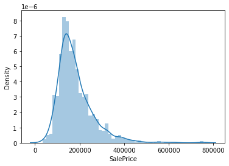
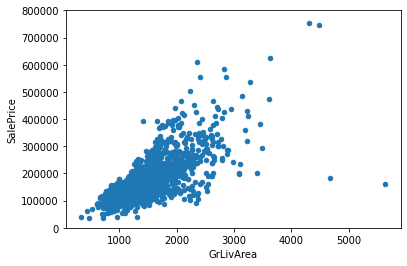
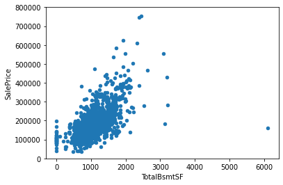
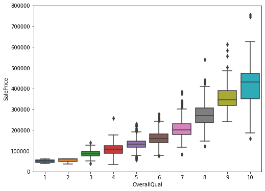
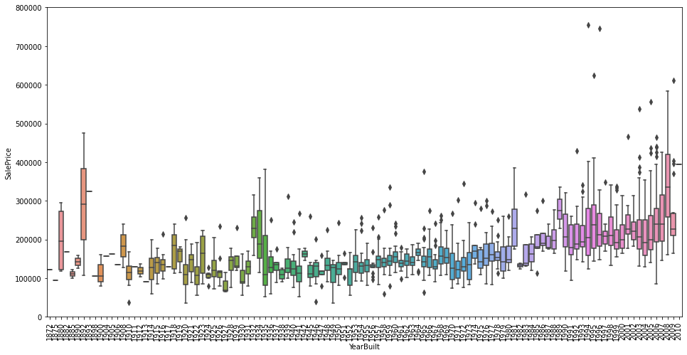
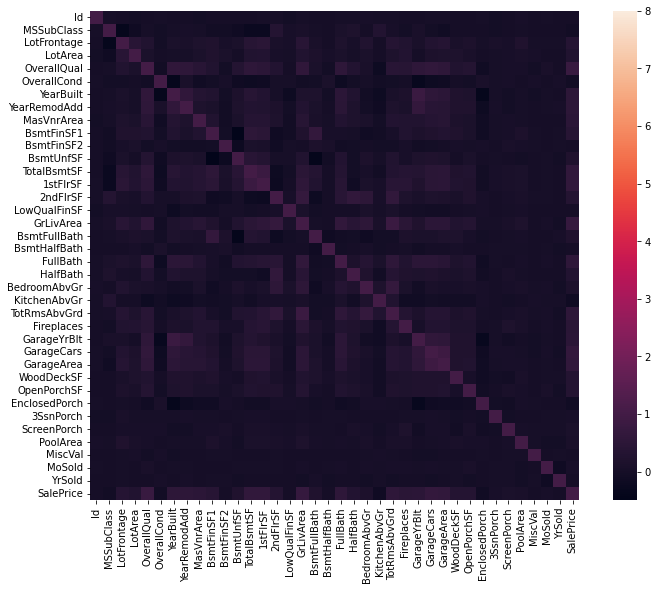
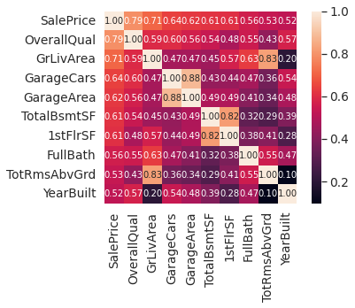
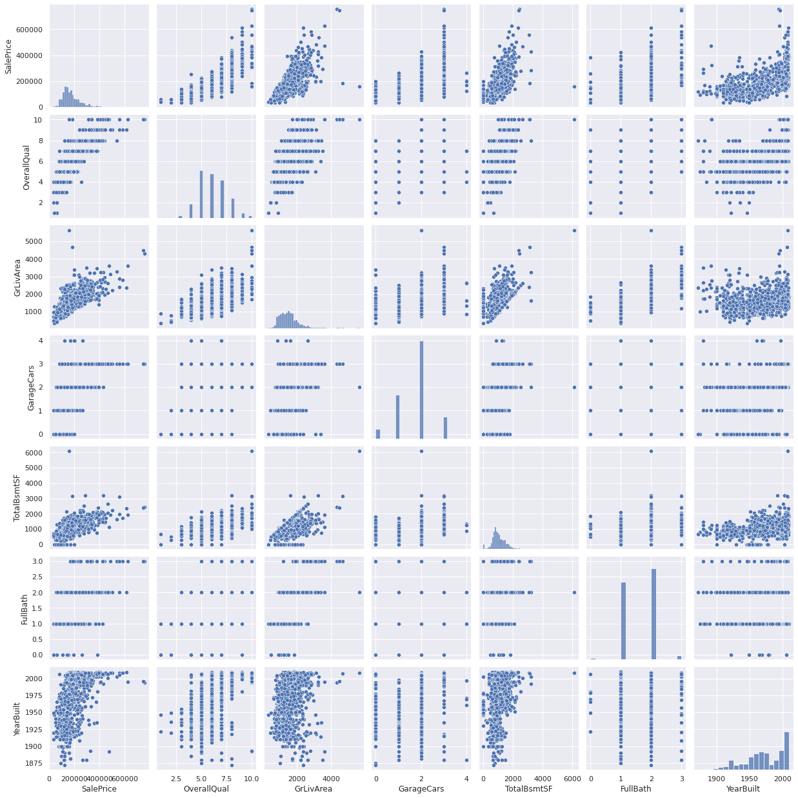

```python
#invite people for the Kaggle party
import pandas as pd
import matplotlib.pyplot as plt
import seaborn as sns
import numpy as np
from scipy.stats import norm
from sklearn.preprocessing import StandardScaler
from scipy import stats
import warnings
warnings.filterwarnings('ignore')
%matplotlib inline
```

# 1. 데이터 로드 및 확인


```python
# 데이터 로드
df_train = pd.read_csv('/kaggle/input/house-prices-advanced-regression-techniques/train.csv')
```


```python
# column 확인
df_train.columns
```


    Index(['Id', 'MSSubClass', 'MSZoning', 'LotFrontage', 'LotArea', 'Street',
           'Alley', 'LotShape', 'LandContour', 'Utilities', 'LotConfig',
           'LandSlope', 'Neighborhood', 'Condition1', 'Condition2', 'BldgType',
           'HouseStyle', 'OverallQual', 'OverallCond', 'YearBuilt', 'YearRemodAdd',
           'RoofStyle', 'RoofMatl', 'Exterior1st', 'Exterior2nd', 'MasVnrType',
           'MasVnrArea', 'ExterQual', 'ExterCond', 'Foundation', 'BsmtQual',
           'BsmtCond', 'BsmtExposure', 'BsmtFinType1', 'BsmtFinSF1',
           'BsmtFinType2', 'BsmtFinSF2', 'BsmtUnfSF', 'TotalBsmtSF', 'Heating',
           'HeatingQC', 'CentralAir', 'Electrical', '1stFlrSF', '2ndFlrSF',
           'LowQualFinSF', 'GrLivArea', 'BsmtFullBath', 'BsmtHalfBath', 'FullBath',
           'HalfBath', 'BedroomAbvGr', 'KitchenAbvGr', 'KitchenQual',
           'TotRmsAbvGrd', 'Functional', 'Fireplaces', 'FireplaceQu', 'GarageType',
           'GarageYrBlt', 'GarageFinish', 'GarageCars', 'GarageArea', 'GarageQual',
           'GarageCond', 'PavedDrive', 'WoodDeckSF', 'OpenPorchSF',
           'EnclosedPorch', '3SsnPorch', 'ScreenPorch', 'PoolArea', 'PoolQC',
           'Fence', 'MiscFeature', 'MiscVal', 'MoSold', 'YrSold', 'SaleType',
           'SaleCondition', 'SalePrice'],
          dtype='object')


# 2.1 'SalePrice' 분석


```python
# descriptive statistics summary
df_train['SalePrice'].describe()
```


    count      1460.000000
    mean     180921.195890
    std       79442.502883
    min       34900.000000
    25%      129975.000000
    50%      163000.000000
    75%      214000.000000
    max      755000.000000
    Name: SalePrice, dtype: float64


```python
# histogram
sns.distplot(df_train['SalePrice'])
```


    <AxesSubplot:xlabel='SalePrice', ylabel='Density'>


    

    


* 그래프가 왼쪽으로 약간 치우쳐있음


```python
# skewness and kurtosis
print("Skewness: %f" % df_train['SalePrice'].skew())
print("Kurtosis: %f" % df_train['SalePrice'].kurt())
```

    Skewness: 1.882876
    Kurtosis: 6.536282
    

* skewness: 통계 집단의 도수분포에서 평균값에 관한 비대칭의 방향과 그 정도를 나타내는 특성값
* kurtosis: 도수분포의 뾰족한 정도

#### Relationship with numerical variables


```python
# scatter plot(saleprice & grlivarea)
var = 'GrLivArea'
data = pd.concat([df_train['SalePrice'], df_train[var]], axis = 1)
data.plot.scatter(x = var, y = 'SalePrice', ylim = (0, 800000))
```


    <AxesSubplot:xlabel='GrLivArea', ylabel='SalePrice'>


    

    


* GrLivArea와 SalePrice데이터의 관계를 scatter plot을 통해 그려보았다.
* 두 데이터는 선형 관계를 보임


```python
# scatter plot(saleprice & TotalBsmtSF)
var = 'TotalBsmtSF'
data = pd.concat([df_train['SalePrice'], df_train[var]], axis = 1)
data.plot.scatter(x = var, y = 'SalePrice', ylim = (0, 800000))
```


    <AxesSubplot:xlabel='TotalBsmtSF', ylabel='SalePrice'>


    

    


* 다음으로 TotalBsmtSF와 SalePrice의 scatter plot을 그려보았다.
* 이 둘 역시 선형관계를 보여준다.

#### Relationship with categorical features


```python
#box plot overallqual/saleprice
var = 'OverallQual'
data = pd.concat([df_train['SalePrice'], df_train[var]], axis=1)
f, ax = plt.subplots(figsize=(8, 6))
fig = sns.boxplot(x=var, y="SalePrice", data=data)
fig.axis(ymin=0, ymax=800000);
```


    

    


```python
var = 'YearBuilt'
data = pd.concat([df_train['SalePrice'], df_train[var]], axis=1)
f, ax = plt.subplots(figsize=(16, 8))
fig = sns.boxplot(x=var, y="SalePrice", data=data)
fig.axis(ymin=0, ymax=800000);
plt.xticks(rotation=90);
```


    

    


* 신축 건물에 더 높은 가격이 책정된 것을 볼 수 있음

## 요약
TotalBsmtSF, GrLivArea 두 가지 변수는 SalePrice와 선형 관계를 보여주고, TotalBsmtSF는 높은 기울기를 갖는다는 사실을 확인하였다.
boxplot을 활용하여 YearBuilt와 overallqual 두 변수와의 관계도 시각화 해 보았으나 overallqual과 SalePrice의 관계가 YearBuilt를 통한 분석보다 더 좋은 품질을 보여준다.


```python
# correlation matrix
corrmat = df_train.corr()
f, ax = plt.subplots(figsize = (12, 9))
sns.heatmap(corrmat, vmax = 8, square = True)
```


    <AxesSubplot:>


    

    


* 히트맵 상에서 눈에 보이는 두 가지 사각형을 살펴보자
* 첫 사각형은 TotalBsmtSF와 1stFlrsF간의 사각형이며, 두 번째는 GarageX간의 사각형이다.

## 'SalePrice' correlation matrix


```python
#saleprice correlation matrix
k = 10 #number of variables for heatmap
cols = corrmat.nlargest(k, 'SalePrice')['SalePrice'].index
cm = np.corrcoef(df_train[cols].values.T)
sns.set(font_scale=1.25)
hm = sns.heatmap(cm, cbar=True, annot=True, square=True, fmt='.2f', annot_kws={'size': 10}, yticklabels=cols.values, xticklabels=cols.values)
plt.show()
```


    

    


* 'OverallQual', 'GrLivArea' 및 'TotalBsmtSF'는 'SalePrice'와 높은 상관 관계를 보인다.
* 'GarageCars'는 차고에 들어갈 수 있는 자동차의 수는 차고 면적의 결과로 'Garage Area'와의 연관성이 높다.
* 위 두 Garage'X' 변수중 한 가지 만을 사용할 것임.
* 'TotalBsmtSF'와 '1stFloor'도 위 두 Garage 변수와 비슷한 관계를 보임.

## 'SalePrice'와 다른 변수들 간의 Scatter Plot


```python
# scatter plot
sns.set()
cols = ['SalePrice', 'OverallQual', 'GrLivArea', 'GarageCars', 'TotalBsmtSF', 'FullBath', 'YearBuilt']
sns.pairplot(df_train[cols], size = 2.5)
plt.show()
```


    

    


scatter plot을 처음 그려보았다.
다른 plot들과 달리 좁은 공간에 많은 그래프들이 그려져 변수들과의 어떠한 관계가 있는지 파악이 힘들었다.
천천히 살펴보도록 하자

*  'TotalBsmtSF' and 'GrLiveArea'
    * 우리가 기존에 관심갖고 있던 위의 두 변수는 우상향의 선형 그래프를 갖는다.
*  'SalePrice' and 'YearBuilt' 
    * 점들의 맨 아랫부분을 따라 그래프를 그려보면 지수함수꼴로 나타남을 볼 수 있다.
    

# 4. Missing Data
각 column 별로 Missing data의 비율을 구해보자


```python
#missing data
total = df_train.isnull().sum().sort_values(ascending=False)
percent = (df_train.isnull().sum()/df_train.isnull().count()).sort_values(ascending=False)
missing_data = pd.concat([total, percent], axis=1, keys=['Total', 'Percent'])
missing_data.head(20)
```


<div>
<style scoped>
    .dataframe tbody tr th:only-of-type {
        vertical-align: middle;
    }

    .dataframe tbody tr th {
        vertical-align: top;
    }

    .dataframe thead th {
        text-align: right;
    }
</style>
<table border="1" class="dataframe">
  <thead>
    <tr style="text-align: right;">
      <th></th>
      <th>Total</th>
      <th>Percent</th>
    </tr>
  </thead>
  <tbody>
    <tr>
      <th>PoolQC</th>
      <td>1453</td>
      <td>0.995205</td>
    </tr>
    <tr>
      <th>MiscFeature</th>
      <td>1406</td>
      <td>0.963014</td>
    </tr>
    <tr>
      <th>Alley</th>
      <td>1369</td>
      <td>0.937671</td>
    </tr>
    <tr>
      <th>Fence</th>
      <td>1179</td>
      <td>0.807534</td>
    </tr>
    <tr>
      <th>FireplaceQu</th>
      <td>690</td>
      <td>0.472603</td>
    </tr>
    <tr>
      <th>LotFrontage</th>
      <td>259</td>
      <td>0.177397</td>
    </tr>
    <tr>
      <th>GarageYrBlt</th>
      <td>81</td>
      <td>0.055479</td>
    </tr>
    <tr>
      <th>GarageCond</th>
      <td>81</td>
      <td>0.055479</td>
    </tr>
    <tr>
      <th>GarageType</th>
      <td>81</td>
      <td>0.055479</td>
    </tr>
    <tr>
      <th>GarageFinish</th>
      <td>81</td>
      <td>0.055479</td>
    </tr>
    <tr>
      <th>GarageQual</th>
      <td>81</td>
      <td>0.055479</td>
    </tr>
    <tr>
      <th>BsmtFinType2</th>
      <td>38</td>
      <td>0.026027</td>
    </tr>
    <tr>
      <th>BsmtExposure</th>
      <td>38</td>
      <td>0.026027</td>
    </tr>
    <tr>
      <th>BsmtQual</th>
      <td>37</td>
      <td>0.025342</td>
    </tr>
    <tr>
      <th>BsmtCond</th>
      <td>37</td>
      <td>0.025342</td>
    </tr>
    <tr>
      <th>BsmtFinType1</th>
      <td>37</td>
      <td>0.025342</td>
    </tr>
    <tr>
      <th>MasVnrArea</th>
      <td>8</td>
      <td>0.005479</td>
    </tr>
    <tr>
      <th>MasVnrType</th>
      <td>8</td>
      <td>0.005479</td>
    </tr>
    <tr>
      <th>Electrical</th>
      <td>1</td>
      <td>0.000685</td>
    </tr>
    <tr>
      <th>Id</th>
      <td>0</td>
      <td>0.000000</td>
    </tr>
  </tbody>
</table>
</div>


* 15% 이상이 Null Data인 경우 해당 변수 삭제
* Garage'x'변수들의 Null Data 수가 같음 -> 같은 데이터를 기반으로 이루어진 변수 -> 삭제 예정
* 'Electrical'에서 누락된 관측치가 하나 있음. 하나의 관측치이므로 이 관측치를 삭제하고 변수를 유지
* 'MasVnrArea'와 'MasVnrType'에 대해서는 이러한 변수가 필요하지 않다고 볼 수 있음. 또한 이들은 'Year Built', 'Overall Qual'과 강한 상관관계를 가지고 있어 대체 가능하므로 삭제


```python
#dealing with missing data
df_train = df_train.drop((missing_data[missing_data['Total'] > 1]).index,1)
df_train = df_train.drop(df_train.loc[df_train['Electrical'].isnull()].index)
df_train.isnull().sum().max()
```


    ---------------------------------------------------------------------------

    KeyError                                  Traceback (most recent call last)

    /tmp/ipykernel_27/3547138573.py in <module>
          1 #dealing with missing data
    ----> 2 df_train = df_train.drop((missing_data[missing_data['Total'] > 1]).index,1)
          3 df_train = df_train.drop(df_train.loc[df_train['Electrical'].isnull()].index)
          4 df_train.isnull().sum().max()
    

    /opt/conda/lib/python3.7/site-packages/pandas/util/_decorators.py in wrapper(*args, **kwargs)
        309                     stacklevel=stacklevel,
        310                 )
    --> 311             return func(*args, **kwargs)
        312 
        313         return wrapper
    

    /opt/conda/lib/python3.7/site-packages/pandas/core/frame.py in drop(self, labels, axis, index, columns, level, inplace, errors)
       4911             level=level,
       4912             inplace=inplace,
    -> 4913             errors=errors,
       4914         )
       4915 
    

    /opt/conda/lib/python3.7/site-packages/pandas/core/generic.py in drop(self, labels, axis, index, columns, level, inplace, errors)
       4148         for axis, labels in axes.items():
       4149             if labels is not None:
    -> 4150                 obj = obj._drop_axis(labels, axis, level=level, errors=errors)
       4151 
       4152         if inplace:
    

    /opt/conda/lib/python3.7/site-packages/pandas/core/generic.py in _drop_axis(self, labels, axis, level, errors)
       4183                 new_axis = axis.drop(labels, level=level, errors=errors)
       4184             else:
    -> 4185                 new_axis = axis.drop(labels, errors=errors)
       4186             result = self.reindex(**{axis_name: new_axis})
       4187 
    

    /opt/conda/lib/python3.7/site-packages/pandas/core/indexes/base.py in drop(self, labels, errors)
       6015         if mask.any():
       6016             if errors != "ignore":
    -> 6017                 raise KeyError(f"{labels[mask]} not found in axis")
       6018             indexer = indexer[~mask]
       6019         return self.delete(indexer)
    

    KeyError: "['PoolQC' 'MiscFeature' 'Alley' 'Fence' 'FireplaceQu' 'LotFrontage'\n 'GarageYrBlt' 'GarageCond' 'GarageType' 'GarageFinish' 'GarageQual'\n 'BsmtFinType2' 'BsmtExposure' 'BsmtQual' 'BsmtCond' 'BsmtFinType1'\n 'MasVnrArea' 'MasVnrType'] not found in axis"


```python

```
