```python
import numpy as np
import pandas as pd
import seaborn as sns
import matplotlib.pyplot as plt
import missingno as msno
import warnings

plt.style.use('seaborn')
sns.set(font_scale = 2.5)
warnings.filterwarnings('ignore')

%matplotlib inline
```


```python
df_train = pd.read_csv('../input/titanic/train.csv')
df_test = pd.read_csv('../input/titanic/test.csv')
```


```python
df_train.head()
```


<div>
<style scoped>
    .dataframe tbody tr th:only-of-type {
        vertical-align: middle;
    }

    .dataframe tbody tr th {
        vertical-align: top;
    }

    .dataframe thead th {
        text-align: right;
    }
</style>
<table border="1" class="dataframe">
  <thead>
    <tr style="text-align: right;">
      <th></th>
      <th>PassengerId</th>
      <th>Survived</th>
      <th>Pclass</th>
      <th>Name</th>
      <th>Sex</th>
      <th>Age</th>
      <th>SibSp</th>
      <th>Parch</th>
      <th>Ticket</th>
      <th>Fare</th>
      <th>Cabin</th>
      <th>Embarked</th>
    </tr>
  </thead>
  <tbody>
    <tr>
      <th>0</th>
      <td>1</td>
      <td>0</td>
      <td>3</td>
      <td>Braund, Mr. Owen Harris</td>
      <td>male</td>
      <td>22.0</td>
      <td>1</td>
      <td>0</td>
      <td>A/5 21171</td>
      <td>7.2500</td>
      <td>NaN</td>
      <td>S</td>
    </tr>
    <tr>
      <th>1</th>
      <td>2</td>
      <td>1</td>
      <td>1</td>
      <td>Cumings, Mrs. John Bradley (Florence Briggs Th...</td>
      <td>female</td>
      <td>38.0</td>
      <td>1</td>
      <td>0</td>
      <td>PC 17599</td>
      <td>71.2833</td>
      <td>C85</td>
      <td>C</td>
    </tr>
    <tr>
      <th>2</th>
      <td>3</td>
      <td>1</td>
      <td>3</td>
      <td>Heikkinen, Miss. Laina</td>
      <td>female</td>
      <td>26.0</td>
      <td>0</td>
      <td>0</td>
      <td>STON/O2. 3101282</td>
      <td>7.9250</td>
      <td>NaN</td>
      <td>S</td>
    </tr>
    <tr>
      <th>3</th>
      <td>4</td>
      <td>1</td>
      <td>1</td>
      <td>Futrelle, Mrs. Jacques Heath (Lily May Peel)</td>
      <td>female</td>
      <td>35.0</td>
      <td>1</td>
      <td>0</td>
      <td>113803</td>
      <td>53.1000</td>
      <td>C123</td>
      <td>S</td>
    </tr>
    <tr>
      <th>4</th>
      <td>5</td>
      <td>0</td>
      <td>3</td>
      <td>Allen, Mr. William Henry</td>
      <td>male</td>
      <td>35.0</td>
      <td>0</td>
      <td>0</td>
      <td>373450</td>
      <td>8.0500</td>
      <td>NaN</td>
      <td>S</td>
    </tr>
  </tbody>
</table>
</div>


```python
df_train.describe()
```


<div>
<style scoped>
    .dataframe tbody tr th:only-of-type {
        vertical-align: middle;
    }

    .dataframe tbody tr th {
        vertical-align: top;
    }

    .dataframe thead th {
        text-align: right;
    }
</style>
<table border="1" class="dataframe">
  <thead>
    <tr style="text-align: right;">
      <th></th>
      <th>PassengerId</th>
      <th>Survived</th>
      <th>Pclass</th>
      <th>Age</th>
      <th>SibSp</th>
      <th>Parch</th>
      <th>Fare</th>
    </tr>
  </thead>
  <tbody>
    <tr>
      <th>count</th>
      <td>891.000000</td>
      <td>891.000000</td>
      <td>891.000000</td>
      <td>714.000000</td>
      <td>891.000000</td>
      <td>891.000000</td>
      <td>891.000000</td>
    </tr>
    <tr>
      <th>mean</th>
      <td>446.000000</td>
      <td>0.383838</td>
      <td>2.308642</td>
      <td>29.699118</td>
      <td>0.523008</td>
      <td>0.381594</td>
      <td>32.204208</td>
    </tr>
    <tr>
      <th>std</th>
      <td>257.353842</td>
      <td>0.486592</td>
      <td>0.836071</td>
      <td>14.526497</td>
      <td>1.102743</td>
      <td>0.806057</td>
      <td>49.693429</td>
    </tr>
    <tr>
      <th>min</th>
      <td>1.000000</td>
      <td>0.000000</td>
      <td>1.000000</td>
      <td>0.420000</td>
      <td>0.000000</td>
      <td>0.000000</td>
      <td>0.000000</td>
    </tr>
    <tr>
      <th>25%</th>
      <td>223.500000</td>
      <td>0.000000</td>
      <td>2.000000</td>
      <td>20.125000</td>
      <td>0.000000</td>
      <td>0.000000</td>
      <td>7.910400</td>
    </tr>
    <tr>
      <th>50%</th>
      <td>446.000000</td>
      <td>0.000000</td>
      <td>3.000000</td>
      <td>28.000000</td>
      <td>0.000000</td>
      <td>0.000000</td>
      <td>14.454200</td>
    </tr>
    <tr>
      <th>75%</th>
      <td>668.500000</td>
      <td>1.000000</td>
      <td>3.000000</td>
      <td>38.000000</td>
      <td>1.000000</td>
      <td>0.000000</td>
      <td>31.000000</td>
    </tr>
    <tr>
      <th>max</th>
      <td>891.000000</td>
      <td>1.000000</td>
      <td>3.000000</td>
      <td>80.000000</td>
      <td>8.000000</td>
      <td>6.000000</td>
      <td>512.329200</td>
    </tr>
  </tbody>
</table>
</div>


```python
df_test.describe()
```


<div>
<style scoped>
    .dataframe tbody tr th:only-of-type {
        vertical-align: middle;
    }

    .dataframe tbody tr th {
        vertical-align: top;
    }

    .dataframe thead th {
        text-align: right;
    }
</style>
<table border="1" class="dataframe">
  <thead>
    <tr style="text-align: right;">
      <th></th>
      <th>PassengerId</th>
      <th>Pclass</th>
      <th>Age</th>
      <th>SibSp</th>
      <th>Parch</th>
      <th>Fare</th>
    </tr>
  </thead>
  <tbody>
    <tr>
      <th>count</th>
      <td>418.000000</td>
      <td>418.000000</td>
      <td>332.000000</td>
      <td>418.000000</td>
      <td>418.000000</td>
      <td>417.000000</td>
    </tr>
    <tr>
      <th>mean</th>
      <td>1100.500000</td>
      <td>2.265550</td>
      <td>30.272590</td>
      <td>0.447368</td>
      <td>0.392344</td>
      <td>35.627188</td>
    </tr>
    <tr>
      <th>std</th>
      <td>120.810458</td>
      <td>0.841838</td>
      <td>14.181209</td>
      <td>0.896760</td>
      <td>0.981429</td>
      <td>55.907576</td>
    </tr>
    <tr>
      <th>min</th>
      <td>892.000000</td>
      <td>1.000000</td>
      <td>0.170000</td>
      <td>0.000000</td>
      <td>0.000000</td>
      <td>0.000000</td>
    </tr>
    <tr>
      <th>25%</th>
      <td>996.250000</td>
      <td>1.000000</td>
      <td>21.000000</td>
      <td>0.000000</td>
      <td>0.000000</td>
      <td>7.895800</td>
    </tr>
    <tr>
      <th>50%</th>
      <td>1100.500000</td>
      <td>3.000000</td>
      <td>27.000000</td>
      <td>0.000000</td>
      <td>0.000000</td>
      <td>14.454200</td>
    </tr>
    <tr>
      <th>75%</th>
      <td>1204.750000</td>
      <td>3.000000</td>
      <td>39.000000</td>
      <td>1.000000</td>
      <td>0.000000</td>
      <td>31.500000</td>
    </tr>
    <tr>
      <th>max</th>
      <td>1309.000000</td>
      <td>3.000000</td>
      <td>76.000000</td>
      <td>8.000000</td>
      <td>9.000000</td>
      <td>512.329200</td>
    </tr>
  </tbody>
</table>
</div>


# 1.1 Null Data Check


```python
for col in df_train.columns:
    msg = "column: {:>10}\t Percent of NaN Value: {:.2f}".format(
    col, 100 * (df_train[col].isnull().sum() / df_train[col].shape[0]))
    print(msg)
```

    column: PassengerId	 Percent of NaN Value: 0.00
    column:   Survived	 Percent of NaN Value: 0.00
    column:     Pclass	 Percent of NaN Value: 0.00
    column:       Name	 Percent of NaN Value: 0.00
    column:        Sex	 Percent of NaN Value: 0.00
    column:        Age	 Percent of NaN Value: 19.87
    column:      SibSp	 Percent of NaN Value: 0.00
    column:      Parch	 Percent of NaN Value: 0.00
    column:     Ticket	 Percent of NaN Value: 0.00
    column:       Fare	 Percent of NaN Value: 0.00
    column:      Cabin	 Percent of NaN Value: 77.10
    column:   Embarked	 Percent of NaN Value: 0.22
    


```python
for col in df_test.columns:
    msg = "column: {:>10}\t Percent of NaN Value: {:.2f}".format(
    col, 100 * (df_test[col].isnull().sum() / df_test[col].shape[0]))
    print(msg)
```

    column: PassengerId	 Percent of NaN Value: 0.00
    column:     Pclass	 Percent of NaN Value: 0.00
    column:       Name	 Percent of NaN Value: 0.00
    column:        Sex	 Percent of NaN Value: 0.00
    column:        Age	 Percent of NaN Value: 20.57
    column:      SibSp	 Percent of NaN Value: 0.00
    column:      Parch	 Percent of NaN Value: 0.00
    column:     Ticket	 Percent of NaN Value: 0.00
    column:       Fare	 Percent of NaN Value: 0.24
    column:      Cabin	 Percent of NaN Value: 78.23
    column:   Embarked	 Percent of NaN Value: 0.00
    

# 1.2 Target label


```python
f, ax = plt.subplots(1, 2, figsize = (18, 8))

df_train['Survived'].value_counts().plot.pie(explode = [0, 0.1],
                                            autopct = '%1.1f%%', ax = ax[0], shadow = True)
ax[0].set_title('Pie plot - Survived')
ax[0].set_ylabel('')
sns.countplot("Survived", data = df_train, ax = ax[1])
ax[1].set_title('Count plot - Survived')

plt.show()
```


    
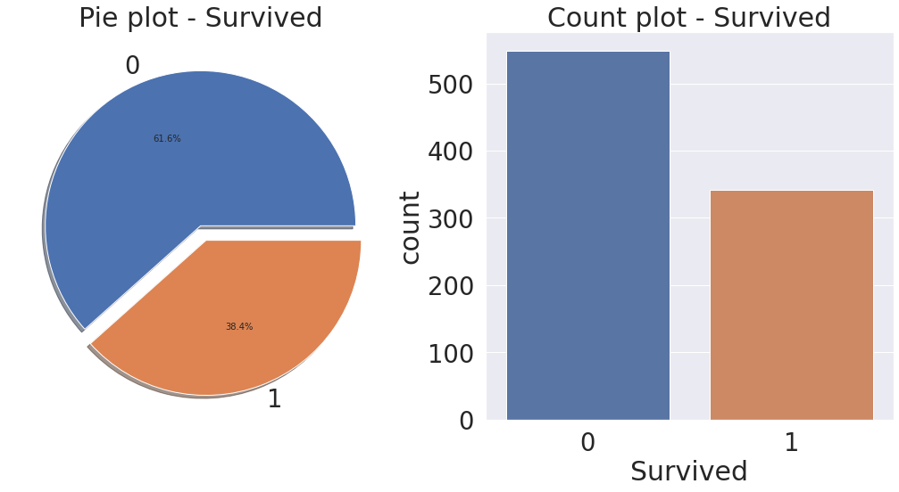
    


# 2. Exploratory Data Analysis

# 2.1 Pcalss


```python
df_train[["Pclass", "Survived"]].groupby(["Pclass"],as_index = True).count()
```


<div>
<style scoped>
    .dataframe tbody tr th:only-of-type {
        vertical-align: middle;
    }

    .dataframe tbody tr th {
        vertical-align: top;
    }

    .dataframe thead th {
        text-align: right;
    }
</style>
<table border="1" class="dataframe">
  <thead>
    <tr style="text-align: right;">
      <th></th>
      <th>Survived</th>
    </tr>
    <tr>
      <th>Pclass</th>
      <th></th>
    </tr>
  </thead>
  <tbody>
    <tr>
      <th>1</th>
      <td>216</td>
    </tr>
    <tr>
      <th>2</th>
      <td>184</td>
    </tr>
    <tr>
      <th>3</th>
      <td>491</td>
    </tr>
  </tbody>
</table>
</div>


```python
df_train[["Pclass", "Survived"]].groupby(["Pclass"], as_index = True).sum()
```


<div>
<style scoped>
    .dataframe tbody tr th:only-of-type {
        vertical-align: middle;
    }

    .dataframe tbody tr th {
        vertical-align: top;
    }

    .dataframe thead th {
        text-align: right;
    }
</style>
<table border="1" class="dataframe">
  <thead>
    <tr style="text-align: right;">
      <th></th>
      <th>Survived</th>
    </tr>
    <tr>
      <th>Pclass</th>
      <th></th>
    </tr>
  </thead>
  <tbody>
    <tr>
      <th>1</th>
      <td>136</td>
    </tr>
    <tr>
      <th>2</th>
      <td>87</td>
    </tr>
    <tr>
      <th>3</th>
      <td>119</td>
    </tr>
  </tbody>
</table>
</div>


```python
# pandas - crosstab
# margins = False(default)

pd.crosstab(df_train['Pclass'], df_train['Survived'])
```


<div>
<style scoped>
    .dataframe tbody tr th:only-of-type {
        vertical-align: middle;
    }

    .dataframe tbody tr th {
        vertical-align: top;
    }

    .dataframe thead th {
        text-align: right;
    }
</style>
<table border="1" class="dataframe">
  <thead>
    <tr style="text-align: right;">
      <th>Survived</th>
      <th>0</th>
      <th>1</th>
    </tr>
    <tr>
      <th>Pclass</th>
      <th></th>
      <th></th>
    </tr>
  </thead>
  <tbody>
    <tr>
      <th>1</th>
      <td>80</td>
      <td>136</td>
    </tr>
    <tr>
      <th>2</th>
      <td>97</td>
      <td>87</td>
    </tr>
    <tr>
      <th>3</th>
      <td>372</td>
      <td>119</td>
    </tr>
  </tbody>
</table>
</div>


```python
# margins = True

pd.crosstab(df_train['Pclass'], df_train['Survived'], margins = True)
```


<div>
<style scoped>
    .dataframe tbody tr th:only-of-type {
        vertical-align: middle;
    }

    .dataframe tbody tr th {
        vertical-align: top;
    }

    .dataframe thead th {
        text-align: right;
    }
</style>
<table border="1" class="dataframe">
  <thead>
    <tr style="text-align: right;">
      <th>Survived</th>
      <th>0</th>
      <th>1</th>
      <th>All</th>
    </tr>
    <tr>
      <th>Pclass</th>
      <th></th>
      <th></th>
      <th></th>
    </tr>
  </thead>
  <tbody>
    <tr>
      <th>1</th>
      <td>80</td>
      <td>136</td>
      <td>216</td>
    </tr>
    <tr>
      <th>2</th>
      <td>97</td>
      <td>87</td>
      <td>184</td>
    </tr>
    <tr>
      <th>3</th>
      <td>372</td>
      <td>119</td>
      <td>491</td>
    </tr>
    <tr>
      <th>All</th>
      <td>549</td>
      <td>342</td>
      <td>891</td>
    </tr>
  </tbody>
</table>
</div>


```python
df_train[['Pclass', 'Survived']].groupby(['Pclass'], as_index = True).mean().plot.bar()
```


    <AxesSubplot:xlabel='Pclass'>


    
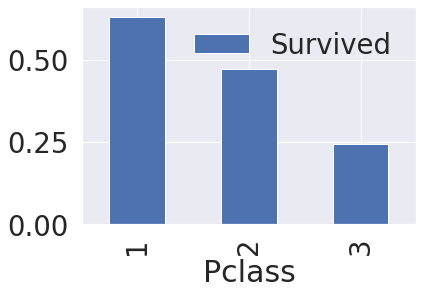
    


```python
f, ax = plt.subplots(1, 2, figsize = (18, 8))
df_train[['Pclass']].value_counts().plot.bar(ax = ax[0])
ax[0].set_title('Number of Passengers By Pclass')
ax[0].set_ylabel('Count')

sns.countplot('Pclass', hue = 'Survived', data = df_train, ax = ax[1])
ax[1].set_title('Pclass: Survived vs Dead')
plt.show()
```


    
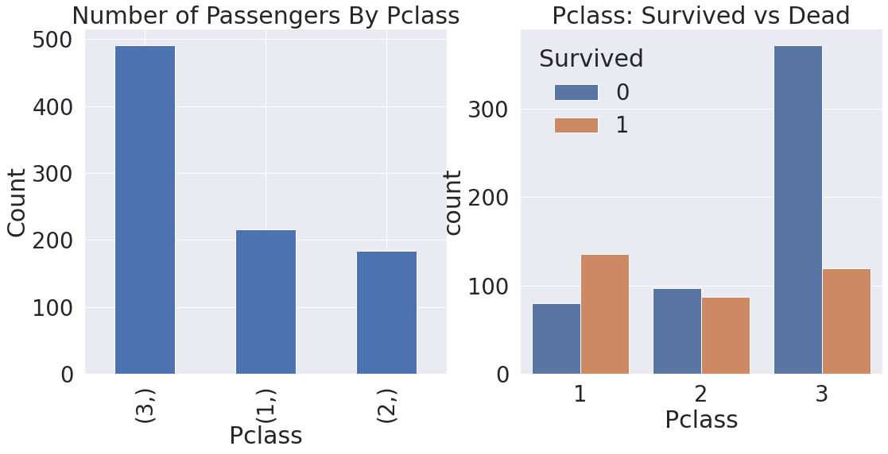
    


```python
pd.crosstab([df_train.Sex, df_train.Survived], df_train.Pclass, margins = True).style.background_gradient(cmap = 'summer_r')
```


<style type="text/css">
#T_1d87a_row0_col0, #T_1d87a_row0_col1, #T_1d87a_row0_col3, #T_1d87a_row3_col2 {
  background-color: #ffff66;
  color: #000000;
}
#T_1d87a_row0_col2, #T_1d87a_row1_col2 {
  background-color: #f1f866;
  color: #000000;
}
#T_1d87a_row1_col0 {
  background-color: #96cb66;
  color: #000000;
}
#T_1d87a_row1_col1 {
  background-color: #a3d166;
  color: #000000;
}
#T_1d87a_row1_col3 {
  background-color: #cfe766;
  color: #000000;
}
#T_1d87a_row2_col0 {
  background-color: #a7d366;
  color: #000000;
}
#T_1d87a_row2_col1, #T_1d87a_row2_col3 {
  background-color: #85c266;
  color: #000000;
}
#T_1d87a_row2_col2 {
  background-color: #6eb666;
  color: #f1f1f1;
}
#T_1d87a_row3_col0 {
  background-color: #cde666;
  color: #000000;
}
#T_1d87a_row3_col1 {
  background-color: #f0f866;
  color: #000000;
}
#T_1d87a_row3_col3 {
  background-color: #f7fb66;
  color: #000000;
}
#T_1d87a_row4_col0, #T_1d87a_row4_col1, #T_1d87a_row4_col2, #T_1d87a_row4_col3 {
  background-color: #008066;
  color: #f1f1f1;
}
</style>
<table id="T_1d87a_">
  <thead>
    <tr>
      <th class="blank" >&nbsp;</th>
      <th class="index_name level0" >Pclass</th>
      <th class="col_heading level0 col0" >1</th>
      <th class="col_heading level0 col1" >2</th>
      <th class="col_heading level0 col2" >3</th>
      <th class="col_heading level0 col3" >All</th>
    </tr>
    <tr>
      <th class="index_name level0" >Sex</th>
      <th class="index_name level1" >Survived</th>
      <th class="blank col0" >&nbsp;</th>
      <th class="blank col1" >&nbsp;</th>
      <th class="blank col2" >&nbsp;</th>
      <th class="blank col3" >&nbsp;</th>
    </tr>
  </thead>
  <tbody>
    <tr>
      <th id="T_1d87a_level0_row0" class="row_heading level0 row0" rowspan="2">female</th>
      <th id="T_1d87a_level1_row0" class="row_heading level1 row0" >0</th>
      <td id="T_1d87a_row0_col0" class="data row0 col0" >3</td>
      <td id="T_1d87a_row0_col1" class="data row0 col1" >6</td>
      <td id="T_1d87a_row0_col2" class="data row0 col2" >72</td>
      <td id="T_1d87a_row0_col3" class="data row0 col3" >81</td>
    </tr>
    <tr>
      <th id="T_1d87a_level1_row1" class="row_heading level1 row1" >1</th>
      <td id="T_1d87a_row1_col0" class="data row1 col0" >91</td>
      <td id="T_1d87a_row1_col1" class="data row1 col1" >70</td>
      <td id="T_1d87a_row1_col2" class="data row1 col2" >72</td>
      <td id="T_1d87a_row1_col3" class="data row1 col3" >233</td>
    </tr>
    <tr>
      <th id="T_1d87a_level0_row2" class="row_heading level0 row2" rowspan="2">male</th>
      <th id="T_1d87a_level1_row2" class="row_heading level1 row2" >0</th>
      <td id="T_1d87a_row2_col0" class="data row2 col0" >77</td>
      <td id="T_1d87a_row2_col1" class="data row2 col1" >91</td>
      <td id="T_1d87a_row2_col2" class="data row2 col2" >300</td>
      <td id="T_1d87a_row2_col3" class="data row2 col3" >468</td>
    </tr>
    <tr>
      <th id="T_1d87a_level1_row3" class="row_heading level1 row3" >1</th>
      <td id="T_1d87a_row3_col0" class="data row3 col0" >45</td>
      <td id="T_1d87a_row3_col1" class="data row3 col1" >17</td>
      <td id="T_1d87a_row3_col2" class="data row3 col2" >47</td>
      <td id="T_1d87a_row3_col3" class="data row3 col3" >109</td>
    </tr>
    <tr>
      <th id="T_1d87a_level0_row4" class="row_heading level0 row4" >All</th>
      <th id="T_1d87a_level1_row4" class="row_heading level1 row4" ></th>
      <td id="T_1d87a_row4_col0" class="data row4 col0" >216</td>
      <td id="T_1d87a_row4_col1" class="data row4 col1" >184</td>
      <td id="T_1d87a_row4_col2" class="data row4 col2" >491</td>
      <td id="T_1d87a_row4_col3" class="data row4 col3" >891</td>
    </tr>
  </tbody>
</table>


```python
sns.factorplot('Pclass', 'Survived', hue = 'Sex', data = df_train)

plt.show()
```


    
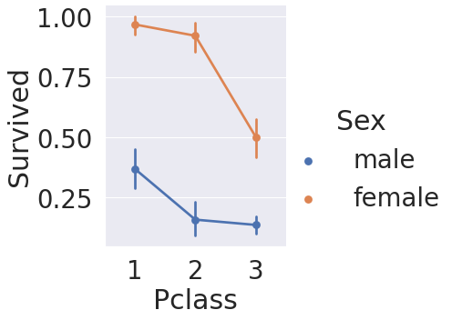
    


# 2.2 Age


```python
print('Oldest Passenger was of: ', df_train['Age'].max(), 'Years')
print('Youngest Passenger was of: ', df_train['Age'].min(), 'Years')
print('Average Age on the ship: ', df_train['Age'].mean(), 'Years')
```

    Oldest Passenger was of:  80.0 Years
    Youngest Passenger was of:  0.42 Years
    Average Age on the ship:  29.69911764705882 Years
    


```python
f, ax = plt.subplots(1, 2, figsize = (18, 8))
sns.violinplot("Pclass", "Age", hue = "Survived", data = df_train, split = True, ax = ax[0])
ax[0].set_title('Pclass and Age vs Survived')
ax[0].set_yticks(range(0, 110, 10))
sns.violinplot("Sex", "Age", hue = "Survived", data = df_train, split = True, ax = ax[1])
ax[1].set_title('Sex and Age vs Survived')
ax[1].set_yticks(range(0, 110, 10))
plt.show()
```


    
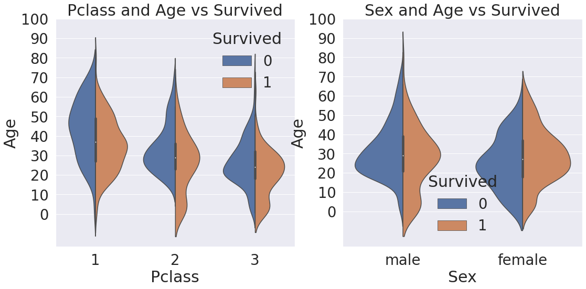
    


# 2.3 Embarked


```python
pd.crosstab([df_train.Embarked, df_train.Pclass], [df_train.Sex, df_train.Survived], margins = True).style.background_gradient(cmap = 'summer_r')
```


<style type="text/css">
#T_29db6_row0_col0, #T_29db6_row1_col2 {
  background-color: #fcfe66;
  color: #000000;
}
#T_29db6_row0_col1 {
  background-color: #d2e866;
  color: #000000;
}
#T_29db6_row0_col2 {
  background-color: #f2f866;
  color: #000000;
}
#T_29db6_row0_col3 {
  background-color: #d8ec66;
  color: #000000;
}
#T_29db6_row0_col4, #T_29db6_row2_col3 {
  background-color: #e8f466;
  color: #000000;
}
#T_29db6_row1_col0, #T_29db6_row3_col0, #T_29db6_row3_col1, #T_29db6_row3_col2, #T_29db6_row3_col3, #T_29db6_row3_col4, #T_29db6_row4_col0, #T_29db6_row4_col2, #T_29db6_row4_col3, #T_29db6_row4_col4 {
  background-color: #ffff66;
  color: #000000;
}
#T_29db6_row1_col1, #T_29db6_row6_col0 {
  background-color: #f9fc66;
  color: #000000;
}
#T_29db6_row1_col3, #T_29db6_row1_col4 {
  background-color: #fbfd66;
  color: #000000;
}
#T_29db6_row2_col0, #T_29db6_row5_col1 {
  background-color: #e6f266;
  color: #000000;
}
#T_29db6_row2_col1 {
  background-color: #f0f866;
  color: #000000;
}
#T_29db6_row2_col2 {
  background-color: #eef666;
  color: #000000;
}
#T_29db6_row2_col4, #T_29db6_row7_col0 {
  background-color: #edf666;
  color: #000000;
}
#T_29db6_row4_col1 {
  background-color: #fefe66;
  color: #000000;
}
#T_29db6_row5_col0 {
  background-color: #e3f166;
  color: #000000;
}
#T_29db6_row5_col2 {
  background-color: #ecf666;
  color: #000000;
}
#T_29db6_row5_col3 {
  background-color: #f8fc66;
  color: #000000;
}
#T_29db6_row5_col4 {
  background-color: #ebf566;
  color: #000000;
}
#T_29db6_row6_col1 {
  background-color: #cde666;
  color: #000000;
}
#T_29db6_row6_col2 {
  background-color: #e4f266;
  color: #000000;
}
#T_29db6_row6_col3 {
  background-color: #bede66;
  color: #000000;
}
#T_29db6_row6_col4 {
  background-color: #dbed66;
  color: #000000;
}
#T_29db6_row7_col1 {
  background-color: #bdde66;
  color: #000000;
}
#T_29db6_row7_col2 {
  background-color: #d3e966;
  color: #000000;
}
#T_29db6_row7_col3, #T_29db6_row8_col1 {
  background-color: #dcee66;
  color: #000000;
}
#T_29db6_row7_col4 {
  background-color: #d1e866;
  color: #000000;
}
#T_29db6_row8_col0 {
  background-color: #52a866;
  color: #f1f1f1;
}
#T_29db6_row8_col2 {
  background-color: #81c066;
  color: #000000;
}
#T_29db6_row8_col3 {
  background-color: #b0d866;
  color: #000000;
}
#T_29db6_row8_col4 {
  background-color: #9acc66;
  color: #000000;
}
#T_29db6_row9_col0, #T_29db6_row9_col1, #T_29db6_row9_col2, #T_29db6_row9_col3, #T_29db6_row9_col4 {
  background-color: #008066;
  color: #f1f1f1;
}
</style>
<table id="T_29db6_">
  <thead>
    <tr>
      <th class="blank" >&nbsp;</th>
      <th class="index_name level0" >Sex</th>
      <th class="col_heading level0 col0" colspan="2">female</th>
      <th class="col_heading level0 col2" colspan="2">male</th>
      <th class="col_heading level0 col4" >All</th>
    </tr>
    <tr>
      <th class="blank" >&nbsp;</th>
      <th class="index_name level1" >Survived</th>
      <th class="col_heading level1 col0" >0</th>
      <th class="col_heading level1 col1" >1</th>
      <th class="col_heading level1 col2" >0</th>
      <th class="col_heading level1 col3" >1</th>
      <th class="col_heading level1 col4" ></th>
    </tr>
    <tr>
      <th class="index_name level0" >Embarked</th>
      <th class="index_name level1" >Pclass</th>
      <th class="blank col0" >&nbsp;</th>
      <th class="blank col1" >&nbsp;</th>
      <th class="blank col2" >&nbsp;</th>
      <th class="blank col3" >&nbsp;</th>
      <th class="blank col4" >&nbsp;</th>
    </tr>
  </thead>
  <tbody>
    <tr>
      <th id="T_29db6_level0_row0" class="row_heading level0 row0" rowspan="3">C</th>
      <th id="T_29db6_level1_row0" class="row_heading level1 row0" >1</th>
      <td id="T_29db6_row0_col0" class="data row0 col0" >1</td>
      <td id="T_29db6_row0_col1" class="data row0 col1" >42</td>
      <td id="T_29db6_row0_col2" class="data row0 col2" >25</td>
      <td id="T_29db6_row0_col3" class="data row0 col3" >17</td>
      <td id="T_29db6_row0_col4" class="data row0 col4" >85</td>
    </tr>
    <tr>
      <th id="T_29db6_level1_row1" class="row_heading level1 row1" >2</th>
      <td id="T_29db6_row1_col0" class="data row1 col0" >0</td>
      <td id="T_29db6_row1_col1" class="data row1 col1" >7</td>
      <td id="T_29db6_row1_col2" class="data row1 col2" >8</td>
      <td id="T_29db6_row1_col3" class="data row1 col3" >2</td>
      <td id="T_29db6_row1_col4" class="data row1 col4" >17</td>
    </tr>
    <tr>
      <th id="T_29db6_level1_row2" class="row_heading level1 row2" >3</th>
      <td id="T_29db6_row2_col0" class="data row2 col0" >8</td>
      <td id="T_29db6_row2_col1" class="data row2 col1" >15</td>
      <td id="T_29db6_row2_col2" class="data row2 col2" >33</td>
      <td id="T_29db6_row2_col3" class="data row2 col3" >10</td>
      <td id="T_29db6_row2_col4" class="data row2 col4" >66</td>
    </tr>
    <tr>
      <th id="T_29db6_level0_row3" class="row_heading level0 row3" rowspan="3">Q</th>
      <th id="T_29db6_level1_row3" class="row_heading level1 row3" >1</th>
      <td id="T_29db6_row3_col0" class="data row3 col0" >0</td>
      <td id="T_29db6_row3_col1" class="data row3 col1" >1</td>
      <td id="T_29db6_row3_col2" class="data row3 col2" >1</td>
      <td id="T_29db6_row3_col3" class="data row3 col3" >0</td>
      <td id="T_29db6_row3_col4" class="data row3 col4" >2</td>
    </tr>
    <tr>
      <th id="T_29db6_level1_row4" class="row_heading level1 row4" >2</th>
      <td id="T_29db6_row4_col0" class="data row4 col0" >0</td>
      <td id="T_29db6_row4_col1" class="data row4 col1" >2</td>
      <td id="T_29db6_row4_col2" class="data row4 col2" >1</td>
      <td id="T_29db6_row4_col3" class="data row4 col3" >0</td>
      <td id="T_29db6_row4_col4" class="data row4 col4" >3</td>
    </tr>
    <tr>
      <th id="T_29db6_level1_row5" class="row_heading level1 row5" >3</th>
      <td id="T_29db6_row5_col0" class="data row5 col0" >9</td>
      <td id="T_29db6_row5_col1" class="data row5 col1" >24</td>
      <td id="T_29db6_row5_col2" class="data row5 col2" >36</td>
      <td id="T_29db6_row5_col3" class="data row5 col3" >3</td>
      <td id="T_29db6_row5_col4" class="data row5 col4" >72</td>
    </tr>
    <tr>
      <th id="T_29db6_level0_row6" class="row_heading level0 row6" rowspan="3">S</th>
      <th id="T_29db6_level1_row6" class="row_heading level1 row6" >1</th>
      <td id="T_29db6_row6_col0" class="data row6 col0" >2</td>
      <td id="T_29db6_row6_col1" class="data row6 col1" >46</td>
      <td id="T_29db6_row6_col2" class="data row6 col2" >51</td>
      <td id="T_29db6_row6_col3" class="data row6 col3" >28</td>
      <td id="T_29db6_row6_col4" class="data row6 col4" >127</td>
    </tr>
    <tr>
      <th id="T_29db6_level1_row7" class="row_heading level1 row7" >2</th>
      <td id="T_29db6_row7_col0" class="data row7 col0" >6</td>
      <td id="T_29db6_row7_col1" class="data row7 col1" >61</td>
      <td id="T_29db6_row7_col2" class="data row7 col2" >82</td>
      <td id="T_29db6_row7_col3" class="data row7 col3" >15</td>
      <td id="T_29db6_row7_col4" class="data row7 col4" >164</td>
    </tr>
    <tr>
      <th id="T_29db6_level1_row8" class="row_heading level1 row8" >3</th>
      <td id="T_29db6_row8_col0" class="data row8 col0" >55</td>
      <td id="T_29db6_row8_col1" class="data row8 col1" >33</td>
      <td id="T_29db6_row8_col2" class="data row8 col2" >231</td>
      <td id="T_29db6_row8_col3" class="data row8 col3" >34</td>
      <td id="T_29db6_row8_col4" class="data row8 col4" >353</td>
    </tr>
    <tr>
      <th id="T_29db6_level0_row9" class="row_heading level0 row9" >All</th>
      <th id="T_29db6_level1_row9" class="row_heading level1 row9" ></th>
      <td id="T_29db6_row9_col0" class="data row9 col0" >81</td>
      <td id="T_29db6_row9_col1" class="data row9 col1" >231</td>
      <td id="T_29db6_row9_col2" class="data row9 col2" >468</td>
      <td id="T_29db6_row9_col3" class="data row9 col3" >109</td>
      <td id="T_29db6_row9_col4" class="data row9 col4" >889</td>
    </tr>
  </tbody>
</table>


```python
sns.factorplot('Embarked', 'Survived', data = df_train)
plt.show()
```


    
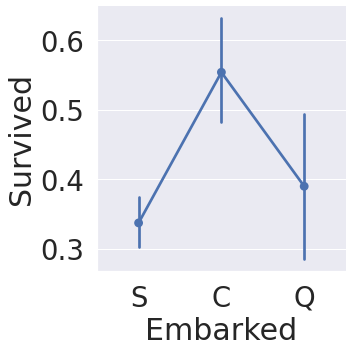
    


```python
f, ax = plt.subplots(2, 2, figsize = (20, 15))
sns.countplot('Embarked', data = df_train, ax = ax[0, 0])
ax[0, 0].set_title('No. Of Passengers Boarded')
sns.countplot('Embarked', hue = 'Sex', data = df_train, ax = ax[0, 1])
ax[0, 1].set_title('Male - Female Split for Embarked')
sns.countplot('Embarked', hue = 'Survived', data = df_train, ax = ax[1, 0])
ax[1, 0].set_title('Embarked vs Survived')
sns.countplot('Embarked', hue = 'Pclass', data = df_train, ax = ax[1, 1])
ax[1, 1].set_title('Embarked vs Pclass')
plt.subplots_adjust(wspace = 0.2, hspace = 0.5)
plt.show()
```


    
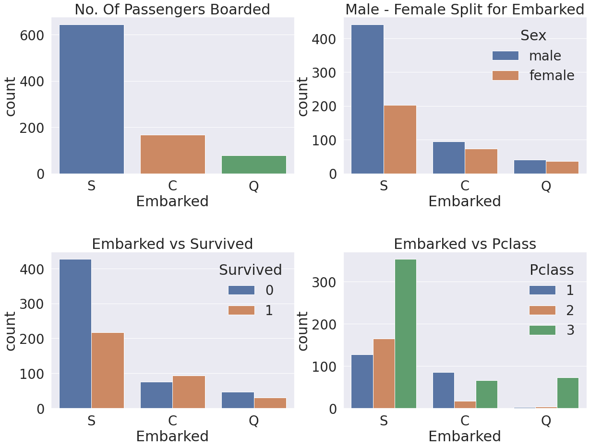
    


```python
sns.factorplot('Pclass', 'Survived', hue = 'Sex', col = 'Embarked', data = df_train)
plt.show()
```


    
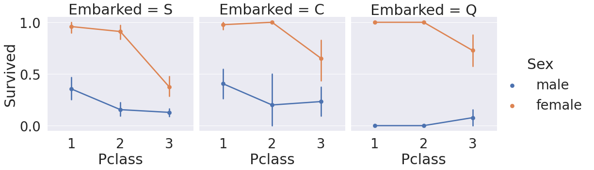
    


```python
df_train['Embarked'].fillna('S', inplace = True)
```


```python
df_train.Embarked.isnull().sum()
```


    0


# 2.4 SibSip


```python
pd.crosstab([df_train.SibSp], df_train.Survived)
```


<div>
<style scoped>
    .dataframe tbody tr th:only-of-type {
        vertical-align: middle;
    }

    .dataframe tbody tr th {
        vertical-align: top;
    }

    .dataframe thead th {
        text-align: right;
    }
</style>
<table border="1" class="dataframe">
  <thead>
    <tr style="text-align: right;">
      <th>Survived</th>
      <th>0</th>
      <th>1</th>
    </tr>
    <tr>
      <th>SibSp</th>
      <th></th>
      <th></th>
    </tr>
  </thead>
  <tbody>
    <tr>
      <th>0</th>
      <td>398</td>
      <td>210</td>
    </tr>
    <tr>
      <th>1</th>
      <td>97</td>
      <td>112</td>
    </tr>
    <tr>
      <th>2</th>
      <td>15</td>
      <td>13</td>
    </tr>
    <tr>
      <th>3</th>
      <td>12</td>
      <td>4</td>
    </tr>
    <tr>
      <th>4</th>
      <td>15</td>
      <td>3</td>
    </tr>
    <tr>
      <th>5</th>
      <td>5</td>
      <td>0</td>
    </tr>
    <tr>
      <th>8</th>
      <td>7</td>
      <td>0</td>
    </tr>
  </tbody>
</table>
</div>


```python
f, ax = plt.subplots(1, 2, figsize = (20, 8))
sns.barplot('SibSp', 'Survived', data = df_train, ax = ax[0])
ax[0].set_title('Sibsp vs Survived')
sns.factorplot('SibSp', 'Survived', data = df_train, ax = ax[1])
# ax[1].xlim(0, 10)
ax[1].set_title('SibSp vs Survived')
plt.show()
```


    
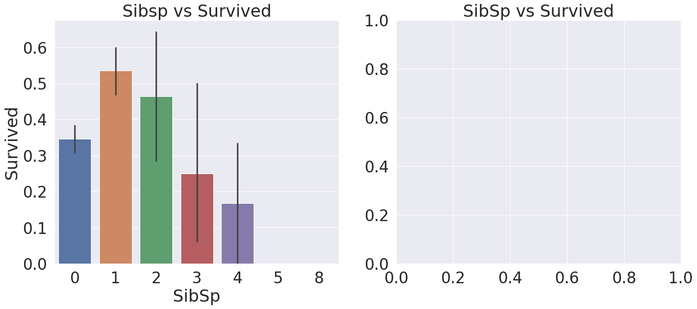
    


    
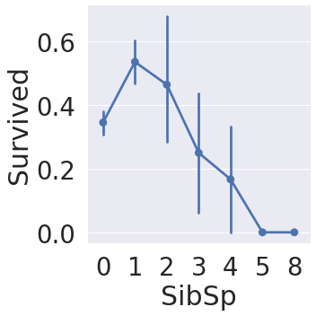
    


```python
pd.crosstab(df_train.SibSp, df_train.Pclass, margins = True)
```


<div>
<style scoped>
    .dataframe tbody tr th:only-of-type {
        vertical-align: middle;
    }

    .dataframe tbody tr th {
        vertical-align: top;
    }

    .dataframe thead th {
        text-align: right;
    }
</style>
<table border="1" class="dataframe">
  <thead>
    <tr style="text-align: right;">
      <th>Pclass</th>
      <th>1</th>
      <th>2</th>
      <th>3</th>
      <th>All</th>
    </tr>
    <tr>
      <th>SibSp</th>
      <th></th>
      <th></th>
      <th></th>
      <th></th>
    </tr>
  </thead>
  <tbody>
    <tr>
      <th>0</th>
      <td>137</td>
      <td>120</td>
      <td>351</td>
      <td>608</td>
    </tr>
    <tr>
      <th>1</th>
      <td>71</td>
      <td>55</td>
      <td>83</td>
      <td>209</td>
    </tr>
    <tr>
      <th>2</th>
      <td>5</td>
      <td>8</td>
      <td>15</td>
      <td>28</td>
    </tr>
    <tr>
      <th>3</th>
      <td>3</td>
      <td>1</td>
      <td>12</td>
      <td>16</td>
    </tr>
    <tr>
      <th>4</th>
      <td>0</td>
      <td>0</td>
      <td>18</td>
      <td>18</td>
    </tr>
    <tr>
      <th>5</th>
      <td>0</td>
      <td>0</td>
      <td>5</td>
      <td>5</td>
    </tr>
    <tr>
      <th>8</th>
      <td>0</td>
      <td>0</td>
      <td>7</td>
      <td>7</td>
    </tr>
    <tr>
      <th>All</th>
      <td>216</td>
      <td>184</td>
      <td>491</td>
      <td>891</td>
    </tr>
  </tbody>
</table>
</div>


# 2.5 Parch


```python
pd.crosstab(df_train.Parch, df_train.Pclass)
```


<div>
<style scoped>
    .dataframe tbody tr th:only-of-type {
        vertical-align: middle;
    }

    .dataframe tbody tr th {
        vertical-align: top;
    }

    .dataframe thead th {
        text-align: right;
    }
</style>
<table border="1" class="dataframe">
  <thead>
    <tr style="text-align: right;">
      <th>Pclass</th>
      <th>1</th>
      <th>2</th>
      <th>3</th>
    </tr>
    <tr>
      <th>Parch</th>
      <th></th>
      <th></th>
      <th></th>
    </tr>
  </thead>
  <tbody>
    <tr>
      <th>0</th>
      <td>163</td>
      <td>134</td>
      <td>381</td>
    </tr>
    <tr>
      <th>1</th>
      <td>31</td>
      <td>32</td>
      <td>55</td>
    </tr>
    <tr>
      <th>2</th>
      <td>21</td>
      <td>16</td>
      <td>43</td>
    </tr>
    <tr>
      <th>3</th>
      <td>0</td>
      <td>2</td>
      <td>3</td>
    </tr>
    <tr>
      <th>4</th>
      <td>1</td>
      <td>0</td>
      <td>3</td>
    </tr>
    <tr>
      <th>5</th>
      <td>0</td>
      <td>0</td>
      <td>5</td>
    </tr>
    <tr>
      <th>6</th>
      <td>0</td>
      <td>0</td>
      <td>1</td>
    </tr>
  </tbody>
</table>
</div>


```python
f, ax = plt.subplots(1, 2, figsize = (20, 8))
sns.barplot('Parch', 'Survived', data = df_train, ax = ax[0])
ax[0].set_title("Parch vs Survived")
sns.factorplot('Parch', 'Survived', data = df_train, ax = ax[1])
ax[1].set_title('Parch vs Survived')
plt.show()
```


    
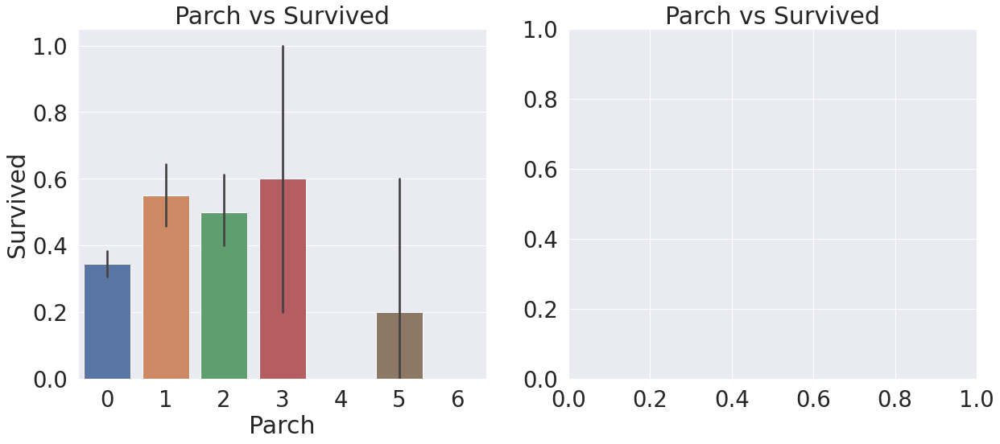
    


    
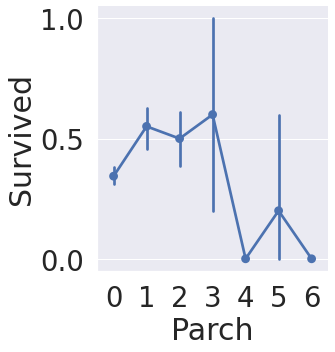
    


# 2.6 Fare

* Fare: 탑승요금
* contious feature


```python
fig, ax = plt.subplots(1, 1, figsize = (8, 8))
g = sns.distplot(df_train['Fare'], color = 'b', label = 'Skewness : {:.2f}'.format(df_train['Fare'].skew()),ax = ax)
g = g.legend(loc = 'best')
```


    
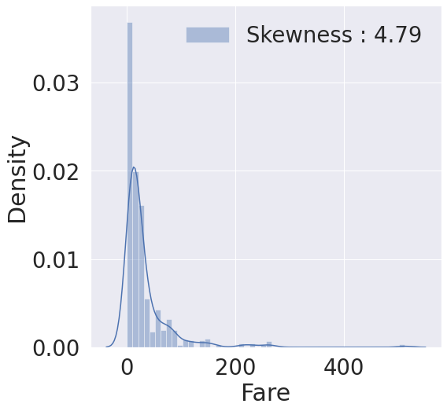
    


* distribution이 매우 비대칭
* 해당 문제점의 해결 방안으로 Fare에 log를 취해볼 것


```python
# df_test의 null값을 평균값으로 치환
df_test.loc[df_test.Fare.isnull(), 'Fare'] = df_test['Fare'].mean()

df_train['Fare'] = df_train['Fare'].map(lambda i: np.log(i) if i > 0 else 0)
df_test['Fare'] = df_test['Fare'].map(lambda i: np.log(i) if i > 0 else 0)
```


```python
fig, ax = plt.subplots(1, 1, figsize = (8, 8))
g = sns.distplot(df_train['Fare'], color = 'b', label = 'Skewness : {:.2f}'.format(df_train['Fare'].skew()), ax = ax)
g = g.legend(loc = 'best')
```


    
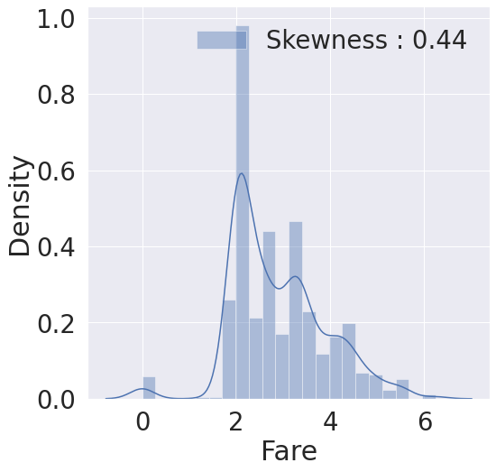
    


* log를 취함으로서 비대칭성을 어느정도 해소함

# 2.7 Cabin


```python
x = df_train['Cabin'].isnull().sum()
y = df_train['Cabin'].shape[0]
print("{}percent of NaN data".format(x/y))
```

    0.7710437710437711percent of NaN data
    

* 77%의 NaN 데이터로 이루어진 column
* 타이타닉호의 생존에 영향을 준 요소인지 알아내기 힘들어 모델 train data에 포함시키지 않음
