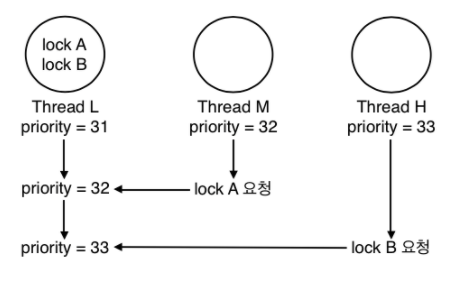
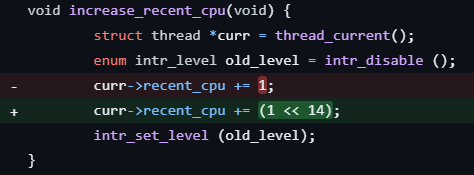
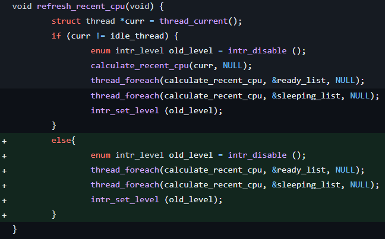

## Alarm clock

### Key words
1. busy waits
<hr>

### Problem
1. Busy waiting 코드에서는 ticks만큼 시간이 흐를 때 까지 스레드의 실행 중단
	- while문 내에서 CPU자원을 계속 소비하고 있음

2. 시스템이 idle 상태가 아닌 이상 스레드는 ticks시간 후에 깨어날 필요가 없다?
	- while문을 ticks동안 굴릴 필요가 없음
    - 적절한 시간을 기다린 후에(?) 준비 대기열에 넣기만 하면됨


<hr>

### Solution
1. sleep하는 thread의 wake up time에 대한 정보, sleep하는 thread 저장

2. scheduler에서 current thread의 정보 삭제

3. current thread를 wake up time에 ready_list에 저장

    -> thread_unblock에서 수행하는데, wakeup_ticks에 모든 스레드를 깨워주는 구현 필요

4. 인터럽트 정보를 해당 thread에 다시 넘겨주기


### Implement

1. thread를 재우려면 깨어날 시간을 저장할 구조체 변수와 자고있는 thread를 담은 리스트 필요

    ```c
    /* thread.h */
    struct thread {
        /* Owned by thread.c. */
        tid_t tid;                          /* Thread identifier. */
        enum thread_status status;          /* Thread state. */
        char name[16];                      /* Name (for debugging purposes). */
        int priority;                       /* Priority. */

        /* project alarm*/
        int64_t wakeup_ticks;				/* Wake up Ticks */


    /* thread.c */
    static struct list sleeping_list;

    void
    thread_init (void) {
        list_init (&sleeping_list);
    }

    ```
    <br>

    - 왜 wakeup_ticks 자료형이 int64_t인가?
        - timer.c에서 현재 ticks를 반환하는 timer_ticks()함수의 반환값과 자료형을 맞춤

    <br>


2. thread를 재우는 함수 구현

    - thread를 sleeping list에 wakeup_ticks 기준으로 오름차순으로 정렬하여 삽입

    ```c
    /* thread.c */
    void
    thread_sleep (int64_t ticks) {
        struct thread *curr = thread_current ();
        enum intr_level old_level;

        ASSERT(curr != idle_thread);

        old_level = intr_disable ();

        curr->wakeup_ticks = ticks;

        list_insert_ordered (&sleeping_list, &(curr->elem), dec_function, NULL);
        thread_block ();
        
        intr_set_level (old_level);
    }

    static bool 
    dec_function(const struct list_elem *a, const struct list_elem *b, void *aux) {
        return list_entry(a, struct thread, elem)->wakeup_ticks < list_entry(b, struct thread, elem)->wakeup_ticks;
    }
    ```

    <br>

3. timer_sleep 함수를 기존 Busy waiting 방식에서 sleep & wakeup 형식으로 재구현

    <br>

    ```c
    /* timer.c */
    void
    timer_sleep (int64_t duration) {
        int64_t start = timer_ticks ();
        ASSERT (intr_get_level () == INTR_ON);
        thread_sleep (start + duration);
    }
    ```

    <br>

4. wake up ticks가 된 thread들을 깨우는 함수 구현
    
    * sleeping list 의 맨 앞에는 wake up ticks가 가장 작은 thread가 들어있음
    * front부터 비교하면서 현재 ticks보다 wake up ticks가 큰 경우 iter break

    <br>

    ```c
    /* thread.c */
    void
    thread_wakeup(int64_t ticks) {
        if (list_empty(&sleeping_list))
            return;
        
        while (!list_empty(&sleeping_list)) {
            struct thread *curr = list_entry(list_front(&sleeping_list), struct thread, elem);
            if (curr->wakeup_ticks <= ticks) {
                list_remove(list_front(&sleeping_list));
                thread_unblock(curr);
            } else {
                break;
            }
        }
    }
    ```

    <br>

5. timer interrupt마다 thread_wakeup을 실행하도록 구현

    <br>


    ```c
    /* timer.c */
    timer_interrupt (struct intr_frame *args UNUSED) {
        ticks++;
        thread_tick ();
        thread_wakeup (ticks);
    }
    ```

<hr>

## Priority Scheduling

### Key words


<hr>

### Problem

1. thread yield는 언제 발생하는가?

<hr>

### Solution

1. thread yield는 thread_create, set_priority, sema_up에서 발생할 수 있음
    - 말 그대로 '발생할 수' 있으므로 발생이 가능한지 확인이 필요

2. semaphore를 기다리는 waiter list를 priority순으로 내림차순 정렬하여 pop front시에 가장 높은 priority를 가진 thread가 나올 수 있도록 함

3. condition variable에서 semaphore와 같이 리스트를 정렬함

<hr>

### Implement

1. thread yield가 가능한지 try해보는 try_yield 함수 구현

    ```c
    /* thread.c */
    void try_yield(void) {
        if (!list_empty (&ready_list) && thread_current ()->priority < 
        list_entry (list_front (&ready_list), struct thread, elem)->priority)
            thread_yield ();
    }
    ```

2. set_priority, thread_create, sema_up 함수에 try_yield() 추가

    ```c
    /* thread.c */
    void
    thread_set_priority (int new_priority) {
        thread_current ()->priority = new_priority;

        test_yield();
    }

    tid_t
    thread_create (const char *name, int priority,
            thread_func *function, void *aux) {
        ...

        test_yield();

        return tid;
    }


    /* synch.c */
    void
    sema_up (struct semaphore *sema) {
        enum intr_level old_level;

        ASSERT (sema != NULL);

        old_level = intr_disable ();
        if (!list_empty (&sema->waiters)) {
            thread_unblock (list_entry (list_pop_front (&sema->waiters),
                        struct thread, elem));
        }
        sema->value++;
        test_yield();
        intr_set_level (old_level);
    }
    ```

3. semaphore, cond wait list를 priority 기준 내림차순으로 정렬되도록 구현
    ```c
    /* synch.c */
    void
    sema_down (struct semaphore *sema) {
        enum intr_level old_level;

        ASSERT (sema != NULL);
        ASSERT (!intr_context ());

        old_level = intr_disable ();
        while (sema->value == 0) {
            list_insert_ordered (&sema->waiters, &thread_current ()->elem, dec_pri_function, NULL);
            thread_block ();
        }
        sema->value--;
        intr_set_level (old_level);
    }

    void
    sema_up (struct semaphore *sema) {
        enum intr_level old_level;

        ASSERT (sema != NULL);

        old_level = intr_disable ();
        if (!list_empty (&sema->waiters)) {
            list_sort(&sema->waiters, dec_pri_function, NULL);
            thread_unblock (list_entry (list_pop_front (&sema->waiters),
                        struct thread, elem));
        }
        sema->value++;
        try_yield();
        intr_set_level (old_level);
    }

    void
    cond_wait (struct condition *cond, struct lock *lock) {
        struct semaphore_elem waiter;

        ASSERT (cond != NULL);
        ASSERT (lock != NULL);
        ASSERT (!intr_context ());
        ASSERT (lock_held_by_current_thread (lock));

        sema_init (&waiter.semaphore, 0);
        list_insert_ordered (&cond->waiters, &waiter.elem, dec_pri_in_sema_function, NULL);
        lock_release (lock);
        sema_down (&waiter.semaphore);
        lock_acquire (lock);
    }


    ```
## Priority Donating

### Key words

1. priority donation

2. priority inversion

3. Priority inheritance

4. multiple donation

5. nested donation

<hr>

### Problem

1. priority donation은 언제 발생하는가?

2. priority donation이 진행된 thread에서 set_priority함수는 어떻게 동작해야 하는가?

3. donated priority값을 list에 모두 담을 것인가? 최종적으로 받은 donated priority값 만을 저장 할 것인가?


## ISSUE

### 1. thread ticks가 오름차순으로 정렬되지 않음


### 2. priority-donate-multiple fail

```bash
(priority-donate-multiple) begin
(priority-donate-multiple) Main thread should have priority 32.  Actual priority: 32.
(priority-donate-multiple) Main thread should have priority 33.  Actual priority: 33.
(priority-donate-multiple) Thread b acquired lock b.
(priority-donate-multiple) Thread b finished.
(priority-donate-multiple) Thread b should have just finished.
(priority-donate-multiple) Main thread should have priority 32.  Actual priority: 31.
(priority-donate-multiple) Thread a acquired lock a.
(priority-donate-multiple) Thread a finished.
(priority-donate-multiple) Thread a should have just finished.
(priority-donate-multiple) Main thread should have priority 31.  Actual priority: 31.
(priority-donate-multiple) end
```

#### 원인



<br>

기존 처리 방식

|Thread-L   | Origin priority   | Updated priority  | Donated Priority history |
|-----      |-----              |-----              |- |
| step 1    | 31           | 31           | |
| step 2    | 31 | 32 ||
| step 3    | 31 | 33 ||
| step 4    | 31 | 31 ||
| step 5    | 31 | 31 ||

해결 방안

|Thread-L   | Origin priority   | Updated priority  | Donated Priority history |
|-----      |-----              |-----              |- |
| step 1    | 31           | 31           | |
| step 2    | 31 | 32 ||
| step 3    | 31 | 33 |32|
| step 4    | 31 | 32 ||
| step 5    | 31 | 31 ||

<br>

위 표와 같이 donated priority에 관한 history가 필요

#### 해결
```c
/* thread.h */

// donation history를 저장할 list, elem 선언
struct thread {
    ...
    struct list donation;				/* Record donated int */
	struct list_elem donation_elem; 	/* Donation element */
}

/* thread.c */
// donation list 초기화
static void
init_thread (struct thread *t, const char *name, int priority) {
    list_init(&t->donation);
}

// current thread의 priority값 재설정시 donation history 유무에 따른 조건문 설정
void
thread_set_priority (int new_priority) {
    enum intr_level old_level = intr_disable();
	struct thread *curr = thread_current();
	curr->origin_priority = new_priority;

	if (list_empty(&curr->donation)) {
		curr->priority = new_priority;
	}
	else if (curr->priority < new_priority){
		curr->priority = new_priority;
	}
	
	try_yield();

	intr_set_level(old_level);
}

/* synch.c */
// 아래 함수 수정
void lock_aquire()
void lock_release()
```

#### 결과
```bash
(priority-donate-multiple) begin
(priority-donate-multiple) Main thread should have priority 32.  Actual priority: 32.
(priority-donate-multiple) Main thread should have priority 33.  Actual priority: 33.
(priority-donate-multiple) Thread b acquired lock b.
(priority-donate-multiple) Thread b finished.
(priority-donate-multiple) Thread b should have just finished.
(priority-donate-multiple) Main thread should have priority 32.  Actual priority: 32.
(priority-donate-multiple) Thread a acquired lock a.
(priority-donate-multiple) Thread a finished.
(priority-donate-multiple) Thread a should have just finished.
(priority-donate-multiple) Main thread should have priority 31.  Actual priority: 31.
(priority-donate-multiple) end
```

### 3-1. recent_cpu 값 계산 오류 - increase_recent_cpu



### 3-2. recent_cpu 결과값 

```bash
2       11.50 >>> 6.40     Too big, by 2.60.
4       17.60 >>> 12.60    Too big, by 2.50.
6       23.49 >>> 18.61    Too big, by 2.38.
8       29.21 >>> 24.44    Too big, by 2.27.
10      34.74 >>> 30.08    Too big, by 2.16.
12      40.10 >>> 35.54    Too big, by 2.06.
14      45.30 >>> 40.83    Too big, by 1.97.
16      50.33 >>> 45.96    Too big, by 1.87.
```

idle thread가 아닌 경우 처리를 해주지 않아 발생

