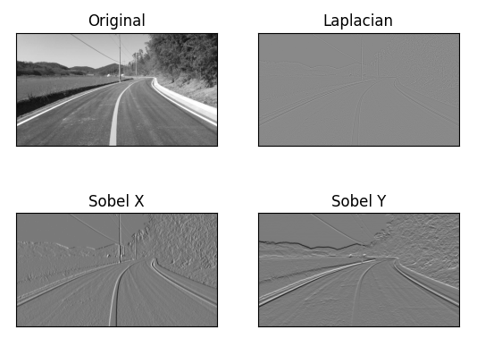
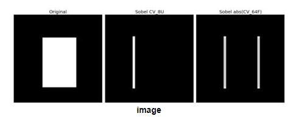

OpenCV에서는 세 가지 Gradient Filter를 제공한다.<br>
Sobel, Scharr, Laplacian에 대하여 알아보자.

# Sobel and Scharr Derivatives
Sobel 연산자는 Gaussian smoothing과 미분 연산을 사용하여 노이즈에 강하다. 미분의 방향을 지정할 수 있다.

# Laplacian Derivatives
이미지에 Laplacian 연산을 취한다. 이때 도함수로 Sobel 도함수를 사용한다.

## 코드
```py
import numpy as np
import cv2 as cv
from matplotlib import pyplot as plt

img = cv.imread('practice.jpg', cv.IMREAD_GRAYSCALE)
assert img is not None, "file could not be read, check with os.path.exists()"

laplacian = cv.Laplacian(img,cv.CV_64F)

# 미분 방향 지정
sobelx = cv.Sobel(img,cv.CV_64F,1,0,ksize=5)
sobely = cv.Sobel(img,cv.CV_64F,0,1,ksize=5)

plt.subplot(2,2,1),plt.imshow(img,cmap = 'gray')
plt.title('Original'), plt.xticks([]), plt.yticks([])
plt.subplot(2,2,2),plt.imshow(laplacian,cmap = 'gray')
plt.title('Laplacian'), plt.xticks([]), plt.yticks([])
plt.subplot(2,2,3),plt.imshow(sobelx,cmap = 'gray')
plt.title('Sobel X'), plt.xticks([]), plt.yticks([])
plt.subplot(2,2,4),plt.imshow(sobely,cmap = 'gray')
plt.title('Sobel Y'), plt.xticks([]), plt.yticks([])

plt.show()
```

## 실행 결과

<br>

라플라시안 연산의 결과는 흐릿하고, 미분 기울기를 x축으로 지정한 이미지에서 차선이 부각되는것을 볼 수 있었다.

# 참조
출력 데이터 유형은 cv.CV_8U 또는 np.uint8이 가능한데, Black-to-White 전환은 양의 기울기(양수 값)로 간주되고 White-to-Black 전환은 음의 기울기(음수 값)로 간주된다. np.uint8로 데이터를 변환하면 모든 음의 기울기가 0이 되는것을 기억하자.<br>
또한 가장자리를 모두 검출하려면 출력 데이터 유형을 cv.CV_16S, cv.CV_64F 등과 같은 더 높은 형식으로 유지하고 절대 값을 취한 다음 다시 cv.CV_8U로 변환하는 것이 좋다.<br>

```py
import numpy as np
import cv2 as cv
from matplotlib import pyplot as plt

img = cv.imread('box.png', cv.IMREAD_GRAYSCALE)

assert img is not None, "file could not be read, check with os.path.exists()"

# Output dtype = cv.CV_8U
sobelx8u = cv.Sobel(img,cv.CV_8U,1,0,ksize=5)

# Output dtype = cv.CV_64F. Then take its absolute and convert to cv.CV_8U
sobelx64f = cv.Sobel(img,cv.CV_64F,1,0,ksize=5)
abs_sobel64f = np.absolute(sobelx64f)
sobel_8u = np.uint8(abs_sobel64f)

plt.subplot(1,3,1),plt.imshow(img,cmap = 'gray')
plt.title('Original'), plt.xticks([]), plt.yticks([])
plt.subplot(1,3,2),plt.imshow(sobelx8u,cmap = 'gray')
plt.title('Sobel CV_8U'), plt.xticks([]), plt.yticks([])
plt.subplot(1,3,3),plt.imshow(sobel_8u,cmap = 'gray')
plt.title('Sobel abs(CV_64F)'), plt.xticks([]), plt.yticks([])
plt.show()
```


<br>

# Reference
https://docs.opencv.org/4.x/d5/d0f/tutorial_py_gradients.html