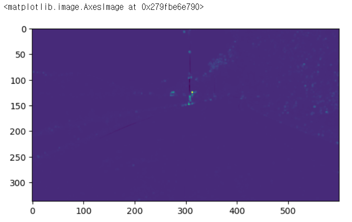
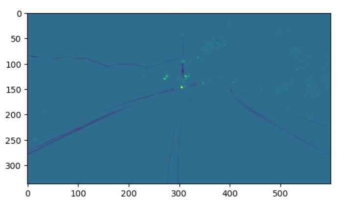

# 해리스 코너 검출

모서리를 찾기 위한 초기 시도 중 1988년 Chris Harris와 Mike Stephens의 논문 A Combined Corner and Edge Detector에서 시도한 간단한 아이디어를 구현하여 코너 검출을 해보려한다.

$E(u, v) = \displaystyle\sum_{x, y}{w(x, y)}[I(x + u, y + v) - I(x, y)]^2$

* $w(x, y)$ : window function으로, 직사각형 창 또는 아래 픽셀에 가중치를 부여하는 가우시안 창

코너 검출을 위해 $E(u, v)$의 최댓값을 알아내야 하는데 이는 두 번째 수식의 최댓값을 알아내는 것이다. 위 수식에 Taylor Expansion과 몇 가지 수식을 거치면 다음과 같은 결과 수식을 얻을 수 있다.

$E(u, v) \approx \begin{bmatrix}u & v \end{bmatrix}M\begin{bmatrix}u \\ v \end{bmatrix}$
<br>

$M = \displaystyle\sum_{x, y}{w(x, y)}\begin{bmatrix}{I_x}{I_x} & {I_x}{I_y} \\ {I_x}{I_y} & {I_y}{I_y} \end{bmatrix}$
<br>

* $I_x$, $I_y$는 x, y 방향의 이미지 도함수이다.(Sobel에서 사용)

이후 창에 모서리가 포함되는지 결정하는 방정식을 통해 검출이 이루어진다.

$R = det(M) - k(trace(M))^2$

* $det(M) = \lambda_1 \lambda_2$
* $trace(M) = \lambda_1 + \lambda_2$
* $\lambda_1$ and $\lambda_2$ are the eigenvalues of $M$

* $abs(R)$이 작으면($ \lambda_1$, $\lambda_2$가 작을 때 발생) 지역은 flat
* $R<0$이면($ \lambda_1 >> \lambda_2$일 때 발생) 지역은 엣지
* $R$이 클때 지역은 코너


출처: https://docs.opencv.org/4.x/dc/d0d/tutorial_py_features_harris.html

# Harris Corner Detector in OpenCV

## Code
```py
import numpy as np
import cv2 as cv
import matplotlib.pyplot as plt

filename = 'practice.jpg'
img = cv.imread(filename)
gray = cv.cvtColor(img, cv.COLOR_BGR2GRAY)

gray = np.float32(gray)
dst = cv.cornerHarris(gray, 3, 7, 0.08)

# result is dilated for marking the corners, not important
dst = cv.dilate(dst, None)

# Threshold for an optimal value, it may vary depending on the image
img[dst>0.01*dst.max()] = [0, 0, 255]

plt.imshow(dst)
```

## Result





## 후기
파라미터 조정만으로 충분한 엣지 검출이 가능해 보인다. 파라미터를 trial and error 방식으로 조정하였는데 더 나은 방식으로 조정이 가능한지 공부가 필요할 것 같다.